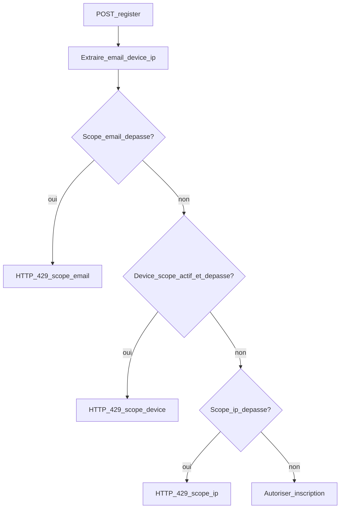

# Guide de migration — Correction du verrou inscription client

> **Objectif** : documenter toutes les étapes pour corriger le rate limiting d'inscription client et reproduire la solution dans un autre projet ASP.NET Core similaire.
>
> **Référence d'implémentation** : CongoTravelAPI (correction livrée en production).

---

## Table des matières

1. [Résumé exécutif](#1-résumé-exécutif)
2. [Symptôme et diagnostic](#2-symptôme-et-diagnostic)
3. [Solution cible](#3-solution-cible)
4. [Prérequis](#4-prérequis)
5. [Étape 0 — Diagnostic dans le projet cible](#étape-0--diagnostic-dans-le-projet-cible)
6. [Étape 1 — Classe d'options de configuration](#étape-1--classe-doptions-de-configuration)
7. [Étape 2 — Refactoriser l'attribut rate limit](#étape-2--refactoriser-lattribut-rate-limit)
8. [Étape 3 — Brancher sur l'endpoint d'inscription](#étape-3--brancher-sur-lendpoint-dinscription)
9. [Étape 4 — Configuration appsettings](#étape-4--configuration-appsettings)
10. [Étape 5 — Observabilité](#étape-5--observabilité)
11. [Étape 6 — Tests unitaires](#étape-6--tests-unitaires)
12. [Étape 7 — Intégration frontend / mobile](#étape-7--intégration-frontend--mobile)
13. [Checklist déploiement production](#checklist-déploiement-production)
14. [Matrice d'adaptation projet similaire](#matrice-dadaptation-projet-similaire)
15. [Pièges connus](#pièges-connus)
16. [Fichiers de référence CongoTravelAPI](#fichiers-de-référence-congotravelapi)

---

## 1. Résumé exécutif

| Avant (bug) | Après (correction) |
|-------------|-------------------|
| Clé cache : `IP + Action` | Clés cache : `email`, `device` (optionnel), `ip` |
| 3 requêtes / 10 min **par IP** | 3 req / 15 min **par email** (principal) |
| Blocage global derrière NAT/proxy | Emails distincts sur même IP : autorisés |
| Pas de distinction abus ciblé / flood | Filet IP volontairement plus haut (ex. 40 / 15 min) |

**Impact métier** : un utilisateur qui échoue plusieurs fois à s'inscrire ne bloque plus tous les autres utilisateurs du même réseau (bureau, 4G partagée, proxy d'entreprise).

---

## 2. Symptôme et diagnostic

### Symptôme observé en production

- Après quelques tentatives d'inscription (même échouées), **plus aucun client** ne peut s'inscrire depuis le même réseau.
- Le problème disparaît après ~10 minutes (fenêtre du rate limit).
- Les logs montrent des `429 Too Many Requests` sur `POST /api/client/register` pour des emails **différents**.

### Cause racine

L'attribut `ClientRegistrationRateLimitAttribute` héritait de `RateLimitAttribute` dont la clé de cache était :

```
{cacheKeyPrefix}_{clientIp}_{actionDisplayName}
```

Exemple : `ClientRegistration_41.243.x.x_ClientController.RegisterClient`

Tous les utilisateurs derrière la même IP publique partagent **un seul compteur**. Avec un seuil de 3 requêtes / 10 minutes, un petit nombre de tentatives suffit à verrouiller toute la plateforme pour ce réseau.

### Comment confirmer le bug dans un autre projet

1. Localiser l'endpoint public d'inscription (`[AllowAnonymous]` + `POST register`).
2. Identifier l'attribut ou filtre de rate limiting appliqué.
3. Vérifier si la clé de cache dépend **uniquement** de l'IP (ou IP + nom d'action).
4. Reproduire :
   - Envoyer 3 requêtes `POST register` avec **3 emails différents**, même IP.
   - Si la 3e ou 4e requête retourne `429` → le bug est présent.

```bash
# Exemple de reproduction (adapter URL et payload)
for i in 1 2 3 4; do
  curl -s -o /dev/null -w "%{http_code}\n" -X POST https://api.example.com/api/client/register \
    -H "Content-Type: application/json" \
    -d "{\"emailClient\":\"user${i}@test.com\",\"nomClient\":\"Test\",\"telephone\":\"+2430000000\",\"acceptTerms\":true}"
done
# Attendu AVANT correction : 200/400/409 puis 429
# Attendu APRÈS correction : 200/400/409 pour chaque email distinct
```

---

## 3. Solution cible

### Politique multi-scope hiérarchique

Évaluation dans l'ordre **email → device → ip**. Le **premier scope dépassé** déclenche le `429` :



### Scopes et clés cache

| Scope | Clé `IMemoryCache` | Rôle | Seuil recommandé prod |
|-------|-------------------|------|------------------------|
| **email** | `ClientRegistration:email:{email_normalise}` | Anti-abus ciblé (principal) | 3 / 15 min |
| **device** | `ClientRegistration:device:{deviceId}` | Lien appareil si header présent | 6 / 15 min |
| **ip** | `ClientRegistration:ip:{ip}` | Filet anti-flood global | 40 / 15 min |

### Règles importantes

- L'email est normalisé : `Trim().ToLowerInvariant()`.
- Le scope **device** n'est évalué que si `EnableDeviceScope = true` **et** que le header device est présent.
- Le scope **email** est ignoré si l'email est vide (la requête passe aux scopes suivants).
- La sous-classe **surcharge entièrement** `OnActionExecuting` : elle n'appelle `base.OnActionExecuting()` qu'en fin de chaîne si aucun scope n'est dépassé (le `base` conserve l'ancien comportement IP+Action mais n'est plus le mécanisme principal — voir [pièges](#pièges-connus)).

---

## 4. Prérequis

| Composant | Requis |
|-----------|--------|
| Framework | ASP.NET Core 6+ |
| Cache | `IMemoryCache` (`AddMemoryCache()` dans `Program.cs`) |
| Endpoint | Action publique d'inscription avec DTO contenant un champ email |
| Configuration | `IOptions<T>` ou `IConfiguration` pour externaliser les seuils |
| Tests | xUnit (ou équivalent) + `Microsoft.AspNetCore.Mvc.Testing` optionnel |

### Fichiers typiquement impactés

```
Models/DTOs/Client/RateLimitAttribute.cs     # Attribut + options
Controllers/ClientController.cs              # [ClientRegistrationRateLimit]
Program.cs                                   # Configure<ClientRegistrationRateLimitOptions>
appsettings.template.json                    # Section ClientRegistrationRateLimit
appsettings.Production.json                  # Mêmes seuils adaptés prod
Services/MetricsService.cs                   # Optionnel : métriques par scope
Tests/ClientRegistrationRateLimitAttributeTests.cs
```

---

## Étape 0 — Diagnostic dans le projet cible

**Checklist**

- [ ] Trouver la route d'inscription publique (`POST .../register` ou équivalent).
- [ ] Lister les filtres/attributs de sécurité sur cette action.
- [ ] Lire le code du rate limiter : identifier la construction de la clé cache.
- [ ] Vérifier la gestion de `X-Forwarded-For` si l'API est derrière un reverse proxy.
- [ ] Reproduire le scénario « 3 emails différents, même IP » (voir section 2).
- [ ] Documenter les seuils actuels (requêtes, fenêtre, clé).

**Décision** : si la clé est IP-only avec un seuil bas (≤ 5 req / 15 min), appliquer la migration complète décrite ci-dessous.

---

## Étape 1 — Classe d'options de configuration

Créer (ou compléter) la classe `ClientRegistrationRateLimitOptions` dans le même fichier que les attributs rate limit, ou dans un dossier `Configuration/`.

```csharp
public class ClientRegistrationRateLimitOptions
{
    public const string SectionName = "ClientRegistrationRateLimit";

    public int EmailLimit { get; set; } = 3;
    public int EmailWindowMinutes { get; set; } = 10;

    public bool EnableDeviceScope { get; set; } = true;
    public int DeviceLimit { get; set; } = 5;
    public int DeviceWindowMinutes { get; set; } = 10;

    public int IpLimit { get; set; } = 30;
    public int IpWindowMinutes { get; set; } = 10;

    public string DeviceIdHeaderName { get; set; } = "X-Device-Id";
}
```

### Enregistrement dans `Program.cs`

```csharp
builder.Services.AddMemoryCache();

builder.Services.Configure<ClientRegistrationRateLimitOptions>(
    builder.Configuration.GetSection(ClientRegistrationRateLimitOptions.SectionName));
```

> **Note** : `AddMemoryCache()` doit être appelé une seule fois. Si déjà présent pour d'autres rate limiters, ne pas le dupliquer.

---

## Étape 2 — Refactoriser l'attribut rate limit

### 2.1 — Classe de base `RateLimitAttribute`

Conserver la classe existante pour les autres endpoints (`EmailCheckRateLimit`, etc.).

**Modification obligatoire** : passer `GetClientIpAddress` de `private` à `protected` pour que la sous-classe puisse réutiliser la résolution IP (proxy-aware) :

```csharp
protected static string GetClientIpAddress(HttpContext context)
{
    var ip = context.Request.Headers["X-Forwarded-For"].FirstOrDefault();
    if (!string.IsNullOrEmpty(ip))
        return ip.Split(',')[0].Trim();

    ip = context.Request.Headers["X-Real-IP"].FirstOrDefault();
    if (!string.IsNullOrEmpty(ip))
        return ip;

    return context.Connection.RemoteIpAddress?.ToString() ?? "unknown";
}
```

### 2.2 — Surcharger `ClientRegistrationRateLimitAttribute`

Remplacer l'implémentation qui délègue uniquement au `base` par une logique multi-scope.

#### Extraction de l'email

L'email est lu depuis les arguments d'action (le modèle binding ASP.NET Core a déjà désérialisé le body) :

```csharp
var registrationDto = context.ActionArguments.Values
    .OfType<RegisterClientDto>()
    .FirstOrDefault();
var normalizedEmail = NormalizeEmail(registrationDto?.EmailClient);

private static string? NormalizeEmail(string? email) =>
    string.IsNullOrWhiteSpace(email) ? null : email.Trim().ToLowerInvariant();
```

> **Adaptation** : remplacer `RegisterClientDto` et `EmailClient` par les noms du projet cible.

#### Extraction du device ID

```csharp
var deviceId = request.Headers[options.DeviceIdHeaderName].FirstOrDefault()?.Trim();
```

#### Helper `IsLimited`

```csharp
private static bool IsLimited(
    IMemoryCache cache,
    string cacheKey,
    int maxRequests,
    TimeSpan window,
    out int resultingCount)
{
    if (cache.TryGetValue(cacheKey, out int current))
    {
        if (current >= maxRequests)
        {
            resultingCount = current;
            return true; // Bloqué
        }
        resultingCount = current + 1;
        cache.Set(cacheKey, resultingCount, window);
        return false;
    }

    resultingCount = 1;
    cache.Set(cacheKey, resultingCount, window);
    return false;
}
```

#### Corps principal de `OnActionExecuting`

```csharp
public override void OnActionExecuting(ActionExecutingContext context)
{
    var cache = context.HttpContext.RequestServices.GetService<IMemoryCache>()
                ?? throw new InvalidOperationException("IMemoryCache non disponible");
    var logger = context.HttpContext.RequestServices
        .GetService<ILogger<ClientRegistrationRateLimitAttribute>>();
    var options = context.HttpContext.RequestServices
        .GetService<IOptions<ClientRegistrationRateLimitOptions>>()?.Value
        ?? new ClientRegistrationRateLimitOptions();

    var request = context.HttpContext.Request;
    var endpoint = context.ActionDescriptor.DisplayName ?? "unknown";
    var ip = GetClientIpAddress(context.HttpContext);
    var deviceId = request.Headers[options.DeviceIdHeaderName].FirstOrDefault()?.Trim();
    var registrationDto = context.ActionArguments.Values.OfType<RegisterClientDto>().FirstOrDefault();
    var normalizedEmail = NormalizeEmail(registrationDto?.EmailClient);

    // 1) Scope email
    if (!string.IsNullOrWhiteSpace(normalizedEmail))
    {
        var keyEmail = $"ClientRegistration:email:{normalizedEmail}";
        if (IsLimited(cache, keyEmail, options.EmailLimit,
            TimeSpan.FromMinutes(options.EmailWindowMinutes), out var emailCount))
        {
            LogBlock(logger, "email", keyEmail, ip, endpoint, emailCount, options.EmailLimit);
            MetricsService.RecordRateLimitBlock("email"); // optionnel
            context.Result = BuildTooManyRequestsResult(
                "Trop de tentatives pour cet email. Veuillez réessayer plus tard.",
                options.EmailWindowMinutes);
            return;
        }
    }

    // 2) Scope device
    if (options.EnableDeviceScope && !string.IsNullOrWhiteSpace(deviceId))
    {
        var keyDevice = $"ClientRegistration:device:{deviceId}";
        if (IsLimited(cache, keyDevice, options.DeviceLimit,
            TimeSpan.FromMinutes(options.DeviceWindowMinutes), out var deviceCount))
        {
            LogBlock(logger, "device", keyDevice, ip, endpoint, deviceCount, options.DeviceLimit);
            MetricsService.RecordRateLimitBlock("device");
            context.Result = BuildTooManyRequestsResult(
                "Trop de tentatives depuis cet appareil. Veuillez réessayer plus tard.",
                options.DeviceWindowMinutes);
            return;
        }
    }

    // 3) Scope IP (filet anti-flood)
    var keyIp = $"ClientRegistration:ip:{ip}";
    if (IsLimited(cache, keyIp, options.IpLimit,
        TimeSpan.FromMinutes(options.IpWindowMinutes), out var ipCount))
    {
        LogBlock(logger, "ip", keyIp, ip, endpoint, ipCount, options.IpLimit);
        MetricsService.RecordRateLimitBlock("ip");
        context.Result = BuildTooManyRequestsResult(
            "Trop de tentatives depuis cette IP. Veuillez réessayer plus tard.",
            options.IpWindowMinutes);
        return;
    }

    base.OnActionExecuting(context);
}
```

#### Réponse HTTP 429

```csharp
private static JsonResult BuildTooManyRequestsResult(string message, int retryAfterMinutes) =>
    new(new
    {
        success = false,
        message,
        retryAfter = TimeSpan.FromMinutes(retryAfterMinutes).TotalSeconds
    })
    {
        StatusCode = (int)HttpStatusCode.TooManyRequests
    };
```

### 2.3 — Logging sécurisé

Ne jamais logger l'email en clair. Hasher la clé pour corrélation :

```csharp
private static void LogBlock(
    ILogger<ClientRegistrationRateLimitAttribute>? logger,
    string scope,
    string key,
    string ip,
    string endpoint,
    int currentCount,
    int limit)
{
    logger?.LogWarning(
        "RateLimit registration blocked. Scope={Scope} KeyHash={KeyHash} Ip={Ip} Endpoint={Endpoint} Count={Count} Limit={Limit}",
        scope,
        HashKeyForLogs(key), // SHA256 tronqué à 12 caractères hex
        ip,
        endpoint,
        currentCount,
        limit);
}
```

---

## Étape 3 — Brancher sur l'endpoint d'inscription

Sur l'action d'inscription publique du contrôleur client :

```csharp
[HttpPost("register")]
[AllowAnonymous]
[ClientRegistrationRateLimit]
public async Task<ActionResult<ClientRegistrationResponseDto>> RegisterClient(
    [FromBody] RegisterClientDto dto)
{
    // ... logique métier inchangée
}
```

**Vérifications**

- [ ] L'attribut `[ClientRegistrationRateLimit]` est bien sur l'action `register`, pas sur le contrôleur entier.
- [ ] Aucun **second** rate limiter IP-only n'est actif sur la même action (AspNetCoreRateLimit global + attribut local = double blocage).
- [ ] Le paramètre DTO a le même nom que celui référencé dans `ActionArguments` des tests (`dto` par convention).

---

## Étape 4 — Configuration appsettings

### Section à ajouter

Dans `appsettings.template.json` et `appsettings.Production.json` :

```json
"ClientRegistrationRateLimit": {
  "EmailLimit": 3,
  "EmailWindowMinutes": 15,
  "EnableDeviceScope": true,
  "DeviceLimit": 6,
  "DeviceWindowMinutes": 15,
  "IpLimit": 40,
  "IpWindowMinutes": 15,
  "DeviceIdHeaderName": "X-Device-Id"
}
```

### Recommandations dev vs prod

| Paramètre | Dev / template | Production | Justification |
|-----------|----------------|------------|---------------|
| `EmailLimit` | 3 | 3 | Bloque le spam ciblé sur un email |
| `EmailWindowMinutes` | 10–15 | 15 | Fenêtre raisonnable pour l'utilisateur légitime |
| `IpLimit` | 30 | **40** | NAT/proxy : beaucoup d'utilisateurs légitimes partagent une IP |
| `DeviceLimit` | 5–6 | 6 | Limite les inscriptions massives depuis un seul appareil |
| `EnableDeviceScope` | true | true | Nécessite que le client envoie `X-Device-Id` |

> **Attention** : un `IpLimit` trop bas (ex. 3) **réintroduit le bug** même avec le scope email.

---

## Étape 5 — Observabilité

### Logs structurés

À chaque blocage, logger :
- `Scope` : `email` | `device` | `ip`
- `KeyHash` : hash SHA256 tronqué (pas l'email en clair)
- `Ip`, `Endpoint`, `Count`, `Limit`

### Métriques (optionnel)

Dans CongoTravelAPI, `MetricsService.RecordRateLimitBlock(scope)` incrémente un compteur en mémoire par scope :

```csharp
public static void RecordRateLimitBlock(string scope)
{
    var key = string.IsNullOrWhiteSpace(scope) ? "unknown" : scope.Trim().ToLowerInvariant();
    lock (_rateLimitBlocksByScope)
    {
        _rateLimitBlocksByScope.TryGetValue(key, out var current);
        _rateLimitBlocksByScope[key] = current + 1;
    }
}
```

**Adaptation projet similaire** : brancher sur Prometheus, Application Insights, ou supprimer l'appel si aucun service métriques n'existe — la correction fonctionne sans métriques.

### Alertes recommandées

- Pic soudain de `scope=ip` → possible attaque ou seuil IP trop bas.
- Pic de `scope=email` → spam ciblé ou UX défaillante (formulaire qui resoumet en boucle).

---

## Étape 6 — Tests unitaires

Créer `Tests/ClientRegistrationRateLimitAttributeTests.cs` avec au minimum **3 scénarios**.

### Setup commun

```csharp
private static ServiceProvider BuildServices(ClientRegistrationRateLimitOptions options)
{
    var services = new ServiceCollection();
    services.AddMemoryCache();
    services.AddSingleton<IOptions<ClientRegistrationRateLimitOptions>>(Options.Create(options));
    services.AddSingleton<ILogger<ClientRegistrationRateLimitAttribute>>(
        NullLogger<ClientRegistrationRateLimitAttribute>.Instance);
    return services.BuildServiceProvider();
}

private static ActionExecutingContext Execute(
    ClientRegistrationRateLimitAttribute filter,
    ServiceProvider services,
    string ip,
    string? email,
    string? deviceId = null)
{
    var httpContext = new DefaultHttpContext
    {
        RequestServices = services,
        Connection = { RemoteIpAddress = IPAddress.Parse(ip) }
    };
    if (!string.IsNullOrWhiteSpace(deviceId))
        httpContext.Request.Headers["X-Device-Id"] = deviceId;

    var actionContext = new ActionContext(
        httpContext,
        new RouteData(),
        new ActionDescriptor { DisplayName = "ClientController.RegisterClient" });

    var args = new Dictionary<string, object?>
    {
        ["dto"] = new RegisterClientDto
        {
            NomClient = "Test",
            Telephone = "+2430000000",
            EmailClient = email,
            AcceptTerms = true
        }
    };

    var executing = new ActionExecutingContext(
        actionContext,
        new List<IFilterMetadata>(),
        args!,
        controller: null);

    filter.OnActionExecuting(executing);
    return executing;
}
```

### Scénarios obligatoires

| Test | Configuration | Action | Résultat attendu |
|------|---------------|--------|------------------|
| `Blocks_after_limit_for_same_email_scope` | `EmailLimit=3`, `IpLimit=100` | 4× même email, même IP | 4e → `429` |
| `Does_not_block_different_emails_from_same_ip` | `EmailLimit=3`, `IpLimit=100` | 3 emails distincts, même IP | Aucun `429` |
| `Blocks_by_device_scope_when_enabled` | `DeviceLimit=2`, `EmailLimit=100` | 3 emails distincts, même `deviceId` | 3e → `429` |

### Exécution

```bash
dotnet test --filter "FullyQualifiedName~ClientRegistrationRateLimitAttributeTests"
```

---

## Étape 7 — Intégration frontend / mobile

### Header `X-Device-Id`

Le client doit envoyer un identifiant stable par installation :

```dart
// Flutter — exemple
headers: {
  'Content-Type': 'application/json',
  'X-Device-Id': await getOrCreateDeviceId(), // UUID persisté localement
},
```

```typescript
// Vue / Angular — exemple
const deviceId = localStorage.getItem('deviceId') ?? crypto.randomUUID();
localStorage.setItem('deviceId', deviceId);

headers: {
  'Content-Type': 'application/json',
  'X-Device-Id': deviceId,
}
```

Sans ce header, le scope **device** est ignoré (les scopes email et ip restent actifs).

### Gestion de la réponse 429

```json
{
  "success": false,
  "message": "Trop de tentatives pour cet email. Veuillez réessayer plus tard.",
  "retryAfter": 900
}
```

**Bonnes pratiques côté client**

- Afficher le message serveur à l'utilisateur.
- Utiliser `retryAfter` (secondes) pour désactiver le bouton « S'inscrire » temporairement.
- Ne pas relancer automatiquement sur le même email en boucle.
- En cas de `429` scope email : inviter à vérifier la boîte mail ou contacter le support, pas à changer de réseau.

---

## Checklist déploiement production

### Avant déploiement

- [ ] Code : `ClientRegistrationRateLimitAttribute` multi-scope déployé
- [ ] `GetClientIpAddress` est `protected` dans la classe de base
- [ ] `Program.cs` : `Configure<ClientRegistrationRateLimitOptions>` en place
- [ ] `appsettings.Production.json` contient la section `ClientRegistrationRateLimit`
- [ ] `IpLimit` ≥ 30 (recommandé : 40)
- [ ] Tests unitaires : 3/3 passent
- [ ] Pas de double rate limit sur la même route

### Après déploiement

- [ ] Redémarrer l'API (cache mémoire réinitialisé au restart — normal)
- [ ] Test manuel : 2 inscriptions emails différents, même réseau → succès ou erreur métier (pas 429)
- [ ] Test manuel : 4e tentative même email → `429` avec message email
- [ ] Vérifier logs : `Scope=email` sur abus ciblé, `Scope=ip` rare en usage normal
- [ ] Mettre à jour la doc API client si les seuils ou headers ont changé

### Commande de test rapide post-déploiement

```bash
BASE_URL="https://api.congotravel.cd/api/client/register"

# Doit passer (emails différents)
curl -X POST "$BASE_URL" -H "Content-Type: application/json" \
  -d '{"nomClient":"A","telephone":"+243111","emailClient":"test-a@example.com","acceptTerms":true}'

curl -X POST "$BASE_URL" -H "Content-Type: application/json" \
  -d '{"nomClient":"B","telephone":"+243222","emailClient":"test-b@example.com","acceptTerms":true}'
```

---

## Matrice d'adaptation projet similaire

| Élément CongoTravelAPI | Action dans le projet cible |
|-----------------------|----------------------------|
| `RegisterClientDto.EmailClient` | Mapper vers le champ email du DTO d'inscription |
| `POST /api/client/register` | Identifier la route publique équivalente |
| `ClientRegistrationRateLimitAttribute` | Copier/adapter le fichier `RateLimitAttribute.cs` |
| Namespace `CongoTravel.*` | Remplacer par le namespace du projet |
| `MetricsService.RecordRateLimitBlock` | Implémenter équivalent ou retirer les 3 appels |
| `X-Device-Id` | Aligner avec le header déjà utilisé par l'app mobile |
| `EmailCheckRateLimitAttribute` | **Ne pas modifier** — rate limit séparé pour vérif email |
| `IpRateLimiting` (AspNetCoreRateLimit) | Vérifier qu'il n'a pas une règle trop stricte sur `/register` |

### Ordre d'implémentation recommandé

1. Options + configuration
2. Attribut multi-scope
3. Branchement contrôleur
4. Tests unitaires (valider avant prod)
5. Config prod + déploiement
6. Header device côté clients

---

## Pièges connus

| Piège | Conséquence | Solution |
|-------|-------------|----------|
| Seuil `IpLimit` trop bas | Régression du bug NAT | `IpLimit` ≥ 30, idéalement 40 |
| Ancien rate limit IP actif en parallèle | Double blocage imprévisible | Un seul mécanisme sur `register` |
| `GetClientIpAddress` reste `private` | Erreur de compilation sous-classe | Passer en `protected` |
| Email lu depuis le body stream sans buffering | Body vide pour le contrôleur | Lire depuis `ActionArguments` (après model binding) |
| Oublier `appsettings.Production.json` | Seuils par défaut du code (peut-être trop bas) | Toujours configurer explicitement en prod |
| Proxy sans `X-Forwarded-For` | Toutes les requêtes = IP du proxy | Configurer le reverse proxy + `ForwardedHeaders` |
| Appeler `base.OnActionExecuting` en premier | Ancien blocage IP+Action s'applique encore | Évaluer les scopes **avant** `base`, ou ne pas appeler `base` si la logique est complète |

### Note sur l'appel à `base.OnActionExecuting`

Dans l'implémentation CongoTravelAPI, `base.OnActionExecuting(context)` est appelé en fin de méthode si aucun scope n'est dépassé. La classe de base applique encore son propre compteur `ClientRegistration_{ip}_{action}`. Pour une migration **propre** dans un autre projet, deux options :

1. **Recommandé** : ne **pas** appeler `base` et supprimer l'héritage du constructeur avec `cacheKeyPrefix: "ClientRegistration"` — utiliser `ActionFilterAttribute` directement ou un `base` neutre.
2. **Minimal (comme CongoTravelAPI)** : garder l'appel `base` mais s'assurer que les seuils du `base` (3/10 min IP+action) ne contredisent pas la politique — les scopes multi-clés sont évalués en premier.

---

## Fichiers de référence CongoTravelAPI

| Fichier | Rôle |
|---------|------|
| [`Models/DTOs/Client/RateLimitAttribute.cs`](../../../Models/DTOs/Client/RateLimitAttribute.cs) | Implémentation complète |
| [`Controllers/ClientController.cs`](../../../Controllers/ClientController.cs) | Application sur `POST register` |
| [`Program.cs`](../../../Program.cs) | Enregistrement DI et options |
| [`appsettings.template.json`](../../../appsettings.template.json) | Template de configuration |
| [`Services/MetricsService.cs`](../../../Services/MetricsService.cs) | `RecordRateLimitBlock` |
| [`Tests/ClientRegistrationRateLimitAttributeTests.cs`](../../../Tests/ClientRegistrationRateLimitAttributeTests.cs) | Tests unitaires |
| [`CLIENT_REGISTRATION_API_GUIDE.md`](../03_utilisateurs_roles_agents/CLIENT_REGISTRATION_API_GUIDE.md) | Doc API inscription côté intégration |

---

## Historique

| Date | Version | Description |
|------|---------|-------------|
| 2026-07-07 | 1.0 | Guide initial — correction verrou inscription client multi-scope |
