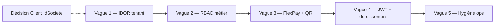

# Plan de travail sécurité — CongoTravelAPI

**Date :** mai 2026  
**Statut :** planification — **aucune implémentation lancée**  
**Document source :** [ANALYSE_FAILLES_SECURITE.md](./ANALYSE_FAILLES_SECURITE.md)

---

## Objectif

Corriger les failles identifiées par ordre de risque métier, sans régression fonctionnelle sur le cœur transport (réservation, paiement cash/FlexPay, billets, embarquement), en livrant par **vagues courtes** testables et déployables indépendamment.

---

## Principes directeurs

1. **P0 avant tout** — IDOR et RBAC métier avant durcissement JWT ou Swagger.
2. **Pas de big-bang** — une vague = un thème = une PR reviewable.
3. **Tests obligatoires** — chaque vague ajoute ou met à jour des tests (unitaires + contractuels sur les endpoints touchés).
4. **Compatibilité front** — documenter les changements breaking (403 sur routes auparavant ouvertes au mauvais rôle).
5. **Prod-safe** — feature flags ou déploiement progressif pour FlexPay et JWT issuer/audience.

---

## Vue d’ensemble (4 vagues + 1 décision produit)

| Vague | Thème | Durée estimée | Risque régression |
|-------|--------|-----------------|-------------------|
| **V1** | Isolation multi-tenant (IDOR) | 1–2 semaines | Moyen (403 sur accès cross-société) |
| **V2** | RBAC cœur métier | 2–3 semaines | Élevé (fronts sans permission) |
| **V3** | FlexPay + QR billets | 1–2 semaines | Moyen (callbacks, scan QR) |
| **V4** | JWT + secrets | 1 semaine | Élevé (tokens invalidés si mal coordonné) |
| **V5** | Hygiène exposition (Swagger, rate limit, metrics) | 1 semaine | Faible |
| **Décision** | Modèle Client multi-tenant | 1 atelier + 2–4 sem. si Option A | Élevé (schéma + sync) |

**Horizon total indicatif :** 6 à 10 semaines calendaires (1 dev backend + revue sécurité + tests front).

---

## Prérequis transverses (avant V1)

| # | Tâche | Responsable | Livrable |
|---|--------|-------------|----------|
| P0.1 | Inventaire endpoints sensibles (GET/POST/PUT/DELETE avec `{id}` ou `{idSociete}`) | Backend | Tableau CSV ou section dans ce doc (annexe A) |
| P0.2 | Matrice rôle → permission cible (Caissier, Gérant, Client, SuperAdmin) | Produit + Backend | Tableau annexe B |
| P0.3 | Environnement de test multi-société (2 sociétés, 2 agents, 1 client) | Ops / Dev | Jeu de données staging |
| P0.4 | Baseline tests : `dotnet test` vert sur branche main | CI | Rapport CI |

---

## Vague 1 — Isolation multi-tenant (IDOR)

**Référence analyse :** C1  
**Objectif :** aucun accès cross-société sur lecture/écriture des entités tenantées.

### Tâches

| ID | Tâche | Fichiers / zone | Critère d’acceptation |
|----|--------|-----------------|------------------------|
| V1.1 | Audit exhaustif routes `{idSociete}` sans `TenantGuard` | Tous controllers | Liste exhaustive validée |
| V1.2 | Appliquer `TenantGuard.EnsureRouteSocieteMatchesJwt` sur Reservation `/Societe/*` | `ReservationController` | Agent société 1 → 403 sur société 2 |
| V1.3 | Vérification tenant sur `GetById` Reservation, Paiement, Billet | Controllers + services | `GetById` cross-société → 403 ou 404 |
| V1.4 | Étendre pattern aux controllers secondaires (Agent, Vehicule, Site, Voyage write, Remboursement, etc.) | Controllers listés en annexe A | Même règle SuperAdmin / société JWT |
| V1.5 | Helper réutilisable `EnsureEntityBelongsToTenant(IHasSociete entity)` | `Helpers/TenantGuard.cs` | Réduction duplication dans controllers |
| V1.6 | Tests contractuels IDOR | `Tests/` (ex. `TenantIsolationTests.cs`) | ≥ 10 cas : listes, GetById, routes société |
| V1.7 | Mise à jour doc API / note breaking pour fronts | `Documentation/Themes/09_frontend_integration/` | Liste endpoints désormais 403 cross-tenant |

### Hors scope V1 (reporté)

- Middleware global EF `HasQueryFilter` (V2 ou post-V2 si charge acceptable).
- Décision Client `IdSociete` (voir section Décision produit).

### Definition of Done V1

- [ ] Aucun test manuel IDOR connu ne passe entre 2 sociétés staging.
- [ ] Tests automatisés IDOR verts en CI.
- [ ] Revue code sécurité signée (checklist annexe C).

---

## Vague 2 — RBAC sur le cœur métier

**Référence analyse :** C2  
**Objectif :** seuls les rôles autorisés exécutent réservation, paiement, billet (CRUD + embarquement + réaffectation).

### Tâches

| ID | Tâche | Fichiers / zone | Critère d’acceptation |
|----|--------|-----------------|------------------------|
| V2.1 | Définir catalogue permissions manquantes | `Data/PermissionSeeder.cs` | Permissions nommées `Module.Action` cohérentes |
| V2.2 | Assigner permissions aux rôles (Caissier, Gérant, Financier, Client, Admin) | `PermissionSeeder` + doc matrice | Matrice annexe B validée produit |
| V2.3 | `[Permission]` sur **ReservationController** (Read, Create, Update, Delete, cash workflow) | Controller | Client ne peut pas POST réservation staff |
| V2.4 | `[Permission]` sur **PaiementController** | Controller | Idem |
| V2.5 | `[Permission]` sur **BilletController** (Read, Check, Embarquer, Reaffecter) | Controller | Scan QR réservé rôles embarquement |
| V2.6 | Audit controllers restants sans `[Permission]` (Client, Voyage mutations, Dashboard…) | Rapport + tickets V2.x | Backlog priorisé |
| V2.7 | Tests RBAC par rôle | `Tests/RbacTransportTests.cs` | Matrice rôle × endpoint couverte |
| V2.8 | Coordination front Vue / Flutter : gestion 403 + masquage UI | Équipes front | Checklist intégration |

### Permissions proposées (brouillon — à valider en atelier)

| Permission | Rôles typiques |
|------------|----------------|
| `Reservation.Read` | Caissier, Gérant, Admin, SuperAdmin |
| `Reservation.Create` | Caissier, Gérant, Admin |
| `Reservation.Update` | Caissier, Gérant, Admin |
| `Paiement.Read` | Caissier, Financier, Gérant, Admin |
| `Paiement.Create` | Caissier, Gérant |
| `Billet.Read` | Caissier, Gérant, Admin |
| `Billet.Check` | Caissier, Agent embarquement |
| `Billet.Embarquer` | Caissier, Agent embarquement |
| `Billet.Reaffecter` | Caissier, Gérant |

### Definition of Done V2

- [ ] Aucune action métier sensible accessible avec JWT Client (sauf routes explicitement publiques documentées).
- [ ] PermissionSeeder idempotent appliqué staging + prod (script ou migration données).
- [ ] Fronts mis à jour ou ticket front ouvert avec échéance.

---

## Vague 3 — FlexPay et QR billets

**Référence analyse :** C3, E2, E5  
**Objectif :** callbacks non forgeables ; QR non énumérables ; vérification FlexPay liée au demandeur.

### Tâches

| ID | Tâche | Fichiers / zone | Critère d’acceptation |
|----|--------|-----------------|------------------------|
| V3.1 | Obtenir spec FlexPay : IP sources, signature, token callback | Doc FlexPay / support | Note technique validée |
| V3.2 | Whitelist IP callback (middleware ou reverse proxy Nginx) | Infra + `FlexPayController` | Callback hors IP → 403 |
| V3.3 | Validation signature / secret callback (si supporté) | `FlexPayCallbackService` | Callback forgé rejeté |
| V3.4 | Rate limit dédié `/api/FlexPay/callback` et `/payout/callback` | `IpRateLimiting` ou filtre | Flood limité |
| V3.5 | Finalisation : recoupement obligatoire `VerifierStatutTransactionAsync` avant commit | `FlexPayCallbackService` | Pas de succès sans check API FlexPay |
| V3.6 | `GET /api/FlexPay/verifier/{orderNumber}` : lier à société + utilisateur / commande | Controller + service | Token autre user → 403 |
| V3.7 | QR : `RandomNumberGenerator` + suffixe ≥ 128 bits (ou UUID) | `QrCodeService` | Format documenté, rétrocompat lecture anciens QR |
| V3.8 | Rate limit + `[Permission("Billet.Check")]` sur `/check` | `BilletController` | Brute-force mitigé |
| V3.9 | Tests régression FlexPay + QR | `FlexPayRegressionTests`, nouveaux tests | CI vert |

### Definition of Done V3

- [ ] Test manuel callback rejeté depuis IP non autorisée.
- [ ] Nouveaux billets : QR non devinable par énumération naïve.
- [ ] Documentation callback mise à jour (`Integration-FlexPay-From-CongoTravelAPI.md` ou thème 06).

---

## Vague 4 — JWT et gestion des secrets

**Référence analyse :** E1, M5  
**Objectif :** tokens non forgeables ; pas de secret par défaut en prod ; issuer/audience validés.

### Tâches

| ID | Tâche | Fichiers / zone | Critère d’acceptation |
|----|--------|-----------------|------------------------|
| V4.1 | Supprimer fallbacks secret dans `Program.cs` et `SimpleJwtService` | Code | Démarrage prod impossible sans `Jwt:SecretKey` |
| V4.2 | Activer `ValidateIssuer` + `ValidateAudience` | `Program.cs` | Tokens sans iss/aud rejetés |
| V4.3 | `RequireHttpsMetadata = true` en Production | `Program.cs` | Config par environnement |
| V4.4 | Documenter rotation secret + déploiement coordonné front | Doc ops | Procédure écrite |
| V4.5 | Supprimer `Console.WriteLine` debug dans `SimpleJwtService` | Service | Logs structurés Serilog uniquement |
| V4.6 | Vérifier User Secrets / vault prod (pas de secrets dans repo) | Ops | Audit config |

### Précaution déploiement

- Coordonner avec tous les clients (Vue, Flutter, mobile) avant activation issuer/audience stricte.
- Prévoir fenêtre de maintenance ou double validation temporaire si tokens legacy en circulation.

### Definition of Done V4

- [ ] Staging : login + refresh + SignalR OK avec nouvelle config JWT.
- [ ] Aucun secret en dur dans le binaire / code source.

---

## Vague 5 — Hygiène exposition et résilience

**Référence analyse :** M1–M6, E3, E4  
**Objectif :** réduire la surface d’attaque et le risque DoS / fuite d’information.

### Tâches

| ID | Tâche | Fichiers / zone | Critère d’acceptation |
|----|--------|-----------------|------------------------|
| V5.1 | Swagger : Development only ou auth basique prod | `Program.cs` | `/swagger` inaccessible publiquement en prod |
| V5.2 | Désactiver `AuthTestController` hors Development | Controller ou `#if DEBUG` | 404 en prod |
| V5.3 | `Metrics/health` : retirer AllowAnonymous ou fusionner avec `/health/ready` | `MetricsController` | Pas de fuite env/uptime publique |
| V5.4 | Activer `IpRateLimiting` (login, reset pwd, callback, billet check) | `appsettings` prod | Règles testées |
| V5.5 | Migrer `PermissionAttribute` → `IAsyncAuthorizationFilter` | `Attributes/` | Plus de `.GetResult()` |
| V5.6 | Rate limit catalogue voyages public (anti-scraping léger) | `VoyageController` ou global | Seuil documenté |
| V5.7 | Revue SignalR `access_token` query : durée token + logs sans secret | `Program.cs`, doc | Note sécurité |

### Definition of Done V5

- [ ] Scan surface externe (staging prod-like) : swagger/metrics/auth-test fermés.
- [ ] Rate limit visible sur login (429 après N tentatives).

---

## Décision produit — Client multi-tenant (C4)

**Bloquant pour isolation complète long terme — non bloquant pour V1–V3.**

| Option | Description | Effort | Quand |
|--------|-------------|--------|-------|
| **A** | Ajouter `IdSociete` sur `Client` + migration + sync | 2–4 semaines | Si clients doivent être strictement isolés par société |
| **B** | Client global + contrôles applicatifs renforcés | 1 semaine doc + V1/V2 | Si même personne peut voyager chez plusieurs opérateurs |

### Atelier décision (1 h)

- Participants : produit, backend, front, ops.
- Livrable : ADR (Architecture Decision Record) dans `Documentation/Themes/02_securite_auth/ADR_CLIENT_MULTITENANT.md`.
- Deadline recommandée : **fin V1** (avant V2 si Option A).

---

## Stratégie de tests sécurité

| Type | Quand | Exemples |
|------|-------|----------|
| **Tests unitaires** | Chaque vague | `TenantGuard`, `PermissionSeeder`, `QrCodeService` |
| **Tests contractuels API** | V1, V2 | Agent société A → 403 sur ressource société B |
| **Tests RBAC** | V2 | JWT Client → 403 sur POST paiement |
| **Régression FlexPay** | V3 | Callback idempotent, rejet IP |
| **Smoke post-deploy** | Chaque prod | `Scripts/smoke_tests.sh` + login + 1 réservation test |
| **Pentest manuel** | Post V3 | Scénarios annexe D |

---

## Déploiement et rollback

1. **Ordre prod :** V1 → V2 → V3 → V4 → V5 (ne pas inverser V4 avant coordination JWT).
2. **Migrations :** PermissionSeeder / données rôles → exécuter avant redémarrage API.
3. **Rollback :** chaque vague = 1 PR revertible ; pas de migration schéma destructive en V1–V3 (sauf Option A Client).
4. **Communication :** changelog sécurité envoyé aux équipes front avant V2 et V4.

---

## Indicateurs de succès (KPI)

| Indicateur | Cible post-plan |
|------------|-----------------|
| Endpoints IDOR connus | 0 |
| Actions métier sans `[Permission]` (cœur transport) | 0 |
| Callbacks FlexPay sans contrôle IP/signature | 0 |
| Secret JWT en dur dans code | 0 |
| Swagger public en prod | Non |
| Tests sécurité automatisés CI | ≥ 25 cas dédiés |

---

## Risques et mitigations

| Risque | Mitigation |
|--------|------------|
| Régression front (403 inattendus) | Matrice rôle-permission partagée avant V2 ; staging avec comptes réels |
| Callback FlexPay cassé en prod | Whitelist IP progressive ; logs audit ; rollback PR |
| Invalidation masse tokens (V4) | Déploiement hors heure de pointe ; refresh token window |
| Option A Client : migration lourde | Atelier early ; script SQL idempotent ; sync offline V2 alignée |

---

## Annexe A — Controllers à auditer (IDOR / tenant)

Priorité **haute** (données PII / financières) :

- `ReservationController`, `PaiementController`, `BilletController`
- `ClientController`, `RemboursementController`
- `ReversementSiteController`, `FinanceReportingController`
- `AgentController`, `UtilisateurController` (lecture cross-société)

Priorité **moyenne** :

- `VoyageController`, `VehiculeController`, `SiteController`, `DestinationController`
- `SyncController`, `DashboardController`, `*DashboardController`

Priorité **basse** (référentiels globaux ou déjà filtrés) :

- `SocieteController` (SuperAdmin), `RoleController`, `PermissionController`

---

## Annexe B — Matrice rôle × permission (brouillon)

À compléter en atelier V2.1 :

| Rôle | Reservation | Paiement | Billet | Sync | Dashboard |
|------|-------------|----------|--------|------|-----------|
| SuperAdmin | CRUD | CRUD | CRUD | Oui | Oui |
| Gérant | CRUD | R/C | R + réaffect | Non | Oui |
| Caissier | CRUD | R/C | R + embarquer | Non | Caissier |
| Client | R (siennes) | R (siens) | R (siens) | Non | Client |
| Financier | R | R | R | Non | Financier |

---

## Annexe C — Checklist revue sécurité (par PR)

- [ ] Route avec `{id}` ou `{idSociete}` : tenant vérifié ?
- [ ] Mutation métier : `[Permission]` présent ?
- [ ] AllowAnonymous justifié et documenté ?
- [ ] Pas de secret / PII dans logs ?
- [ ] Tests négatifs (403/404) ajoutés ?
- [ ] Doc front mise à jour si breaking ?

---

## Annexe D — Scénarios pentest manuel (post V3)

1. JWT société A → `GET /api/Reservation/Societe/{B}` → attendu **403**.
2. JWT Client → `POST /api/Paiement` → attendu **403** (post V2).
3. POST callback FlexPay forgé sans IP autorisée → **403**.
4. 100 req/s sur `/api/Billet/{qr}/check` → **429**.
5. Token JWT sans `aud`/`iss` (post V4) → **401**.

---

## Documents liés

- [ANALYSE_FAILLES_SECURITE.md](./ANALYSE_FAILLES_SECURITE.md) — analyse détaillée
- [DOCUMENTATION_AUTHENTIFICATION.md](./DOCUMENTATION_AUTHENTIFICATION.md)
- [SECURISATION_COMPLETE_JWT.md](./SECURISATION_COMPLETE_JWT.md)
- [../06_facturation_paiement/FLEXPAY_STATUT_PAIEMENT_RULES.md](../06_facturation_paiement/FLEXPAY_STATUT_PAIEMENT_RULES.md)
- [../09_frontend_integration/DOCUMENTATION_BACKEND_CONTRACT_FRONTENDS.md](../09_frontend_integration/DOCUMENTATION_BACKEND_CONTRACT_FRONTENDS.md)

---

## Suivi d’avancement (à remplir)

| Vague | Statut | Date début | Date fin | PR / notes |
|-------|--------|------------|----------|------------|
| Prérequis | ☐ | | | |
| V1 IDOR | ☐ | | | |
| V2 RBAC | ☐ | | | |
| V3 FlexPay / QR | ☐ | | | |
| V4 JWT | ☐ | | | |
| V5 Hygiène | ☐ | | | |
| Décision Client | ☐ | | | |

---

*Plan de travail — à exécuter sans modification de ce document lors de l’implémentation ; ouvrir des tickets / PR par tâche ID (V1.1, V2.3, etc.).*
