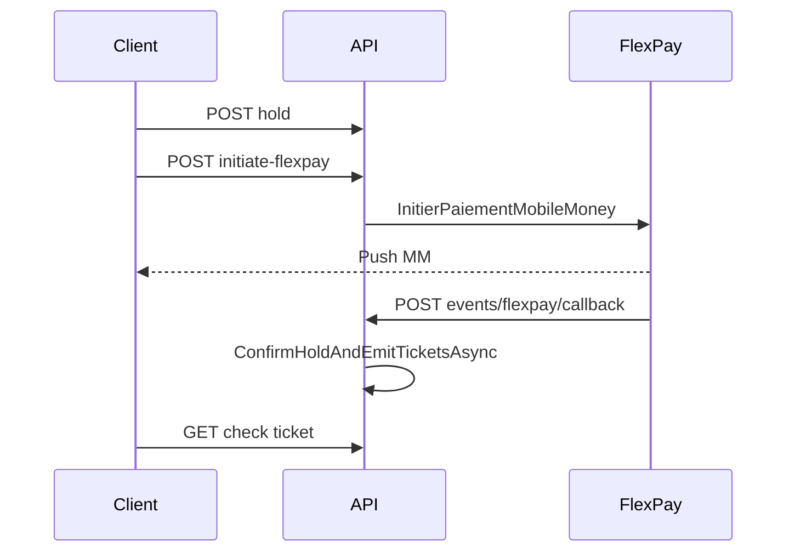

# FlexPay événementiel V1 — CongoTravelAPI

Pipeline **autonome** du transport : tables `EvenementPayments` uniquement, pas de `CommandeReservationEnAttente` ni `TransactionsFlexPay`.

## Prérequis

- Session publiée + réservation `HOLD` existante (`POST /api/events/reservations/holds` ou flux équivalent).
- `FlexPay:Enabled` et `FlexPay:EventEnabled` (ou fallback sur `Enabled`) à `true`.
- `InfoPaiementSociete` active pour le `IdSite` marchand.
- Devise tarif réservation (`D_t`) : `CDF` ou `USD` (figée au hold).
- Devise de paiement FlexPay (`D_p`) : choix client via `codeDevisePaiement` à l’initiation (`CDF` / `USD`) ; conversion serveur tarif → FlexPay si `D_t ≠ D_p`.

Configuration (`appsettings` / variables d'environnement) :

```json
"FlexPay": {
  "Enabled": true,
  "EventEnabled": true,
  "CallbackBaseUrl": "https://api.votredomaine.com/api/FlexPay/callback",
  "EventCallbackRelativePath": "/api/events/flexpay/callback",
  "ForceProductionCallbackInDev": false
}
```

L'URL callback envoyée à FlexPay est dérivée de `CallbackBaseUrl` + `EventCallbackRelativePath` (voir `FlexPayUrlHelper.ResolveEvenementCallbackUrl`).

## Endpoints (Phase 5)

| Méthode | Route | Auth | Permission |
|---------|-------|------|------------|
| `POST` | `/api/events/reservations/{id}/initiate-flexpay` | JWT | `Evenement.Reservation.Confirm` |
| `POST` | `/api/events/flexpay/callback` | Public | — |
| `GET` | `/api/events/flexpay/verifier/{orderNumber}` | JWT | `Evenement.Reservation.Confirm` |
| `GET` | `/api/events/flexpay/approve` \| `cancel` \| `decline` | Public | Redirections carte |

**Inchangé (transport)** : `/api/FlexPay/callback`, `/api/FlexPay/verifier/...`, etc.

## Parcours Mobile Money (recommandé)



### 1. Initiation

`POST /api/events/reservations/{idReservation}/initiate-flexpay`

```json
{
  "methodePaiement": "MOBILE_MONEY",
  "phone": "243900000001",
  "idSite": 1,
  "codeDevisePaiement": "CDF",
  "idempotencyKey": "optional-uuid"
}
```

`codeDevisePaiement` est optionnel : s’il est omis, la devise tarif de la réservation est utilisée (pas de conversion).

Réponse (extrait) :

```json
{
  "idEvenementReservation": 42,
  "orderNumber": "FP-ORDER-123",
  "flexPayAccepted": true,
  "alreadyInitiated": false,
  "montantTarif": 50.00,
  "codeDeviseTarif": "USD",
  "montantFlexPay": 140000,
  "codeDevisePaiement": "CDF",
  "tauxApplique": 2800,
  "payment": { "status": "PENDING", "provider": "FLEXPAY", "montant": 140000, "codeDevise": "CDF", "montantTarif": 50.00, "codeDeviseTarif": "USD", "tauxVersDevisePaiement": 2800 },
  "reservationExpiresAtUtc": "2026-07-04T12:00:00Z",
  "message": "Validez le paiement sur votre téléphone Mobile Money..."
}
```

### 2. Callback (FlexPay → API)

`POST /api/events/flexpay/callback` — corps `FlexPayCallbackDto` (`code`, `orderNumber`, `amount`, …).

- `code = 0` → confirmation hold + émission tickets (`EvenementPayment` → `SUCCEEDED`).
- `code ≠ 0` → `EvenementPayment` → `FAILED` (nouvelle initiation possible).

### 3. Secours verify

`GET /api/events/flexpay/verifier/{orderNumber}`

- Statut FlexPay `0` → même finalisation que callback ; réponse `EvenementConfirmPaymentResponseDto`.
- Statut `2` (pending) → message d'attente, hold conservé.
- Statut `1` → échec, paiement `FAILED`.

## Parcours carte bancaire

Même initiation avec `"methodePaiement": "CARTE_BANCAIRE"` (sans `phone`). La réponse contient `paymentUrl` ; redirections via `approve` / `cancel` / `decline` sur le callback événement.

## Idempotence

| Clé / cas | Comportement |
|-----------|--------------|
| `idempotencyKey` initiation | Replay → `alreadyInitiated: true`, même `EvenementPayment` |
| Callback succès répété | `alreadyProcessed: true` |
| Verify après confirm | `alreadyConfirmed: true` |
| Paiement `PENDING` existant | Nouvelle initiation refusée (utiliser verify ou callback) |

## Services C# (namespace `CongoTravel.Services.Evenement`)

| Service | Rôle |
|---------|------|
| `EvenementFlexPayInitiationService` | Hold → `PENDING` + appel `IFlexPayService` |
| `EvenementFlexPayCallbackService` | Callback + verify |
| `EvenementReservationConfirmationService` | Cœur confirm partagé CASH / FlexPay |

## Tests automatisés (Phase 5f)

- `EvenementFlexPaySmokeTests` — parcours E2E hold → initiate → callback/verify → check/use ticket.
- `EvenementFlexPayInitiationServiceTests`, `EvenementFlexPayCallbackServiceTests`, `EvenementFlexPayVerifierTests`.
- Filtre CI : `dotnet test --filter "FullyQualifiedName~Evenement"`.

## Non-régression transport

Ne pas modifier `FlexPayController`, `FlexPayCallbackService`, `FlexPayReservationService` pour le module événement.
