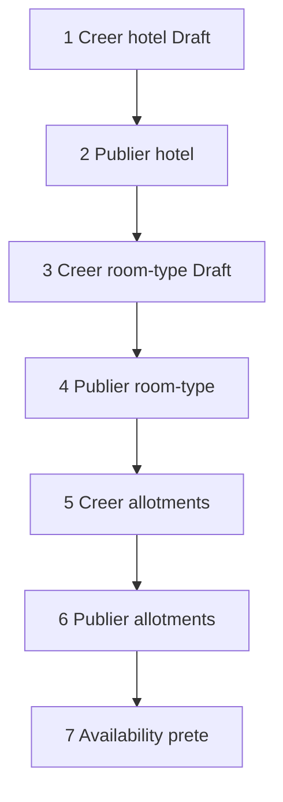
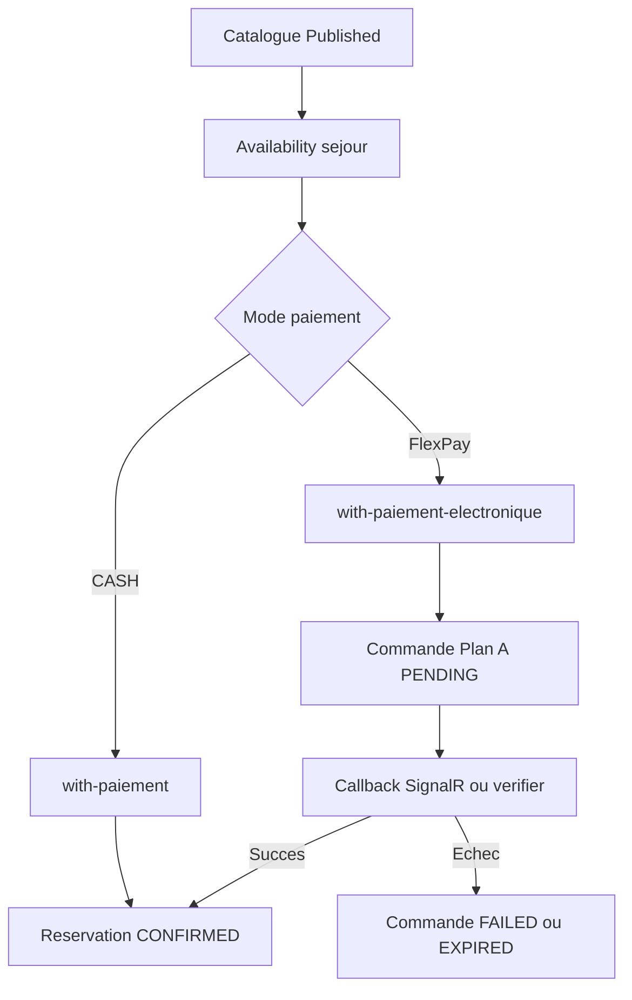

# Workflow Hôtel V1

> Module isolé : préfixe **`/api/hotels/*`**  
> Analyse architecture : [`ANALYSE_V1_HOTEL.md`](../11_analyses_plans/ANALYSE_V1_HOTEL.md)  
> Contrats API front : [`MODULE_14_HOTEL.md`](../09_frontend_integration/MODULE_14_HOTEL.md)  
> Guide implémentation Vue/Flutter : [`INTEGRATION_HOTEL_VUE_FLUTTER.md`](../09_frontend_integration/INTEGRATION_HOTEL_VUE_FLUTTER.md)

Ce document décrit le workflow métier Hôtel (ClassQuota + **GlobalQuota Phase 7b** + **HotelRoom Phase 7c** + **check-in Phase 7d** + **extras Phase 7e**), de la configuration à la vente d’acompte et au suivi. Les tickets QR et le gate restent hors V1. Catalogue chambres : `/api/hotels/rooms` ; attribution : `…/assign-rooms` ; check-in/out : `…/check-in`, `…/check-out` ; extras : `/api/hotels/extras`, `…/extras`. Planifications : `/api/hotels/planifications`. Nuits globales : `/api/hotels/nights`.

---

## 1. Glossaire (anti-collision)

| Terme | Signifie | Ne pas confondre avec |
|-------|----------|------------------------|
| `Site` / `idSite` | Guichet opérationnel / marchand FlexPay | L’établissement hôtel |
| `idHotel` | Établissement hôtelier | Table générique `Sites` |
| `HotelRoomType` | Type de chambre | Chambre physique numérotée |
| `HotelNightAllotment` | Capacité/prix d’un type pour une `NightDate` | Stock global de l’hôtel |
| `[checkIn, checkOut)` | Nuits du séjour ; check-out exclusif | Plage incluant le jour de sortie |
| Acompte | Encaissement à la réservation | Total du séjour / solde à l’arrivée |
| `idReservation` (SignalR) | = `idHotelReservation` | Réservation Transport ou autre vertical |

---

## 2. Groupes Swagger (carte mentale)

| Groupe Swagger | Rôle | Quand l’utiliser |
|----------------|------|------------------|
| **HotelEtablissement** | Catalogue, publication, photos | Toujours en premier |
| **HotelRoomType** | Types de chambres Draft/Published | Avant les allotments |
| **HotelAllotment** | Capacité/prix par nuit, batch `[from, to)` | Configuration calendrier |
| **HotelAvailability** | Stock Published par nuit / minimum séjour | Avant toute vente |
| **HotelReservation** | CASH, FlexPay, listes, détail, annulation | Guichet / app client |
| **HotelFlexPay** | Callback, verifier, abandon | Paiement électronique |
| **HotelDashboard** | KPIs société, super-admin, widget | Back-office |

---

## 3. Prérequis

1. Exécuter, dans l’ordre :
   - `production_hotel_v1.sql` ;
   - `production_hotel_phase2_allotments.sql` ;
   - `production_hotel_phase3_reservations.sql` ;
   - `production_hotel_phase4_flexpay.sql` ;
   - `production_hotel_hold_expiration_procedure_only.sql` ;
   - `production_hotel_phase7a_planification.sql` (templates planif) ;
   - `production_hotel_phase7b_global_quota.sql` (GlobalQuota / HotelNights) ;
   - `production_hotel_phase7c_rooms.sql` (HotelRooms / attributions) ;
   - `production_hotel_phase7d_checkin.sql` (CheckedInAtUtc / CheckedOutAtUtc) ;
   - `production_hotel_phase7e_extras.sql` (HotelExtras / HotelReservationExtras) ;
   - `assign_hotel_permissions_admin_gerant.sql`.
2. JWT avec permissions `Hotel.*` selon le rôle.
3. Au moins un `Site` marchand de la société.
4. Config société `DureeHoldHotelMinutes` (défaut 15, bornée de 1 à 120).
5. Pour FlexPay : `FlexPay:HotelEnabled=true` et callback hôtel configuré.

Voir [`Scripts/README_DEPLOIEMENT_HOTEL_V1.md`](../../../Scripts/README_DEPLOIEMENT_HOTEL_V1.md).

---

## 4. Parcours back-office (configuration)



### 4.1 Hôtel

1. `POST /api/hotels/etablissements` avec `idSite` marchand et `acomptePourcentDefaut`.
2. Ajouter les photos multipart si nécessaire.
3. `PUT /api/hotels/etablissements/{id}/publish`.

### 4.2 Types de chambres

1. `POST /api/hotels/room-types` avec `idHotel`, code, libellé, capacité personnes et prix de référence.
2. `PUT /api/hotels/room-types/{id}/publish`.

Le type est une classe vendable, pas une chambre numérotée.

### 4.3 Allotments

- Unitaire : `POST /api/hotels/allotments`.
- Plage simple : `POST /api/hotels/allotments/batch` avec `[from, to)`.
- Templates récurrents (**Phase 7a**) : `POST /api/hotels/planifications` puis `POST /api/hotels/planifications/{id}/generer`.
- Publication : `PUT /api/hotels/allotments/{id}/publish` (ou `publierApresGeneration` à la génération).

Chaque nuit du séjour doit disposer d’un allotment Published pour chaque type demandé. Le batch one-shot et la planif génèrent des Drafts ; publier avant vente.

### 4.3bis Chambres physiques (Phase 7c)

1. `POST /api/hotels/rooms` (`idHotel`, `idHotelRoomType`, `numero`, étage/libellé optionnels).
2. Après confirmation d’une réservation : `POST|PUT /api/hotels/reservations/{id}/assign-rooms` avec une chambre par unité de quantity.
3. L’annulation de la réservation libère les attributions.

Le client n’achète pas un numéro ; la réception attribue après confirm.

### 4.3ter Check-in réception (Phase 7d)

1. `POST|PUT /api/hotels/reservations/{id}/check-in` sur résa **CONFIRMED** (attribution 7c optionnelle).
2. `POST|PUT /api/hotels/reservations/{id}/check-out` après check-in.
3. L’annulation remet `checkedInAtUtc` / `checkedOutAtUtc` à null.

Statut métier reste `CONFIRMED` — pas de ticket QR.

### 4.3quater Extras réception (Phase 7e)

1. `POST /api/hotels/extras` — catalogue (`code`, `libelle`, `prixUnitaire`, `pricingUnit` : `PerStay` ou `PerNight`).
2. Après confirmation : `POST|PUT /api/hotels/reservations/{id}/extras` avec `{ items: [{ idHotelExtra, quantity }] }` (replace-all).
3. L’annulation supprime les lignes extras. `montantExtras` est informatif ; l’acompte (`montantSejour`) reste inchangé.

### 4.4 Validation finale

```http
GET /api/hotels/availability?idHotel=1&from=2026-09-10&to=2026-09-13&roomTypeId=2
```

La vente est prête si toutes les nuits sont retournées et si `minDisponible` couvre la quantité demandée.

---

## 5. Parcours vente — CASH vs FlexPay



### 5.1 CASH

`POST /api/hotels/reservations/with-paiement`

Le backend crée un hold multi-nuit puis le confirme immédiatement : réservation `CONFIRMED`, paiement acompte `SUCCEEDED`, inventaire déplacé de Hold vers Vendue.

### 5.2 FlexPay — Plan A

`POST /api/hotels/reservations/with-paiement-electronique`

Le Plan A ne crée **aucune réservation métier avant le succès FlexPay** :

1. validation du séjour et snapshot des lignes ;
2. création d’une `HotelCommandeEnAttente` avec expiration ;
3. initiation FlexPay et retour de `orderNumber` / `paymentUrl` ;
4. callback ou `GET /api/hotels/flexpay/verifier/{orderNumber}` ;
5. en cas de succès, création atomique du hold, confirmation et paiement ;
6. en cas d’échec/expiration, aucune réservation Hôtel n’est conservée.

Store frontend : `domain: 'hotel'`. `paiement.idSite` est le marchand, pas l’hôtel.

---

## 6. Expiration des holds et commandes Plan A

### Holds CASH / réservation

`HotelHoldExpirationHostedService` appelle `sp_ExpireHotelHolds` : un hold expiré devient `EXPIRED` et restitue toutes les nuits concernées.

### Commandes FlexPay Plan A

Une commande en attente expirée devient non payable, libère son état temporaire et produit `FlexPayPaymentFailed`. Comme aucune réservation n’existe avant le succès, le frontend doit suivre le paiement avec `orderNumber`, pas avec un faux identifiant de réservation.

Abandon explicite :

```http
POST /api/hotels/flexpay/abandon/{orderNumber}
```

Le callback `/api/hotels/flexpay/callback` appartient à FlexPay et ne doit jamais être invoqué par Vue ou Flutter.

---

## 7. Mes réservations

| Besoin | Endpoint |
|--------|----------|
| Liste société / self-scope | `GET /api/hotels/reservations?idSociete=&status=&idHotel=` |
| Liste client cross-société | `GET /api/hotels/reservations/client/{idClient}?status=` |
| Détail | `GET /api/hotels/reservations/{id}?idSociete=` |
| Annulation | `POST /api/hotels/reservations/{id}/cancel?idSociete=` |

Le statut par défaut est `CONFIRMED`; `status=ALL` inclut les autres états. Le backend vérifie l’ownership client et la société propriétaire de l’hôtel.

---

## 8. Dashboard

- `GET /api/hotels/dashboard?month=yyyy-MM&idSociete=`
- `GET /api/hotels/dashboard/super-admin?month=yyyy-MM`
- `GET /api/hotels/dashboard/widget?month=yyyy-MM&idSociete=`

Permission : `Hotel.Dashboard.Read`. La route `super-admin` exige aussi le rôle Super-Admin. Les montants encaissés représentent les **acomptes** ; ne pas les présenter comme le total des séjours.

---

## 9. Checklist ops déploiement

- [ ] SQL Phases 1 à 4 + procédure d’expiration appliqués
- [ ] `assign_hotel_permissions_admin_gerant.sql` appliqué
- [ ] `DureeHoldHotelMinutes` vérifié
- [ ] `FlexPay:HotelEnabled` et callback configurés si nécessaire
- [ ] Hôtel Published
- [ ] Room-types Published
- [ ] Allotments Published sur toutes les nuits du test
- [ ] Smoke CASH multi-nuit sans oversell
- [ ] Smoke FlexPay Plan A + SignalR / verifier
- [ ] Smoke mes réservations cross-société
- [ ] Smoke dashboard société + widget

---

## 10. Références

- Contrats API : [`MODULE_14_HOTEL.md`](../09_frontend_integration/MODULE_14_HOTEL.md)
- Guide implémentation Vue/Flutter : [`INTEGRATION_HOTEL_VUE_FLUTTER.md`](../09_frontend_integration/INTEGRATION_HOTEL_VUE_FLUTTER.md)
- Analyse : [`ANALYSE_V1_HOTEL.md`](../11_analyses_plans/ANALYSE_V1_HOTEL.md)
- Photos : [`MODULE_13_PHOTOS_STOCKAGE_S3.md`](../09_frontend_integration/MODULE_13_PHOTOS_STOCKAGE_S3.md)
- SignalR : [`INTEGRATION_SIGNALR_EVENEMENT_FLEXPAY.md`](../09_frontend_integration/INTEGRATION_SIGNALR_EVENEMENT_FLEXPAY.md)
- Déploiement : [`Scripts/README_DEPLOIEMENT_HOTEL_V1.md`](../../../Scripts/README_DEPLOIEMENT_HOTEL_V1.md)
