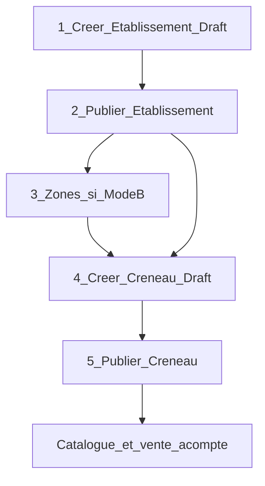
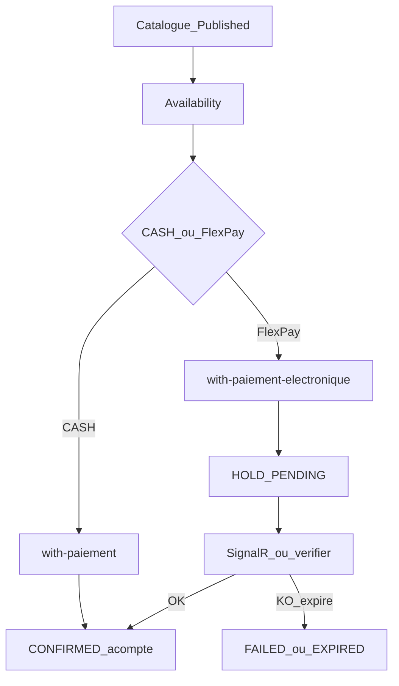

# Workflow Restaurant V1

> Module isolé : préfixe **`/api/restaurants/*`**  
> Analyse architecture : [`ANALYSE_V1_RESTAURANT.md`](../11_analyses_plans/ANALYSE_V1_RESTAURANT.md)  
> Intégration front : [`MODULE_11_RESTAURANT.md`](../09_frontend_integration/MODULE_11_RESTAURANT.md)

Ce document décrit le **workflow métier complet** (configuration → vente d’acompte).  
**Hors V1** : tables numérotées, check-in salle / QR (Phase 6+).  
**V1.1** : planification batch multi-plages des créneaux (`/api/restaurants/planifications`).

---

## 1. Glossaire (anti-collision)

| Terme | Signifie | Ne pas confondre avec |
|-------|----------|------------------------|
| `Site` / `idSite` | Guichet opérationnel / marchand FlexPay | L’établissement restaurant |
| `idRestaurant` | Établissement (produit) | Table `Sites` |
| `idRestaurantCreneau` | Offre sellable (date + plage horaire) | Journée site touristique |
| `idRestaurantZone` | Zone inventaire Mode B | Classe billetterie événement |
| Acompte | Encaissement à la réservation | Addition / ticket repas |
| `idReservation` (SignalR) | = `idRestaurantReservation` | Réservation bus |

---

## 2. Groupes Swagger (carte mentale)

| Groupe Swagger | Rôle | Quand l’utiliser |
|----------------|------|------------------|
| **RestaurantEtablissement** | Catalogue du restaurant | **Toujours en premier** |
| **RestaurantZone** | Zones / salles (Terrasse, VIP…) | Si inventaire `ClassQuota` |
| **RestaurantCreneau** | Créneau sellable + publish + availability | Vente + catalogue |
| **RestaurantPlanification** | Templates multi-plages + génération batch | Back-office (V1.1) |
| **RestaurantReservation** | Façades acompte CASH / FlexPay, cancel | Guichet / app client |
| **RestaurantFlexPay** | Callback, verifier, abandon | Paiement électronique |
| **RestaurantDashboard** | KPIs société | Back-office |

---

## 3. Prérequis

1. Scripts SQL Restaurant appliqués (tables Phase 1–4 + expiration hold + permissions).
2. JWT avec permissions `Restaurant.*` selon le rôle.
3. Au moins un `Site` (guichet) de la société avec config FlexPay si vente électronique.
4. Config société : `DureeHoldRestaurantMinutes` (défaut 15).
5. Optionnel kill-switch : `FlexPay:RestaurantEnabled`.

---

## 4. Parcours back-office (configuration)

Ordre recommandé :

### 4.1 Établissement

1. `POST /api/restaurants/etablissements` — créer (Draft) avec `idSite` = **guichet** marchand + `acomptePourcentDefaut`.
2. `PUT /api/restaurants/etablissements/{id}/publish` — rendre le restaurant publié.

Sans établissement publié, pas de catalogue client cohérent.

### 4.2 Zones (Mode B uniquement)

- `POST /api/restaurants/zones` — ex. Terrasse, Salle VIP.
- Nécessaire avant un créneau en `ClassQuota`.

### 4.3 Créneau (chemin principal V1)

- `POST /api/restaurants/creneaux` — `GlobalQuota` **ou** `ClassQuota` + `zoneQuotas`.
- Optionnel : `montantAcompte` fixe (sinon % défaut × prix unitaire).
- `PUT /api/restaurants/creneaux/{id}/publish` — ouvre la vente.

### 4.4 Planification batch (V1.1)

Alternative au créneau unitaire : template récurrent multi-plages.

1. `POST /api/restaurants/planifications` — jours de semaine + N plages locales (`startTime`/`endTime`) avec quotas **par plage**.
2. `POST /api/restaurants/planifications/{id}/generer` — pour chaque date × chaque plage → créneau Draft (idempotent sur `IdRestaurant` + `DateService` + `StartAtUtc`).
3. Optionnel : `"publierApresGeneration": true` pour publier immédiatement les créneaux créés.

Horaires locaux convertis en UTC via offset fixe UTC+1 (`utc = local − 1h`).  
Les plages chevauchantes sont rejetées à la création / mise à jour.  
Modifier le template (quotas) **ne recalcule pas** les créneaux déjà générés.

---

## 5. Parcours vente (acompte)

### 5.1 CASH (guichet)

`POST /api/restaurants/reservations/with-paiement`  
→ réservation `CONFIRMED` + paiement `SUCCEEDED` immédiat.

### 5.2 FlexPay (client / guichet)

`POST /api/restaurants/reservations/with-paiement-electronique`  
→ `HOLD` + paiement `PENDING`  
→ SignalR `FlexPayPaymentConfirmed` / `Failed` **ou** poll  
`GET /api/restaurants/flexpay/verifier/{orderNumber}`.

Front : store pending avec `domain: 'restaurant'`.

### 5.3 Expiration hold

Job `RestaurantHoldExpirationHostedService` + SP :  
hold expiré → statut résa `EXPIRED`, paiement FlexPay `FAILED` + SignalR Failed.

---

## 6. Dashboard

- `GET /api/restaurants/dashboard?month=yyyy-MM`
- `GET /api/restaurants/dashboard/super-admin?month=`
- `GET /api/restaurants/dashboard/widget?month=`

KPIs centrés **acomptes** (CASH / FLEXPAY), créneaux et réservations — **pas** de tickets.

---

## 7. Checklist ops déploiement

- [ ] `production_restaurant_v1.sql`
- [ ] `production_restaurant_phase2_reservations.sql`
- [ ] `production_restaurant_hold_expiration_procedure_only.sql`
- [ ] `production_restaurant_phase4_zones.sql`
- [ ] `assign_restaurant_permissions_admin_gerant.sql`
- [ ] Config `DureeHoldRestaurantMinutes` + FlexPay restaurant si besoin
- [ ] Smoke : CASH GlobalQuota + dashboard mois courant
- [ ] Smoke : FlexPay MM + SignalR / verifier

---

## 8. Références

- Front : [`MODULE_11_RESTAURANT.md`](../09_frontend_integration/MODULE_11_RESTAURANT.md)
- Miroir Site Touristique : [`DOCUMENTATION_WORKFLOW_SITE_TOURISTIQUE_V1.md`](DOCUMENTATION_WORKFLOW_SITE_TOURISTIQUE_V1.md)
