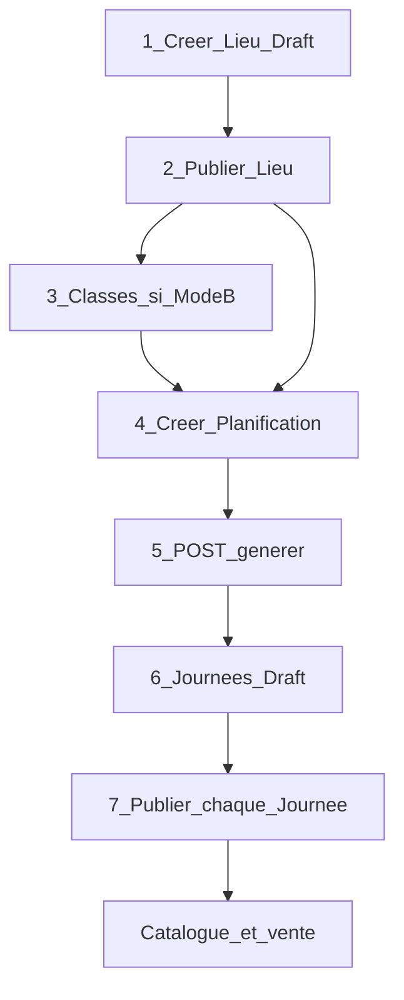
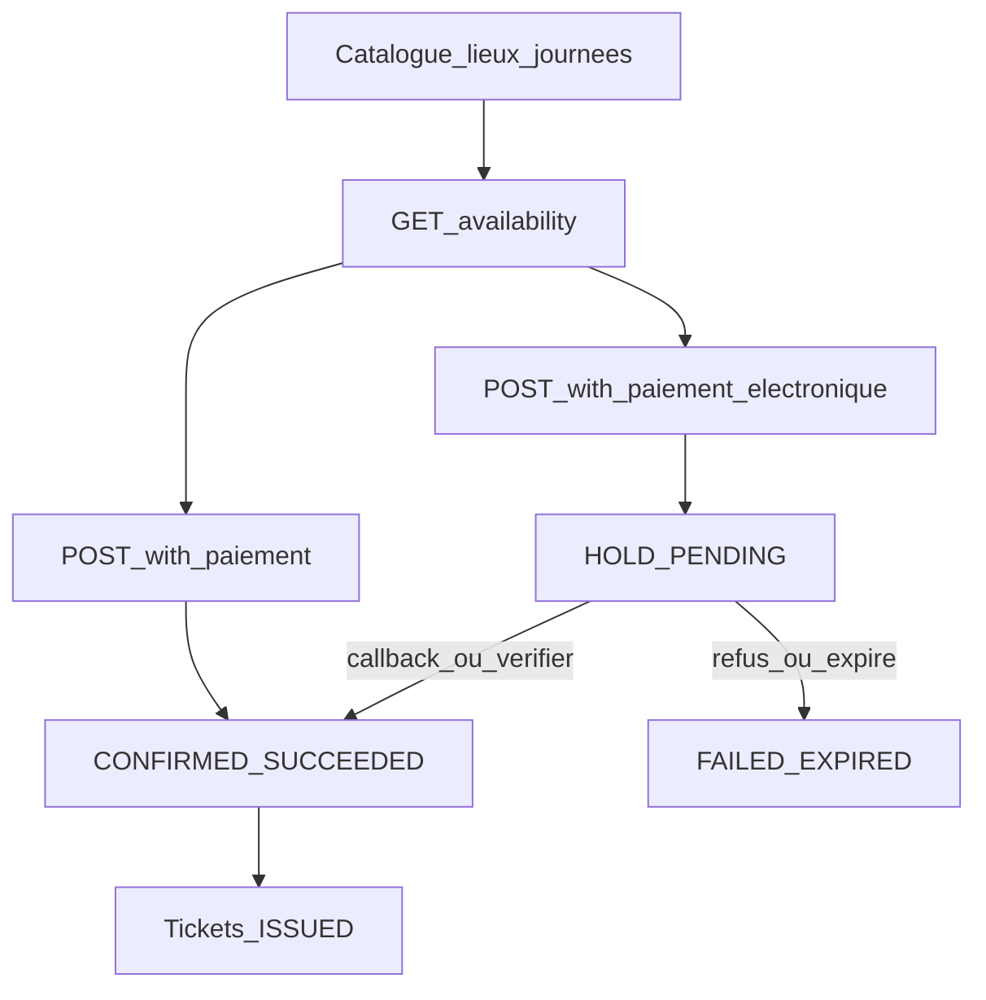
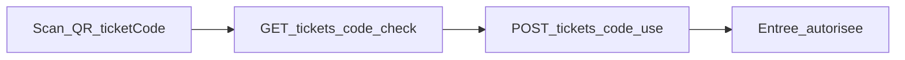

# Workflow Site Touristique V1

> Module isolé : préfixe **`/api/sites-touristiques/*`**  
> Analyse architecture : [`ANALYSE_V1_SITE_TOURISTIQUE.md`](../11_analyses_plans/ANALYSE_V1_SITE_TOURISTIQUE.md)  
> Intégration front : [`MODULE_10_SITE_TOURISTIQUE.md`](../09_frontend_integration/MODULE_10_SITE_TOURISTIQUE.md)  
> Déploiement SQL : [`Scripts/README_DEPLOIEMENT_SITE_TOURISTIQUE_V1.md`](../../../Scripts/README_DEPLOIEMENT_SITE_TOURISTIQUE_V1.md)

Ce document décrit le **workflow métier complet** (configuration → vente → entrée), y compris la **Planification** (V1.1).

---

## 1. Glossaire (anti-collision)

| Terme | Signifie | Ne pas confondre avec |
|-------|----------|------------------------|
| `Site` / `idSite` | Guichet opérationnel / marchand FlexPay | Le produit touristique |
| `idSiteTouristique` | Lieu / attraction (produit) | Table `Sites` |
| `idSiteTouristiqueJournee` | Offre sellable pour une **date** de visite | Session événement |
| `idSiteTouristiquePlanification` | Template récurrent (jours + quotas) | `PlanificationVoyage` transport |
| `idReservation` (SignalR) | = `idSiteTouristiqueReservation` | Réservation bus |

---

## 2. Groupes Swagger (carte mentale)

| Groupe Swagger | Rôle | Quand l’utiliser |
|----------------|------|------------------|
| **SiteTouristiqueLieu** | Catalogue du lieu (parc, musée…) | **Toujours en premier** |
| **SiteTouristiqueClasse** | Tarifs Adulte / Enfant… | Si inventaire `ClassQuota` |
| **SiteTouristiquePlanification** | Template + génération batch de journées | Calendrier récurrent (recommandé) |
| **SiteTouristiqueJournee** | Date sellable + publish + availability | Vente + catalogue |
| **SiteTouristiqueReservation** | Façades achat CASH / FlexPay, cancel | Guichet / app client |
| **SiteTouristiqueFlexPay** | Callback, verifier, abandon | Paiement électronique |
| **SiteTouristiqueTicket** | Liste, check, use | QR + contrôle entrée |
| **SiteTouristiqueDashboard** | KPIs société | Back-office |

---

## 3. Prérequis

1. Scripts SQL Site Touristique appliqués (tables + planification + expiration hold + permissions).
2. JWT avec permissions `SiteTouristique.*` selon le rôle.
3. Au moins un `Site` (guichet) de la société avec config FlexPay si vente électronique.
4. Config société : `DureeHoldSiteTouristiqueMinutes` (défaut 15).

---

## 4. Parcours back-office (configuration)

Ordre recommandé :

### 4.1 Lieu

1. `POST /api/sites-touristiques/lieux` — créer (Draft) avec `idSite` = **guichet** marchand.
2. `PUT /api/sites-touristiques/lieux/{id}/publish` — rendre le lieu publié.

Sans lieu publié, pas de catalogue client cohérent / pas de template rattaché proprement.

### 4.2 Classes (Mode B uniquement)

- `POST /api/sites-touristiques/classes` — ex. Adulte, Enfant.
- Nécessaire avant planification / journée en `ClassQuota`.

### 4.3 Planification → génération (chemin principal)

1. `POST /api/sites-touristiques/planifications`  
   Template : `joursSemaine` (0=dim … 6=sam), `inventoryMode`, quotas snapshot, `codeDevise`.
2. `POST /api/sites-touristiques/planifications/{id}/generer`  
   Modes : `MoisCourant` | `SemaineCourante` | `MoisProchain` | `PeriodePersonnalisee`.  
   Optionnel : `"publierApresGeneration": true` pour publier chaque journée **créée** (pas les ignorées).
3. Résultat : résumé `creees` / `publiees` / `ignorees` / `echecs` + `details[].publiee`.
4. Sans le flag (défaut) : journées en **`Draft`** → `PUT /api/sites-touristiques/journees/{id}/publish` pour vendre.  
   Avec le flag : `publiees` indique celles déjà Published ; si le lieu n’est pas Published, create reste Draft et `message` explique l’échec publish.

**Règles** :
- Idempotence : `(idSiteTouristique, dateVisite)` déjà présent → **Ignore**.
- Modifier le template (`PUT`) **ne mute pas** les journées déjà générées.
- `DELETE` planification : soft-disable si des journées liées ont des réservations ; sinon hard delete si safe.

### 4.4 Alternative — journée ponctuelle

Sans planification :

1. `POST /api/sites-touristiques/journees` (Draft + quotas Global ou Class).
2. `PUT .../journees/{id}/publish`.

---

## 5. Parcours vente

### 5.1 CASH (guichet)

`POST /api/sites-touristiques/reservations/with-paiement`

- Hold + confirm + tickets en une façade.
- Réponse typique : `transactionStatut: Succes`, résa `CONFIRMED`, tickets `ISSUED`.

### 5.2 FlexPay (app / caisse électronique)

`POST /api/sites-touristiques/reservations/with-paiement-electronique`

- Réservation `HOLD`, paiement `PENDING`, `orderNumber` + éventuellement `paymentUrl` (carte).
- Finalisation :
  - Callback `POST .../flexpay/callback`, ou
  - Poll `GET .../flexpay/verifier/{orderNumber}`, ou
  - SignalR `FlexPayPaymentConfirmed` / `FlexPayPaymentFailed`.
- Hold expiré (job) → paiement `FAILED` + SignalR Failed + journée libérée côté inventaire.

### 5.3 Items selon inventaire

| `inventoryMode` journée | `items[]` |
|-------------------------|-----------|
| `GlobalQuota` | `[{ "quantity": 2 }]` |
| `ClassQuota` | `[{ "classId": 1, "quantity": 2 }]` |

`paiement.idSite` = guichet (préremplir depuis le lieu), **pas** `idSiteTouristique`.

---

## 6. Parcours contrôle d’entrée (gate)

1. `GET /api/sites-touristiques/tickets/{ticketCode}/check`
2. Si OK : `POST /api/sites-touristiques/tickets/{ticketCode}/use` → `USED`
3. Règle V1 : entrée autorisée si le **jour calendaire UTC** = `DateVisite` de la journée.

---

## 7. Matrice d’états

| Entité | États principaux |
|--------|------------------|
| Lieu / Journée | `Draft` → `Published` → `Closed` / `Cancelled` |
| Réservation | `HOLD` → `CONFIRMED` \| `EXPIRED` \| `CANCELLED` |
| Paiement | `PENDING` → `SUCCEEDED` \| `FAILED` \| `REFUNDED` |
| Ticket | `ISSUED` → `USED` \| `VOID` |
| Planification | `Statut` bool (actif / désactivé) |

---

## 8. Permissions (rappel)

| Permission | Usage workflow |
|------------|----------------|
| `SiteTouristique.Lieu.Read` | Listes lieux, journées, planifs, résas |
| `SiteTouristique.Lieu.Write` | CRUD lieu, journée, planification, `/generer`, publish |
| `SiteTouristique.Classe.Read` / `.Write` | Mode B |
| `SiteTouristique.Hold.Create` + `.Reservation.Confirm` | Façades achat |
| `SiteTouristique.Ticket.Check` / `.Use` | Gate |
| `SiteTouristique.Dashboard.Read` | Dashboard |

Client app : `Lieu.Read` + `Hold.Create` + `Reservation.Confirm`.

---

## 9. Ce que ce module n’est pas

- Pas Transport (`/api/Reservation`, `/api/FlexPay`, `PlanificationVoyage`).
- Pas Evenement (`/api/events/*`).
- Pas de sièges numérotés ni créneaux horaires en V1.
- Auto-publish des journées générées : **opt-in** via `publierApresGeneration` sur `/generer` (défaut = Draft → publish explicite).

---

## 10. Checklist test manuel (Swagger)

1. Auth JWT Admin / Gérant.
2. Créer + publier un lieu (`idSite` guichet valide).
3. Créer planification GlobalQuota (ex. lun–sam) → `generer` MoisCourant.
4. Publier 1–2 journées Draft.
5. `with-paiement` CASH → tickets.
6. (Optionnel) FlexPay MM → verifier / SignalR.
7. `tickets/{code}/check` puis `use` le jour de `DateVisite`.
