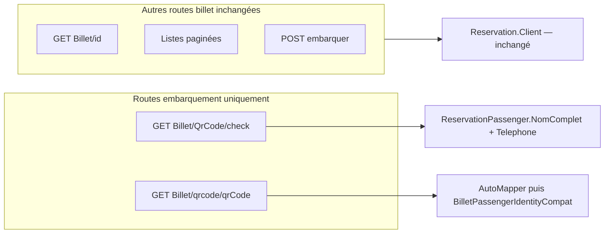

# Guide de migration — Identité passager sur check billet

> **Objectif** : documenter toutes les étapes pour corriger l'identité affichée lors du scan billet à l'embarquement, et reproduire la solution dans un autre projet ASP.NET Core similaire.
>
> **Référence d'implémentation** : CongoTravelAPI (correction livrée).

---

## Table des matières

1. [Résumé exécutif](#1-résumé-exécutif)
2. [Avis technique sur l'approche compatibilité](#2-avis-technique-sur-lapproche-compatibilité)
3. [Symptôme et diagnostic](#3-symptôme-et-diagnostic)
4. [Solution cible](#4-solution-cible)
5. [Prérequis](#5-prérequis)
6. [Étape 0 — Diagnostic dans le projet cible](#étape-0--diagnostic-dans-le-projet-cible)
7. [Étape 1 — Documenter la sémantique des DTOs](#étape-1--documenter-la-sémantique-des-dtos)
8. [Étape 2 — Corriger la route check (`ToCheckResponseDto`)](#étape-2--corriger-la-route-check-tocheckresponsedto)
9. [Étape 3 — Helper de compatibilité pour `GET qrcode`](#étape-3--helper-de-compatibilité-pour-get-qrcode)
10. [Étape 4 — Includes Entity Framework](#étape-4--includes-entity-framework)
11. [Étape 5 — Tests unitaires](#étape-5--tests-unitaires)
12. [Étape 6 — Impact frontend](#étape-6--impact-frontend)
13. [Checklist déploiement production](#checklist-déploiement-production)
14. [Matrice d'adaptation projet similaire](#matrice-dadaptation-projet-similaire)
15. [Pièges connus](#pièges-connus)
16. [Fichiers de référence CongoTravelAPI](#fichiers-de-référence-congotravelapi)

---

## 1. Résumé exécutif

| Avant (bug) | Après (correction) |
|-------------|-------------------|
| `nomClient` / `telephoneClient` = **acheteur payeur** (`Clients`) | Mêmes propriétés = **passager transporté** (`ReservationPassagers`) |
| Mauvaise personne affichée en multi-passagers | Nom et téléphone du passager lié au billet |
| Noms de propriétés JSON inchangés | Noms de propriétés JSON inchangés (compat frontend) |

### Routes impactées vs non impactées

| Route | DTO | `nomClient` / `telephoneClient` |
|-------|-----|--------------------------------|
| `GET /api/Billet/{QrCode}/check` | `BilletCheckResponseDto` | **Passager** (corrigé) |
| `GET /api/Billet/qrcode/{qrCode}` | `BilletResponseDto[]` | **Passager** (corrigé via helper) |
| `GET /api/Billet/{id}` | `BilletResponseDto` | Acheteur (inchangé) |
| `GET /api/Billet/reservation/{id}` | `BilletResponseDto[]` | Acheteur (inchangé) |
| Listes paginées, embarquement POST, etc. | `BilletResponseDto` | Acheteur (inchangé) |

**Impact métier** : l'agent d'embarquement voit le bon passager au scan QR, sans mise à jour obligatoire des applications mobiles ou web.

---

## 2. Avis technique sur l'approche compatibilité

### Décision retenue

Conserver les noms de propriétés `nomClient` et `telephoneClient`, changer uniquement la **source des valeurs** (passager transporté au lieu de l'acheteur payeur).

### Avantages

| Point | Détail |
|-------|--------|
| Zéro changement de contrat JSON | Les apps Flutter/Vue qui lisent `nomClient` au scan continuent de fonctionner |
| Déploiement backend seul | Correction possible sans release coordonnée front + back |
| Périmètre ciblé | Seules les routes embarquement changent ; le back-office CRM garde `nomClient` = payeur |

### Limites

| Point | Détail |
|-------|--------|
| Sémantique trompeuse | Sur les routes check/qrcode, `nomClient` n'est **plus** le client payeur |
| Double sémantique selon la route | Un même champ a deux significations selon l'endpoint appelé |
| Risque de confusion dev | Un développeur qui lit `nomClient` sans consulter la doc peut se tromper |

### Recommandation

L'approche est **valide et pragmatique** pour corriger l'affichage embarquement en production sans régression frontend.

**Évolution à moyen terme** (optionnelle) :
- Utiliser explicitement `nomPassager` côté frontend (déjà présent sur `BilletResponseDto`).
- Ajouter `telephonePassager` si besoin d'un contrat explicite.
- Migrer progressivement les écrans de scan vers ces champs, puis documenter `nomClient` comme « legacy embarquement ».

---

## 3. Symptôme et diagnostic

### Symptôme observé

Lors du scan QR à l'embarquement (`GET /api/Billet/{QrCode}/check`), l'application affichait :
- Le **nom de l'acheteur** (personne qui a payé la réservation)
- Le **téléphone de l'acheteur**

Au lieu du passager réellement transporté (surtout visible en **réservation multi-passagers** : un parent achète pour plusieurs enfants, l'agent voyait le nom du parent).

### Cause racine

1. **Route check** : `BilletCheckResponseDto` était peuplé depuis `Reservation.Client` (acheteur), pas depuis `ReservationPassenger`.

2. **Route qrcode** : le mapping AutoMapper standard sur `Billet → BilletResponseDto` définit explicitement :

```csharp
// VehiculeMappingProfile.cs — mapping global (inchangé volontairement)
.ForMember(dest => dest.NomPassager,
    opt => opt.MapFrom(src => src.ReservationPassenger != null
        ? src.ReservationPassenger.NomComplet : null))
.ForMember(dest => dest.NomClient,
    opt => opt.MapFrom(src => src.Reservation != null && src.Reservation.Client != null
        ? src.Reservation.Client.NomClient : null))
.ForMember(dest => dest.TelephoneClient,
    opt => opt.MapFrom(src => src.Reservation != null && src.Reservation.Client != null
        ? src.Reservation.Client.Telephone : null))
```

Le champ `nomPassager` existait déjà avec la bonne valeur, mais le frontend embarquement lisait `nomClient` / `telephoneClient`.

### Modèle de données concerné

```
Reservation (1) ──► Client (acheteur / payeur)
       │
       ├──► ReservationPassenger (passager 1)
       ├──► ReservationPassenger (passager 2)
       │
       └──► Billet ──► IdReservationPassenger ──► un passager précis
```

Chaque billet est lié à **un** passager via `Billet.IdReservationPassenger`.

---

## 4. Solution cible

### Principe : périmètre ciblé, pas de changement AutoMapper global



### Deux mécanismes complémentaires

| Route | Mécanisme | Pourquoi |
|-------|-----------|----------|
| `check` | Mapping direct dans `ToCheckResponseDto` | DTO dédié, pas d'AutoMapper |
| `qrcode` | Helper `BilletPassengerIdentityCompat` après AutoMapper | Réutilise le mapping existant puis écrase les champs client |

**Ne pas** modifier le profil AutoMapper global : cela changerait `nomClient` sur toutes les listes admin, facturation et exports.

---

## 5. Prérequis

| Composant | Requis |
|-----------|--------|
| Framework | ASP.NET Core 6+ |
| ORM | Entity Framework Core avec relation `Billet → ReservationPassenger` |
| Modèle | `Billet.IdReservationPassenger` renseigné à l'émission |
| DTO check | `BilletCheckResponseDto` avec `NomClient` et `TelephoneClient` |
| Tests | xUnit + base de données en mémoire ou mocks |

### Fichiers typiquement impactés

```
Models/DTOs/BilletCheckResponseDto.cs          # Commentaires XML sémantique
Services/Billets/BilletService.Embarquement.cs # ToCheckResponseDto
Helpers/BilletPassengerIdentityCompat.cs       # Nouveau helper
Controllers/BilletController.cs                # GetByQrCode uniquement
Services/BilletService.cs                      # Vérifier includes EF
Tests/BilletPassengerIdentityCompatTests.cs    # Tests helper
Tests/BilletValiditeMultiVoyagesTests.cs       # Tests intégration check/qrcode
```

---

## Étape 0 — Diagnostic dans le projet cible

**Checklist**

- [ ] Localiser `GET .../check` (contrôle billet par QR code).
- [ ] Localiser `GET .../qrcode/{qrCode}` si utilisé à l'embarquement.
- [ ] Identifier la source actuelle de `nomClient` / `telephoneClient` dans le code (Client vs Passenger).
- [ ] Vérifier que les billets multi-passagers ont `IdReservationPassenger` renseigné.
- [ ] Reproduire le scénario acheteur ≠ passager (voir ci-dessous).

### Reproduction du bug

1. Créer une réservation avec :
   - Client acheteur : `NomClient = "Acheteur Dupont"`, `Telephone = "+243111"`
   - Passager billet : `NomComplet = "Passager Réel"`, `Telephone = "+243999"`
2. Émettre un billet lié au passager.
3. Appeler `GET /api/Billet/{qrCode}/check`.

**Comportement bugué** : `nomClient = "Acheteur Dupont"`, `telephoneClient = "+243111"`.

**Comportement attendu après correction** : `nomClient = "Passager Réel"`, `telephoneClient = "+243999"`.

```bash
curl -s "https://api.example.com/api/Billet/QR-XXXX/check" | jq '{nomClient, telephoneClient}'
```

---

## Étape 1 — Documenter la sémantique des DTOs

Mettre à jour les commentaires XML de `BilletCheckResponseDto` pour éviter toute ambiguïté future :

```csharp
/// <summary>Nom affiché à l'embarquement : passager réel (NomComplet), pas l'acheteur.</summary>
public string? NomClient { get; set; }

/// <summary>Téléphone affiché à l'embarquement : passager réel, pas l'acheteur.</summary>
public string? TelephoneClient { get; set; }
```

Optionnel : ajouter une note similaire dans la documentation API (`DOCUMENTATION_EMBARQUEMENT_BILLET_ET_PASSAGERS_VOYAGE.md`).

---

## Étape 2 — Corriger la route check (`ToCheckResponseDto`)

Dans le service d'embarquement (`BilletService.Embarquement.cs`), la méthode `ToCheckResponseDto` construit la réponse du check.

### Avant (bugué — exemple typique)

```csharp
NomClient = billet.Reservation?.Client?.NomClient,
TelephoneClient = billet.Reservation?.Client?.Telephone
```

### Après (corrigé)

```csharp
NomClient = billet.ReservationPassenger?.NomComplet,
TelephoneClient = billet.ReservationPassenger?.Telephone
```

### Contexte complet de la méthode

```csharp
private static BilletCheckResponseDto ToCheckResponseDto(Billet billet, BilletEligibiliteResult e)
{
    var voyage = e.VoyageReference ?? billet.Reservation?.Voyage;
    return new BilletCheckResponseDto
    {
        IdBillet = billet.IdBillet,
        IsUsed = billet.IsUsed,
        Statut = e.Code,
        Message = e.Message,
        EmbarquementAutorise = e.Autorise,
        IdReservation = e.IdReservation ?? billet.IdReservation,
        StatutReservation = e.StatutReservation ?? billet.Reservation?.StatutReservation,
        DateDepartVoyage = e.DateDepartVoyage ?? voyage?.DateDepart.Date,
        HeureDepartVoyage = e.HeureDepartVoyage ?? voyage?.HeureDepart,
        // Identité passager (pas acheteur)
        NomClient = billet.ReservationPassenger?.NomComplet,
        TelephoneClient = billet.ReservationPassenger?.Telephone
    };
}
```

### Vérifier le chargement du billet

`CheckBilletByQrCodeAsync` doit charger le billet avec les includes nécessaires :

```csharp
var billet = await QueryBilletsWithEmbarquementIncludes()
    .FirstOrDefaultAsync(b => b.QrCode == normalized);
return await CheckBilletCoreAsync(billet, idVoyageCible);
```

---

## Étape 3 — Helper de compatibilité pour `GET qrcode`

La route `GET /api/Billet/qrcode/{qrCode}` retourne des `BilletResponseDto` mappés par AutoMapper (où `nomClient` = acheteur). Pour aligner le comportement sur le check sans toucher AutoMapper global, appliquer un helper **après** le mapping.

### Créer `Helpers/BilletPassengerIdentityCompat.cs`

```csharp
using CongoTravel.Models;
using CongoTravel.Models.DTOs;

namespace CongoTravel.Helpers
{
    /// <summary>
    /// Aligne BilletResponseDto.NomClient / TelephoneClient
    /// sur le passager transporté (compatibilité frontend embarquement).
    /// </summary>
    public static class BilletPassengerIdentityCompat
    {
        public static void ApplyPassengerIdentityToClientFields(BilletResponseDto dto, Billet billet)
        {
            if (billet.ReservationPassenger == null)
                return;

            dto.NomClient = billet.ReservationPassenger.NomComplet;
            dto.TelephoneClient = billet.ReservationPassenger.Telephone;
        }
    }
}
```

### Brancher dans le contrôleur — `GetByQrCode` uniquement

```csharp
[HttpGet("qrcode/{qrCode}")]
public async Task<ActionResult<IEnumerable<BilletResponseDto>>> GetByQrCode(string qrCode)
{
    var list = (await _billetRepository.GetByQrCodeAsync(qrCode)).ToList();
    var dtos = await MapBilletResponsesAsync(list);
    for (var i = 0; i < list.Count; i++)
        BilletPassengerIdentityCompat.ApplyPassengerIdentityToClientFields(dtos[i], list[i]);
    return Ok(dtos);
}
```

**Important** : ne pas appeler ce helper sur `GetById`, `GetByReservation`, les listes paginées, etc.

---

## Étape 4 — Includes Entity Framework

Sans chargement explicite de `ReservationPassenger`, les champs resteront `null` même après correction.

### Vérifier `QueryBilletsWithEmbarquementIncludes()`

```csharp
private IQueryable<Billet> QueryBilletsWithEmbarquementIncludes() =>
    _context.Billets
        .Include(b => b.ReservationPassenger)   // OBLIGATOIRE pour identité passager
        .Include(b => b.Siege)
        .Include(b => b.Reservation)
            .ThenInclude(r => r!.Utilisateur)
        .Include(b => b.Reservation)
            .ThenInclude(r => r!.Client)
        .Include(b => b.Reservation)
            .ThenInclude(r => r!.Voyage!)
                .ThenInclude(v => v.Destination)
        .Include(b => b.Reservation)
            .ThenInclude(r => r!.Voyage!)
                .ThenInclude(v => v.Vehicule);
```

### Routes qui doivent utiliser cette requête

- [ ] `CheckBilletByQrCodeAsync`
- [ ] `GetByQrCodeAsync`
- [ ] `GetByIdAsync` (si utilisé en contexte embarquement)

---

## Étape 5 — Tests unitaires

### Fichier 1 — `BilletPassengerIdentityCompatTests.cs`

Tests du helper en isolation :

```csharp
[Fact]
public void ApplyPassengerIdentityToClientFields_overwrites_with_passenger()
{
    var dto = new BilletResponseDto
    {
        NomClient = "Acheteur Dupont",
        TelephoneClient = "+243111"
    };
    var billet = new Billet
    {
        ReservationPassenger = new ReservationPassenger
        {
            NomComplet = "Passager Réel",
            Telephone = "+243999"
        }
    };

    BilletPassengerIdentityCompat.ApplyPassengerIdentityToClientFields(dto, billet);

    Assert.Equal("Passager Réel", dto.NomClient);
    Assert.Equal("+243999", dto.TelephoneClient);
}

[Fact]
public void ApplyPassengerIdentityToClientFields_leaves_dto_unchanged_when_no_passenger()
{
    var dto = new BilletResponseDto
    {
        NomClient = "Acheteur Dupont",
        TelephoneClient = "+243111"
    };
    var billet = new Billet();

    BilletPassengerIdentityCompat.ApplyPassengerIdentityToClientFields(dto, billet);

    Assert.Equal("Acheteur Dupont", dto.NomClient);
    Assert.Equal("+243111", dto.TelephoneClient);
}
```

### Fichier 2 — `BilletValiditeMultiVoyagesTests.cs`

Test d'intégration sur la route check :

```csharp
[Fact]
public async Task CheckBillet_returns_passenger_identity_not_buyer_in_nomClient_fields()
{
    // Arrange : client acheteur ≠ passager, billet lié au passager
    // ...

    var result = await service.CheckBilletByQrCodeAsync("QR-PASSENGER");

    Assert.Equal("Passager Réel", result.NomClient);
    Assert.Equal("+243999", result.TelephoneClient);
    Assert.NotEqual(client.NomClient, result.NomClient);
    Assert.NotEqual(client.Telephone, result.TelephoneClient);
}
```

Test d'intégration sur la route qrcode avec helper :

```csharp
[Fact]
public async Task GetByQrCode_apply_compat_returns_passenger_identity_not_buyer()
{
    // Arrange : même scénario acheteur ≠ passager
    var loaded = (await service.GetByQrCodeAsync("QR-PASSENGER-QRCODE")).ToList();
    var dto = /* mapper comme le contrôleur */;
    BilletPassengerIdentityCompat.ApplyPassengerIdentityToClientFields(dto, loaded[0]);

    Assert.Equal("Passager Réel", dto.NomClient);
    Assert.Equal("+243999", dto.TelephoneClient);
    Assert.NotEqual(client.NomClient, dto.NomClient);
}
```

### Exécution

```bash
dotnet test --filter "FullyQualifiedName~BilletPassengerIdentityCompat|CheckBillet_returns_passenger_identity|GetByQrCode_apply_compat"
```

**Résultat attendu** : 4/4 tests passent.

---

## Étape 6 — Impact frontend

### Aucun changement de code requis côté client

Les applications qui affichent `nomClient` et `telephoneClient` lors du scan QR montreront automatiquement le **bon passager** après déploiement backend.

### Comportement par écran

| Écran / flux | Route API | Champ lu | Après correction |
|--------------|-----------|----------|------------------|
| Scan embarquement | `GET .../check` | `nomClient` | Passager réel |
| Consultation QR | `GET .../qrcode/...` | `nomClient` | Passager réel |
| Détail billet admin | `GET .../{id}` | `nomClient` | Acheteur (inchangé) |
| Liste billets réservation | `GET .../reservation/{id}` | `nomClient` | Acheteur (inchangé) |

### Migration future recommandée (optionnelle)

Pour un contrat JSON plus explicite à long terme :

```dart
// Préférer nomPassager quand disponible (BilletResponseDto)
final displayName = billet.nomPassager ?? billet.nomClient;
```

Sur `BilletCheckResponseDto`, seuls `nomClient` / `telephoneClient` existent — le front embarquement peut continuer à les utiliser.

---

## Checklist déploiement production

### Avant déploiement

- [ ] `ToCheckResponseDto` mappe `ReservationPassenger.NomComplet` et `.Telephone`
- [ ] `BilletPassengerIdentityCompat` créé et branché **uniquement** sur `GetByQrCode`
- [ ] Profil AutoMapper global **non** modifié
- [ ] `QueryBilletsWithEmbarquementIncludes()` inclut `ReservationPassenger`
- [ ] Commentaires XML mis à jour sur `BilletCheckResponseDto`
- [ ] Tests 4/4 passent

### Après déploiement

- [ ] Test manuel scan : réservation acheteur ≠ passager → affichage passager
- [ ] Test régression : `GET /api/Billet/{id}` → `nomClient` = acheteur (inchangé)
- [ ] Test régression : listes admin / facturation non impactées
- [ ] Vérifier billet legacy sans `IdReservationPassenger` → `nomClient` null ou comportement documenté

### Commande de test rapide post-déploiement

```bash
# Remplacer QR-XXXX par un billet test (acheteur ≠ passager)
curl -s "https://api.congotravel.cd/api/Billet/QR-XXXX/check" \
  | jq '{statut, nomClient, telephoneClient, embarquementAutorise}'
```

---

## Matrice d'adaptation projet similaire

| Concept CongoTravelAPI | À adapter dans le projet cible |
|-----------------------|-------------------------------|
| `ReservationPassenger.NomComplet` | Nom complet du passager lié au billet |
| `ReservationPassenger.Telephone` | Téléphone du passager |
| `Reservation.Client` | Acheteur / payeur de la réservation |
| `Billet.IdReservationPassenger` | FK billet → passager |
| `BilletCheckResponseDto` | DTO réponse scan QR (nom libre) |
| `BilletResponseDto` | DTO détail/liste billet |
| `GET api/Billet/{qr}/check` | Route contrôle pré-embarquement |
| `GET api/Billet/qrcode/{qr}` | Route consultation par QR |
| `BilletPassengerIdentityCompat` | Helper post-mapping (nom libre) |
| `VehiculeMappingProfile` / AutoMapper | Profil mapping billet — ne pas modifier globalement |

### Ordre d'implémentation recommandé

1. Vérifier includes EF (`ReservationPassenger`)
2. Corriger `ToCheckResponseDto` (route check)
3. Créer et brancher le helper (route qrcode)
4. Mettre à jour commentaires DTO
5. Écrire les 4 tests
6. Déployer et valider manuellement

---

## Pièges connus

| Piège | Conséquence | Solution |
|-------|-------------|----------|
| Modifier AutoMapper globalement | `nomClient` = passager partout (admin, CRM, exports) | Helper ciblé ou mapping direct dans check uniquement |
| Oublier `.Include(ReservationPassenger)` | `nomClient` / `telephoneClient` = `null` | Utiliser `QueryBilletsWithEmbarquementIncludes()` |
| Appeler le helper sur toutes les routes | Régression back-office | Uniquement `GetByQrCode` |
| Billet sans `IdReservationPassenger` | Pas de passager lié → champs null | Comportement attendu ; documenter pour billets legacy |
| Confondre sémantique selon route | Mauvaise interprétation en dev | Lire ce guide + commentaires XML |
| Changer les noms JSON (`nomPassager` only) | Régression apps prod | Garder `nomClient` / `telephoneClient` sur check |

### Cas billet sans passager lié

Si `billet.ReservationPassenger == null` :
- **Check** : `nomClient` et `telephoneClient` = `null`
- **Qrcode avec helper** : valeurs AutoMapper conservées (acheteur)
- **Action** : s'assurer que l'émission de billet renseigne toujours `IdReservationPassenger` pour les réservations multi-passagers

---

## Fichiers de référence CongoTravelAPI

| Fichier | Rôle |
|---------|------|
| [`Models/DTOs/BilletCheckResponseDto.cs`](../../../Models/DTOs/BilletCheckResponseDto.cs) | DTO réponse check |
| [`Models/DTOs/Billet/BilletResponseDto.cs`](../../../Models/DTOs/Billet/BilletResponseDto.cs) | DTO détail billet |
| [`Services/Billets/BilletService.Embarquement.cs`](../../../Services/Billets/BilletService.Embarquement.cs) | `ToCheckResponseDto`, logique check |
| [`Helpers/BilletPassengerIdentityCompat.cs`](../../../Helpers/BilletPassengerIdentityCompat.cs) | Helper compat qrcode |
| [`Controllers/BilletController.cs`](../../../Controllers/BilletController.cs) | `CheckBillet`, `GetByQrCode` |
| [`Services/BilletService.cs`](../../../Services/BilletService.cs) | Includes EF |
| [`Models/DTOs/Mapping/VehiculeMappingProfile.cs`](../../../Models/DTOs/Mapping/VehiculeMappingProfile.cs) | Mapping AutoMapper standard (inchangé) |
| [`Tests/BilletPassengerIdentityCompatTests.cs`](../../../Tests/BilletPassengerIdentityCompatTests.cs) | Tests helper |
| [`Tests/BilletValiditeMultiVoyagesTests.cs`](../../../Tests/BilletValiditeMultiVoyagesTests.cs) | Tests intégration |
| [`DOCUMENTATION_EMBARQUEMENT_BILLET_ET_PASSAGERS_VOYAGE.md`](DOCUMENTATION_EMBARQUEMENT_BILLET_ET_PASSAGERS_VOYAGE.md) | Doc API embarquement |

---

## Historique

| Date | Version | Description |
|------|---------|-------------|
| 2026-07-07 | 1.0 | Guide initial — identité passager sur check billet (compat `nomClient` / `telephoneClient`) |
