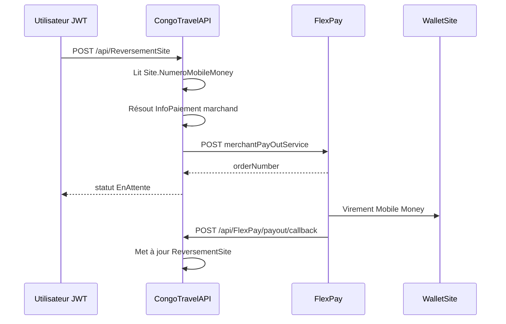

# FlexPay PayOut — reversement vers les sites

Ce document décrit l'intégration du service **Merchant PayOut** FlexPay pour envoyer des fonds vers le `NumeroMobileMoney` configuré sur chaque site.

Référence externe : [INTEGRATION_Merchant_PayOut_Service.md](../INTEGRATION_Merchant_PayOut_Service.md)

---

## Principe métier

Un utilisateur autorisé (Financier, Gérant, Admin) initie un **reversement manuel** vers le site :

- Le **bénéficiaire** est toujours `Site.NumeroMobileMoney` (jamais saisi dans le body).
- Le **marchand débiteur** est résolu via `InfoPaiementSociete` (même logique de fallback que les paiements entrants).
- Le montant et la devise sont fournis dans la requête (phase 1 : pas de calcul automatique des recettes).

---

## Configuration

Section `FlexPay` (`appsettings` ou variables d'environnement) :

| Clé | Description | Défaut |
|-----|-------------|--------|
| `Enabled` | Active FlexPay | `false` |
| `CallbackBaseUrl` | URL publique de base pour les callbacks | — |
| `PayOutUrl` | Endpoint FlexPay PayOut | `https://backend.flexpay.cd/api/rest/v1/merchantPayOutService` |
| `PayOutPendingMinutes` | Fenêtre anti double-clic (reversement manuel `EnAttente`) | `15` |
| `AutoReversementEnabled` | Kill-switch global reversement auto post-paiement | `true` |

Configuration société (`PUT /api/Societe/{id}/config`) :

| Champ | Description | Défaut |
|-------|-------------|--------|
| `autoReversementPaiementElectronique` | Active le PayOut auto après callback FlexPay succès | `false` |
| `pourcentageReversementSite` | Part du `MontantPaye` à reverser (0–100 %) | `100` |

Prérequis site :

- `NumeroMobileMoney` renseigné (9 à 15 chiffres, ex. `243900000000`).
- Configuration FlexPay active (`InfoPaiementSociete`) sur le site ou via fallback site principal / société.

---

## Endpoints API

### Initier un reversement

`POST /api/ReversementSite`  
Permission : `ReversementSite.Create`  
JWT requis.

```json
{
  "idSite": 71,
  "idSociete": 60,
  "montant": 150000,
  "codeDevise": "CDF",
  "motif": "Reversement recettes guichet"
}
```

Réponse (succès initiation FlexPay) :

```json
{
  "idReversementSite": 1,
  "idSite": 71,
  "idSociete": 60,
  "numeroMobileMoney": "243900000000",
  "montant": 150000,
  "codeDevise": "CDF",
  "reference": "REV71A1B2C3",
  "orderNumber": "SQeCGunXEGnr243815877848",
  "statut": 0,
  "motif": "Reversement recettes guichet",
  "dateCreation": "2026-06-18T12:00:00Z"
}
```

`statut` : `0` = EnAttente, `1` = Succès, `2` = Échec, `3` = Annulé.

### Détail

`GET /api/ReversementSite/{id}`  
Permission : `ReversementSite.Read`

### Historique par site (paginé)

`GET /api/ReversementSite/site/{idSite}?pageNumber=1&pageSize=20`  
Permission : `ReversementSite.Read`

### Vérification manuelle du statut

`GET /api/ReversementSite/verifier/{orderNumber}`  
Permission : `ReversementSite.Read`

Interroge l'API FlexPay check et met à jour le reversement si finalisé.

### Callback PayOut (public)

`POST /api/FlexPay/payout/callback`  
Sans JWT — appelé par FlexPay.

Corps identique au callback paiement entrant (`code`, `reference`, `orderNumber`, `provider_reference`, montants, `phone`, `channel`).

---

## Flux



---

## Permissions et rôles

| Permission | Description |
|------------|-------------|
| `ReversementSite.Create` | Initier un reversement |
| `ReversementSite.Read` | Consulter un reversement / historique site |
| `ReversementSite.ReadAll` | Liste globale (réservé admin) |

Rôles avec accès par défaut (via seeder) : **Admin**, **Gerant**, **Financier** (create + read, sans ReadAll pour Financier).

---

## Persistance

Table `ReversementsSite` :

- Traçabilité : `IdSite`, `IdSociete`, `IdUtilisateur`
- Snapshot : `NumeroMobileMoney`, `Montant`, `CodeDevise`, `Motif`
- FlexPay : `Reference`, `OrderNumber`, `ProviderReference`, `CodeMarchand`, `CodeFlexPay`, `Channel`
- Statut : `Statut`, `DateCreation`, `DateCallback`

Les callbacks sont audités dans `CallbacksFlexPay` (sans impact sur les réservations).

---

## Supplément paiement électronique (initiation FlexPay)

Config société (`GET/PUT /api/Societe/{id}/config`) et **réponses Voyage** (`VoyageResponseDto` — listes, détail, création, mise à jour) :

| Champ | Rôle |
|-------|------|
| `montAddPaieElectronique` | Montant additionnel **par place** pour MOBILE_MONEY / CARTE_BANCAIRE |
| `codeDeviseMontAddPaieElectronique` | Devise du supplément (CDF/USD, ou null = devise du voyage) |

Snapshot `ConfigSociete` au moment de la lecture voyage (pas de colonne sur la table `Voyages`).

Formule côté serveur à l’initiation (`POST reservation_with_paiement_electronique`) :

```
montantAPaye attendu = tarifs sièges + (montAddPaieElectronique × nombreDePlace)
```

- Conversion du supplément en devise voyage via `TauxChanges` si besoin.
- Le total (billets + supplément) est ensuite converti en `codeDevisePaiement` pour FlexPay.
- **Guichet CASH** : le supplément n’est **pas** appliqué.
- **Reversement auto** : le supplément est inclus dans `MontantPaye` après callback ; le reversement `%` / `fraisPlateforme` s’applique sur ce total.

---

## Reversement automatique (post-paiement électronique)

Déclenché **après confirmation FlexPay** (`POST /api/FlexPay/callback` avec `code=0`), une fois la réservation et le paiement finalisés — **pas** après `POST reservation_with_paiement_electronique` (initiation seulement).

### Conditions

1. `FlexPay:Enabled` et `FlexPay:AutoReversementEnabled` = true
2. `ConfigSociete.AutoReversementPaiementElectronique` = true pour la société
3. `ConfigSociete.PourcentageReversementSite` > 0 (défaut 100 = totalité du `MontantPaye`)
4. Optionnel : `ConfigSociete.FraisPlateforme` > 0 avec `CodeDeviseFraisPlateforme` (CDF/USD, ou null = devise du paiement)
5. Paiement électronique confirmé (`MOBILE_MONEY` ou `CARTE_BANCAIRE`)
6. Site avec `NumeroMobileMoney` valide

### Formule de montant

```
partPercent = MontantPaye × (PourcentageReversementSite / 100)
fraisConverti = FraisPlateforme converti en CodeDevisePaiement si besoin (TauxChanges)
montantReverse = max(0, partPercent − fraisConverti)
```

- Devise : `CodeDevisePaiement` du paiement (CDF ou USD uniquement)
- CDF : montant arrondi à l'entier (exigence FlexPay)
- USD : 2 décimales
- Si conversion du frais impossible (taux manquant) → pas de reversement auto

| MontantPaye | Devise | Pourcentage | FraisPlateforme | Devise frais | Montant reversé |
|-------------|--------|-------------|-----------------|--------------|-----------------|
| 150 000 | CDF | 100 | 0 | — | 150 000 |
| 150 000 | CDF | 100 | 500 | CDF | 149 500 |
| 150 000 | CDF | 95 | 500 | CDF | 142 000 |
| 25.50 | USD | 100 | 1.00 | USD | 24.50 |
| 25.50 | USD | 100 | 1 500 | CDF | 25.50 − frais CDF converti en USD |

Implémentation : [`PaiementElectroniqueReversementMontantResolver`](../../../Services/PaiementElectroniqueReversementMontantResolver.cs)

### Comportement

- Appel interne à `ReversementSiteService.InitierPourPaiementAsync` (pas d'appel HTTP vers `POST /api/ReversementSite`)
- Lien `IdPaiement` / `IdReservation` sur `ReversementsSite` ; `Origine` = `PaiementElectronique`
- Idempotence : un seul reversement par `IdPaiement` (callbacks FlexPay répétés ignorés)
- Échec PayOut : la réservation **reste confirmée** ; reversement marqué `Echec` ou log warning

### Script SQL production

Voir [`Scripts/production_payout_reversement_migrations.sql`](../../../Scripts/production_payout_reversement_migrations.sql) (idempotent MySQL).

---

## Migration

Appliquer les migrations ou le script SQL ci-dessus :

```bash
dotnet ef database update --project CongoTravel.csproj
```

---

## Erreurs courantes

| Message | Cause |
|---------|-------|
| `NumeroMobileMoney invalide` | Champ absent ou format invalide sur le site |
| `Aucune configuration FlexPay active` | Pas d'`InfoPaiementSociete` pour le site / société |
| `Un reversement est déjà en attente` | Double initiation dans la fenêtre `PayOutPendingMinutes` |
| `FlexPay est désactivé` | `FlexPay:Enabled = false` |
