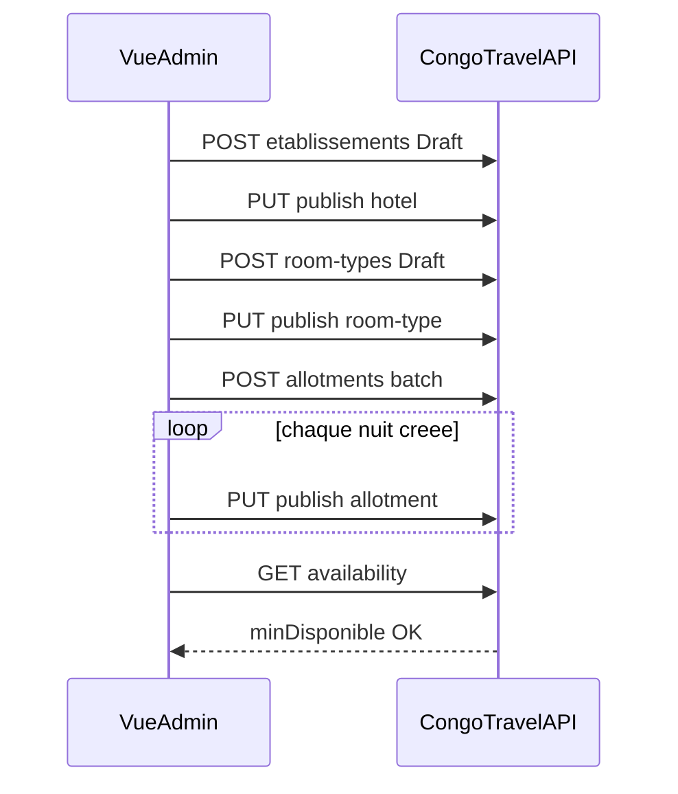
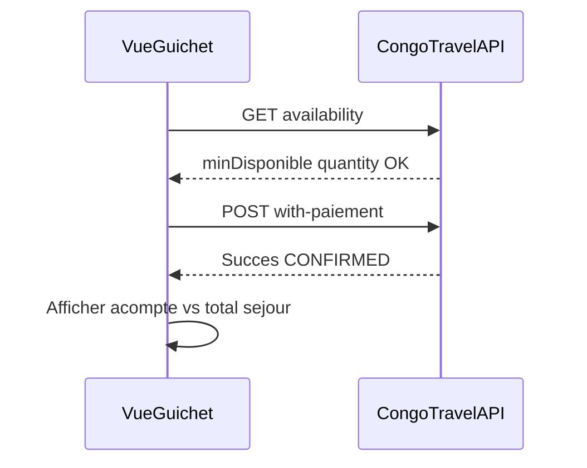
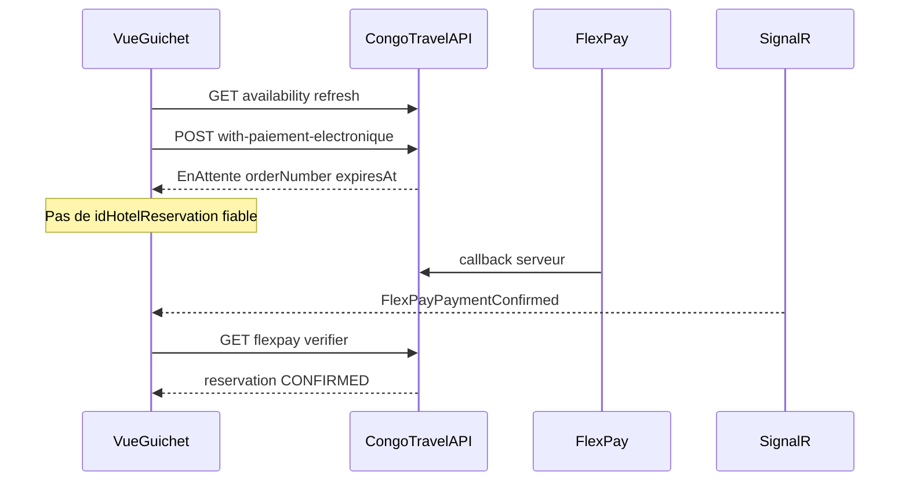
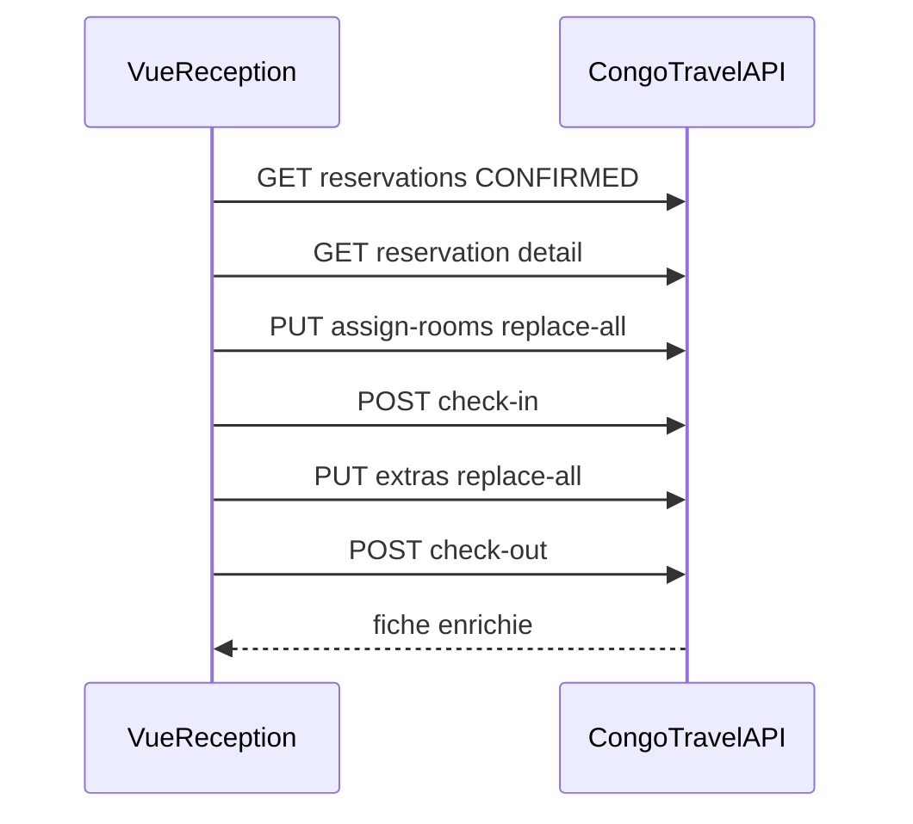
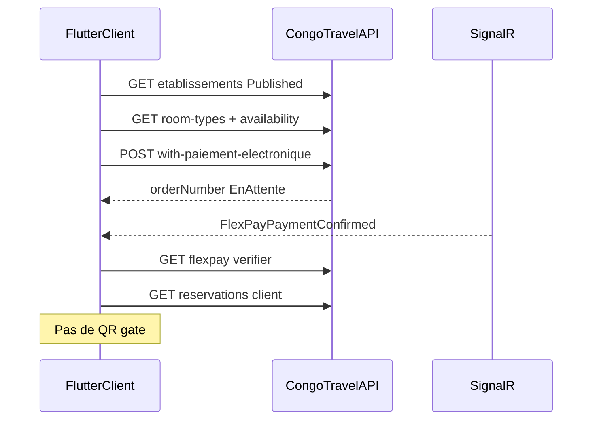
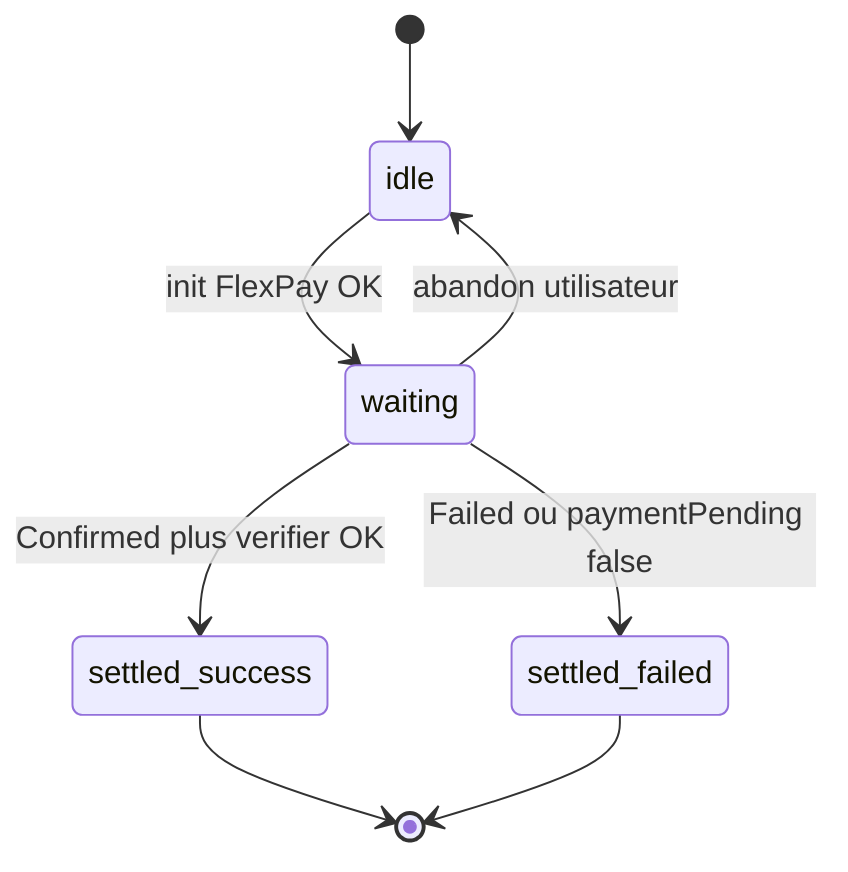

# Intégration Hôtel — Vue.js + Flutter (guide complet)

Guide pratique **autonome** pour implémenter la **Partie 5 Hôtel** (`/api/hotels/*`) en Vue 3 et Flutter client. Phases livrées **1–7e** (catalogue, allotments, CASH/FlexPay, dashboard, planifications, GlobalQuota, chambres, check-in/out, extras).

> Retour : [Document maître](DOCUMENTATION_COMPLETE_INTEGRATION_FRONTEND.md)
>
> Contrats API (payloads JSON détaillés) : [MODULE_14_HOTEL.md](MODULE_14_HOTEL.md)  
> Workflow métier : [DOCUMENTATION_WORKFLOW_HOTEL_V1.md](../05_transport_sync/DOCUMENTATION_WORKFLOW_HOTEL_V1.md)  
> Auth / permissions : [MODULE_01_AUTH_ET_PERMISSIONS.md](MODULE_01_AUTH_ET_PERMISSIONS.md)  
> Client Flutter (auth, profil) : [MODULE_06_CLIENT_APP_VOYAGEUR.md](MODULE_06_CLIENT_APP_VOYAGEUR.md)  
> Photos S3 : [MODULE_13_PHOTOS_STOCKAGE_S3.md](MODULE_13_PHOTOS_STOCKAGE_S3.md) + [INTEGRATION_PHOTOS_S3_VUE_FLUTTER.md](INTEGRATION_PHOTOS_S3_VUE_FLUTTER.md)  
> SignalR FlexPay (pattern multi-domaines) : [INTEGRATION_SIGNALR_EVENEMENT_FLEXPAY.md](INTEGRATION_SIGNALR_EVENEMENT_FLEXPAY.md)

**Module isolé** : ne pas réutiliser les routes ou DTOs Transport, Événement, Site Touristique ou Restaurant.

**Hors V1** : ticket QR, gate hôtel, paiement FlexPay des extras (7e = montants informatifs uniquement).

---

## 0. Objectif et personas

| Persona | Application | Parcours principal | Façades d’achat |
|---------|-------------|-------------------|-----------------|
| Admin / gérant | **Vue 3** back-office | Config hôtel → types/allotments ou nuits → planifs → publish → dashboard | — |
| Guichet / caissier | **Vue 3** | Availability → CASH ou FlexPay → recherche / annulation résa | `with-paiement`, `with-paiement-electronique` |
| Réception | **Vue 3** | Liste CONFIRMED → assign chambres → check-in → extras → check-out | — |
| Client voyageur | **Flutter** | Catalogue → dates/type → FlexPay → mes réservations | `with-paiement-electronique` |

Il n’existe **pas** de persona gate hôtel en V1.

**Stack recommandée**

| Stack | Librairies |
|-------|------------|
| Vue admin / guichet / réception | Vue 3, Vue Router, Pinia, Axios |
| Flutter client | Flutter, Dio, `flutter_secure_storage`, client SignalR |

---

## 1. Prérequis

### 1.1 Permissions (évite 403)

Sur une base **déjà peuplée**, exécuter [`assign_hotel_permissions_admin_gerant.sql`](../../../Scripts/assign_hotel_permissions_admin_gerant.sql) avant tout Write ou achat.

| Rôle | Permissions minimales |
|------|----------------------|
| Admin / Gérant | `Hotel.Etablissement.*`, `Hotel.RoomType.*`, `Hotel.Dashboard.Read` |
| Caissier / Client (achat) | `Hotel.Etablissement.Read` + `Hotel.Hold.Create` + `Hotel.Reservation.Confirm` |
| Réception | `Hotel.Etablissement.Read` + `.Write` |

Matrice complète : [MODULE_14 §3](MODULE_14_HOTEL.md).

### 1.2 Déploiement backend

Scripts SQL dans l’ordre : [`README_DEPLOIEMENT_HOTEL_V1.md`](../../../Scripts/README_DEPLOIEMENT_HOTEL_V1.md) (Phases 1–5 + **7a–7e**).

FlexPay hôtel : `FlexPay:HotelEnabled=true` + callback `/api/hotels/flexpay/callback` (côté serveur uniquement).

### 1.3 Activation module Hôtel (ConfigSociete)

Le module Hôtel est activé **par société** via `ConfigSociete.ActiviteHotel` (JSON `activiteHotel`).

| Contexte | Source | Usage |
|----------|--------|-------|
| **Admin** — paramètres société | `GET/PUT /api/Societe/{id}/config` → `activiteHotel: boolean` | Switch dans l'écran config |
| **Staff Vue** — navigation | Réponse login → `activitesSociete: string[]` | Afficher le menu Hôtel si `"Hotel"` ∈ `activitesSociete` |

```typescript
// Après login (utilisateur avec idSociete)
const showHotel = auth.activitesSociete.includes('Hotel')
```

- Ce flag est un **toggle produit**, indépendant des permissions RBAC (`Hotel.*`).
- Utilisateurs sans société (`idSociete` null) : `activitesSociete = []` — mécanisme surtout back-office Vue.
- Flutter client B2C : catalogue via `/api/hotels/*`, pas via `activitesSociete`.

### 1.4 HTTP et environnement

```
Content-Type: application/json
Authorization: Bearer <accessToken>
```

| Env | Usage |
|-----|-------|
| `VITE_API_BASE` (Vue) | Base URL API, ex. `https://api.example.com` |
| `dio.options.baseUrl` (Flutter) | Idem ; chemins relatifs `/hotels/...` |

Toutes les routes hôtel sont sous **`/api/hotels/*`**.

### 1.5 Modules à lire en parallèle

| Besoin | Document |
|--------|----------|
| JWT, refresh, guards router | MODULE_01 |
| Inscription / login client | MODULE_06 |
| Upload / affichage photos hôtel | MODULE_13 + INTEGRATION_PHOTOS_S3 |
| Bodies JSON exhaustifs | MODULE_14 |

---

## 2. Glossaire anti-collision

| Terme | Signification | Ne pas confondre avec |
|-------|---------------|------------------------|
| `idHotel` | Établissement hôtelier (produit) | `idSite` (guichet marchand FlexPay/CASH) |
| `idSite` | Guichet opérationnel / caisse | L’hôtel |
| `idHotelRoomType` | Type vendable (Standard, Suite…) | Chambre physique numérotée |
| `HotelRoom` | Chambre physique (catalogue réception 7c) | Type de chambre |
| `checkInDate` / `checkOutDate` | Dates **vendues** du séjour | `checkedInAtUtc` / `checkedOutAtUtc` (arrivée/départ réels 7d) |
| `[checkIn, checkOut)` | Intervalle semi-ouvert ; check-out **exclusif** | Plage incluant le jour de sortie comme nuit |
| `montantSejour` | Total du séjour (toutes nuits) | Acompte payé |
| `montantSousTotal` | **Acompte** encaissé à la réservation | Total séjour |
| `montantExtras` | Somme lignes extras (7e, informatif) | Acompte ou total séjour |
| `inventoryMode` | `ClassQuota` **XOR** `GlobalQuota` (exclusif par hôtel) | Hybride simultané (hors V1) |
| `idReservation` (SignalR) | = `idHotelReservation` | Réservation autre vertical |
| Allotment | Capacité/prix **type × nuit** (ClassQuota) | `HotelNight` (pool global 7b) |

Exemple dates : du **10 au 13** → **3 nuits** (10, 11, 12).

---

## 3. Architecture navigation

### 3.1 Vue Router (suggestion)

```
/hotels                              → liste établissements
/hotels/dashboard                    → KPIs société (+ super-admin)
/hotels/:idHotel/config              → onglets : infos, photos, room-types, allotments/nights, planifs, rooms, extras
/hotels/:idHotel/guichet             → calendrier + vente CASH/FlexPay
/hotels/:idHotel/reception           → arrivées + fiche résa
/hotels/:idHotel/reception/:idResa   → détail opérations 7c–7e
```

**Guards router** (extrait) :

```js
// router/hotel.js
{
  path: '/hotels/:idHotel/guichet',
  meta: { permissions: ['Hotel.Etablissement.Read', 'Hotel.Hold.Create', 'Hotel.Reservation.Confirm'] },
  beforeEnter: (to, from, next) => {
    const auth = useAuthStore();
    if (!hasEveryPermission(auth.permissions, to.meta.permissions)) return next('/forbidden');
    next();
  },
}
```

```js
function hasEveryPermission(userPerms, required) {
  return required.every((p) => userPerms.includes(p));
}
```

### 3.2 Flutter (routes nommées suggestion)

```
/hotel/catalogue           → liste hôtels Published
/hotel/:id                 → détail + choix dates
/hotel/:id/booking         → room-types + availability + récap acompte
/hotel/payment/pending     → attente FlexPay Plan A
/hotel/my-reservations     → liste client cross-société
/hotel/reservation/:id     → détail + annulation
```

---

## 4. Parcours écrans

### 4.1 Admin — publication (ClassQuota)



| Écran | Route API | Permission | Validations UI |
|-------|-----------|------------|----------------|
| Liste hôtels | `GET /api/hotels/etablissements` | Read | Filtre statut pour vente |
| CRUD + photos | `POST/PUT …/etablissements`, photos multipart | Write | `idSite` marchand obligatoire |
| Room-types | `GET/POST …/room-types`, publish | RoomType.* | ClassQuota |
| Allotments | `GET/POST …/allotments`, batch, publish | Write | `[from, to)` semi-ouvert |
| Planifications 7a | `POST …/planifications/{id}/generer` | Write | Mode + plage dates |
| Nuits Global 7b | `GET/POST …/nights`, batch, publish | Write | XOR ClassQuota |
| Chambres 7c | `GET/POST …/rooms` | Read/Write | Numéro UQ par hôtel |
| Extras 7e | `GET/POST …/extras` | Read/Write | `PerStay` / `PerNight` |
| Dashboard | `GET …/dashboard` | Dashboard.Read | Mois `yyyy-MM` |

### 4.2 Guichet — CASH ClassQuota



| Écran | Route API | Permission | État UI |
|-------|-----------|------------|---------|
| Calendrier | `GET …/availability` | Read + Hold | `minDisponible`, prix/nuit |
| Vente CASH | `POST …/with-paiement` | Hold + Confirm | `idSite`, idempotencyKey |
| Liste résas | `GET …/reservations?status=ALL` | Read | Défaut CONFIRMED |
| Annulation | `POST …/{id}/cancel` | Confirm | Confirmation modal |

### 4.3 Guichet — FlexPay Plan A



| Écran | Route API | État UI clé |
|-------|-----------|-------------|
| Init MM / carte | `POST …/with-paiement-electronique` | `flexPayPending.domain = 'hotel'` |
| Attente | SignalR + poll verifier | Compte à rebours `reservationExpiresAtUtc` |
| Abandon | `POST …/flexpay/abandon/{orderNumber}` | Reset pending |

### 4.4 Réception — opérations 7c–7e



| Écran | Route API | Règle |
|-------|-----------|-------|
| Arrivées | `GET …/reservations?status=CONFIRMED` | Filtre date check-in vendu |
| Assign | `PUT …/{id}/assign-rooms` | 1 chambre / unité quantity ; 409 si chevauchement |
| Check-in | `POST …/{id}/check-in` | Idempotent ; assign **non** requis |
| Extras | `PUT …/{id}/extras` | Replace-all ; liste vide = efface |
| Check-out | `POST …/{id}/check-out` | Requiert `checkedInAtUtc` |

### 4.5 Flutter client — réservation FlexPay



| Écran | Route API | Permission |
|-------|-----------|------------|
| Catalogue | `GET …/etablissements` | Read |
| Booking | `GET …/availability` | Read |
| Paiement | `POST …/with-paiement-electronique` | Hold + Confirm |
| Mes résas | `GET …/reservations/client/{idClient}` | Read |
| Annulation | `POST …/{id}/cancel` | Confirm |

---

## 5. Intégration Vue.js

### 5.1 Instance Axios

```js
// plugins/api.js
import axios from 'axios';

export const api = axios.create({
  baseURL: `${import.meta.env.VITE_API_BASE}/api`,
});

api.interceptors.request.use((config) => {
  const token = localStorage.getItem('accessToken');
  if (token) config.headers.Authorization = `Bearer ${token}`;
  return config;
});

api.interceptors.response.use(
  (r) => r,
  async (err) => {
    if (err.response?.status === 401) {
      // refresh token ou redirect login — voir MODULE_01
    }
    return Promise.reject(err);
  },
);
```

### 5.2 Stores Pinia

```js
// stores/hotelConfig.js
export const useHotelConfigStore = defineStore('hotelConfig', {
  state: () => ({
    hotels: [],
    selectedHotelId: null,
    roomTypes: [],
    allotments: [],
    nights: [],
    inventoryMode: 'ClassQuota', // ou GlobalQuota
    planifications: [],
    rooms: [],
    extras: [],
  }),
  actions: {
    async loadHotel(id) {
      const { data } = await api.get(`/hotels/etablissements/${id}`);
      this.selectedHotelId = id;
      this.inventoryMode = data.inventoryMode ?? 'ClassQuota';
    },
  },
});

// stores/hotelGuichet.js
export const useHotelGuichetStore = defineStore('hotelGuichet', {
  state: () => ({
    checkInDate: null,
    checkOutDate: null,
    availability: null,
    items: [],
    lastSale: null,
    flexPayPending: null,
  }),
  getters: {
    nombreNuits: (s) => {
      if (!s.checkInDate || !s.checkOutDate) return 0;
      return dayDiff(s.checkInDate, s.checkOutDate);
    },
  },
  actions: {
    setFlexPayPending(payload) {
      this.flexPayPending = { domain: 'hotel', settled: false, ...payload };
    },
    clearFlexPayPending() {
      this.flexPayPending = null;
    },
    buildItemsForMode(inventoryMode, roomTypeId, quantity) {
      if (inventoryMode === 'GlobalQuota') return [{ quantity }];
      return [{ roomTypeId, quantity }];
    },
  },
});

// stores/hotelReception.js
export const useHotelReceptionStore = defineStore('hotelReception', {
  state: () => ({
    reservation: null,
    assignItems: [],
    extraItems: [],
  }),
});
```

### 5.3 Admin — publication ClassQuota

```js
const { data: hotel } = await api.post('/hotels/etablissements', {
  codeHotel: 'HOTEL-01',
  nom: 'Hôtel du Fleuve',
  idSite: siteId,
  acomptePourcentDefaut: 20,
});
await api.put(`/hotels/etablissements/${hotel.idHotel}/publish`);

const { data: type } = await api.post('/hotels/room-types', {
  idHotel: hotel.idHotel,
  code: 'STD',
  libelle: 'Standard',
  capacitePersonnesMax: 2,
  prixNuitReference: 100000,
  codeDevise: 'CDF',
});
await api.put(`/hotels/room-types/${type.idHotelRoomType}/publish`);

const { data: batch } = await api.post('/hotels/allotments/batch', {
  idHotel: hotel.idHotel,
  idHotelRoomType: type.idHotelRoomType,
  from: '2026-09-10',
  to: '2026-09-20',
  capaciteTotale: 10,
  prixNuit: 100000,
  codeDevise: 'CDF',
  skipExisting: true,
});
for (const row of batch.created) {
  await api.put(`/hotels/allotments/${row.idHotelNightAllotment}/publish`);
}
```

### 5.4 Admin — planifications 7a

```js
// Créer template (voir MODULE_14 pour body complet Class ou Global)
const { data: planif } = await api.post('/hotels/planifications', {
  idHotel: hotelId,
  inventoryMode: 'ClassQuota',
  // lignesClassQuota ou globalQuota selon mode
});

const { data: gen } = await api.post(`/hotels/planifications/${planif.idHotelPlanification}/generer`, {
  mode: 'PeriodePersonnalisee',
  dateDebut: '2026-10-01',
  dateFin: '2026-10-31',
  publierApresGeneration: false,
});
// Publier les allotments/nights Draft si publierApresGeneration === false
```

### 5.5 Admin — GlobalQuota 7b

```js
const { data: batch } = await api.post('/hotels/nights/batch', {
  idHotel: hotelId,
  from: '2026-10-01',
  to: '2026-10-31',
  capaciteTotale: 50,
  prixNuit: 80000,
  codeDevise: 'CDF',
  skipExisting: true,
});
for (const night of batch.created) {
  await api.put(`/hotels/nights/${night.idHotelNight}/publish`);
}
```

### 5.6 Guichet — validations UI avant POST

Cocher **toutes** ces conditions avant `with-paiement` ou `with-paiement-electronique` :

- [ ] `checkOutDate > checkInDate`
- [ ] Availability **rechargée** immédiatement avant POST
- [ ] `availability.minDisponible >= quantity` (Class) ou pool global suffisant
- [ ] `paiement.idSite` renseigné (guichet marchand)
- [ ] `idempotencyKey` UUID unique par tentative (hold + paiement)
- [ ] `items[]` cohérent avec `inventoryMode` :
  - ClassQuota → `{ roomTypeId, quantity }`
  - GlobalQuota → `{ quantity }` **sans** `roomTypeId`

### 5.7 Guichet — CASH ClassQuota

```js
const guichet = useHotelGuichetStore();
const { data: avail } = await api.get('/hotels/availability', {
  params: { idHotel: hotelId, from: checkIn, to: checkOut, roomTypeId: typeId },
});
if (avail.minDisponible < quantity) {
  toast.error('Capacité insuffisante sur une ou plusieurs nuits');
  return;
}

const { data } = await api.post('/hotels/reservations/with-paiement', {
  idHotel: hotelId,
  checkInDate: checkIn,
  checkOutDate: checkOut,
  customerRef: 'GUICHET-42',
  idClient: clientId,
  idempotencyKey: crypto.randomUUID(),
  items: [{ roomTypeId: typeId, quantity: 1 }],
  paiement: {
    methodePaiement: 'CASH',
    referenceTransaction: 'CAISSE-001',
    idSite: siteId,
    idempotencyKey: crypto.randomUUID(),
  },
});

if (data.transactionStatut === 'Succes') {
  // data.reservation.status === 'CONFIRMED'
  showAcompteVsTotal(data.reservation.montantSousTotal, data.reservation.montantSejour);
}
```

### 5.8 Guichet — GlobalQuota CASH

```js
await api.post('/hotels/reservations/with-paiement', {
  idHotel: hotelId,
  checkInDate: checkIn,
  checkOutDate: checkOut,
  items: [{ quantity: 2 }],
  paiement: { methodePaiement: 'CASH', referenceTransaction: 'CAISSE-002', idSite: siteId },
});
```

### 5.9 Guichet — FlexPay

```js
const { data: init } = await api.post('/hotels/reservations/with-paiement-electronique', {
  idHotel: hotelId,
  checkInDate: checkIn,
  checkOutDate: checkOut,
  items: guichet.buildItemsForMode(inventoryMode, typeId, quantity),
  paiement: {
    methodePaiement: 'MOBILE_MONEY',
    phone: '243900000001',
    idSite: siteId,
    codeDevisePaiement: 'CDF',
    idempotencyKey: crypto.randomUUID(),
  },
});

guichet.setFlexPayPending({
  orderNumber: init.orderNumber,
  idSociete: init.reservation?.idSociete ?? hotelSociete,
  expiresAtUtc: init.reservationExpiresAtUtc,
});

if (init.paymentUrl) window.open(init.paymentUrl, '_blank');
else showMessage('Validez le paiement sur votre téléphone');
// Suite : §7 SignalR + poll
```

### 5.10 Réception — fiche et opérations

**Mapping DTO → UI**

| Zone UI | Champs API |
|---------|------------|
| En-tête | `referenceReservation`, `status`, `checkInDate`, `checkOutDate`, `nombreNuits` |
| Montants | `montantSejour`, `montantSousTotal`, `montantExtras` (info) |
| Statut réel | `checkedInAtUtc`, `checkedOutAtUtc` |
| Lignes | `lines[]` → type, quantity |
| Chambres | `roomAssignments[]` → numero |
| Extras | `extras[]` → libelle, quantity, montantLigne |

**Construire assign replace-all** depuis les lignes :

```js
function buildAssignItems(lines, selectedRoomByLineUnit) {
  const items = [];
  for (const line of lines) {
    const rooms = selectedRoomByLineUnit[line.idHotelReservationLine] ?? [];
    if (rooms.length !== line.quantity) {
      throw new Error(`Ligne ${line.idHotelReservationLine} : ${line.quantity} chambre(s) attendue(s)`);
    }
    for (const idHotelRoom of rooms) {
      items.push({ idHotelReservationLine: line.idHotelReservationLine, idHotelRoom });
    }
  }
  return items;
}

try {
  await api.put(`/hotels/reservations/${id}/assign-rooms`, { items }, { params: { idSociete } });
} catch (e) {
  if (e.response?.status === 409) toast.error(e.response.data.message ?? 'Chambre déjà attribuée');
}
```

**Preview extras côté UI** (miroir backend) :

```js
function previewExtraLine(extra, quantity, nombreNuits) {
  if (extra.pricingUnit === 'PerNight') return extra.prixUnitaire * quantity * nombreNuits;
  return extra.prixUnitaire * quantity;
}
```

```js
await api.post(`/hotels/reservations/${id}/check-in`, null, { params: { idSociete } });
await api.put(`/hotels/reservations/${id}/extras`, {
  items: [{ idHotelExtra: 3, quantity: 2 }],
}, { params: { idSociete } });
await api.post(`/hotels/reservations/${id}/check-out`, null, { params: { idSociete } });
```

### 5.11 Dashboard

```js
const { data } = await api.get('/hotels/dashboard', {
  params: { month: '2026-09', idSociete: societeId }, // idSociete si Super-Admin
});
// Présenter KPIs : réservations confirmées, acomptes SUCCEEDED — pas CA hôtelier total
```

---

## 6. Intégration Flutter (client voyageur)

Auth Dio : MODULE_06. Base URL identique à Vue.

### 6.1 Mapping widget catalogue

| Widget carte | Champ API |
|--------------|-----------|
| Image | `photoCouverture` ou première `photoUrl` (MODULE_13) |
| Titre | `nom` |
| Adresse | `adresse` |
| Indication acompte | `acomptePourcentDefaut` % |
| Tap | → `/hotel/:idHotel` |

```dart
final res = await dio.get('/hotels/etablissements', queryParameters: {'status': 'Published'});
final hotels = (res.data as List).map((h) => HotelSummary.fromJson(h)).toList();
```

### 6.2 Flux réservation — pas à pas

1. Liste hôtels **Published** avec photo URL (pas base64 legacy).
2. Détail hôtel : lire `inventoryMode` si exposé, sinon déduire via availability.
3. Sélecteur dates : valider `checkOut.isAfter(checkIn)`.
4. Charger room-types (ClassQuota) ou sauter (GlobalQuota).
5. **`GET /hotels/availability`** — refresh **juste avant** achat.
6. Afficher récap : total séjour estimé vs acompte (`acomptePourcentDefaut`).
7. `POST /hotels/reservations/with-paiement-electronique` → écran pending (§6.4).
8. Après succès : `GET /hotels/reservations/client/{idClient}` — **pas de QR**.

### 6.3 Availability et achat

```dart
Future<HotelAvailability> loadAvailability({
  required int hotelId,
  required DateTime checkIn,
  required DateTime checkOut,
  int? roomTypeId,
  bool global = false,
}) async {
  final res = await dio.get('/hotels/availability', queryParameters: {
    'idHotel': hotelId,
    'from': _dateOnly(checkIn),
    'to': _dateOnly(checkOut),
    if (roomTypeId != null) 'roomTypeId': roomTypeId,
    if (global) 'inventoryMode': 'GlobalQuota',
  });
  return HotelAvailability.fromJson(res.data);
}

Future<void> bookFlexPay({...}) async {
  final init = await dio.post('/hotels/reservations/with-paiement-electronique', data: {
    'idHotel': hotelId,
    'checkInDate': checkIn.toIso8601String(),
    'checkOutDate': checkOut.toIso8601String(),
    'idempotencyKey': const Uuid().v4(),
    'items': global
        ? [{'quantity': quantity}]
        : [{'roomTypeId': roomTypeId, 'quantity': quantity}],
    'paiement': {
      'methodePaiement': 'MOBILE_MONEY',
      'phone': phone,
      'idSite': idSite,
      'codeDevisePaiement': 'CDF',
      'idempotencyKey': const Uuid().v4(),
    },
  });
  // Naviguer vers pending screen — §6.4
}
```

### 6.4 Écran attente FlexPay (Plan A)

| Élément UI | Source |
|------------|--------|
| Compte à rebours | `reservationExpiresAtUtc` |
| Montant | réponse init ou verifier |
| MM | Message « Validez sur le téléphone » |
| Carte | Ouvrir `paymentUrl` en WebView |
| Abandon | `POST /hotels/flexpay/abandon/{orderNumber}` |

**Important** : après init, `idHotelReservation` peut être **0 ou absent** — corréler uniquement via `orderNumber` jusqu’au `verifier`.

### 6.5 Mes réservations et annulation

```dart
final res = await dio.get('/hotels/reservations/client/$idClient', queryParameters: {'status': 'ALL'});

await dio.post('/hotels/reservations/$id/cancel', queryParameters: {'idSociete': idSociete});
```

Afficher clairement :
- **Acompte payé** → `montantSousTotal` / paiement `SUCCEEDED`
- **Total séjour** → `montantSejour`
- Pas d’écran ticket / QR

### 6.6 Rappels Flutter

- Ne jamais appeler `/api/FlexPay/*`, `/api/events/*`, `/api/restaurants/*`, `/api/sites-touristiques/*`.
- Toujours passer `idSociete` sur cancel / detail si requis par le tenant.

---

## 7. SignalR FlexPay (`domain: 'hotel'`)

Hub : `/hubs/notifications?access_token={jwt}`

### 7.1 Machine d’état pending



| État | Comportement |
|------|--------------|
| `waiting` | Écouter hub + poll ~3 s en parallèle |
| `settled` | Flag anti double traitement SignalR + poll |
| `domain` | Doit être `'hotel'` (≠ `restaurant`, `event`, …) |

### 7.2 Vue

```js
connection.on('FlexPayPaymentConfirmed', async (payload) => {
  const pending = guichet.flexPayPending;
  if (!pending?.orderNumber || payload.orderNumber !== pending.orderNumber) return;
  if (pending.settled || pending.domain !== 'hotel') return;
  pending.settled = true;
  const { data } = await api.get(
    `/hotels/flexpay/verifier/${encodeURIComponent(payload.orderNumber)}`,
    { params: { idSociete: pending.idSociete } },
  );
  onHotelPaymentSuccess(data);
});

connection.on('FlexPayPaymentFailed', (payload) => {
  const pending = guichet.flexPayPending;
  if (!pending?.orderNumber || payload.orderNumber !== pending.orderNumber) return;
  if (pending.settled || pending.domain !== 'hotel') return;
  pending.settled = true;
  onHotelPaymentFailed(payload.message || 'Paiement échoué');
});

async function pollHotelFlexPay(orderNumber, idSociete, deadlineMs) {
  while (Date.now() < deadlineMs) {
    const { data } = await api.get(`/hotels/flexpay/verifier/${orderNumber}`, {
      params: { idSociete },
    });
    if (data.reservation && data.payment) return data;
    if (data.paymentPending === true) {
      await new Promise((r) => setTimeout(r, 3000));
      continue;
    }
    throw new Error(data.message || 'Paiement échoué');
  }
  throw new Error('Délai dépassé');
}
```

Abandon : `POST /api/hotels/flexpay/abandon/{orderNumber}`.

**Ne jamais** appeler `POST /api/hotels/flexpay/callback` depuis le frontend.

### 7.3 Flutter

```dart
hub.on('FlexPayPaymentConfirmed', (args) async {
  final payload = args![0] as Map;
  if (payload['orderNumber'] != pendingOrder) return;
  if (settled || domain != 'hotel') return;
  settled = true;
  final res = await dio.get(
    '/hotels/flexpay/verifier/$pendingOrder',
    queryParameters: {'idSociete': pendingSociete},
  );
  onSuccess(res.data);
});
```

### 7.4 Comparaison domaines FlexPay

| Vertical | Poll verifier | `domain` pending |
|----------|---------------|------------------|
| Événement | `/api/events/flexpay/verifier/` | `event` |
| Restaurant | `/api/restaurants/flexpay/verifier/` | `restaurant` |
| **Hôtel** | `/api/hotels/flexpay/verifier/` | **`hotel`** |

---

## 8. Composants UI recommandés

### 8.1 Calendrier multi-nuit

- Vue : range picker avec validation `checkOut > checkIn`.
- Flutter : `showDateRangePicker` ou deux `showDatePicker`.
- Afficher `nombreNuits` calculé côté UI (= API).
- Envoyer dates au format attendu par l’API (souvent date-only `YYYY-MM-DD` pour availability).

### 8.2 Builder `items[]` (Class vs Global)

| Mode | Availability query | Body `items` |
|------|-------------------|--------------|
| ClassQuota | `roomTypeId` requis | `[{ roomTypeId, quantity }]` |
| GlobalQuota | `inventoryMode=GlobalQuota` | `[{ quantity }]` |

Exposer un composant `HotelItemsBuilder` partagé guichet Vue ; logique identique Flutter.

### 8.3 Fiche réception (wireframe)

```
┌─ Réservation HOT-2026-0042 ─ CONFIRMED ─────────────┐
│ Séjour vendu : 10 → 13 sep (3 nuits)               │
│ Check-in réel : 10 sep 14:30  [Badge: En séjour]   │
├─ Lignes ───────────────────────────────────────────┤
│ Standard × 1                                       │
├─ Chambres assignées ───────────────────────────────┤
│ 201 (STD)                                          │
├─ Extras (informatif) ──────────────────────────────┤
│ Parking ×1 — 10 000    Total extras : 10 000       │
├─ Montants ───────────────────────────────────────────┤
│ Acompte payé : 75 000   Total séjour : 300 000     │
├─ Actions ──────────────────────────────────────────┤
│ [Assigner] [Check-in] [Extras] [Check-out]         │
└────────────────────────────────────────────────────┘
```

### 8.4 Photos hôtel

```js
function absoluteApiUrl(path) {
  if (!path || path.startsWith('http')) return path;
  return `${import.meta.env.VITE_API_BASE}${path}`;
}
```

```vue

```

Upload : multipart MODULE_13 — voir INTEGRATION_PHOTOS_S3.

---

## 9. Gestion des erreurs UI

| Situation | HTTP / signal | Action UI |
|-----------|---------------|-----------|
| Oversell sur une nuit | 409 | « Nuit indisponible » + recharger availability |
| Assign chambre chevauchante | 409 | Message conflit + refresh liste chambres libres |
| Allotment / nuit manquante | 400 | Admin : configurer calendrier |
| Parents Draft non publiés | vide / 400 | Guider vers publish |
| Extras sur HOLD / annulée | 400 | Masquer section extras |
| Check-out sans check-in | 400 | Bloquer bouton check-out |
| Permission manquante | 403 | Masquer action + « Accès refusé » |
| FlexPay refusé / expiré | Failed ou `paymentPending: false` | Fermer pending, nouvelle tentative |
| `checkOut <= checkIn` | — | Validation formulaire avant appel API |
| Acompte vs total confondus | — | Libellés distincts partout |

---

## 10. Types TypeScript / modèles Dart suggérés

### 10.1 TypeScript (extrait)

```ts
export type HotelInventoryMode = 'ClassQuota' | 'GlobalQuota';
export type HotelExtraPricingUnit = 'PerStay' | 'PerNight';

export interface HotelFlexPayPending {
  domain: 'hotel';
  orderNumber: string;
  idSociete: number;
  settled: boolean;
  expiresAtUtc: string;
}

export interface HotelHoldItem {
  roomTypeId?: number;
  quantity: number;
}

export interface HotelReservation {
  idHotelReservation: number;
  idSociete: number;
  idHotel: number;
  status: string;
  checkInDate: string;
  checkOutDate: string;
  nombreNuits: number;
  checkedInAtUtc?: string | null;
  checkedOutAtUtc?: string | null;
  montantSejour: number;
  montantSousTotal: number;
  montantExtras: number;
  codeDevise: string;
  inventoryMode: HotelInventoryMode;
  lines: HotelReservationLine[];
  payments: HotelPayment[];
  roomAssignments: HotelRoomAssignment[];
  extras: HotelReservationExtra[];
}

export interface HotelWithPaiementResponse {
  transactionStatut: 'Succes' | 'EnAttente' | string;
  orderNumber?: string;
  paymentUrl?: string;
  reservationExpiresAtUtc?: string;
  reservation: HotelReservation;
  payment?: HotelPayment;
}
```

### 10.2 Dart (extrait)

```dart
enum HotelInventoryMode { classQuota, globalQuota }

class HotelFlexPayPending {
  final String domain; // 'hotel'
  final String orderNumber;
  final int idSociete;
  final DateTime expiresAtUtc;
  bool settled;
}

class HotelSummary {
  final int idHotel;
  final String nom;
  final String? adresse;
  final String? photoCouverture;
  final double acomptePourcentDefaut;
  factory HotelSummary.fromJson(Map<String, dynamic> j) => ...;
}

class HotelAvailability {
  final int? minDisponible;
  final List<HotelAvailabilityNight> nights;
  factory HotelAvailability.fromJson(Map<String, dynamic> j) => ...;
}
```

Source backend : [`HotelReservationDtos.cs`](../../../Models/DTOs/Hotel/HotelReservationDtos.cs), [`HotelExtraDtos.cs`](../../../Models/DTOs/Hotel/HotelExtraDtos.cs).

---

## 11. Checklist intégration

| Item | Vue | Flutter | Test manuel |
|------|:---:|:-------:|:-----------:|
| Permissions `Hotel.*` + script SQL | ✓ | ✓ | Login rôles |
| Publication hôtel → type → allotment/nuit | ✓ | — | §12.1 |
| Planification `/generer` | ✓ | — | — |
| GlobalQuota sans `roomTypeId` | ✓ | ✓ | §12.2 |
| Guichet CASH ClassQuota | ✓ | — | §12.1 |
| FlexPay + SignalR `domain: hotel` | ✓ | ✓ | §12.3 |
| Réception assign / check-in / extras / check-out | ✓ | — | §12.5 |
| Dashboard KPIs acomptes | ✓ | — | §12.6 |
| Catalogue + photos URL | ✓ | ✓ | — |
| Mes réservations + cancel | ✓ | ✓ | — |
| Aucun QR / gate | ✓ | ✓ | — |
| Pas de routes autres verticals | ✓ | ✓ | — |

---

## 12. Tests manuels pas-à-pas

### 12.1 CASH ClassQuota 3 nuits

**Préconditions** : hôtel + type + allotments publiés sur 3 nuits consécutives.

1. Guichet : sélectionner hôtel, dates 10→13, type STD, qty 1.
2. Vérifier availability `minDisponible >= 1`.
3. POST `with-paiement` CASH.
4. **Attendu** : `transactionStatut: Succes`, `status: CONFIRMED`, `montantSousTotal < montantSejour`.

### 12.2 GlobalQuota

**Préconditions** : hôtel en GlobalQuota, nuits batch publiées.

1. Availability sans `roomTypeId`, `inventoryMode=GlobalQuota`.
2. Achat `{ quantity: 1 }` sans `roomTypeId`.
3. **Attendu** : CONFIRMED, ligne GlobalQuota.

### 12.3 FlexPay Mobile Money

1. Init `with-paiement-electronique`.
2. Attendre SignalR `FlexPayPaymentConfirmed` ou poll verifier.
3. **Attendu** : résa visible dans `GET …/client/{idClient}` ; pas de QR.

### 12.4 Assign chevauchement → 409

1. Deux résas CONFIRMED chevauchantes sur même chambre physique.
2. Second `assign-rooms` avec chambre déjà prise.
3. **Attendu** : HTTP 409, message conflit, UI propose autre chambre.

### 12.5 Réception complète

1. Assign replace-all (1 chambre / unité).
2. Check-in (re-POST idempotent OK).
3. Extras PerNight : vérifier `montantExtras` = prix × qty × nuits.
4. Check-out.
5. Cancel : assignments + extras + timestamps effacés.

### 12.6 Dashboard

1. Après vente CASH du mois courant.
2. GET dashboard `month=yyyy-MM`.
3. **Attendu** : KPIs reflètent réservation + acompte SUCCEEDED.

---

## 13. FAQ / pièges courants

**Pourquoi pas de `idHotelReservation` juste après init FlexPay ?**  
Hôtel = **Plan A** : aucune réservation métier avant succès FlexPay. Utiliser `orderNumber` + verifier.

**Batch allotment (Phase 2) vs planification (7a) ?**  
Batch = raccourci one-shot `[from, to)`. Planif = template récurrent + `/generer`.

**Puis-je envoyer `roomTypeId` en GlobalQuota ?**  
Non — items = `{ quantity }` uniquement.

**Check-in oblige-t-il assign chambres ?**  
Non — API indépendante ; UX réception peut suggérer assign avant check-in.

**Les extras augmentent-ils l’acompte ?**  
Non — `montantExtras` est informatif ; `montantSejour` / acompte inchangés en 7e.

**Puis-je réutiliser `/api/restaurants/reservations` ?**  
Non — module isolé `/api/hotels/*` uniquement.

**Différence `checkInDate` et `checkedInAtUtc` ?**  
Premier = date vendue du séjour ; second = horodatage réel arrivée réception.

---

## 14. Références

| Document | Rôle |
|----------|------|
| [MODULE_14_HOTEL.md](MODULE_14_HOTEL.md) | Contrats API, permissions, routes, exemples JSON request |
| [DOCUMENTATION_WORKFLOW_HOTEL_V1.md](../05_transport_sync/DOCUMENTATION_WORKFLOW_HOTEL_V1.md) | Workflow ops bout-en-bout |
| [MODULE_01_AUTH_ET_PERMISSIONS.md](MODULE_01_AUTH_ET_PERMISSIONS.md) | JWT, guards |
| [MODULE_06_CLIENT_APP_VOYAGEUR.md](MODULE_06_CLIENT_APP_VOYAGEUR.md) | App client Flutter |
| [MODULE_13_PHOTOS_STOCKAGE_S3.md](MODULE_13_PHOTOS_STOCKAGE_S3.md) | Photos hôtel |
| [INTEGRATION_SIGNALR_EVENEMENT_FLEXPAY.md](INTEGRATION_SIGNALR_EVENEMENT_FLEXPAY.md) | Pattern SignalR partagé |
| [assign_hotel_permissions_admin_gerant.sql](../../../Scripts/assign_hotel_permissions_admin_gerant.sql) | Permissions |
| [README_DEPLOIEMENT_HOTEL_V1.md](../../../Scripts/README_DEPLOIEMENT_HOTEL_V1.md) | SQL Phases 1–7e |
