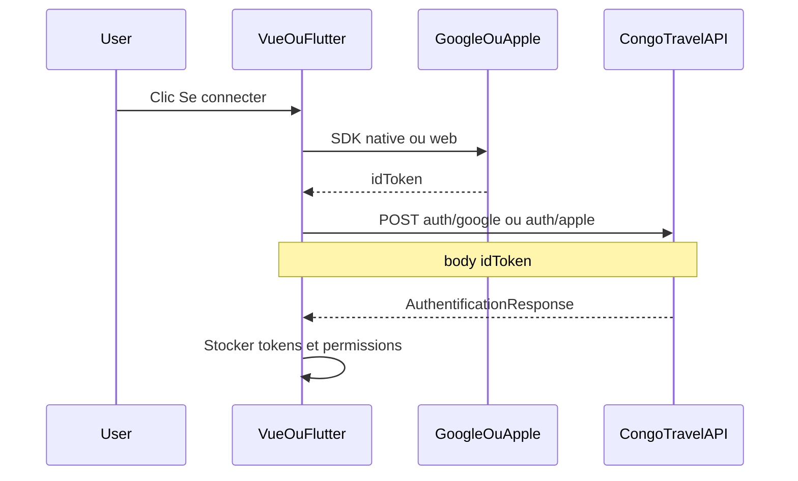

# Intégration « Se connecter avec Google » et « Se connecter avec Apple »

> Guide frontend — **Vue.js (web)** et **Flutter (iOS / Android)**  
> Contrat API détaillé : [MODULE_01_AUTH_ET_PERMISSIONS.md](MODULE_01_AUTH_ET_PERMISSIONS.md)  
> Retour : [Document maître](DOCUMENTATION_COMPLETE_INTEGRATION_FRONTEND.md)

---

## 1. Vue d’ensemble

Le frontend **n’envoie jamais** de mot de passe Google/Apple à CongoTravel. Il obtient un **ID token** (JWT) auprès du provider, puis le poste à l’API. L’API vérifie le token côté serveur, retrouve ou crée le compte client, et renvoie le **même** `AuthentificationResponse` que le login classique.



| Provider | Endpoint | Champ body |
|----------|----------|------------|
| Google | `POST /api/Utilisateur/auth/google` | `idToken` = **ID token** Google (pas l’access token OAuth) |
| Apple | `POST /api/Utilisateur/auth/apple` | `idToken` = **identity token** Apple (`id_token`) |

- Routes **publiques** (`AllowAnonymous`) — pas de header `Authorization` sur cet appel.
- JSON camelCase : `{ "idToken": "..." }`.
- Succès **200** → traiter comme `POST /api/Utilisateur/authentifier` (même store / interceptor / guards).

---

## 2. Contrat API (rappel)

### Request

```json
{ "idToken": "<jwt-provider>" }
```

`idToken` manquant ou vide → **400** `{ "message": "idToken est requis." }`.

### Response 200

Même structure que le login email/mot de passe (`AuthentificationResponse`) :

| Champ | Usage front |
|-------|-------------|
| `accessToken` | JWT → `Authorization: Bearer …` |
| `refreshToken` | Renouvellement via `/api/Utilisateur/refresh-token` |
| `tokenType` | `"Bearer"` |
| `expiresIn` / `expiresAt` | Expiration access token |
| `doitChangerMotDePasse` | Toujours `false` pour les comptes créés via Google/Apple |
| `permissions` | Guards UI / menus |
| `utilisateur` | Profil (dont `authProvider`, `externalSubjectId`, `emailVerified`) |
| `client` | Présent pour un compte client OAuth ; `telephone` souvent `null` |
| `agent` | Généralement `null` |

### Erreurs (UX)

| HTTP | Message typique | Action front |
|------|-----------------|--------------|
| 400 | Email manquant / non vérifié ; `idToken` requis | Message utilisateur ; Apple 1ʳᵉ connexion sans email → demander de réessayer / vérifier réglages Apple |
| 401 | Token invalide ou expiré | Relancer le SDK provider puis réessayer |
| 403 | Compte désactivé | Bloquer ; contacter support |
| 409 | Email déjà lié à un autre compte / provider | Proposer login classique ou support |
| 500 | Auth non configurée (ClientIds vides) / erreur serveur | Ops : vérifier config API |

Corps d’erreur : `{ "message": "..." }`.

### Comportement compte

1. Lookup par `(AuthProvider, ExternalSubjectId)` = claim `sub` du token.
2. Sinon create/link par **email** (vérifié selon règles Google/Apple).
3. Téléphone **optionnel** au premier login — proposer une collecte plus tard si réservation / FlexPay l’exigent.
4. **Apple** : l’email n’est souvent fourni qu’à la **première** connexion ; les suivantes se basent sur `sub`. Ne pas échouer côté UI si l’email est absent après un compte déjà créé.

---

## 3. Prérequis consoles & config API

Les audiences JWT (`aud`) du token client **doivent** figurer dans la config API.

```json
{
  "GoogleAuth": {
    "ClientIds": [
      "<web-client-id>.apps.googleusercontent.com",
      "<android-client-id>.apps.googleusercontent.com",
      "<ios-client-id>.apps.googleusercontent.com"
    ]
  },
  "AppleAuth": {
    "ClientIds": [
      "<ServicesID.web>",
      "<bundle.id.ios>"
    ]
  }
}
```

Liste vide → **500** « Authentification Google/Apple non configurée. »

### Google Cloud Console

1. Créer un projet OAuth.
2. Écrans de consentement.
3. Créer un **Client ID** par plateforme utilisée :
   - **Web** (origine JS autorisée = domaine Vue)
   - **Android** (package name + SHA-1)
   - **iOS** (Bundle ID)
4. Transmettre **tous** ces Client IDs à l’équipe API pour `GoogleAuth:ClientIds`.

### Apple Developer

1. Activer **Sign in with Apple** sur l’App ID (Bundle ID iOS).
2. Créer un **Services ID** pour le web (domaines + return URLs du site Vue).
3. Transmettre Services ID + Bundle ID(s) pour `AppleAuth:ClientIds`.

---

## 4. Vue.js (web)

Stack typique : Vue 3 + Axios/fetch + Pinia (réutiliser le store de `authentifier`).

### 4.1 Helper API commun

```ts
// api/authSocial.ts
import axios from 'axios'

const api = axios.create({
  baseURL: import.meta.env.VITE_API_BASE_URL, // ex. https://api.exemple.com
})

export async function loginWithGoogle(idToken: string) {
  const { data } = await api.post('/api/Utilisateur/auth/google', { idToken })
  return data // AuthentificationResponse
}

export async function loginWithApple(idToken: string) {
  const { data } = await api.post('/api/Utilisateur/auth/apple', { idToken })
  return data
}

/** Après succès : même pipeline que le login classique */
export function applyAuthSession(response: {
  accessToken: string
  refreshToken: string
  permissions?: string[]
  utilisateur?: unknown
  client?: unknown
}) {
  // localStorage / pinia / cookie sécurisé — IDENTIQUE à authentifier
  localStorage.setItem('accessToken', response.accessToken)
  localStorage.setItem('refreshToken', response.refreshToken)
  // ... permissions, utilisateur, client
}
```

### 4.2 Google — Google Identity Services (GIS)

Charger le script :

```html
<script src="https://accounts.google.com/gsi/client" async defer></script>
```

Exemple bouton (Composition API) :

```vue
<script setup lang="ts">
import { onMounted } from 'vue'
import { loginWithGoogle, applyAuthSession } from '@/api/authSocial'

const GOOGLE_CLIENT_ID = import.meta.env.VITE_GOOGLE_WEB_CLIENT_ID

declare const google: any

onMounted(() => {
  google.accounts.id.initialize({
    client_id: GOOGLE_CLIENT_ID,
    callback: async (response: { credential: string }) => {
      // response.credential = ID token JWT
      const auth = await loginWithGoogle(response.credential)
      applyAuthSession(auth)
      // router.push('/accueil')
    },
  })
  google.accounts.id.renderButton(
    document.getElementById('google-btn'),
    { theme: 'outline', size: 'large', text: 'signin_with' },
  )
})
</script>

<template>
  <div id="google-btn" />
</template>
```

**Points d’attention**

- Envoyer uniquement `credential` (ID token), **jamais** un access token OAuth.
- Le Client ID **Web** utilisé dans GIS doit être dans `GoogleAuth:ClientIds` côté API.
- Origines JS autorisées dans Google Cloud = URL(s) du front Vue.

### 4.3 Apple — Sign in with Apple JS

1. Services ID + domaines / return URLs configurés chez Apple.
2. Charger le script Apple :

```html
<script type="text/javascript" src="https://appleid.cdn-apple.com/appleauth/static/jsapi/appleid/1/en_US/appleid.auth.js"></script>
```

```ts
declare const AppleID: any

export async function signInWithAppleWeb() {
  AppleID.auth.init({
    clientId: import.meta.env.VITE_APPLE_SERVICES_ID, // Services ID
    scope: 'name email',
    redirectURI: import.meta.env.VITE_APPLE_REDIRECT_URI, // doit matcher Apple Developer
    usePopup: true,
  })

  const result = await AppleID.auth.signIn()
  const idToken = result?.authorization?.id_token
  if (!idToken) throw new Error('Identity token Apple manquant')

  const auth = await loginWithApple(idToken)
  applyAuthSession(auth)
  return auth
}
```

**Points d’attention**

- `clientId` web = **Services ID** (pas le Bundle ID iOS) → présent dans `AppleAuth:ClientIds`.
- À la 1ʳᵉ connexion, Apple peut fournir `email` / `fullName` dans `result.user` ; l’API se base sur le JWT. Les connexions suivantes peuvent omettre l’email.
- HTTPS obligatoire en production pour Apple web.

---

## 5. Flutter (iOS / Android)

Packages recommandés :

```yaml
dependencies:
  google_sign_in: ^6.2.1
  sign_in_with_apple: ^6.1.0
  dio: ^5.4.0
  flutter_secure_storage: ^9.0.0
```

### 5.1 Helper API

```dart
import 'package:dio/dio.dart';
import 'package:flutter_secure_storage/flutter_secure_storage.dart';

final dio = Dio(BaseOptions(baseUrl: const String.fromEnvironment('API_BASE_URL')));
const storage = FlutterSecureStorage();

Future<Map<String, dynamic>> loginWithGoogle(String idToken) async {
  final res = await dio.post('/api/Utilisateur/auth/google', data: {'idToken': idToken});
  await _persistSession(res.data as Map<String, dynamic>);
  return res.data as Map<String, dynamic>;
}

Future<Map<String, dynamic>> loginWithApple(String idToken) async {
  final res = await dio.post('/api/Utilisateur/auth/apple', data: {'idToken': idToken});
  await _persistSession(res.data as Map<String, dynamic>);
  return res.data as Map<String, dynamic>;
}

Future<void> _persistSession(Map<String, dynamic> data) async {
  await storage.write(key: 'accessToken', value: data['accessToken'] as String?);
  await storage.write(key: 'refreshToken', value: data['refreshToken'] as String?);
  // permissions / utilisateur : même logique que authentifier
}
```

Configurer ensuite l’interceptor Dio `Authorization: Bearer …` comme pour le login classique.

### 5.2 Google Sign-In

```dart
import 'package:google_sign_in/google_sign_in.dart';

final googleSignIn = GoogleSignIn(
  // Sur iOS / web, serverClientId = Client ID Web souvent requis pour obtenir un idToken
  // dont l'aud est acceptée par l'API (à aligner avec GoogleAuth:ClientIds).
  scopes: const ['email', 'profile'],
);

Future<void> signInGoogleAndCallApi() async {
  final account = await googleSignIn.signIn();
  if (account == null) return; // utilisateur a annulé

  final auth = await account.authentication;
  final idToken = auth.idToken;
  if (idToken == null || idToken.isEmpty) {
    throw StateError('ID token Google manquant — vérifier Client IDs / serverClientId');
  }

  await loginWithGoogle(idToken);
}
```

**Config plateforme**

| Plateforme | À faire |
|------------|---------|
| Android | `google-services.json` / OAuth client Android (package + SHA-1) ; Client ID Android dans `GoogleAuth:ClientIds` |
| iOS | URL scheme / `GIDClientID` dans `Info.plist` ; Client ID iOS (et souvent Web comme `serverClientId`) dans `GoogleAuth:ClientIds` |

### 5.3 Sign in with Apple

**iOS** : capability *Sign in with Apple* sur le target Xcode (Bundle ID dans `AppleAuth:ClientIds`).

```dart
import 'dart:convert';
import 'package:sign_in_with_apple/sign_in_with_apple.dart';

Future<void> signInAppleAndCallApi() async {
  final credential = await SignInWithApple.getAppleIDCredential(
    scopes: [
      AppleIDAuthorizationScopes.email,
      AppleIDAuthorizationScopes.fullName,
    ],
  );

  final identityToken = credential.identityToken;
  if (identityToken == null || identityToken.isEmpty) {
    throw StateError('Identity token Apple manquant');
  }

  await loginWithApple(identityToken);
}
```

**Android** : Sign in with Apple n’est pas natif comme sur iOS. Utiliser le flux web / Services ID (souvent via le package + configuration Android documentée par `sign_in_with_apple`). Le claim `aud` du token sera alors le **Services ID** → à inclure dans `AppleAuth:ClientIds`.

**Rappel email Apple** : à la première autorisation seulement ; stocker localement le nom affiché si fourni (`givenName` / `familyName`) pour l’UI, mais l’API lie le compte via le JWT / `sub`.

---

## 6. Session, refresh et parcours UX

1. Sur **200**, appeler **exactement** le même handler que après `authentifier` (tokens, permissions, navigation).
2. Ne pas ouvrir un parcours « inscription » séparé si le compte vient d’être créé côté API — le JWT est déjà valide.
3. Si `client.telephone` / `utilisateur.telephone` est `null`, afficher un écran optionnel « Compléter mon numéro » plus tard (réservations / Mobile Money).
4. Logout : `POST /api/Utilisateur/deconnecter` + `googleSignIn.signOut()` / révocation session Apple locale si besoin.
5. Refresh : inchangé — `POST /api/Utilisateur/refresh-token` avec `refreshToken`.

---

## 7. Mapping erreurs côté UI (exemple)

```ts
function mapSocialAuthError(status: number, message?: string): string {
  switch (status) {
    case 400:
      return message ?? 'Données de connexion incomplètes (email requis).'
    case 401:
      return 'Session Google/Apple invalide. Réessayez.'
    case 403:
      return 'Ce compte est désactivé.'
    case 409:
      return 'Cet email est déjà associé à un autre compte.'
    case 500:
      return 'Service temporairement indisponible.'
    default:
      return message ?? 'Erreur de connexion.'
  }
}
```

---

## 8. Checklist QA

### Commun API

- [ ] `GoogleAuth:ClientIds` contient Web + Android + iOS utilisés par les apps
- [ ] `AppleAuth:ClientIds` contient Services ID (web/Android Apple) + Bundle ID iOS
- [ ] `POST .../auth/google` avec un vrai ID token → 200 + `accessToken`
- [ ] `POST .../auth/apple` idem
- [ ] Mauvais token → 401
- [ ] Compte `statut: false` → 403
- [ ] 2ᵉ login Apple **sans** email dans le token → 200 (compte déjà lié par `sub`)

### Vue.js

- [ ] Bouton Google affiché ; `credential` posté (pas access token)
- [ ] Origines JS Google Cloud = domaines de déploiement
- [ ] Apple popup / redirect : return URL = Services ID
- [ ] Session Pinia/localStorage identique au login MDP

### Flutter

- [ ] Android : SHA-1 correct ; `idToken` non null
- [ ] iOS : URL scheme Google + capability Apple
- [ ] Tokens en secure storage ; interceptor Bearer OK
- [ ] Annulation utilisateur (null account) ne crash pas

### Produit

- [ ] Message clair si téléphone manquant (sans bloquer le login)
- [ ] Guards permissions inchangés après login social

---

## 9. Liens utiles

| Doc | Rôle |
|-----|------|
| [MODULE_01_AUTH_ET_PERMISSIONS.md](MODULE_01_AUTH_ET_PERMISSIONS.md) | Contrat endpoints auth |
| [MATRICE_ENDPOINTS_FRONT_COMPLETE.md](MATRICE_ENDPOINTS_FRONT_COMPLETE.md) | Statut endpoints |
| [DOCUMENTATION_AUTHENTIFICATION.md](../02_securite_auth/DOCUMENTATION_AUTHENTIFICATION.md) | Détail `AuthentificationResponse` |
| [PLAN_IMPLEMENTATION_GOOGLE_SIGN_IN.md](../02_securite_auth/PLAN_IMPLEMENTATION_GOOGLE_SIGN_IN.md) | Décisions backend Google |
| [Google Identity Services](https://developers.google.com/identity/gsi/web) | SDK web Google |
| [Sign in with Apple (web)](https://developer.apple.com/documentation/sign_in_with_apple/sign_in_with_apple_js) | SDK web Apple |
| [google_sign_in](https://pub.dev/packages/google_sign_in) | Package Flutter Google |
| [sign_in_with_apple](https://pub.dev/packages/sign_in_with_apple) | Package Flutter Apple |
