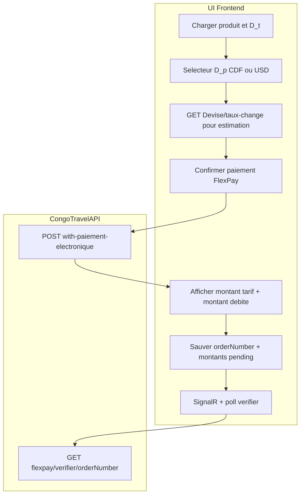

# Intégration frontend — Paiement électronique cross-devise (Vue.js + Flutter)

Guide transversal pour intégrer **FlexPay en devise de paiement différente de la devise tarif** sur les quatre parcours CongoTravelAPI :

- **Transport** (voyage / billet)
- **Evenement** (billetterie)
- **Restaurant** (acompte réservation)
- **Site touristique** (billetterie)

Références connexes :

- Document maître : [DOCUMENTATION_COMPLETE_INTEGRATION_FRONTEND.md](DOCUMENTATION_COMPLETE_INTEGRATION_FRONTEND.md)
- FlexPay transport : [MODULE_04_PAIEMENT_FLEXPAY.md](MODULE_04_PAIEMENT_FLEXPAY.md), [INTEGRATION_FLUTTER_FLEXPAY.md](INTEGRATION_FLUTTER_FLEXPAY.md)
- Billetterie satellite : [MODULE_05_EVENEMENT_BILLETTERIE.md](MODULE_05_EVENEMENT_BILLETTERIE.md), [MODULE_10_SITE_TOURISTIQUE.md](MODULE_10_SITE_TOURISTIQUE.md), [MODULE_11_RESTAURANT.md](MODULE_11_RESTAURANT.md)
- Backend multi-devise : [DOCUMENTATION_MODULE_MULTIDEVISE_CONGOTRAVEL_API.md](../06_facturation_paiement/DOCUMENTATION_MODULE_MULTIDEVISE_CONGOTRAVEL_API.md)
- QA fonctionnelle : [CHECKLIST_FLEXPAY_CROSS_DEVISE_QA.md](CHECKLIST_FLEXPAY_CROSS_DEVISE_QA.md)

---

## 1. Objectif et périmètre

### Objectif UX

Permettre à l’utilisateur de :

1. Voir le **prix tarif** dans la devise du produit (D_t).
2. Choisir la **devise de débit FlexPay** (D_p = `CDF` ou `USD`).
3. Voir une **estimation** du montant débité avant confirmation.
4. Lancer FlexPay et afficher le **montant réel** renvoyé par l’API après initiation.
5. Finaliser via SignalR + poll `verifier` (cf. guides FlexPay par domaine).

### Périmètre

| Inclus | Exclu |
|--------|-------|
| Initiation FlexPay cross-devise (4 domaines) | Paiement cash |
| Affichage montants tarif / paiement / taux | Remboursement |
| Preview taux avant POST | Configuration admin des taux |
| | **Reversement PayOut / `FraisPlateforme`** : aucun champ à afficher au client ; le frais réduit uniquement le montant reversé au site après confirmation FlexPay |

### Personas

- **Vue.js** : guichet, back-office (Transport, Evenement, Restaurant, Site touristique).
- **Flutter** : app client voyageur, agent caisse, billetterie événement / site / restaurant.

---

## 2. Glossaire

| Terme | Signification | Exemple |
|-------|---------------|---------|
| **D_t** (devise tarif) | Devise du pricing produit | Session événement en `USD`, voyage en `CDF` |
| **D_p** (devise paiement) | Devise réellement débitée chez FlexPay | `codeDevisePaiement` = `CDF` |
| **Montant tarif** | Total métier avant conversion | `montantTarif` / `montantVoyage` |
| **Montant FlexPay** | Montant envoyé au provider | `montantFlexPay` |
| **Taux appliqué** | Taux D_t → D_p au moment de l’initiation | `tauxApplique` = `2800` |

---

## 3. Contrat API universel (règles non négociables)

### 3.1 Devise de paiement

- Champ : `codeDevisePaiement` (Transport : `paiement.codeDevisePaiement`).
- Valeurs autorisées : **`CDF`** ou **`USD`** uniquement.
- Si omis : l’API utilise **D_t** (pas de conversion).

### 3.2 Saisie du montant — différence Transport vs billetterie

| Domaine | Montant dans le body ? | Règle |
|---------|------------------------|-------|
| **Transport** | **Oui** — `paiement.montantAPaye` | Toujours en **D_t** (devise tarif voyage), même si D_p ≠ D_t |
| **Evenement / Restaurant / Site touristique** | **Non** | Le serveur calcule depuis le hold (`items` + tarif publié). Seul `paiement.codeDevisePaiement` pilote la conversion |

### 3.3 Conversion et arrondi

- Conversion **côté serveur** via taux actif société (`TauxChanges`, `Statut=true`, `DateEffet` la plus récente).
- Si D_t = D_p : `tauxApplique = 1`, pas d’appel taux.
- Montant CDF envoyé à FlexPay : **arrondi entier** (AwayFromZero).
- Montant USD : décimales conservées selon règles FlexPay.

### 3.4 Règle d’or frontend

> Le front **affiche une estimation** avant POST, mais **ne recalcule jamais le montant final**.  
> Après initiation, utiliser **`montantFlexPay`**, **`codeDevisePaiement`** et **`tauxApplique`** de la réponse API.

### 3.5 Sécurité callback / verify

- Le front **ne doit jamais** appeler `POST .../flexpay/callback`.
- Le serveur rejette une confirmation si la devise retournée par FlexPay ≠ devise attendue (message contenant `devise callback`).

### 3.6 Capacité canal (Mobile Money / Carte)

- Chaque canal peut restreindre les devises (config serveur `FlexPay:MobileMoneySupportedCurrencies` / `CardSupportedCurrencies`, défaut `CDF` + `USD`).
- Erreur typique : devise autorisée globalement mais **interdite pour le canal** choisi.

---

## 4. Flux UI recommandé



---

## 5. Matrice endpoints

| Domaine | Initiation | Verify | Champs réponse cross-devise |
|---------|------------|--------|----------------------------|
| Transport | `POST /api/Reservation/reservation_with_paiement_electronique` | `GET /api/FlexPay/verifier/{orderNumber}` | `montantVoyage`, `codeDeviseVoyage`, `montantFlexPay`, `codeDevisePaiement`, `tauxApplique` |
| Evenement | `POST /api/events/reservations/with-paiement-electronique` | `GET /api/events/flexpay/verifier/{orderNumber}` | `montantTarif`, `codeDeviseTarif`, `montantFlexPay`, `codeDevisePaiement`, `tauxApplique` |
| Restaurant | `POST /api/restaurants/reservations/with-paiement-electronique` | `GET /api/restaurants/flexpay/verifier/{orderNumber}` | idem |
| Site touristique | `POST /api/sites-touristiques/reservations/with-paiement-electronique` | `GET /api/sites-touristiques/flexpay/verifier/{orderNumber}` | idem |

> **Important** : le parcours front documenté est **`with-paiement-electronique`** (commande en attente + hold inventaire + FlexPay, **sans** réservation métier avant succès — parité Transport). Ne pas appeler `{id}/flexpay/initiate` (refusé). Poll / SignalR uniquement via `orderNumber`.

---

## 6. Prévisualisation avant POST

### Estimation du montant débité

Utiliser le taux direct D_t → D_p :

```
GET /api/Devise/taux-change?idSociete={idSociete}&source={D_t}&cible={D_p}
```

Réponse (extrait) :

```json
{
  "idTauxChange": 42,
  "idSociete": 1,
  "codeDeviseSource": "USD",
  "codeDeviseCible": "CDF",
  "taux": 2800,
  "dateEffet": "2026-08-01T00:00:00",
  "statut": true
}
```

Calcul UI (estimation uniquement) :

```javascript
const montantEstime = D_p === 'CDF'
  ? Math.round(montantTarif * taux)
  : Math.round(montantTarif * taux * 100) / 100;
```

### Limite de `preview-conversion`

`GET /api/Devise/preview-conversion` convertit vers la **devise principale de la société**, pas vers une D_p arbitraire.  
**Ne pas l’utiliser seul** pour estimer un paiement FlexPay en D_p ≠ devise principale. Préférer `taux-change` avec `source` = D_t et `cible` = D_p.

### Exemple libellé UI

> Total **40 USD** — vous paierez environ **112 000 CDF** (taux 2800).  
> Le montant exact sera confirmé après validation serveur.

---

## 7. Exemples JSON par domaine

Conventions : JSON camelCase ; `transactionStatut` / `statut` = `EnAttente` après initiation FlexPay ; `tickets` / `billets` = `[]` tant que le paiement n’est pas confirmé.

---

### 7.1 Transport

#### Même devise (CDF → CDF)

**Request** — `POST /api/Reservation/reservation_with_paiement_electronique`

```json
{
  "reservation": {
    "idVoyage": 101,
    "idClient": 55,
    "nombreDePlace": 1,
    "idUtilisateur": 12,
    "idSociete": 1,
    "idSite": 3,
    "passagers": [
      {
        "idCategorieSiege": 2,
        "nomComplet": "Jean Kabila"
      }
    ]
  },
  "paiement": {
    "montantAPaye": 50000,
    "methodePaiement": "MOBILE_MONEY",
    "codeDevisePaiement": "CDF",
    "phone": "243900000001",
    "idUtilisateur": 12,
    "idSociete": 1,
    "idSite": 3
  }
}
```

**Response** (extrait)

```json
{
  "statut": "EnAttente",
  "message": "Validez le paiement sur votre téléphone Mobile Money.",
  "billets": [],
  "orderNumberFlexPay": "FP-TR-001234",
  "montantVoyage": 50000,
  "codeDeviseVoyage": "CDF",
  "montantFlexPay": 50000,
  "codeDevisePaiement": "CDF",
  "tauxApplique": 1,
  "flexPayAccepted": true,
  "holdExpireAt": "2026-08-19T16:00:00Z"
}
```

#### Cross-devise (CDF tarif → USD paiement)

**Request** — seul `codeDevisePaiement` change ; `montantAPaye` reste en CDF :

```json
{
  "reservation": { "...": "..." },
  "paiement": {
    "montantAPaye": 50000,
    "methodePaiement": "MOBILE_MONEY",
    "codeDevisePaiement": "USD",
    "phone": "243900000001",
    "idUtilisateur": 12,
    "idSociete": 1,
    "idSite": 3
  }
}
```

**Response** (extrait, taux 0.0004 CDF→USD)

```json
{
  "statut": "EnAttente",
  "montantVoyage": 50000,
  "codeDeviseVoyage": "CDF",
  "montantFlexPay": 20,
  "codeDevisePaiement": "USD",
  "tauxApplique": 0.0004,
  "orderNumberFlexPay": "FP-TR-001235"
}
```

---

### 7.2 Evenement

Tarif session : **20 USD / ticket**, achat **2 tickets** → `montantTarif` = 40 USD.

#### Même devise (USD → USD)

**Request** — `POST /api/events/reservations/with-paiement-electronique`

```json
{
  "idEvenementSession": 12,
  "customerRef": "243900000001",
  "items": [{ "quantity": 2 }],
  "paiement": {
    "methodePaiement": "MOBILE_MONEY",
    "phone": "243900000001",
    "idSite": 1,
    "codeDevisePaiement": "USD"
  }
}
```

**Response** (extrait)

```json
{
  "transactionStatut": "EnAttente",
  "reservation": { "status": "EN_ATTENTE_PAIEMENT", "idEvenementReservation": 0 },
  "tickets": [],
  "orderNumber": "FP-EVT-00042",
  "montantTarif": 40,
  "codeDeviseTarif": "USD",
  "montantFlexPay": 40,
  "codeDevisePaiement": "USD",
  "tauxApplique": 1,
  "flexPayAccepted": true,
  "reservationExpiresAtUtc": "2026-08-19T16:15:00Z"
}
```

#### Cross-devise (USD tarif → CDF paiement)

**Request** — `codeDevisePaiement: "CDF"` (pas de montant dans le body)

```json
{
  "idEvenementSession": 12,
  "customerRef": "243900000001",
  "items": [{ "quantity": 2 }],
  "paiement": {
    "methodePaiement": "MOBILE_MONEY",
    "phone": "243900000001",
    "idSite": 1,
    "codeDevisePaiement": "CDF"
  }
}
```

**Response** (extrait, taux 2800)

```json
{
  "transactionStatut": "EnAttente",
  "montantTarif": 40,
  "codeDeviseTarif": "USD",
  "montantFlexPay": 112000,
  "codeDevisePaiement": "CDF",
  "tauxApplique": 2800,
  "orderNumber": "FP-EVT-00043"
}
```

---

### 7.3 Restaurant

Acompte : tarif créneau en **USD**, 1 couvert à **50 USD** (acompte 20 % = 10 USD).

#### Cross-devise (USD tarif → CDF paiement)

**Request** — `POST /api/restaurants/reservations/with-paiement-electronique`

```json
{
  "idRestaurantCreneau": 10,
  "customerRef": "243900000001",
  "items": [{ "quantity": 1 }],
  "paiement": {
    "methodePaiement": "MOBILE_MONEY",
    "phone": "243900000001",
    "idSite": 1,
    "codeDevisePaiement": "CDF"
  }
}
```

**Response** (extrait)

```json
{
  "transactionStatut": "EnAttente",
  "reservation": { "status": "EN_ATTENTE_PAIEMENT", "idRestaurantReservation": 0 },
  "tickets": [],
  "orderNumber": "FP-RST-00018",
  "montantTarif": 10,
  "codeDeviseTarif": "USD",
  "montantFlexPay": 28000,
  "codeDevisePaiement": "CDF",
  "tauxApplique": 2800
}
```

---

### 7.4 Site touristique

Journée publiée : **20 USD / personne**, 2 billets.

#### Cross-devise (USD tarif → CDF paiement)

**Request** — `POST /api/sites-touristiques/reservations/with-paiement-electronique`

```json
{
  "idSiteTouristiqueJournee": 10,
  "customerRef": "243900000001",
  "items": [{ "quantity": 2 }],
  "paiement": {
    "methodePaiement": "MOBILE_MONEY",
    "phone": "243900000001",
    "idSite": 1,
    "codeDevisePaiement": "CDF"
  }
}
```

**Response** (extrait)

```json
{
  "transactionStatut": "EnAttente",
  "reservation": { "status": "EN_ATTENTE_PAIEMENT", "idSiteTouristiqueReservation": 0 },
  "tickets": [],
  "orderNumber": "FP-ST-00007",
  "montantTarif": 40,
  "codeDeviseTarif": "USD",
  "montantFlexPay": 112000,
  "codeDevisePaiement": "CDF",
  "tauxApplique": 2800
}
```

---

## 8. Recommandations UX

### Sélecteur de devise

- Proposer **CDF** et **USD** avant le bouton « Payer ».
- Pré-sélectionner D_p = D_t (comportement par défaut si le champ est omis côté API).
- Désactiver le bouton si le taux D_t → D_p est introuvable (404 sur `taux-change`).

### Affichage double montant

Après initiation (`EnAttente`), afficher :

```
Prix : 40 USD
Débit FlexPay : 112 000 CDF (taux 2800)
```

Utiliser les champs réponse API, pas le calcul local.

### Store pending FlexPay

Conserver par transaction :

```typescript
interface FlexPayPending {
  domain: 'transport' | 'event' | 'restaurant' | 'siteTouristique';
  orderNumber: string;
  montantTarif: number;
  codeDeviseTarif: string;
  montantFlexPay: number;
  codeDevisePaiement: string;
  tauxApplique: number;
  expiresAtUtc?: string;
  settled: boolean;
}
```

### Finalisation

- **SignalR** : `FlexPayPaymentConfirmed` / `FlexPayPaymentFailed` (même hub, cf. guides par domaine).
- **Poll secours** : `GET .../flexpay/verifier/{orderNumber}` toutes les ~3 s.
- Flag `settled` pour éviter double traitement push + poll.

### Carte bancaire

- Utiliser `paymentUrl` en WebView.
- Même contrat devise : D_p dans le body, montants cross-devise dans la réponse.

---

## 9. Catalogue erreurs API (HTTP 400)

| Situation | Message API (extrait) | Action UI |
|-----------|----------------------|-----------|
| Devise invalide (`EUR`) | `n'accepte que CDF ou USD comme devise de paiement` | Bloquer sélection, message clair |
| Taux absent | `Aucun taux actif` | Proposer D_p = D_t ou contacter admin |
| Devise canal interdite | `n'autorise pas la devise USD pour MOBILE_MONEY` | Changer D_p ou méthode paiement |
| Montant Transport incohérent | `MontantAPaye doit être saisi dans la devise tarif` | Recalculer affichage tarif voyage |
| FlexPay non configuré | `Paiement electronique non configurer pour cette société` | Message admin / support |
| Mismatch verify (interne) | `devise callback … incohérente` | Ne pas confirmer ; support / retry |

Format erreur :

```json
{ "message": "Description lisible pour l'utilisateur" }
```

---

## 10. Snippets Vue.js

### Helper estimation

```javascript
async function estimateFlexPayAmount(idSociete, montantTarif, codeDeviseTarif, codeDevisePaiement) {
  if (codeDeviseTarif === codeDevisePaiement) {
    return { montantEstime: montantTarif, taux: 1 };
  }
  const { data: tauxRow } = await api.get('/Devise/taux-change', {
    params: { idSociete, source: codeDeviseTarif, cible: codeDevisePaiement },
  });
  const taux = tauxRow.taux;
  const montantEstime = codeDevisePaiement === 'CDF'
    ? Math.round(montantTarif * taux)
    : Math.round(montantTarif * taux * 100) / 100;
  return { montantEstime, taux };
}
```

### Affichage post-initiation (satellite)

```javascript
function renderPaymentSummary(response) {
  const { montantTarif, codeDeviseTarif, montantFlexPay, codeDevisePaiement, tauxApplique } = response;
  if (codeDeviseTarif === codeDevisePaiement) {
    return `${montantFlexPay} ${codeDevisePaiement}`;
  }
  return `${montantTarif} ${codeDeviseTarif} → ${montantFlexPay} ${codeDevisePaiement} (taux ${tauxApplique})`;
}
```

### Transport cross-devise

```javascript
const payload = {
  reservation: { /* ... */ },
  paiement: {
    montantAPaye: montantVoyageEnDeviseTarif, // toujours D_t
    methodePaiement: 'MOBILE_MONEY',
    codeDevisePaiement: selectedPaymentCurrency, // D_p
    phone: phoneNumber,
    idUtilisateur,
    idSociete,
    idSite,
  },
};

try {
  const { data } = await api.post('/Reservation/reservation_with_paiement_electronique', payload);
  if (data.statut === 'EnAttente') {
    savePending({ domain: 'transport', orderNumber: data.orderNumberFlexPay, ...data });
    await pollTransportVerifier(data.orderNumberFlexPay);
  }
} catch (err) {
  showError(err.response?.data?.message ?? 'Paiement impossible');
}
```

---

## 11. Snippets Flutter

### Modèle pending

```dart
class FlexPayPending {
  final String domain;
  final String orderNumber;
  final double montantTarif;
  final String codeDeviseTarif;
  final double montantFlexPay;
  final String codeDevisePaiement;
  final double tauxApplique;

  FlexPayPending.fromEventJson(Map<String, dynamic> json)
      : domain = 'event',
        orderNumber = json['orderNumber'] as String,
        montantTarif = (json['montantTarif'] as num).toDouble(),
        codeDeviseTarif = json['codeDeviseTarif'] as String,
        montantFlexPay = (json['montantFlexPay'] as num).toDouble(),
        codeDevisePaiement = json['codeDevisePaiement'] as String,
        tauxApplique = (json['tauxApplique'] as num).toDouble();
}
```

### Initiation événement cross-devise

```dart
final body = {
  'idEvenementSession': sessionId,
  'customerRef': phone,
  'items': [{'quantity': qty}],
  'paiement': {
    'methodePaiement': 'MOBILE_MONEY',
    'phone': phone,
    'idSite': idSite,
    'codeDevisePaiement': paymentCurrency, // 'CDF' ou 'USD'
  },
};

final response = await dio.post(
  '/events/reservations/with-paiement-electronique',
  data: body,
);

if (response.data['transactionStatut'] == 'EnAttente') {
  final pending = FlexPayPending.fromEventJson(response.data);
  // Afficher: "${pending.montantTarif} ${pending.codeDeviseTarif}"
  //       → "${pending.montantFlexPay} ${pending.codeDevisePaiement}"
  await startVerifierPoll('/events/flexpay/verifier/${pending.orderNumber}');
}
```

### Gestion erreur 400

```dart
try {
  await initiateFlexPay();
} on DioException catch (e) {
  final msg = e.response?.data['message'] ?? 'Erreur paiement';
  if (msg.contains('CDF ou USD')) {
    // devise invalide
  } else if (msg.contains('taux actif')) {
    // proposer même devise que tarif
  } else if (msg.contains('n\'autorise pas la devise')) {
    // canal / devise incompatible
  }
  showSnackBar(msg);
}
```

---

## 12. Checklist intégration frontend

### Commune (tous domaines)

- [ ] Sélecteur D_p (`CDF` / `USD`) visible avant confirmation FlexPay
- [ ] D_t lue depuis le produit (voyage, session, journée, créneau)
- [ ] Estimation via `GET /api/Devise/taux-change` (pas seule `preview-conversion`)
- [ ] Montant final affiché depuis la **réponse POST** (`montantFlexPay`, `tauxApplique`)
- [ ] Store pending avec `orderNumber`, devises, montants, `settled`
- [ ] Poll `verifier` ~3 s + SignalR en parallèle
- [ ] Jamais d’appel manuel à `flexpay/callback`
- [ ] Erreurs 400 mappées (devise, taux, canal)
- [ ] Test manuel : même devise + cross-devise (cf. [checklist QA](CHECKLIST_FLEXPAY_CROSS_DEVISE_QA.md))

### Transport

- [ ] `montantAPaye` toujours en D_t même si D_p différent
- [ ] Routes : `reservation_with_paiement_electronique` + `/FlexPay/verifier/{orderNumber}`

### Evenement / Restaurant / Site touristique

- [ ] Pas de montant dans le body ; uniquement `paiement.codeDevisePaiement`
- [ ] Routes verify par domaine (`/events/`, `/restaurants/`, `/sites-touristiques/`)
- [ ] Store pending : champ `domain` distinct pour ne pas mélanger les polls

---

## 13. Références

| Document | Contenu |
|----------|---------|
| [MODULE_04_PAIEMENT_FLEXPAY.md](MODULE_04_PAIEMENT_FLEXPAY.md) | FlexPay transport, module Devise |
| [MODULE_05_EVENEMENT_BILLETTERIE.md](MODULE_05_EVENEMENT_BILLETTERIE.md) | Parcours billetterie événement |
| [MODULE_10_SITE_TOURISTIQUE.md](MODULE_10_SITE_TOURISTIQUE.md) | Parcours site touristique |
| [MODULE_11_RESTAURANT.md](MODULE_11_RESTAURANT.md) | Parcours restaurant (acompte) |
| [INTEGRATION_SIGNALR_EVENEMENT_FLEXPAY.md](INTEGRATION_SIGNALR_EVENEMENT_FLEXPAY.md) | SignalR + poll événement |
| [CHECKLIST_FLEXPAY_CROSS_DEVISE_QA.md](CHECKLIST_FLEXPAY_CROSS_DEVISE_QA.md) | Scénarios QA fonctionnels |
