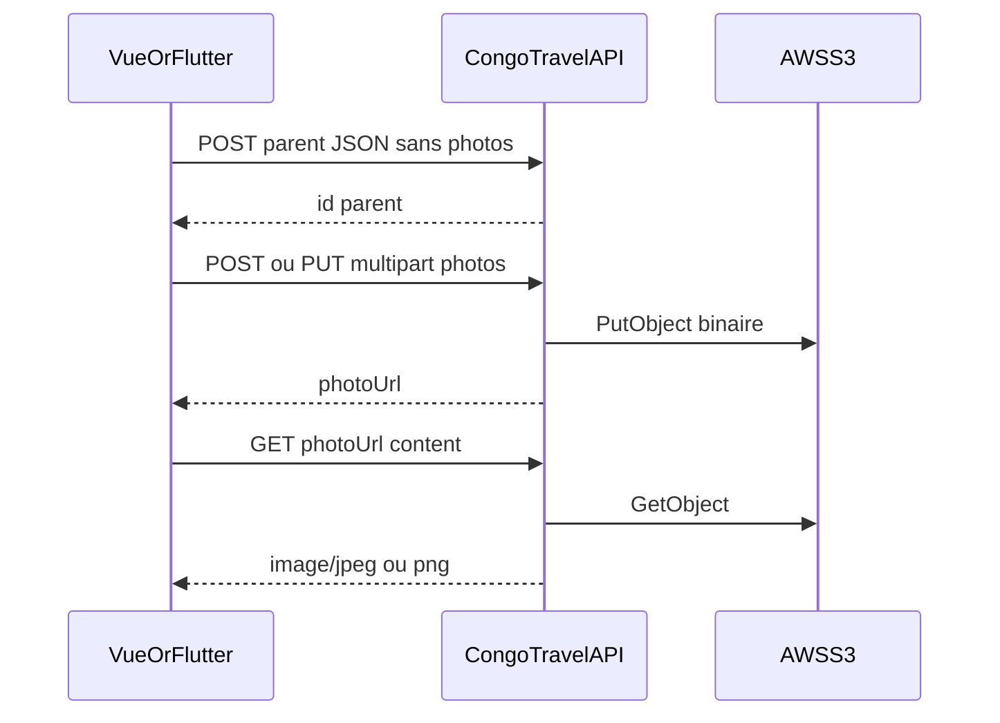

# Intégration frontend — Photos AWS S3 (Vue.js + Flutter)

Guide pratique pour afficher et uploader les photos CongoTravelAPI après migration S3.

Contrats : [`MODULE_13_PHOTOS_STOCKAGE_S3.md`](MODULE_13_PHOTOS_STOCKAGE_S3.md)  
Document maître : [`DOCUMENTATION_COMPLETE_INTEGRATION_FRONTEND.md`](DOCUMENTATION_COMPLETE_INTEGRATION_FRONTEND.md)

---

## 1. Objectif et personas

| Persona | App | Besoin |
|---------|-----|--------|
| Admin / caissier | **Vue.js** | CRUD galerie (véhicule, session, resto, lieu) |
| Client / catalogue | **Flutter** | Afficher `photoUrl` / couverture |
| Staff mobile | **Flutter** | Upload multipart (mêmes endpoints que Vue) |

Le client **ne contacte jamais S3**. Tout passe par l’API (`multipart` + `.../content`).

---

## 2. Flux cible



1. Créer l’entité **sans** `photos`.
2. `POST .../photos` (1 fichier) **ou** `PUT .../photos` (lot 0–3).
3. Afficher avec `photoUrl` (chemin relatif → préfixer base URL).

---

## 3. Affichage

### Règles

- Utiliser **`photoUrl`**, pas `photoBase64` (souvent vide).
- Listes : `includePhotoBase64=false` (défaut).
- Événement / restaurant / site : `/content` souvent **public** → `` / `Image.network` OK.
- **Véhicule** : `/content` exige JWT → fetch blob + object URL (Vue) ou headers Dio (Flutter).

### Vue — image publique

```vue

```

```ts
function absoluteApiUrl(path: string) {
  if (path.startsWith('http')) return path;
  return `${import.meta.env.VITE_API_BASE}${path}`; // ex. https://api… sans /api en double
}
```

### Vue — image véhicule (JWT)

```ts
async function loadProtectedPhoto(photoUrl: string, token: string): Promise<string> {
  const res = await fetch(absoluteApiUrl(photoUrl), {
    headers: { Authorization: `Bearer ${token}` },
  });
  if (!res.ok) throw new Error('Photo indisponible');
  const blob = await res.blob();
  return URL.createObjectURL(blob);
}
```

### Flutter — public

```dart
Image.network(
  '$apiBase${photo.photoUrl}',
  fit: BoxFit.cover,
  errorBuilder: (_, __, ___) => const Icon(Icons.broken_image),
)
```

### Flutter — véhicule (header)

```dart
Image.network(
  '$apiBase${photo.photoUrl}',
  headers: {'Authorization': 'Bearer $token'},
  fit: BoxFit.cover,
)
```

Ou `CachedNetworkImage` avec les mêmes headers.

---

## 4. Upload Vue (multipart)

### Après create — 1 fichier

```ts
async function addPhoto(basePath: string, file: File, ordre?: number) {
  const form = new FormData();
  form.append('file', file);
  if (ordre != null) form.append('ordre', String(ordre));
  form.append('fileName', file.name);

  const { data } = await api.post(`${basePath}/photos`, form, {
    headers: { 'Content-Type': 'multipart/form-data' },
  });
  return data; // contient photoUrl
}
```

Exemples `basePath` :

- `/Vehicule/${id}`
- `/events/sessions/${id}`
- `/restaurants/etablissements/${id}`
- `/sites-touristiques/lieux/${id}`

### Replace-all (édition galerie)

```ts
async function replaceAllPhotos(basePath: string, files: File[], ordres?: number[]) {
  const form = new FormData();
  for (const f of files) {
    form.append('files', f);
  }
  if (ordres?.length) {
    for (const o of ordres) form.append('ordres', String(o));
  }
  // files vide = vider la galerie
  const { data } = await api.put(`${basePath}/photos`, form, {
    headers: { 'Content-Type': 'multipart/form-data' },
  });
  return data as Array<{ photoUrl?: string; ordre: number }>;
}
```

### Validations UI avant envoi

- Max **3** fichiers ; JPG/PNG ; ≤ **1 Mo** chacun.
- Create parent d’abord → puis photos (éviter gros JSON base64).

---

## 5. Upload Flutter (Dio)

```dart
Future<Map<String, dynamic>> addPhoto({
  required String basePath,
  required File file,
  int? ordre,
}) async {
  final form = FormData.fromMap({
    'file': await MultipartFile.fromFile(
      file.path,
      filename: file.uri.pathSegments.last,
    ),
    if (ordre != null) 'ordre': ordre,
  });

  final res = await dio.post(
    '$basePath/photos',
    data: form,
    options: Options(contentType: 'multipart/form-data'),
  );
  return Map<String, dynamic>.from(res.data as Map);
}

Future<List<dynamic>> replaceAllPhotos({
  required String basePath,
  required List<File> files,
  List<int>? ordres,
}) async {
  final map = <String, dynamic>{
    'files': [
      for (final f in files)
        await MultipartFile.fromFile(f.path, filename: f.uri.pathSegments.last),
    ],
  };
  if (ordres != null) map['ordres'] = ordres;

  final res = await dio.put(
    '$basePath/photos',
    data: FormData.fromMap(map),
    options: Options(contentType: 'multipart/form-data'),
  );
  return res.data as List<dynamic>;
}
```

---

## 6. Legacy — ne plus utiliser en nouveau code

| Ancien | Remplacement |
|--------|----------------|
| `photos: [{ photoBase64 }]` dans create | Create sans photos + multipart |
| `POST` JSON `photoBase64` | `POST` multipart `file` |
| Afficher `photoBase64` / data-URL | Afficher `photoUrl` → `/content` |
| `includePhotoBase64=true` systématique | Uniquement debug / migration |

L’API accepte encore le base64 (pas de breaking), mais les DTO create sont marqués **LEGACY / déprécié**.

---

## 7. Erreurs UX

| Situation | HTTP / message | UI |
|-----------|----------------|-----|
| 4e fichier / > 3 | 400 | Limiter le sélecteur à 3 |
| Non JPG/PNG | 400 | Filtrer `accept="image/jpeg,image/png"` |
| > 1 Mo | 400 | Compresser / refuser côté client |
| Galerie pleine (POST) | 400 | Proposer replace-all PUT |
| 401 véhicule content | — | Renvoyer le Bearer |
| 403 write | — | Permission domaine manquante |
| 404 | — | Photo / parent supprimé |

---

## 8. Checklist QA

- [ ] Liste photos : `photoUrl` renseigné, `photoBase64` vide
- [ ] `GET .../content` affiche l’image (anon ou JWT selon domaine)
- [ ] Create entité **sans** `photos` puis `POST` multipart → OK
- [ ] `PUT` avec 2 fichiers → 2 photos, anciennes remplacées
- [ ] `PUT` avec 0 fichier → galerie vide
- [ ] `PUT` avec 4 fichiers → 400
- [ ] Create avec `photos` base64 → toujours OK (régression compat)
- [ ] Couverture liste (`photoCouverture.photoUrl`) sans hydrater base64
- [ ] Véhicule : image protégée avec token

---

## 9. Référence rapide routes

| Domaine | Base |
|---------|------|
| Véhicule | `/api/Vehicule/{id}` |
| Session événement | `/api/events/sessions/{id}` |
| Restaurant | `/api/restaurants/etablissements/{id}` |
| Lieu site | `/api/sites-touristiques/lieux/{id}` |

Opérations : `GET/POST/PUT /photos`, `GET /photos/{id}/content`, `PUT /photos/{id}/ordre`, `DELETE /photos/{id}`.

Détail auth, champs, contraintes : [MODULE_13](MODULE_13_PHOTOS_STOCKAGE_S3.md).
