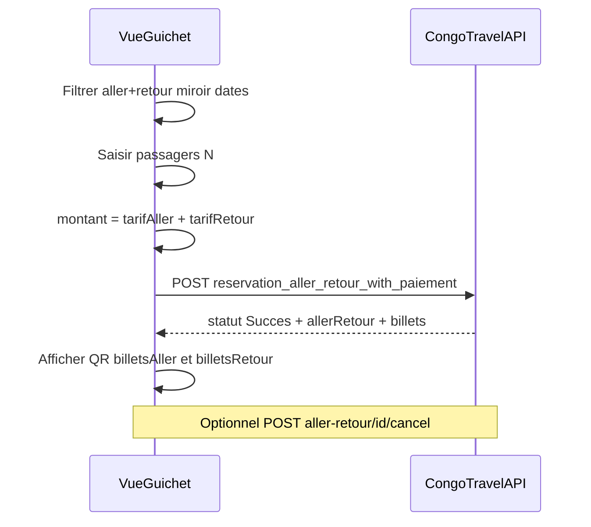
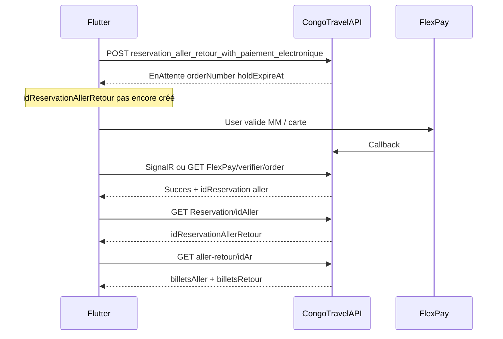

# Intégration frontend — Réservation Aller-Retour (Transport)

Guide pratique **Vue.js (guichet)** + **Flutter (voyageur)** pour intégrer la réservation aller-retour transport CongoTravelAPI V1.

Contrats détaillés (JSON, codes HTTP, règles) : [`MODULE_12_TRANSPORT_ALLER_RETOUR.md`](MODULE_12_TRANSPORT_ALLER_RETOUR.md)  
Spec backend : [`SPEC_ALLER_RETOUR_TRANSPORT_V1.md`](../05_transport_sync/SPEC_ALLER_RETOUR_TRANSPORT_V1.md)  
Document maître : [`DOCUMENTATION_COMPLETE_INTEGRATION_FRONTEND.md`](DOCUMENTATION_COMPLETE_INTEGRATION_FRONTEND.md)

---

## 1. Objectif et personas

| Persona | App | Parcours principal | Endpoint |
|---------|-----|--------------------|----------|
| **Caissier** | Vue.js guichet | Cash (espèces / méthodes guichet) | `POST .../reservation_aller_retour_with_paiement` |
| **Client voyageur** | Flutter | FlexPay (Mobile Money / carte) | `POST .../reservation_aller_retour_with_paiement_electronique` |

Même API JWT ; différence = méthode de paiement + moment où `idReservationAllerRetour` est disponible.

---

## 2. Prérequis

| Besoin | Module / doc |
|--------|----------------|
| Auth Bearer JWT | [MODULE_01](MODULE_01_AUTH_ET_PERMISSIONS.md) |
| Catalogue / détail voyages (2 IDs, villes, tarifs, `codeDevisePrix`) | [MODULE_02](MODULE_02_TRANSPORT_VOYAGE.md) |
| Passagers, single-leg (référence), scan billet | [MODULE_03](MODULE_03_RESERVATION_BILLET.md) |
| FlexPay, SignalR, `verifier`, multi-devise | [MODULE_04](MODULE_04_PAIEMENT_FLEXPAY.md), [`INTEGRATION_FLUTTER_FLEXPAY.md`](INTEGRATION_FLUTTER_FLEXPAY.md), [cross-devise](INTEGRATION_PAIEMENT_ELECTRONIQUE_CROSS_DEVISE_VUE_FLUTTER.md) |
| Contrats AR | [MODULE_12](MODULE_12_TRANSPORT_ALLER_RETOUR.md) |

Headers :

```
Content-Type: application/json
Authorization: Bearer <accessToken>
```

---

## 3. Flux Vue.js — guichet cash



### Pas à pas

1. Sélectionner voyage **aller** puis **retour** (même `idSociete`, villes miroir, départ retour ≥ aller).
2. Une seule liste de passagers (`nombreDePlace` = `passagers.length`).
3. Afficher le détail tarif : aller + retour = `montantAPaye` / `montantPaye`.
4. `POST /api/Reservation/reservation_aller_retour_with_paiement`.
5. Si `statut === 'Succes'` → afficher `allerRetour.billetsAller` + `billetsRetour` ; stocker `idReservationAllerRetour`.
6. Si `SuccesPaiementPartiel` → message paiement incomplet, pas d’embarquement complet.
7. Annulation guichet : `POST /api/Reservation/aller-retour/{id}/cancel` (2 legs + sièges).

### Snippet Vue / TypeScript

```ts
import type {
  CreateReservationAllerRetourPayload,
  ReservationAllerRetourWithPaiementResponse,
} from '@/types/allerRetour';

async function createAllerRetourCash(
  payload: CreateReservationAllerRetourPayload
): Promise<ReservationAllerRetourWithPaiementResponse> {
  const { data } = await api.post<ReservationAllerRetourWithPaiementResponse>(
    '/Reservation/reservation_aller_retour_with_paiement',
    payload
  );

  if (data.statut === 'Succes') {
    const ar = data.allerRetour!;
    showTickets([...(ar.billetsAller ?? []), ...(ar.billetsRetour ?? [])]);
    storeIdAr(ar.idReservationAllerRetour);
  } else if (data.statut === 'Echec') {
    toast.error(data.message);
  } else if (data.statut === 'SuccesPaiementPartiel') {
    toast.warning(data.message);
  }

  return data;
}

async function cancelAllerRetour(idReservationAllerRetour: number) {
  await api.post(`/Reservation/aller-retour/${idReservationAllerRetour}/cancel`);
}
```

### Validations UI avant POST

- `idVoyageAller !== idVoyageRetour`
- `villeArrivee(aller) === villeDepart(retour)` et inverse (trim / case-insensitive)
- Date+heure retour ≥ aller
- `passagers.length === nombreDePlace` ; chaque `nomComplet` + `idCategorieSiege`
- `paiement.montantAPaye ≈ tarifAller + tarifRetour` (± 0,05)
- `paiement.methodePaiement` = méthode **cash / guichet** uniquement

---

## 4. Flux Flutter — voyageur FlexPay



### Pas à pas

1. Choix aller + retour + passagers (mêmes règles géo / dates / devises).
2. Calculer `montantAPaye` en **devise tarif** :  
   `(tarifAller + tarifRetour) + (supplémentÉlectronique × nombreDePlace × 2)`.
3. `POST /api/Reservation/reservation_aller_retour_with_paiement_electronique`  
   → `statut: EnAttente`, `orderNumberFlexPay`, `holdExpireAt`, `montantFlexPay`, `codeDevisePaiement`.
4. UI d’attente (« Validez sur le téléphone ») ou ouvrir `paymentUrl` (carte).
5. Attendre confirmation :
   - SignalR `FlexPayPaymentConfirmed` (**idReservation = aller**), **ou**
   - Poll `GET /api/FlexPay/verifier/{orderNumber}` jusqu’à `Succes` / échec / expiration hold.
6. `GET /api/Reservation/{idReservationAller}` → `idReservationAllerRetour`.
7. `GET /api/Reservation/aller-retour/{id}` → afficher QR aller + retour.
8. Ne pas s’attendre à `idReservationAllerRetour` dans la réponse d’initiation.

### Snippet Dart

```dart
Future<void> bookAllerRetourFlexPay(Map<String, dynamic> payload) async {
  final init = await api.post(
    '/Reservation/reservation_aller_retour_with_paiement_electronique',
    data: payload,
  );
  final body = init.data as Map<String, dynamic>;

  if (body['statut'] != 'EnAttente') {
    throw Exception(body['message'] ?? 'Initiation FlexPay échouée');
  }

  final order = body['orderNumberFlexPay'] as String;
  final holdExpireAt = DateTime.tryParse(body['holdExpireAt']?.toString() ?? '');

  // Afficher montantFlexPay / codeDevisePaiement ; attendre SignalR ou :
  final verified = await pollFlexPayVerifier(order, until: holdExpireAt);
  if (verified['statut'] != 'Succes') {
    throw Exception(verified['message'] ?? 'Paiement non confirmé');
  }

  final idReservationAller = verified['reservation']?['idReservation']
      ?? verified['idReservation'];
  if (idReservationAller == null) {
    throw Exception('idReservation aller manquant après FlexPay');
  }

  final res = await api.get('/Reservation/$idReservationAller');
  final idAr = res.data['idReservationAllerRetour'] as int?;
  if (idAr == null) {
    throw Exception('idReservationAllerRetour absent — retry GET Reservation');
  }

  final detail = await api.get('/Reservation/aller-retour/$idAr');
  final billetsAller = detail.data['billetsAller'] as List? ?? [];
  final billetsRetour = detail.data['billetsRetour'] as List? ?? [];
  showTickets(billetsAller, billetsRetour);
}
```

> Verifier / SignalR = réservation **aller** (rétrocompat). Toujours recharger `GET aller-retour/{id}` pour les billets **retour**.

---

## 5. Modèles TypeScript

```ts
export interface ReservationPassengerInput {
  idClient?: number | null;
  idCategorieSiege: number;
  nomComplet: string;
  telephone?: string | null;
  email?: string | null;
  documentType?: string | null;
  documentNumero?: string | null;
  genre?: string | null;
}

export interface PaiementCashInput {
  montantAPaye: number;
  montantPaye: number;
  methodePaiement: string;
  referenceTransaction?: string | null;
  idUtilisateur: number;
  idSociete: number;
  idSite?: number | null;
}

export interface PaiementFlexPayInput {
  montantAPaye: number; // devise tarif D_t
  methodePaiement: string; // MOBILE_MONEY | ...
  codeDevisePaiement: 'CDF' | 'USD';
  phone?: string | null;
  idUtilisateur: number;
  idSociete: number;
  idSite: number; // obligatoire FlexPay
}

export interface CreateReservationAllerRetourPayload {
  idVoyageAller: number;
  idVoyageRetour: number;
  idClient: number;
  nombreDePlace: number;
  idUtilisateur: number;
  idSociete: number;
  idSite?: number | null;
  passagers: ReservationPassengerInput[];
  paiement: PaiementCashInput;
}

export interface InitiateFlexPayAllerRetourPayload
  extends Omit<CreateReservationAllerRetourPayload, 'paiement'> {
  paiement: PaiementFlexPayInput;
}

export type TransactionStatut =
  | 'Succes'
  | 'SuccesPaiementPartiel'
  | 'Echec'
  | 'Annule'
  | 'EnAttente';

export interface BilletDto {
  idBillet: number;
  idReservation: number;
  qrCode?: string;
  // ... autres champs BilletResponseDto
}

export interface ReservationAllerRetourDetail {
  idReservationAllerRetour: number;
  idVoyageAller: number;
  idVoyageRetour: number;
  idReservationAller?: number | null;
  idReservationRetour?: number | null;
  idPaiement?: number | null;
  statut: 'EN_ATTENTE_PAIEMENT' | 'CONFIRMEE' | 'ANNULEE' | string;
  idSociete: number;
  idClient: number;
  idUtilisateur: number;
  idSite?: number | null;
  origine: string;
  dateCreation: string;
  dateModification?: string | null;
  reservationAller?: Record<string, unknown> | null;
  reservationRetour?: Record<string, unknown> | null;
  paiement?: Record<string, unknown> | null;
  billetsAller: BilletDto[];
  billetsRetour: BilletDto[];
}

export interface ReservationAllerRetourWithPaiementResponse {
  transactionId: string;
  statut: TransactionStatut;
  message: string;
  dateCreation: string;
  allerRetour?: ReservationAllerRetourDetail | null;
  idCommandeReservationEnAttente?: string | null;
  orderNumberFlexPay?: string | null;
  referenceFlexPay?: string | null;
  montantVoyage?: number | null;
  codeDeviseVoyage?: string | null;
  montantFlexPay?: number | null;
  codeDevisePaiement?: string | null;
  tauxApplique?: number | null;
  holdExpireAt?: string | null;
  paymentUrl?: string | null;
  flexPayAccepted?: boolean | null;
}
```

---

## 6. Modèles Dart

```dart
class ReservationPassengerInput {
  final int idCategorieSiege;
  final String nomComplet;
  final String? telephone;
  final String? email;
  final String? documentType;
  final String? documentNumero;
  final String? genre;
  final int? idClient;

  Map<String, dynamic> toJson() => {
        'idCategorieSiege': idCategorieSiege,
        'nomComplet': nomComplet,
        if (telephone != null) 'telephone': telephone,
        if (email != null) 'email': email,
        if (documentType != null) 'documentType': documentType,
        if (documentNumero != null) 'documentNumero': documentNumero,
        if (genre != null) 'genre': genre,
        if (idClient != null) 'idClient': idClient,
      };
}

class InitiateFlexPayAllerRetourPayload {
  final int idVoyageAller;
  final int idVoyageRetour;
  final int idClient;
  final int nombreDePlace;
  final int idUtilisateur;
  final int idSociete;
  final int idSite;
  final List<ReservationPassengerInput> passagers;
  final double montantAPaye; // D_t
  final String methodePaiement;
  final String codeDevisePaiement; // CDF | USD
  final String? phone;

  Map<String, dynamic> toJson() => {
        'idVoyageAller': idVoyageAller,
        'idVoyageRetour': idVoyageRetour,
        'idClient': idClient,
        'nombreDePlace': nombreDePlace,
        'idUtilisateur': idUtilisateur,
        'idSociete': idSociete,
        'idSite': idSite,
        'passagers': passagers.map((p) => p.toJson()).toList(),
        'paiement': {
          'montantAPaye': montantAPaye,
          'methodePaiement': methodePaiement,
          'codeDevisePaiement': codeDevisePaiement,
          if (phone != null) 'phone': phone,
          'idUtilisateur': idUtilisateur,
          'idSociete': idSociete,
          'idSite': idSite,
        },
      };
}
```

---

## 7. Erreurs UX (API → UI)

| HTTP / message typique | Action front |
|------------------------|--------------|
| 400 — Incompatibilité géographique | Corriger le couple de voyages (villes miroir) |
| 400 — Départ retour … postérieur / antérieur | Ajuster date/heure retour |
| 400 — Montant à payer incohérent | Recalculer somme (+ supplément × N × 2 en FlexPay) |
| 400 — IdSite requis | Forcer un site marchand (FlexPay) |
| 400 — Places insuffisantes sur le voyage X | Proposer un autre voyage / réduire N |
| 400 — Devises tarif … identiques | Refuser couple de voyages multi-devises |
| 400 — téléphone / MOBILE_MONEY | Demander `phone` au format attendu |
| 403 | Session mauvaise société — re-login / tenant |
| 404 | Dossier AR inconnu — ne pas afficher détail |
| 500 + `statut: Echec` (cash) | Afficher `message` ; ne pas considérer comme payé |
| Hold expiré (FlexPay) | Proposer de relancer une initiation |

---

## 8. Embarquement

- Billets AR = billets transport classiques (`BilletResponseDto`).
- Gate : `GET /api/Billet/{QrCode}/check?idVoyageCible=...` ([MODULE_03](MODULE_03_RESERVATION_BILLET.md)).
- Un QR = **un** leg (aller **ou** retour) ; toujours passer le `idVoyageCible` du voyage scanné.

---

## 9. Checklist QA

### Commun

- [ ] UI refuse 2 voyages même ID
- [ ] Filtre villes miroir + même société + même `codeDevisePrix`
- [ ] Date/heure retour ≥ aller
- [ ] Une seule liste passagers (N = `nombreDePlace`)
- [ ] Single-leg MODULE_03 / 04 non régressé

### Vue (cash)

- [ ] `montantAPaye` = somme des 2 tarifs
- [ ] Succès → QR aller **et** retour
- [ ] `SuccesPaiementPartiel` géré (pas d’embarquement complet)
- [ ] Cancel annule les 2 legs (sièges libérés)
- [ ] GET détail affiche agrégat + paiement

### Flutter (FlexPay)

- [ ] `montantAPaye` inclut supplément × places × 2 (en D_t)
- [ ] Affichage `montantFlexPay` / `tauxApplique` si D_p ≠ D_t
- [ ] `EnAttente` sans `idReservationAllerRetour`
- [ ] Après verifier/SignalR → reload `GET aller-retour/{id}`
- [ ] Expiration `holdExpireAt` → message clair + retry
- [ ] Tenant JWT cohérent sur GET AR

---

## 10. Hors scope V1

- Sync offline agent pour AR
- Passagers différents aller vs retour
- Tarif promo / pack AR
- Retour ouvert (sans voyage retour fixé)
- Annulation d’un seul leg

---

## 11. Références rapides endpoints

| Méthode | Route |
|---------|-------|
| POST | `/api/Reservation/reservation_aller_retour_with_paiement` |
| POST | `/api/Reservation/reservation_aller_retour_with_paiement_electronique` |
| GET | `/api/Reservation/aller-retour/{id}` |
| POST | `/api/Reservation/aller-retour/{id}/cancel` |
| GET | `/api/Reservation/{id}` (lire `idReservationAllerRetour` post-FlexPay) |
| GET | `/api/FlexPay/verifier/{orderNumber}` |
