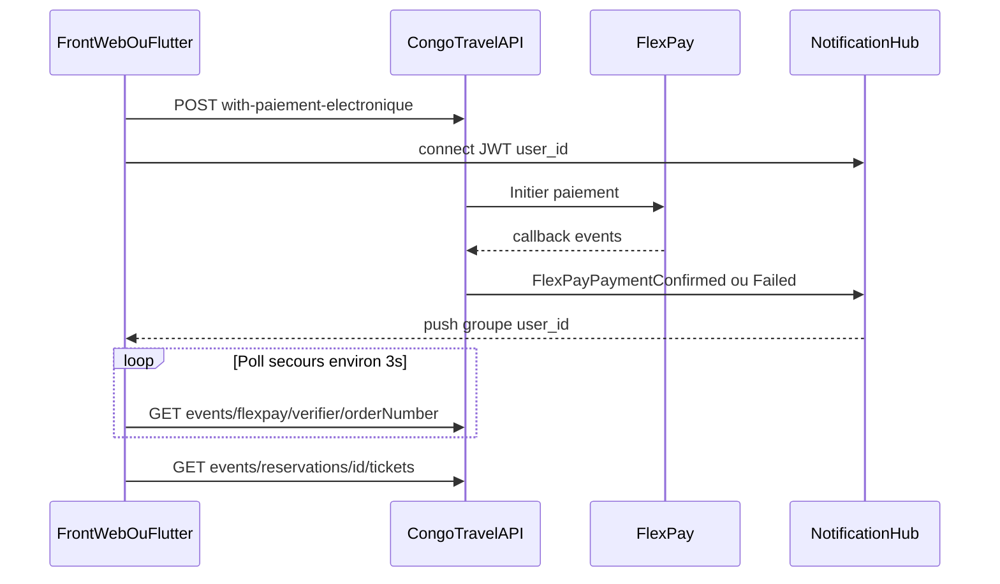

# Intégration SignalR — FlexPay EvenementReservation (web + mobile)

Guide d’intégration temps réel pour le **paiement FlexPay billetterie événement**.  
Même hub et **mêmes noms d’événements** que le transport ; les **routes API** et le sens des IDs diffèrent.

Références connexes :

- Flux métier billetterie : [MODULE_05_EVENEMENT_BILLETTERIE.md](MODULE_05_EVENEMENT_BILLETTERIE.md)
- FlexPay transport (ne pas mélanger les routes) : [MODULE_04_PAIEMENT_FLEXPAY.md](MODULE_04_PAIEMENT_FLEXPAY.md), [INTEGRATION_FLUTTER_FLEXPAY.md](INTEGRATION_FLUTTER_FLEXPAY.md)
- Hub générique : [`docs/SIGNALR_FRONTEND_GUIDE.md`](../../../docs/SIGNALR_FRONTEND_GUIDE.md)

---

## 1. Objectif UX

Après `POST /api/events/reservations/with-paiement-electronique` :

1. Connecter (ou réutiliser) le hub SignalR avec le JWT de l’acheteur.
2. Écouter `FlexPayPaymentConfirmed` / `FlexPayPaymentFailed`.
3. En parallèle, poller `GET /api/events/flexpay/verifier/{orderNumber}` (~3 s) comme **secours**.
4. Afficher les tickets QR (confirm) ou un message d’échec / hold expiré.

Le push accélère l’UI ; le poll garantit la finalité si WebSocket est coupé.



---

## 2. Prérequis

| Élément | Détail |
|---------|--------|
| JWT acheteur | Hub `[Authorize]` ; sans token → connexion refusée |
| `IdUtilisateur` | Renseigné côté API à l’achat si `UserId > 0` ; **sinon pas de push** (guichet anonyme → poll seul) |
| Permissions poll | `Evenement.Reservation.Confirm` pour `verifier` |
| Query Client | `?idSociete=` = société **organisatrice** (achat cross-société) — voir [MODULE_05](MODULE_05_EVENEMENT_BILLETTERIE.md) |
| Package web | `@microsoft/signalr` |
| Package Flutter | `signalr_netcore` (ou client SignalR compatible .NET) |

Packages npm / pub :

```bash
# Vue / web
npm install @microsoft/signalr

# Flutter (exemple)
flutter pub add signalr_netcore
```

---

## 3. Connexion au hub

**URL** : `{API_BASE}/hubs/notifications`

Auth :

- Web recommandé : `accessTokenFactory: () => jwt`
- Mobile / fallback : `?access_token={jwt}` (attention logs proxy / Referer)

À la connexion, le serveur ajoute automatiquement le client aux groupes `user_{userId}` et `all_users`.  
**Ne pas** appeler `JoinGroup('user_…')` pour recevoir les events FlexPay.

Reconnect recommandé : `withAutomaticReconnect()`.

---

## 4. Contrat des événements

| Event SignalR | Quand (événement) | Payload |
|---------------|-------------------|---------|
| `FlexPayPaymentConfirmed` | Callback `code=0` ou verifier qui finalise | `{ orderNumber, idReservation, idPaiement, status: "confirmed", timestampUtc }` |
| `FlexPayPaymentFailed` | Refus FlexPay, cancel, decline, hold expiré, erreur confirmation | `{ orderNumber, message, status: "failed", timestampUtc }` |

### Mapping sémantique (critique)

Pour un **achat événement**, les champs du payload confirment des IDs **événement**, pas transport :

| Champ payload | Signifie |
|---------------|----------|
| `idReservation` | `IdEvenementReservation` |
| `idPaiement` | `IdEvenementPayment` |
| `orderNumber` | `ProviderTxRef` FlexPay (même valeur que le poll) |

Corréler toujours avec le `orderNumber` (ou `idReservation`) du pending local pour ignorer les pushes d’un autre flux (ex. transport en parallèle).

### Déclencheurs côté API

| Événement SignalR | Quand |
|-------------------|--------|
| `FlexPayPaymentConfirmed` | Callback `code=0` ou verifier qui finalise le succès |
| `FlexPayPaymentFailed` | Refus FlexPay (`code≠0`) **ou** hold expiré (job serveur) |

- Callback public `POST /api/events/flexpay/callback` (`code=0` confirm ; `code≠0` → FAILED + HOLD libéré + SignalR Failed)
- Job d’expiration hold → résa `EXPIRED`, FlexPay `PENDING`→`FAILED`, SignalR Failed (« Hold expiré… ») — **sans** appel Flutter
- Secours `GET /api/events/flexpay/verifier/{orderNumber}` (comme pour le succès)
- `POST /api/events/reservations/{id}/cancel` = **optionnel** (annulation anticipée dans l’app), **pas** obligatoire en MM
- Ne pas exiger `GET .../flexpay/cancel` pour le MM (FlexPay n’envoie en général pas `cancel_url`)
- Carte : `GET .../cancel` / `decline` (redirect) ou `POST .../abandon/{orderNumber}` restent disponibles

---

## 5. Router transport vs événement

Les **noms SignalR sont identiques**. Après un push, brancher selon le **contexte d’écran** (pending événement vs pending transport).

| Après SignalR / poll | Événement | Transport (interdit ici) |
|----------------------|-----------|---------------------------|
| Vérifier / finaliser | `GET /api/events/flexpay/verifier/{orderNumber}` | `/api/FlexPay/verifier/...` |
| Annuler (app, optionnel) | `POST /api/events/reservations/{id}/cancel` | — |
| Tickets | `GET /api/events/reservations/{id}/tickets` | `/api/Reservation/{id}` |
| Init paiement | `POST /api/events/reservations/with-paiement-electronique` | `.../reservation_with_paiement_electronique` |

Réutiliser le même service SignalR (handlers partagés) ; différencier uniquement les appels HTTP et le store pending (`domain: 'event' | 'transport'`).

---

## 6. Exemple Vue.js (guichet / back-office)

```js
import * as signalR from '@microsoft/signalr';
import api from '@/services/api'; // Axios + Bearer

let connection = null;
const pendingEvent = {
  orderNumber: null,
  idEvenementReservation: null,
  settled: false,
};

export async function startNotificationHub(getAccessToken) {
  if (connection) return connection;

  connection = new signalR.HubConnectionBuilder()
    .withUrl(`${import.meta.env.VITE_API_BASE}/hubs/notifications`, {
      accessTokenFactory: () => getAccessToken(),
    })
    .withAutomaticReconnect()
    .build();

  connection.on('FlexPayPaymentConfirmed', async (payload) => {
    if (!pendingEvent.orderNumber || payload.orderNumber !== pendingEvent.orderNumber) return;
    if (pendingEvent.settled) return;
    pendingEvent.settled = true;
    // idReservation = idEvenementReservation
    const { data } = await api.get(
      `/events/flexpay/verifier/${encodeURIComponent(payload.orderNumber)}`
    );
    // data = DTO confirm (reservation + payment + tickets) à la racine
    onEventPaymentSuccess(data);
  });

  connection.on('FlexPayPaymentFailed', (payload) => {
    if (!pendingEvent.orderNumber || payload.orderNumber !== pendingEvent.orderNumber) return;
    if (pendingEvent.settled) return;
    pendingEvent.settled = true;
    onEventPaymentFailed(payload.message || 'Paiement échoué');
  });

  // Ne pas traiter onclose comme un échec de paiement
  connection.onclose(() => { /* reconnect auto ; le poll continue */ });

  await connection.start();
  return connection;
}

export async function beginEventFlexPayWait({ orderNumber, idEvenementReservation, expiresAtUtc }) {
  pendingEvent.orderNumber = orderNumber;
  pendingEvent.idEvenementReservation = idEvenementReservation;
  pendingEvent.settled = false;

  return pollEventFlexPay(orderNumber, expiresAtUtc);
}

async function pollEventFlexPay(orderNumber, expiresAtUtc) {
  const deadline = new Date(expiresAtUtc).getTime() + 60_000;
  while (!pendingEvent.settled && Date.now() < deadline) {
    const { data } = await api.get(`/events/flexpay/verifier/${encodeURIComponent(orderNumber)}`);
    if (data.reservation && data.payment) {
      pendingEvent.settled = true;
      return data;
    }
    if (data.paymentPending === true) {
      await new Promise((r) => setTimeout(r, 3000));
      continue;
    }
    pendingEvent.settled = true;
    throw new Error(data.message || 'Paiement échoué');
  }
  if (!pendingEvent.settled) {
    pendingEvent.settled = true;
    throw new Error('Hold expiré');
  }
  return null; // déjà réglé via SignalR
}

function onEventPaymentSuccess(confirmDto) {
  // Afficher QR : confirmDto.reservation.tickets ou GET /events/reservations/{id}/tickets
}

function onEventPaymentFailed(message) {
  // Toast / écran échec + proposer nouvel achat
}
```

Après init :

```js
const { data: init } = await api.post('/events/reservations/with-paiement-electronique', body);
if (!init.flexPayAccepted) {
  alert(init.message);
} else {
  if (init.paymentUrl) window.open(init.paymentUrl, '_blank');
  await startNotificationHub(() => localStorage.getItem('accessToken'));
  const confirmed = await beginEventFlexPayWait({
    orderNumber: init.orderNumber,
    idEvenementReservation: init.reservation.idEvenementReservation,
    expiresAtUtc: init.reservationExpiresAtUtc,
  });
  // confirmed peut être null si SignalR a déjà settlé + UI mise à jour
}
```

---

## 7. Exemple Flutter (app voyageur)

```dart
import 'package:signalr_netcore/signalr_client.dart';

class EventFlexPayPending {
  String? orderNumber;
  int? idEvenementReservation;
  bool settled = false;
}

final pending = EventFlexPayPending();
HubConnection? hub;

Future<void> startNotificationHub(String Function() getJwt) async {
  if (hub != null) return;

  final base = apiBaseUrl; // sans slash final
  hub = HubConnectionBuilder()
      .withUrl(
        '$base/hubs/notifications',
        options: HttpConnectionOptions(
          accessTokenFactory: () async => getJwt(),
        ),
      )
      .withAutomaticReconnect()
      .build();

  hub!.on('FlexPayPaymentConfirmed', (args) async {
    final payload = args?.first as Map<String, dynamic>?;
    if (payload == null) return;
    final order = payload['orderNumber'] as String?;
    if (order == null || order != pending.orderNumber || pending.settled) return;
    pending.settled = true;
    final confirm = await api.get('/events/flexpay/verifier/$order');
    onEventPaymentSuccess(confirm.data as Map<String, dynamic>);
  });

  hub!.on('FlexPayPaymentFailed', (args) {
    final payload = args?.first as Map<String, dynamic>?;
    if (payload == null) return;
    final order = payload['orderNumber'] as String?;
    if (order == null || order != pending.orderNumber || pending.settled) return;
    pending.settled = true;
    onEventPaymentFailed(payload['message'] as String? ?? 'Paiement échoué');
  });

  // Ne pas appeler verifier dans onclose / ne pas interpréter déconnexion = échec
  await hub!.start();
}

Future<Map<String, dynamic>> pollEventFlexPay({
  required String orderNumber,
  required DateTime expiresAtUtc,
}) async {
  final deadline = expiresAtUtc.toUtc().add(const Duration(minutes: 1));
  while (!pending.settled && DateTime.now().toUtc().isBefore(deadline)) {
    final res = await api.get('/events/flexpay/verifier/$orderNumber');
    final data = res.data as Map<String, dynamic>;
    if (data['reservation'] != null && data['payment'] != null) {
      pending.settled = true;
      return data;
    }
    if (data['paymentPending'] == true) {
      await Future<void>.delayed(const Duration(seconds: 3));
      continue;
    }
    pending.settled = true;
    throw Exception(data['message'] ?? 'Paiement échoué');
  }
  if (!pending.settled) {
    pending.settled = true;
    throw Exception('Hold expiré');
  }
  // Settled via SignalR — l’UI a déjà été mise à jour
  return <String, dynamic>{};
}
```

Usage après POST électronique :

```dart
await startNotificationHub(() => tokenStore.accessToken);
pending.orderNumber = init['orderNumber'] as String;
pending.idEvenementReservation =
    init['reservation']['idEvenementReservation'] as int;
pending.settled = false;

// paymentUrl != null → WebView ; sinon message « validez sur le téléphone »
final confirmed = await pollEventFlexPay(
  orderNumber: pending.orderNumber!,
  expiresAtUtc: DateTime.parse(init['reservationExpiresAtUtc'] as String),
);
if (confirmed.isNotEmpty) {
  onEventPaymentSuccess(confirmed);
}
final tickets = await api.get(
  '/events/reservations/${pending.idEvenementReservation}/tickets',
);
```

---

## 8. Polling secours — réponses `verifier`

`GET /api/events/flexpay/verifier/{orderNumber}` (JWT) renvoie **à la racine** (pas d’enveloppe `confirmPayment` / `statusOnly`) :

| Cas | Corps typique | Action front |
|-----|---------------|--------------|
| Succès | DTO confirm : `reservation`, `payment`, tickets | Sortir du pending, afficher QR |
| En attente | `{ success, paymentPending: true, message, idEvenementReservation, idEvenementPayment }` | Attendre ~3 s |
| Échec / hold expiré / annulé | `{ success, paymentPending: false, message, ... }` | Sortir du pending, message, nouvel achat |

Intervalle recommandé : **3 s**. Ne pas spammer `verifier` à chaque `onclose` SignalR.

---

## 9. Cas limites

| Situation | Comportement attendu |
|-----------|----------------------|
| Guichet sans JWT utilisateur / `IdUtilisateur` null | **Pas de SignalR** pour cet achat → poll seul |
| Push + poll quasi simultanés | Flag `settled` / idempotence : un seul traitement UI |
| Déconnexion hub | Reconnect auto ; **continuer le poll** ; ce n’est pas un échec paiement |
| Redirection carte `cancel` / `decline` | API marque FAILED + push Failed ; le poll sort aussi |
| Annulation anticipée dans l’app (MM, optionnel) | `POST /events/reservations/{id}/cancel` → CANCELLED + FAILED + SignalR Failed |
| Hold expiré (MM sans callback refus) | Job serveur → EXPIRED + FAILED + SignalR Failed ; poll secours `paymentPending: false` |
| Pending transport + événement en même temps | Filtrer sur `orderNumber` (et idéalement un flag domaine) |

---

## 10. Checklist intégration

- [ ] Connexion hub `/hubs/notifications` avec JWT après login
- [ ] Handlers `FlexPayPaymentConfirmed` / `FlexPayPaymentFailed` (partagés transport OK)
- [ ] Corrélation `orderNumber` avec le pending **événement**
- [ ] Après confirm : `GET /api/events/flexpay/verifier/...` ou tickets `/api/events/reservations/{id}/tickets`
- [ ] Poll ~3 s en secours jusqu’à succès / `paymentPending: false` / hold expiré
- [ ] Sortir du pending sur `FlexPayPaymentFailed` (refus **ou** hold expiré) — **sans** exiger `POST .../cancel` en MM
- [ ] Bouton Annuler (optionnel) → `POST /api/events/reservations/{id}/cancel` si annulation anticipée
- [ ] Ne pas appeler `/api/FlexPay/*` ni `/api/Reservation/{id}` dans ce flux
- [ ] Ne pas traiter `onclose` hub comme échec paiement
- [ ] Guichet anonyme : UI basée sur le poll uniquement
- [ ] Test manuel : MM succès, refus téléphone, hold expiré (SignalR Failed), annulation WebView carte

### Tests manuels suggérés

1. Achat MM connecté → push Confirm → tickets visibles sans attendre longtemps.
2. Couper le Wi‑Fi après init → seul le poll (après reprise) finalise.
3. Refus MM sur le téléphone (si callback `code≠0`) → SignalR Failed + sortir du pending.
4. Laisser expirer le hold (sans POST cancel) → SignalR Failed « Hold expiré… » + poll `paymentPending: false`.
5. Annuler dans le parcours carte → Failed + message, stock libéré.
6. (Optionnel) Bouton Annuler app → `POST .../reservations/{id}/cancel` → Failed anticipé.
