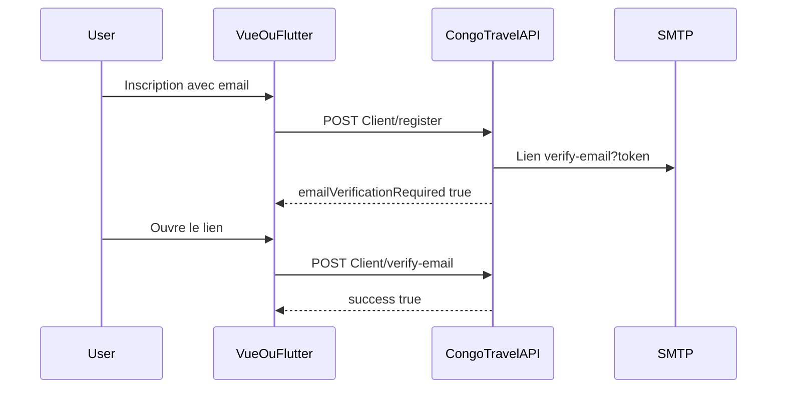

# Intégration vérification d’email à l’inscription (Vue.js + Flutter)

> Guide frontend — **Vue.js (web)** et **Flutter (iOS / Android)**  
> Contrat API : [MODULE_06_CLIENT_APP_VOYAGEUR.md](MODULE_06_CLIENT_APP_VOYAGEUR.md)  
> Login social (pas de mail CongoTravel) : [INTEGRATION_LOGIN_GOOGLE_APPLE_VUE_FLUTTER.md](INTEGRATION_LOGIN_GOOGLE_APPLE_VUE_FLUTTER.md)  
> Retour : [Document maître](DOCUMENTATION_COMPLETE_INTEGRATION_FRONTEND.md)

---

## 1. Vue d’ensemble

Quand le client s’inscrit avec un **email** via `POST /api/Client/register`, l’API envoie un mail SMTP contenant un **lien** de confirmation. Le front doit :

1. Afficher un écran « Vérifiez votre boîte mail » après inscription.
2. Exposer une route / deep link alignée sur l’URL du mail (`/verify-email?token=…`).
3. Poster le `token` à l’API pour marquer `EmailVerified = true`.
4. Proposer un renvoi d’email si besoin.

Sans email à l’inscription → **pas** de vérification.  
Google / Apple → **pas** ce flux (email déjà prouvé par le provider).



---

## 2. Contrat API

Toutes ces routes sont **publiques** (`AllowAnonymous`). JSON camelCase.

| Étape | Méthode | Endpoint | Body |
|-------|---------|----------|------|
| Inscription | `POST` | `/api/Client/register` | `RegisterClientDto` |
| Confirmer | `POST` | `/api/Client/verify-email` | `{ "token": "..." }` |
| Renvoyer | `POST` | `/api/Client/resend-verification-email` | `{ "email": "..." }` |
| Dispo email (optionnel) | `POST` | `/api/Client/check-email` | `{ "email": "..." }` |

### 2.1 Inscription

**Header recommandé** : `X-Device-Id: <uuid-stable>` (rate limit multi-scope).

```json
{
  "nomClient": "Jean Dupont",
  "telephone": "+243900000001",
  "emailClient": "jean@example.com",
  "acceptTerms": true
}
```

`emailClient` est **optionnel**. S’il est renseigné : format + unicité ; puis envoi du lien.

**Réponse 201** (extrait, enveloppe typique) :

```json
{
  "success": true,
  "data": {
    "idClient": 42,
    "emailClient": "jean@example.com",
    "message": "Inscription réussie !",
    "emailVerificationRequired": true,
    "emailVerificationSent": true,
    "welcomeMessage": "Bienvenue sur CongoTravel ! Vérifiez votre boîte mail..."
  }
}
```

| Champ | Usage front |
|-------|-------------|
| `emailVerificationRequired` | Afficher l’écran « vérifiez votre email » |
| `emailVerificationSent` | `false` → SMTP KO : proposer « Renvoyer » + support |
| `welcomeMessage` | Texte UI |

Erreurs inscription utiles : **400** (validation), **409** (email déjà pris), **429** (rate limit).

### 2.2 Confirmer le lien

```json
{ "token": "<valeur query token du lien>" }
```

| HTTP | Signification |
|------|----------------|
| 200 | `{ "success": true, "message": "Adresse email vérifiée avec succès." }` |
| 400 | Token manquant / invalide / déjà utilisé / expiré |

Validité du lien : **24 heures**.

### 2.3 Renvoyer l’email

```json
{ "email": "jean@example.com" }
```

Réponse **toujours** générique (anti-énumération), ex. :

```json
{
  "success": true,
  "message": "Si un compte existe pour cette adresse, un email de vérification a été envoyé."
}
```

Rate limit : même famille que `check-email` (`EmailCheckRateLimit`).

---

## 3. Config à aligner (ops + front)

L’URL dans le mail est construite côté API :

```text
{FrontendSettings:BaseUrl}{FrontendSettings:VerifyEmailPath}?token={token}
```

Défauts :

| Clé | Exemple |
|-----|---------|
| `FrontendSettings:BaseUrl` | `https://congotravel.kansaconsulting.com` |
| `FrontendSettings:VerifyEmailPath` | `/verify-email` |

**Le front web doit déclarer la même path** (`/verify-email`).  
**Flutter** doit enregistrer le même host + path en App Links / Universal Links (ou ouvrir le lien web qui deep-linke vers l’app).

---

## 4. Vue.js (web)

Stack typique : Vue 3 + Vue Router + Axios/Pinia.

### 4.1 Après inscription

```ts
// api/clientRegister.ts
import axios from 'axios'

const api = axios.create({ baseURL: import.meta.env.VITE_API_BASE_URL })

export async function registerClient(payload: object, deviceId: string) {
  const { data } = await api.post('/api/Client/register', payload, {
    headers: { 'X-Device-Id': deviceId },
  })
  return data // { success, data: ClientRegistrationResponseDto }
}

export async function verifyEmail(token: string) {
  const { data } = await api.post('/api/Client/verify-email', { token })
  return data
}

export async function resendVerificationEmail(email: string) {
  const { data } = await api.post('/api/Client/resend-verification-email', { email })
  return data
}
```

UX après succès register :

```ts
if (result.data?.emailVerificationRequired) {
  // router.push({ name: 'check-email', query: { email: payload.emailClient } })
} else {
  // router.push({ name: 'login' }) // ou onboarding sans email
}
```

### 4.2 Route `/verify-email`

```ts
// router
{ path: '/verify-email', name: 'verify-email', component: () => import('@/views/VerifyEmailView.vue') }
```

```vue
<script setup lang="ts">
import { onMounted, ref } from 'vue'
import { useRoute, useRouter } from 'vue-router'
import { verifyEmail } from '@/api/clientRegister'

const route = useRoute()
const router = useRouter()
const status = ref<'loading' | 'ok' | 'error'>('loading')
const message = ref('')

onMounted(async () => {
  const token = String(route.query.token ?? '')
  if (!token) {
    status.value = 'error'
    message.value = 'Lien invalide (token manquant).'
    return
  }
  try {
    const res = await verifyEmail(token)
    status.value = 'ok'
    message.value = res.message ?? 'Email vérifié.'
    // optionnel : redirect login après 2s
    // setTimeout(() => router.push('/login'), 2000)
  } catch (e: any) {
    status.value = 'error'
    message.value = e?.response?.data?.message ?? 'Échec de la vérification.'
  }
})
</script>

<template>
  <p v-if="status === 'loading'">Vérification en cours…</p>
  <p v-else>{{ message }}</p>
</template>
```

### 4.3 Écran « Renvoyer »

Bouton qui appelle `resendVerificationEmail(email)` — afficher le `message` générique sans révéler si le compte existe.

---

## 5. Flutter (iOS / Android)

Packages typiques : `dio`, `shared_preferences` / `flutter_secure_storage`, `app_links` (ou `uni_links`).

### 5.1 Register + device id

```dart
Future<String> getDeviceId() async {
  final prefs = await SharedPreferences.getInstance();
  var id = prefs.getString('deviceId');
  if (id == null) {
    id = const Uuid().v4();
    await prefs.setString('deviceId', id);
  }
  return id!;
}

Future<Map<String, dynamic>> registerClient(Map<String, dynamic> body) async {
  final res = await dio.post(
    '/api/Client/register',
    data: body,
    options: Options(headers: {'X-Device-Id': await getDeviceId()}),
  );
  return res.data as Map<String, dynamic>;
}
```

Si `data['emailVerificationRequired'] == true` → naviguer vers `CheckEmailScreen(email: …)`.

### 5.2 Deep link → verify

Configurer le domaine / path pour ouvrir l’app sur :

`https://<FrontendSettings:BaseUrl-host>/verify-email?token=…`

```dart
Future<void> handleIncomingUri(Uri uri) async {
  if (uri.path != '/verify-email') return;
  final token = uri.queryParameters['token'];
  if (token == null || token.isEmpty) return;

  try {
    final res = await dio.post('/api/Client/verify-email', data: {'token': token});
    // Afficher succès + naviguer vers login
  } on DioException catch (e) {
    final msg = e.response?.data is Map ? e.response?.data['message'] : null;
    // Afficher erreur (expiré / déjà utilisé)
  }
}
```

Alternative simple (MVP) : le mail ouvre le **site web** Vue `/verify-email` ; l’app mobile n’implémente le deep link que plus tard.

### 5.3 Renvoi

```dart
await dio.post('/api/Client/resend-verification-email', data: {'email': email});
```

Toujours afficher le message serveur tel quel.

---

## 6. Mapping erreurs UX

| Situation | Action UI |
|-----------|-----------|
| Register 409 email | « Cet email est déjà utilisé » |
| Register 429 | Respecter `retryAfter`, ne pas spammer |
| `emailVerificationSent: false` | Toast « Email non envoyé » + bouton Renvoyer |
| Verify 400 expiré | CTA « Renvoyer un lien » |
| Verify 400 déjà utilisé | « Déjà confirmé » → écran login |
| Resend 200 | Message générique (OK même si email inconnu) |

---

## 7. Checklist QA

### API / ops

- [ ] Table `EmailVerificationTokens` déployée (migration / script SQL)
- [ ] SMTP `EmailSettings` opérationnel
- [ ] `FrontendSettings:BaseUrl` + `VerifyEmailPath` = URL réellement joignable
- [ ] Register avec email → mail reçu avec lien cliquable
- [ ] `POST verify-email` → 200 puis 400 au 2ᵉ essai (réutilisation)
- [ ] Lien > 24 h → 400 expiré + renvoi OK

### Vue.js

- [ ] Route `/verify-email` déclarée (même path que la config API)
- [ ] Query `token` postée correctement (pas d’access token JWT)
- [ ] Écran post-register si `emailVerificationRequired`
- [ ] Bouton renvoi branché

### Flutter

- [ ] `X-Device-Id` stable par installation
- [ ] Navigation « check email » après register avec email
- [ ] Deep link **ou** parcours web de secours documenté
- [ ] Gestion Dio 400 avec `message`

### Produit

- [ ] Inscription **sans** email : pas d’écran vérif email
- [ ] Login Google/Apple : pas d’attente de mail CongoTravel

---

## 8. Liens utiles

| Doc | Rôle |
|-----|------|
| [MODULE_06_CLIENT_APP_VOYAGEUR.md](MODULE_06_CLIENT_APP_VOYAGEUR.md) | Inscription / dashboard client |
| [MATRICE_ENDPOINTS_FRONT_COMPLETE.md](MATRICE_ENDPOINTS_FRONT_COMPLETE.md) | Statut endpoints |
| [INTEGRATION_LOGIN_GOOGLE_APPLE_VUE_FLUTTER.md](INTEGRATION_LOGIN_GOOGLE_APPLE_VUE_FLUTTER.md) | OAuth (sans ce flux) |
| [Scripts/create_email_verification_tokens_production.sql](../../Scripts/create_email_verification_tokens_production.sql) | SQL production |
