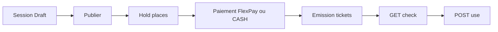

# MODULE 05 — Billetterie événementielle

> Retour : [Document maître](DOCUMENTATION_COMPLETE_INTEGRATION_FRONTEND.md)
>
> Préfixe routes : **`api/events/*`**

---

## Architecture



---

## Permissions

| Permission | Usage |
|------------|-------|
| `Evenement.Session.Read` | Liste / détail sessions |
| `Evenement.Session.Write` | Création, publication |
| `Evenement.Hold.Create` | Réservation temporaire |
| `Evenement.Ticket.Check` | Contrôle entrée |
| `Evenement.Ticket.Use` | Validation entrée |

---

## Classes (`api/events/classes`)

| Méthode | Route |
|---------|-------|
| GET | `/api/events/classes` |
| GET | `/api/events/classes/societe/{idSociete}` |
| GET | `/api/events/classes/by-libelle?libelle=&idSociete=` |
| GET | `/api/events/classes/{id}` |
| POST | `/api/events/classes` |
| PUT | `/api/events/classes/{id}` |
| PUT | `/api/events/classes/{id}/toggle-statut` |

---

## Sessions (`api/events/sessions`)

| Méthode | Route | Description |
|---------|-------|-------------|
| GET | `/api/events/sessions` | Liste (filtres `status`, `inventoryMode`) |
| GET | `/api/events/sessions/{id}` | Détail |
| GET | `/api/events/sessions/code/{codeSession}` | Par code |
| GET | `/api/events/sessions/{id}/availability` | Places disponibles |
| POST | `/api/events/sessions` | Créer (Draft) |
| PUT | `/api/events/sessions/{id}/publish` | Publier |
| POST | `/api/events/sessions/{id}/holds` | Hold temporaire |

`inventoryMode` : `GlobalQuota`, `ClassQuota`, `SeatNumbered`.

---

## Réservations (`api/events/reservations`)

| Méthode | Route |
|---------|-------|
| GET | `/api/events/reservations` |
| GET | `/api/events/reservations/{id}` |
| GET | `/api/events/reservations/{id}/tickets` |
| GET | `/api/events/reservations/reference/{reference}` |
| POST | `/api/events/reservations/{id}/confirm-payment` | Paiement CASH |
| POST | `/api/events/reservations/{id}/initiate-flexpay` | FlexPay |
| POST | `/api/events/reservations/{id}/cancel` | Annulation |

---

## Tickets (`api/events/tickets`)

| Méthode | Route |
|---------|-------|
| GET | `/api/events/tickets` |
| GET | `/api/events/tickets/{id}` |
| GET | `/api/events/tickets/code/{ticketCode}` |
| GET | `/api/events/tickets/{ticketCode}/check` | Contrôle entrée |
| POST | `/api/events/tickets/{ticketCode}/use` | Valider entrée |

Check ticket : structure inspirée du transport (`statut`, `message`, identité passager).

---

## FlexPay événement (`api/events/flexpay`)

| Méthode | Route |
|---------|-------|
| POST | `/api/events/flexpay/callback` | Webhook (backend) |
| GET | `/api/events/flexpay/verifier/{orderNumber}` | Polling client |

---

## Dashboard événement

```
GET /api/events/dashboard?idSociete=&dateDebut=&dateFin=
GET /api/events/dashboard/super-admin
```

---

## Parcours client Flutter (événement)

```dart
// 1. Lister sessions publiées
final sessions = await api.get('/events/sessions', queryParameters: {'status': 'Published'});

// 2. Hold
final hold = await api.post('/events/sessions/${sessionId}/holds', data: { /* lignes */ });

// 3. FlexPay
final pay = await api.post('/events/reservations/${resId}/initiate-flexpay', data: { /* */ });

// 4. Vérifier
final ok = await api.get('/events/flexpay/verifier/${orderNumber}');

// 5. Scan entrée
final check = await api.get('/events/tickets/$ticketCode/check');
```

---

## Références backend

- [`DOCUMENTATION_API_SESSIONS_EVENEMENT_V1.md`](../05_transport_sync/DOCUMENTATION_API_SESSIONS_EVENEMENT_V1.md)
- [`DOCUMENTATION_API_CLASSES_EVENEMENT_V1.md`](../05_transport_sync/DOCUMENTATION_API_CLASSES_EVENEMENT_V1.md)
- [`DOCUMENTATION_API_RESERVATIONS_EVENEMENT_V1.md`](../05_transport_sync/DOCUMENTATION_API_RESERVATIONS_EVENEMENT_V1.md)
- [`DOCUMENTATION_API_TICKETS_EVENEMENT_V1.md`](../05_transport_sync/DOCUMENTATION_API_TICKETS_EVENEMENT_V1.md)
- [`DOCUMENTATION_FLEXPAY_EVENEMENT_V1.md`](../05_transport_sync/DOCUMENTATION_FLEXPAY_EVENEMENT_V1.md)
- [`DOCUMENTATION_DASHBOARD_EVENEMENT_V1.md`](../05_transport_sync/DOCUMENTATION_DASHBOARD_EVENEMENT_V1.md)
