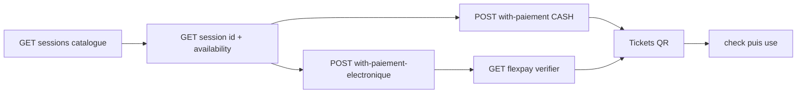
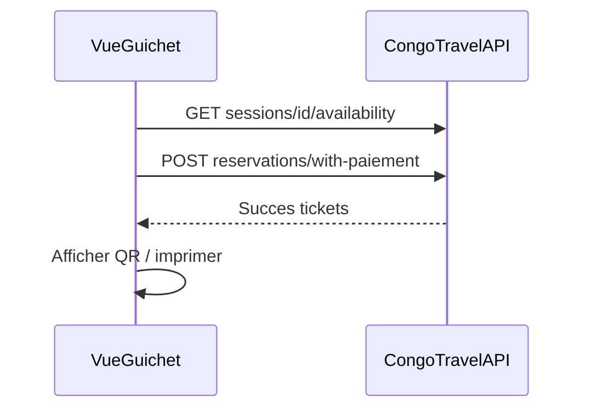
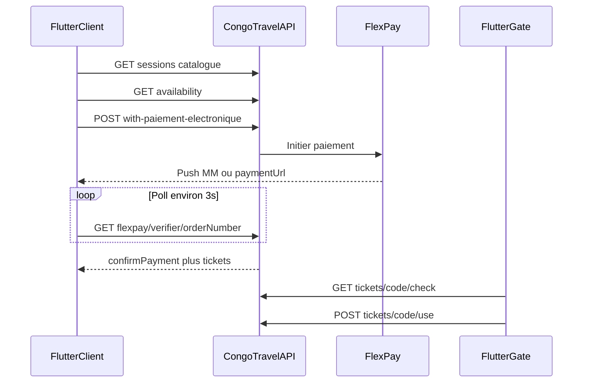

# MODULE 05 — Billetterie événementielle (intégration Vue.js + Flutter)

> Retour : [Document maître](DOCUMENTATION_COMPLETE_INTEGRATION_FRONTEND.md)
>
> Préfixe routes : **`/api/events/*`**
>
> Module **autonome** du transport : ne pas réutiliser `/api/FlexPay/*` ni les DTOs `Reservation` / `Billet` transport.

Ce guide permet de brancher :

- **Vue 3** — back-office société (admin / guichet)
- **Flutter** — app client voyageur + contrôle d’entrée agent

---

## 1. Architecture (parcours actuel)



| Étape | Endpoint | Rôle front |
|-------|----------|------------|
| Catalogue | `GET /events/sessions` | Cartes (photo, prix, société) |
| Détail | `GET /events/sessions/{id}` | Inventaire + photos |
| Dispo | `GET /events/sessions/{id}/availability` | Sélection places |
| Achat CASH | `POST /events/reservations/with-paiement` | Guichet Vue |
| Achat FlexPay | `POST /events/reservations/with-paiement-electronique` | Client Flutter / caisse |
| Polling | `GET /events/flexpay/verifier/{orderNumber}` | Attente paiement |
| Tickets | `GET /events/reservations/{id}/tickets` | Affichage QR |
| Entrée | `GET .../tickets/{code}/check` → `POST .../use` | Gate Flutter |

**Plus d’endpoints legacy** `holds` / `confirm-payment` / `initiate-flexpay` : tout passe par les 2 façades.

---

## 2. Personas et écrans

| Persona | Stack | Écrans | Permissions |
|---------|-------|--------|-------------|
| Admin / guichet | Vue 3 + Axios + Pinia | Classes, Sessions Draft→Publish, Guichet vente, Réservations, Dashboard | `Evenement.Session.*`, `Hold.Create`, `Reservation.Confirm`, `Dashboard.Read` |
| Client voyageur | Flutter + Dio | Catalogue, détail, panier items, FlexPay, mes tickets QR | `Session.Read`, `Hold.Create`, `Reservation.Confirm` |
| Contrôle entrée | Flutter (agent) | Scan QR → check → use | `Ticket.Check`, `Ticket.Use` |

Guards : [MODULE_01_AUTH_ET_PERMISSIONS.md](MODULE_01_AUTH_ET_PERMISSIONS.md).

---

## 3. Permissions

| Permission | Usage front |
|------------|-------------|
| `Evenement.Session.Read` | Listes / détails sessions, classes, réservations, tickets |
| `Evenement.Session.Write` | CRUD classes, créer/publier sessions, photos write |
| `Evenement.Hold.Create` | **Obligatoire** avec Confirm pour les 2 POST achat |
| `Evenement.Reservation.Confirm` | Achat + verify FlexPay + cancel |

**Rôle Client (JWT app voyageur)** : doit avoir **`Evenement.Hold.Create`** et **`Evenement.Reservation.Confirm`** pour `POST .../with-paiement-electronique` (sinon **403** corps vide). `Evenement.Session.Read` pour les listes staff ; le catalogue public est souvent `AllowAnonymous`.

| `Evenement.Ticket.Check` / `Use` | Contrôle entrée |
| `Evenement.Dashboard.Read` | Dashboard |

Matrice : [MATRICE_ROLES_PERMISSIONS.md](MATRICE_ROLES_PERMISSIONS.md).

---

## 4. Contrat API pour le front

### 4.1 Catalogue — `GET /api/events/sessions`

- **Anonyme / Client** : sessions `Published` encore en vente (`endAtUtc` futur, ou `startAtUtc + 24h` si pas de fin) toutes sociétés ; `?idSociete=` filtre libre (pas de 403). Sessions **terminées** exclues ; sessions **en cours** restent listées.
- **Staff** : sessions de sa société ; autre `idSociete` → 403.
- **Fenêtre de vente** : hold / CASH / FlexPay autorisés tant que `utcNow < endAtUtc` (ou `startAtUtc + 24h` sans fin) et statut `Published`. Rejet « Vente fermée » après la fin. Même garde à la confirmation (callback FlexPay).
- **Achat Client** (`POST .../with-paiement` / `with-paiement-electronique`) : la réservation est rattachée à la **société organisatrice de la session** (ex. MEDICO), **pas** à `utilisateur.idSociete` du JWT. Un client inscrit sur la société 1 peut donc payer une session Published de la société 12. Le staff guichet reste limité à sa société JWT.
- Champs utiles UI carte :

| Champ | Usage UI |
|-------|----------|
| `libelle`, `startAtUtc` | Titre + date |
| `nomSociete` | Sous-titre organisateur |
| `idSite`, `nomSite` | Site opérationnel ; **préremplir** `paiement.idSite` à l’achat |
| `photoCouverture.photoBase64` | Image (`data:image/...`) ou placeholder si `null` |
| `prixMin`, `prixMax`, `codeDevise` | « À partir de X CDF » / fourchette |
| `inventoryMode`, `idEvenementSession` | Navigation détail |

### 4.2 Détail — `GET /api/events/sessions/{id}`

Même accès Published pour public/Client. Champs supplémentaires typiques :

- `photos[]` (max 3, base64)
- inventaire : `globalQuota` / `classQuotas` / `seats`
- résumé : `placesTotales`, `placesRestantes`, `isSoldOut` (si exposés)
- `prixMin` / `prixMax` / `nomSociete` / `photoCouverture`
- `idSite` / `nomSite` (défaut FlexPay / guichet)

Puis `GET /events/sessions/{id}/availability` pour le stock live avant achat.

### 4.3 Body achat commun

```json
{
  "idEvenementSession": 12,
  "customerRef": "optionnel",
  "idempotencyKey": "uuid-optionnel",
  "items": [],
  "paiement": {}
}
```

**Site** : `paiement.idSite` **ou**, s’il est omis, `session.idSite` (recommandé côté front : préremplir depuis le détail catalogue). Persistant sur `reservation.idSite` et `payment.idSite`.

#### `items[]` selon `inventoryMode`

| Mode | `items` |
|------|---------|
| `GlobalQuota` | `[{ "quantity": 2 }]` |
| `ClassQuota` | `[{ "classId": 3, "quantity": 2 }]` |
| `SeatNumbered` | `[{ "seatId": 101, "quantity": 1 }, …]` (1 item / siège) |

Ids issus du détail / availability.

#### CASH — `POST /api/events/reservations/with-paiement`

```json
{
  "idEvenementSession": 12,
  "customerRef": "GUICHET-42",
  "idClient": 42,
  "idempotencyKey": "cash-001",
  "items": [{ "classId": 3, "quantity": 2 }],
  "paiement": {
    "methodePaiement": "CASH",
    "referenceTransaction": "CAISSE-001"
  }
}
```

`idClient` (optionnel) : client acheteur. S’il est fourni, il prime sur `Utilisateur.IdClient` du JWT ; le client doit exister en base.

Réponse clé :

| Champ | Valeur typique |
|-------|----------------|
| `transactionStatut` | `Succes` |
| `reservation.status` | `CONFIRMED` |
| `payment.status` | `SUCCEEDED` |
| `tickets[]` | billets `ISSUED` (`ticketCode` = QR) |
| `reservation.idUtilisateur` / `reservation.idClient` | JWT + body/`Utilisateur.IdClient` |

#### FlexPay — `POST /api/events/reservations/with-paiement-electronique`

Mobile Money :

```json
{
  "idEvenementSession": 12,
  "customerRef": "243900000001",
  "items": [{ "quantity": 2 }],
  "paiement": {
    "methodePaiement": "MOBILE_MONEY",
    "phone": "243900000001",
    "idSite": 1,
    "codeDevisePaiement": "CDF"
  }
}
```

Carte : `methodePaiement: "CARTE_BANCAIRE"`, pas de `phone`.  
`idSite` : optionnel si la session a déjà un `idSite` ; sinon obligatoire.

Réponse clé :

| Champ | Usage |
|-------|--------|
| `transactionStatut` | `EnAttente` |
| `reservation.status` | `HOLD` |
| `orderNumber` | polling verify |
| `paymentUrl` | WebView si carte |
| `reservationExpiresAtUtc` | compte à rebours hold |
| `flexPayAccepted` | si `false` → afficher `message` |

Puis : `GET /api/events/flexpay/verifier/{orderNumber}` toutes les ~3 s jusqu’à succès / échec / expiration.  
**Ne jamais** appeler `POST /api/events/flexpay/callback` depuis le front.

**SignalR (même events que le transport)** — groupe `user_{idUtilisateur}` :
- `FlexPayPaymentConfirmed` → `{ orderNumber, idReservation, idPaiement, status, timestampUtc }` (`idReservation` = `idEvenementReservation`, `idPaiement` = `idEvenementPayment`)
- `FlexPayPaymentFailed` → `{ orderNumber, message, status, timestampUtc }`

Réutiliser les handlers transport. Continuer le poll verifier en secours (callback / push peuvent arriver dans n’importe quel ordre).  
Sur `paymentPending: false` sans confirmation (refus, cancel, hold expiré) → sortir du pending et proposer un nouvel achat.

| Événement SignalR | Quand |
|-------------------|--------|
| `FlexPayPaymentConfirmed` | Paiement OK (callback / verifier) |
| `FlexPayPaymentFailed` | Refus FlexPay **ou** hold expiré (job serveur) |

**Guide dédié (Vue + Flutter)** : [INTEGRATION_SIGNALR_EVENEMENT_FLEXPAY.md](INTEGRATION_SIGNALR_EVENEMENT_FLEXPAY.md) — connexion hub, mapping IDs, exemples web/mobile, poll secours, checklist.

**Annulation / expiration (même pattern que Confirm, sans POST Flutter obligatoire en MM)** :
- **Succès** : SignalR `FlexPayPaymentConfirmed` + statut succès (déjà en place).
- **Refus FlexPay** (`callback code ≠ 0`) : `FAILED` + HOLD libéré + SignalR `FlexPayPaymentFailed`.
- **Hold expiré** (job serveur) : résa `EXPIRED`, FlexPay `PENDING`→`FAILED`, SignalR Failed (« Hold expiré… »). En MM, FlexPay n’appelle en général **pas** `cancel_url` : c’est le chemin principal si le client refuse sans callback d’échec.
- Poll `verifier` = **secours** (comme pour le succès) → `paymentPending: false` + message.
- `POST /api/events/reservations/{id}/cancel` = **optionnel** (annulation anticipée dans l’app) → `CANCELLED` + FAILED + SignalR Failed. **Pas** obligatoire en MM.
- Ne **pas** exiger `GET .../flexpay/cancel` pour le MM.
- **Carte** (redirections FlexPay, sans JWT) :
  - `GET /api/events/flexpay/cancel?orderNumber=` → FAILED + HOLD libéré (« Paiement annulé. »)
  - `GET /api/events/flexpay/decline?orderNumber=` → idem (« Paiement refusé. »)
  - `GET .../approve` reste informatif ; la confirmation réelle vient du callback / verifier.

### 4.4 Erreurs UI

| Situation | HTTP / signal | Comportement |
|-----------|---------------|--------------|
| Stock insuffisant | 409 | Message + recharger availability |
| Hold / paiement expiré | verify / message | Proposer un nouvel achat |
| FlexPay déjà en cours | `PENDING` | Continuer le poll, ne pas relancer |
| Verify encore pending | `statusOnly.paymentPending` | Attendre ~3 s |
| Ticket déjà utilisé | `entreeAutorisee: false` | Bloquer `use` |
| Hors fenêtre entrée | `statut: HorsFenetre` | Afficher `message` (heure d’ouverture UTC) |
| Permission manquante | 403 | Masquer l’action / écran forbidden |

### 4.5 Contrôle d’entrée — fenêtre horaire

- **Ouverture** : `startAtUtc − heuresOuvertureEntreeEvenementAvantDebut` (config société, **défaut 3 h**).
- **Fermeture** : `endAtUtc` si renseigné, sinon `startAtUtc + 24 h`.
- Config : `GET/PUT` config société → champ `heuresOuvertureEntreeEvenementAvantDebut` (0–72). Valeur `0` = ouverture exactement à `startAtUtc`.

**Fuseau (Kinshasa = UTC+1, sans heure d’été)** : `startAtUtc` / `endAtUtc` sont des instants **UTC**. Le picker back-office doit convertir l’heure locale avant envoi, ex. 18:00 Kinshasa → `"2026-08-01T17:00:00Z"`. Envoyer 18:00 sans `Z`/offset comme si c’était UTC provoque ~**1 h** de décalage à la porte.

---

## 5. Référence rapide des routes

### Classes — `api/events/classes`

`GET /`, `GET /societe/{id}`, `GET /by-libelle`, `GET /{id}`, `POST /`, `PUT /{id}`, `PUT /{id}/toggle-statut`

### Sessions — `api/events/sessions`

| Méthode | Route |
|---------|-------|
| GET | `/` catalogue / liste société |
| GET | `/{id}`, `/code/{code}`, `/{id}/availability`, `/{id}/photos` |
| POST | `/` Draft (+ `photos` optionnel) |
| PUT | `/{id}/publish` |
| POST/PUT/DELETE | photos write (permissions Write) |

### Réservations — `api/events/reservations`

| Méthode | Route |
|---------|-------|
| POST | `/with-paiement`, `/with-paiement-electronique` |
| GET | `/`, `/{id}`, `/{id}/tickets`, `/reference/{ref}`, … |
| POST | `/{id}/cancel` |

### Tickets — `api/events/tickets`

`GET /{ticketCode}/check`, `POST /{ticketCode}/use`, listes lecture.

### FlexPay / Dashboard

- `GET /api/events/flexpay/verifier/{orderNumber}` — poll JWT
- `POST /api/events/flexpay/abandon/{orderNumber}` — abandon JWT (bouton Annuler app / MM)
- `GET /api/events/flexpay/cancel?orderNumber=` / `decline?orderNumber=` — redirects carte (FAILED + HOLD)
- `GET /api/events/flexpay/approve?orderNumber=` — informatif seulement
- SignalR `FlexPayPaymentConfirmed` / `FlexPayPaymentFailed` (groupe `user_{id}`)
- `GET /api/events/dashboard?month=yyyy-MM`

---

## 6. Intégration Vue.js (back-office)

Stack : Vue 3, Vue Router, Pinia, Axios — client décrit dans le [document maître](DOCUMENTATION_COMPLETE_INTEGRATION_FRONTEND.md).

### 6.1 Checklist écrans

1. **Classes** — CRUD + toggle  
2. **Sessions** — formulaire Draft selon `inventoryMode` → publish + photos  
3. **Guichet** — availability → builder `items` → CASH ou FlexPay  
4. **Réservations / tickets** — filtres statut / session  
5. **Dashboard** — KPIs  
6. **Gate (optionnel)** — saisie code → check → use  

### 6.2 État Pinia (guichet) — suggestion

```js
// stores/evenementGuichet.js
export const useEvenementGuichetStore = defineStore('evenementGuichet', {
  state: () => ({
    sessionId: null,
    inventoryMode: null,
    availability: null,
    items: [],          // construit selon inventoryMode
    lastSale: null,     // réponse with-paiement
    flexPayPending: null, // { orderNumber, expiresAtUtc, reservationId }
  }),
});
```

### 6.3 Axios — publication session

```js
await api.get('/events/classes');
await api.post('/events/classes', { codeClasse: 'VIP', libelle: 'VIP', statut: true });

const { data: session } = await api.post('/events/sessions', {
  codeSession: 'CONCERT-20H',
  libelle: 'Concert 20h',
  idSite: siteId, // obligatoire — site de la société
  startAtUtc: '2026-08-01T19:00:00Z',
  inventoryMode: 'ClassQuota',
  classQuotas: [/* selon contrat CreateSession */],
});
await api.put(`/events/sessions/${session.idEvenementSession}/publish`);
```

### 6.4 Axios — guichet CASH

```js
const sessionId = 12;
const { data: session } = await api.get(`/events/sessions/${sessionId}`);
const { data: avail } = await api.get(`/events/sessions/${sessionId}/availability`);

const { data } = await api.post('/events/reservations/with-paiement', {
  idEvenementSession: sessionId,
  customerRef: 'GUICHET-42',
  idempotencyKey: crypto.randomUUID(),
  items: [{ classId: 3, quantity: 2 }],
  paiement: {
    methodePaiement: 'CASH',
    referenceTransaction: 'CAISSE-001',
    idSite: session.idSite, // optionnel si déjà sur la session
    idempotencyKey: crypto.randomUUID(),
  },
});

// Afficher data.tickets[].ticketCode (QR / impression)
// data.transactionStatut === 'Succes'
```

### 6.5 Axios — FlexPay en caisse

```js
const { data: init } = await api.post('/events/reservations/with-paiement-electronique', {
  idEvenementSession: sessionId,
  items: [{ classId: 3, quantity: 2 }],
  paiement: {
    methodePaiement: 'MOBILE_MONEY',
    phone: '243900000001',
    idSite: 1,
    codeDevisePaiement: 'CDF',
    idempotencyKey: crypto.randomUUID(),
  },
});

if (!init.flexPayAccepted) {
  alert(init.message);
} else if (init.paymentUrl) {
  window.open(init.paymentUrl, '_blank');
} else {
  // Message : « Validez sur le téléphone »
}

async function pollFlexPayEvent(orderNumber, expiresAtUtc) {
  const deadline = new Date(expiresAtUtc).getTime() + 60_000;
  while (Date.now() < deadline) {
    const { data } = await api.get(`/events/flexpay/verifier/${orderNumber}`);
    // Succès : DTO confirm à la racine
    if (data.reservation && data.payment) return data;
    if (data.paymentPending === true) {
      await new Promise((r) => setTimeout(r, 3000));
      continue;
    }
    throw new Error(data.message || 'Paiement échoué');
  }
  throw new Error('Hold expiré');
}

const confirmed = await pollFlexPayEvent(init.orderNumber, init.reservationExpiresAtUtc);
// confirmed.reservation.tickets ou GET /events/reservations/{id}/tickets
```

### 6.6 Dashboard

```js
const { data } = await api.get('/events/dashboard', {
  params: { month: '2026-07' }, // Super-Admin : idSociete=
});
```

### 6.7 Séquence Vue — guichet CASH



---

## 7. Intégration Flutter (mobile)

Stack : Flutter, Dio, `flutter_secure_storage`, `mobile_scanner` — Dio : [document maître](DOCUMENTATION_COMPLETE_INTEGRATION_FRONTEND.md).

### 7.A Client voyageur — mapping UI catalogue

| Widget carte | Champ API |
|--------------|-----------|
| Image | `photoCouverture?.photoBase64` |
| Titre | `libelle` |
| Organisateur | `nomSociete` |
| Prix | `prixMin`–`prixMax` + `codeDevise` |
| Site (achat) | `idSite` → `paiement.idSite` |
| Tap | → détail `idEvenementSession` |

### 7.B Flux achat FlexPay

1. `GET /events/sessions`  
2. `GET /events/sessions/{id}` + `.../availability`  
3. Construire `items` selon `inventoryMode`  
4. `POST /events/reservations/with-paiement-electronique`  
5. Si `paymentUrl` → WebView ; sinon écran « validez sur le téléphone »  
6. Poll `GET /events/flexpay/verifier/{orderNumber}` (~3 s) **et** écouter SignalR `FlexPayPaymentConfirmed` / `Failed` — **pas** `/api/FlexPay/verifier/...`  
7. Afficher QR : `ticketCode` via `GET /events/reservations/{id}/tickets`

```dart
final sessions = await api.get('/events/sessions');
final avail = await api.get('/events/sessions/$sessionId/availability');

final initRes = await api.post(
  '/events/reservations/with-paiement-electronique',
  data: {
    'idEvenementSession': sessionId,
    'customerRef': phone,
    'idempotencyKey': idempotencyKey,
    'items': [
      {'classId': classId, 'quantity': qty},
    ],
    'paiement': {
      'methodePaiement': 'MOBILE_MONEY',
      'phone': phone,
      // idSite omis → défaut session.idSite (ou passer session['idSite'])
      'codeDevisePaiement': 'CDF',
      'idempotencyKey': payIdempotencyKey,
    },
  },
);

final init = initRes.data as Map<String, dynamic>;
final reservationId = init['reservation']['idEvenementReservation'] as int;
final orderNumber = init['orderNumber'] as String;
final paymentUrl = init['paymentUrl'] as String?;
final expiresAt = DateTime.parse(init['reservationExpiresAtUtc'] as String);
// paymentUrl != null → WebView ; sinon message push MM
// hub.on('FlexPayPaymentConfirmed') / Failed — mêmes handlers que transport

Future<Map<String, dynamic>> pollFlexPayEvent(
  String orderNumber,
  DateTime expiresAt,
) async {
  while (DateTime.now().toUtc().isBefore(expiresAt.toUtc().add(const Duration(minutes: 1)))) {
    final res = await api.get('/events/flexpay/verifier/$orderNumber');
    final data = res.data as Map<String, dynamic>;
    // Succès : corps = DTO confirm (reservation + payment + tickets)
    if (data['reservation'] != null && data['payment'] != null) {
      return data;
    }
    // Pending / échec / hold expiré : EvenementFlexPayCallbackProcessResultDto
    if (data['paymentPending'] == true) {
      await Future<void>.delayed(const Duration(seconds: 3));
      continue;
    }
    throw Exception(data['message'] ?? 'Paiement échoué');
  }
  throw Exception('Hold expiré');
}

final confirmed = await pollFlexPayEvent(orderNumber, expiresAt);
final tickets = await api.get('/events/reservations/$reservationId/tickets');
// Afficher QRCode(data: ticket['ticketCode'])
```

### 7.C Contrôle entrée (agent)

Fenêtre : ouverture **N heures avant** `startAtUtc` (config `heuresOuvertureEntreeEvenementAvantDebut`, défaut 3).  
Champs utiles de `GET /events/tickets/{ticketCode}/check` :

| Champ | Usage |
|-------|--------|
| `entreeAutorisee` | Si `false` → ne pas appeler `use` |
| `statut` | `Valide`, `DejaUtilise`, `Invalide`, … |
| `message` | Feedback agent |

```dart
final check = await api.get('/events/tickets/$ticketCode/check');
final c = check.data as Map<String, dynamic>;

if (c['entreeAutorisee'] != true) {
  // Afficher c['statut'] + c['message']
  return;
}

await api.post('/events/tickets/$ticketCode/use');
```

### 7.D Séquences



---

## 8. Références

### Frontend

- [DOCUMENTATION_COMPLETE_INTEGRATION_FRONTEND.md](DOCUMENTATION_COMPLETE_INTEGRATION_FRONTEND.md) — auth, Axios/Dio, personas
- [MODULE_01_AUTH_ET_PERMISSIONS.md](MODULE_01_AUTH_ET_PERMISSIONS.md) — guards
- [MODULE_04_PAIEMENT_FLEXPAY.md](MODULE_04_PAIEMENT_FLEXPAY.md) — FlexPay **transport** (ne pas mélanger)
- [INTEGRATION_SIGNALR_EVENEMENT_FLEXPAY.md](INTEGRATION_SIGNALR_EVENEMENT_FLEXPAY.md) — SignalR paiement événement (web + mobile)
- [MATRICE_ROLES_PERMISSIONS.md](MATRICE_ROLES_PERMISSIONS.md)

### Backend événement

- [`DOCUMENTATION_API_SESSIONS_EVENEMENT_V1.md`](../05_transport_sync/DOCUMENTATION_API_SESSIONS_EVENEMENT_V1.md)
- [`DOCUMENTATION_API_CLASSES_EVENEMENT_V1.md`](../05_transport_sync/DOCUMENTATION_API_CLASSES_EVENEMENT_V1.md)
- [`DOCUMENTATION_API_RESERVATIONS_EVENEMENT_V1.md`](../05_transport_sync/DOCUMENTATION_API_RESERVATIONS_EVENEMENT_V1.md)
- [`DOCUMENTATION_API_TICKETS_EVENEMENT_V1.md`](../05_transport_sync/DOCUMENTATION_API_TICKETS_EVENEMENT_V1.md)
- [`DOCUMENTATION_FLEXPAY_EVENEMENT_V1.md`](../05_transport_sync/DOCUMENTATION_FLEXPAY_EVENEMENT_V1.md)
- [`DOCUMENTATION_DASHBOARD_EVENEMENT_V1.md`](../05_transport_sync/DOCUMENTATION_DASHBOARD_EVENEMENT_V1.md)
