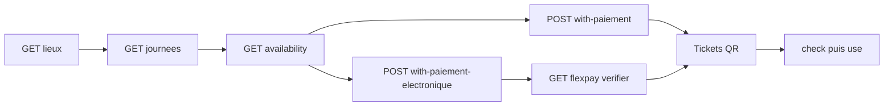

# MODULE 10 — Site Touristique (intégration Vue.js + Flutter)

> Retour : [Document maître](DOCUMENTATION_COMPLETE_INTEGRATION_FRONTEND.md)
>
> Préfixe routes : **`/api/sites-touristiques/*`**
>
> Module **autonome** : ne pas réutiliser `/api/FlexPay/*`, `/api/events/*`, ni les DTOs Transport / Evenement.
>
> Workflow métier complet : [DOCUMENTATION_WORKFLOW_SITE_TOURISTIQUE_V1.md](../05_transport_sync/DOCUMENTATION_WORKFLOW_SITE_TOURISTIQUE_V1.md)  
> Analyse backend : [ANALYSE_V1_SITE_TOURISTIQUE.md](../11_analyses_plans/ANALYSE_V1_SITE_TOURISTIQUE.md)  
> Pattern SignalR (adapter les routes) : [INTEGRATION_SIGNALR_EVENEMENT_FLEXPAY.md](INTEGRATION_SIGNALR_EVENEMENT_FLEXPAY.md)  
> Déploiement SQL : [`Scripts/README_DEPLOIEMENT_SITE_TOURISTIQUE_V1.md`](../../../Scripts/README_DEPLOIEMENT_SITE_TOURISTIQUE_V1.md)
>
> **Photos** : préférer [`MODULE_13_PHOTOS_STOCKAGE_S3.md`](MODULE_13_PHOTOS_STOCKAGE_S3.md) + [`INTEGRATION_PHOTOS_S3_VUE_FLUTTER.md`](INTEGRATION_PHOTOS_S3_VUE_FLUTTER.md) (`photoUrl` + multipart). `photos[]` base64 à la création = **legacy déprécié**.

Ce guide permet de brancher :

- **Vue 3** — back-office société (admin / guichet)
- **Flutter** — app client + contrôle d’entrée agent

### Prérequis permissions (évite 403 Admin / Gerant / Caissier / Client)

Sur une base **déjà peuplée**, exécuter  
[`assign_site_touristique_permissions_admin_gerant.sql`](../../../Scripts/assign_site_touristique_permissions_admin_gerant.sql)  
avant les appels Write (Admin/Gerant) ou vente / gate (Client : achat ; Caissier : vente + `Ticket.Check` / `Ticket.Use`).  
Diagnostic : [`diagnostic_permissions_site_touristique_restaurant.sql`](../../../Scripts/diagnostic_permissions_site_touristique_restaurant.sql).

---

## 0. Glossaire critique

| Champ / terme | Signification |
|---------------|---------------|
| `idSiteTouristique` | **Produit** : lieu / attraction |
| `idSite` | **Guichet marchand** FlexPay / caisse (entité plateforme `Site`) |
| `idSiteTouristiqueJournee` | Journée de visite sellable (date) |
| `idSiteTouristiquePlanification` | Template de calendrier (admin) |
| `idReservation` (SignalR) | = `idSiteTouristiqueReservation` |

---

## 1. Architecture parcours client



| Étape | Endpoint |
|-------|----------|
| Catalogue lieux | `GET /api/sites-touristiques/lieux` |
| Journées | `GET /api/sites-touristiques/journees` |
| Détail | `GET /api/sites-touristiques/journees/{id}` |
| Dispo | `GET /api/sites-touristiques/journees/{id}/availability` |
| Achat CASH | `POST /api/sites-touristiques/reservations/with-paiement` |
| Achat FlexPay | `POST /api/sites-touristiques/reservations/with-paiement-electronique` |
| Poll | `GET /api/sites-touristiques/flexpay/verifier/{orderNumber}` |
| Liste résas | `GET /api/sites-touristiques/reservations` — défaut **CONFIRMED** ; `?status=ALL` pour HOLD/CANCELLED/EXPIRED ; abandon/expiration FlexPay **supprime** la résa jamais confirmée |
| Tickets | `GET /api/sites-touristiques/reservations/{id}/tickets` |
| Entrée | `GET .../tickets/{code}/check` → `POST .../use` |

**Façades uniquement** pour l’achat (pas d’endpoints hold/confirm séparés côté front).

---

## 2. Personas et écrans

| Persona | Stack | Écrans | Permissions |
|---------|-------|--------|-------------|
| Admin / guichet | Vue 3 + Axios + Pinia | Lieux, classes, planifications→générer, publish journées, vente CASH, résas, dashboard | `Lieu.*`, `Classe.*`, `Hold.Create`, `Reservation.Confirm`, `Dashboard.Read` |
| Client voyageur | Flutter + Dio | Catalogue lieux/journées, panier items, FlexPay, mes tickets QR | `Lieu.Read`, `Hold.Create`, `Reservation.Confirm` |
| Contrôle entrée | Flutter (agent) | Scan QR → check → use | `Ticket.Check`, `Ticket.Use` |

Guards : [MODULE_01_AUTH_ET_PERMISSIONS.md](MODULE_01_AUTH_ET_PERMISSIONS.md).

---

## 3. Permissions

| Permission | Usage front |
|------------|-------------|
| `SiteTouristique.Lieu.Read` | Listes lieux / journées / planifs / résas |
| `SiteTouristique.Lieu.Write` | CRUD lieu, journée, planification, `/generer`, publish |
| `SiteTouristique.Classe.Read` / `.Write` | Mode B |
| `SiteTouristique.Hold.Create` | **Obligatoire** avec Confirm pour les 2 POST achat |
| `SiteTouristique.Reservation.Confirm` | Achat + verify FlexPay + cancel |
| `SiteTouristique.Ticket.Check` / `.Use` | Gate |
| `SiteTouristique.Dashboard.Read` | Dashboard |

**Rôle Client** : `Lieu.Read` + `Hold.Create` + `Reservation.Confirm` (sinon **403** sur achat électronique).

Matrice : [MATRICE_ROLES_PERMISSIONS.md](MATRICE_ROLES_PERMISSIONS.md).

---

## 4. Contrat API — configuration (Vue admin)

### 4.1 Créer / publier un lieu

```json
POST /api/sites-touristiques/lieux
{
  "codeLieu": "PARC-01",
  "nom": "Parc National",
  "description": "Visite journalière",
  "province": "Kinshasa",
  "ville": "Mont Ngafula",
  "adresse": "Route de Kasangulu",
  "telephone": "+243810000001",
  "heureOuverture": "08:00:00",
  "heureFermeture": "17:30:00",
  "jourOuverture": "Lun-Dim",
  "idSite": 1,
  "photos": [
    { "photoBase64": "<base64 ou data-URL>", "fileName": "cover.jpg", "ordre": 1 }
  ]
}
```

Puis : `PUT /api/sites-touristiques/lieux/{id}/publish`.

`idSite` = guichet FlexPay / caisse de la société.

**Fiche lieu (list / detail)** expose aussi : `province`, `ville`, `adresse`, `telephone`, `heureOuverture`, `heureFermeture`, `jourOuverture`, `photoCouverture`, `photos[]`.

| Champ | Règle |
|-------|--------|
| Localisation / téléphone | Optionnels ; chaînes vides → `null` |
| `heureOuverture` / `heureFermeture` | `TimeOnly` JSON `"HH:mm:ss"` ; si les deux sont renseignées, `heureFermeture` doit être **strictement** après `heureOuverture` |
| `jourOuverture` | Texte libre (ex. `Lun-Dim`), max 100 |
| Photos | Max **3** ; afficher `photoUrl` (pas data-URL par défaut) — [MODULE_13](MODULE_13_PHOTOS_STOCKAGE_S3.md) |

**CRUD photos** (après création ; préférer multipart, voir [guide S3](INTEGRATION_PHOTOS_S3_VUE_FLUTTER.md)) :

| Méthode | Route |
|---------|-------|
| GET | `/api/sites-touristiques/lieux/{id}/photos` |
| GET | `/api/sites-touristiques/lieux/{id}/photos/{photoId}/content` |
| POST | `/api/sites-touristiques/lieux/{id}/photos` (JSON legacy **ou** multipart) |
| PUT | `/api/sites-touristiques/lieux/{id}/photos` (replace-all multipart) |
| PUT | `/api/sites-touristiques/lieux/{id}/photos/{photoId}/ordre` |
| DELETE | `/api/sites-touristiques/lieux/{id}/photos/{photoId}` |

Update lieu : `PUT /api/sites-touristiques/lieux/{id}` avec `nom`, `description`, localisation, horaires, `idSite?` (pas de `codeLieu`).

Changelog journée : [CHANGELOG_2026-08-15_RESTAURANT_ET_SITE_TOURISTIQUE.md](CHANGELOG_2026-08-15_RESTAURANT_ET_SITE_TOURISTIQUE.md).

### 4.2 Classes (Mode B)

```json
POST /api/sites-touristiques/classes
{
  "libelle": "Adulte",
  "code": "ADL"
}
```

### 4.3 Planification + génération

```json
POST /api/sites-touristiques/planifications
{
  "libelle": "Ouverture lun-sam",
  "idSiteTouristique": 1,
  "joursSemaine": [1, 2, 3, 4, 5, 6],
  "inventoryMode": "GlobalQuota",
  "codeDevise": "CDF",
  "statut": true,
  "globalQuota": {
    "capaciteTotale": 200,
    "prixUnitaire": 5000
  }
}
```

`ClassQuota` : `inventoryMode: "ClassQuota"` + `classQuotas: [{ "idSiteTouristiqueClasse", "capaciteTotale", "prixUnitaire" }]`.

Générer (Draft uniquement, défaut) :

```json
POST /api/sites-touristiques/planifications/{id}/generer
{
  "mode": "MoisCourant"
}
```

ou

```json
{
  "mode": "PeriodePersonnalisee",
  "dateDebut": "2026-09-01",
  "dateFin": "2026-09-30"
}
```

Générer **et publier** chaque journée créée (opt-in) :

```json
{
  "mode": "MoisCourant",
  "publierApresGeneration": true
}
```

Réponse : `resume.creees` / `publiees` / `ignorees` / `echecs` + `details[]` (`publiee`, `message` si publish échoue).  
Sans flag : journées **Draft** → boucle admin `PUT /api/sites-touristiques/journees/{id}/publish`.  
Avec flag : lieu doit être **Published**, sinon create Draft + `publiee: false`.

Modifier le template (`PUT`) **ne change pas** les journées déjà créées.

### 4.4 Journée manuelle (ponctuelle)

```json
POST /api/sites-touristiques/journees
{
  "idSiteTouristique": 1,
  "dateVisite": "2026-09-15",
  "inventoryMode": "GlobalQuota",
  "codeDevise": "CDF",
  "globalQuota": { "capaciteTotale": 100, "prixUnitaire": 5000 }
}
```

`dateVisite` : format **`yyyy-MM-dd`** (ex. `"2026-09-15"`). Éviter `15/09/2026` ou un objet date.  
Si Swagger renvoie `$.dateVisite` + « The request field is required », le body n’a pas été désérialisé (souvent la date) — corriger le format puis réessayer.

Puis publish.

#### Modifier une journée (`PUT /api/sites-touristiques/journees/{id}`)

Permission : `SiteTouristique.Lieu.Write`. `idSiteTouristique` et `inventoryMode` sont **immuables** après création.

| Statut | Autorisé | Interdit |
|--------|----------|----------|
| **Draft** | `dateVisite`, `codeDevise`, `salesOpenAtUtc` / `salesCloseAtUtc`, quotas/prix | Changer lieu ou mode inventaire |
| **Published** | Fenêtres de vente ; capacité/prix **si aucune vente active** (HOLD/CONFIRMED) | Date, devise ; inventaire s’il y a des ventes → **409** |
| **Closed / Cancelled** | — | **400** |

```json
PUT /api/sites-touristiques/journees/10
{
  "dateVisite": "2026-09-20",
  "codeDevise": "CDF",
  "salesOpenAtUtc": "2026-09-01T08:00:00Z",
  "salesCloseAtUtc": "2026-09-19T20:00:00Z",
  "globalQuota": { "capaciteTotale": 120, "prixUnitaire": 6000 }
}
```

Published — fenêtres seules (toujours OK) :

```json
PUT /api/sites-touristiques/journees/10
{
  "salesOpenAtUtc": "2026-09-01T08:00:00Z",
  "salesCloseAtUtc": "2026-09-19T20:00:00Z"
}
```

#### Supprimer une journée (`DELETE /api/sites-touristiques/journees/{id}`)

Permission : `SiteTouristique.Lieu.Write`. Hard delete (journée + quotas).

| Cas | HTTP |
|-----|------|
| Draft / Published / Closed / Cancelled **sans** HOLD/CONFIRMED, sans commande FlexPay en attente, sans résa historique | **204** |
| HOLD ou CONFIRMED présents | **409** |
| Commande FlexPay en attente | **409** |
| Réservations CANCELLED/EXPIRED encore présentes (FK) | **409** |
| Introuvable / autre société | **404** |

```http
DELETE /api/sites-touristiques/journees/10
```

#### Annuler une journée — soft-delete (`PUT /api/sites-touristiques/journees/{id}/cancel`)

Permission : `SiteTouristique.Lieu.Write`. Passe `status` à **`Cancelled`** (ligne conservée). Les HOLD ouverts expirent naturellement ; les CONFIRMED / tickets restent.

| Depuis | Résultat |
|--------|----------|
| Draft / Published | → Cancelled, **200** |
| Déjà Cancelled | **200** idempotent |
| Closed | **400** |
| Introuvable / autre société | **404** |

```http
PUT /api/sites-touristiques/journees/10/cancel
```

| | Hard `DELETE` | Soft `PUT …/cancel` |
|--|---------------|---------------------|
| Données | Effacées | Conservées (`Cancelled`) |
| Avec ventes | **409** | **OK** |
| Catalogue public | N/A | Retirée (filtre Published) |

#### Clôturer une journée (`PUT /api/sites-touristiques/journees/{id}/close`)

Permission : `SiteTouristique.Lieu.Write`. Passe `status` à **`Closed`** (fin opérationnelle ; pas une annulation). Catalogue / ventes bloqués comme pour `Cancelled`.

| Depuis | Résultat |
|--------|----------|
| Draft / Published | → Closed, **200** |
| Déjà Closed | **200** idempotent |
| Cancelled | **400** |
| Introuvable / autre société | **404** |

```http
PUT /api/sites-touristiques/journees/10/close
```

| | `cancel` | `close` |
|--|----------|---------|
| Sens | Annulation / retrait | Fin de journée opérationnelle |
| Statut | `Cancelled` | `Closed` |
| Depuis l’autre | Closed → cancel **400** | Cancelled → close **400** |

---

## 5. Contrat API — vente (Vue guichet + Flutter)

### 5.1 Catalogue / détail / availability

- `GET /api/sites-touristiques/lieux` — cartes lieux Published (souvent anonyme / Client).
- `GET /api/sites-touristiques/journees` — filtres date / lieu / société.
- `GET /api/sites-touristiques/journees/{id}` — détail + inventaire.
- `GET /api/sites-touristiques/journees/{id}/availability` — stock live avant achat.

Champs UI utiles : `nom`, `dateVisite`, `inventoryMode`, `prixMin`/`prixMax` si exposés, `idSite` guichet pour préremplir le paiement.

Sur la réponse **availability** : `idSociete`, `nomSociete` — préremplir `GET /api/Devise/taux-change?idSociete=...` avant FlexPay cross-devise sans rappeler le détail journée.

**Achat Client** : réservation rattachée à la **société du lieu**, pas à `utilisateur.idSociete` du JWT client (même logique qu’Evenement).

### 5.2 Body achat commun

```json
{
  "idSiteTouristiqueJournee": 10,
  "customerRef": "optionnel",
  "idempotencyKey": "uuid-optionnel",
  "items": [],
  "paiement": {}
}
```

#### `items[]` selon `inventoryMode`

| Mode | `items` |
|------|---------|
| `GlobalQuota` | `[{ "quantity": 2 }]` |
| `ClassQuota` | `[{ "classId": 3, "quantity": 2 }]` |

Ids `classId` issus du détail / availability.

#### CASH — `POST /api/sites-touristiques/reservations/with-paiement`

```json
{
  "idSiteTouristiqueJournee": 10,
  "customerRef": "GUICHET-42",
  "idClient": 42,
  "idempotencyKey": "cash-st-001",
  "items": [{ "quantity": 2 }],
  "paiement": {
    "methodePaiement": "CASH",
    "referenceTransaction": "CAISSE-001",
    "idSite": 1
  }
}
```

`idClient` (optionnel) : client acheteur. S’il est fourni, il prime sur `Utilisateur.IdClient` du JWT ; le client doit exister en base.

| Champ réponse | Valeur typique |
|---------------|----------------|
| `transactionStatut` | `Succes` |
| `reservation.status` | `CONFIRMED` |
| `payment.status` | `SUCCEEDED` |
| `tickets[]` | `ISSUED` (`ticketCode` = QR) |
| `reservation.idUtilisateur` / `reservation.idClient` | JWT + body/`Utilisateur.IdClient` |

#### FlexPay — `POST /api/sites-touristiques/reservations/with-paiement-electronique`

Mobile Money :

```json
{
  "idSiteTouristiqueJournee": 10,
  "customerRef": "243900000001",
  "items": [{ "quantity": 2 }],
  "paiement": {
    "methodePaiement": "MOBILE_MONEY",
    "phone": "243900000001",
    "idSite": 1,
    "codeDevisePaiement": "CDF"
  }
}
```

Carte : `methodePaiement: "CARTE_BANCAIRE"` (pas de `phone`) ; utiliser `paymentUrl` en WebView.

| Champ | Usage |
|-------|--------|
| `transactionStatut` | `EnAttente` |
| `reservation.status` | `EN_ATTENTE_PAIEMENT` (pas de ligne réservation métier avant succès FlexPay) |
| `reservation.idSiteTouristiqueReservation` | `0` (placeholder) |
| Poll / SignalR | via `orderNumber` uniquement |
| `orderNumber` | poll + SignalR |
| `paymentUrl` | WebView carte |
| `reservationExpiresAtUtc` | compte à rebours hold |

**Ne jamais** appeler `POST /api/sites-touristiques/flexpay/callback` depuis le front.

Sur `paymentPending: false` sans confirmation → sortir du pending (refus, cancel, hold expiré).

---

## 6. SignalR FlexPay (Vue + Flutter)

Même hub `/hubs/notifications`, **mêmes noms d’events** que transport / événement :

| Event | Quand |
|-------|--------|
| `FlexPayPaymentConfirmed` | Paiement OK |
| `FlexPayPaymentFailed` | Refus FlexPay **ou** hold expiré (job) |

### Règles front

1. Corréler `payload.orderNumber` avec le pending local.
2. Flag `settled` pour éviter double traitement (push + poll).
3. Store pending : `domain: 'siteTouristique'` (ne pas confondre avec `event` / `transport`).
4. Poll secours : `GET /api/sites-touristiques/flexpay/verifier/{orderNumber}` toutes les **~3 s**.
5. `POST .../reservations/{id}/cancel` = **optionnel** (annulation anticipée MM) ; pas obligatoire.
6. Ne pas traiter `onclose` hub comme échec paiement.

### Exemple Vue (extrait)

```js
connection.on('FlexPayPaymentConfirmed', async (payload) => {
  if (!pending.orderNumber || payload.orderNumber !== pending.orderNumber) return;
  if (pending.settled || pending.domain !== 'siteTouristique') return;
  pending.settled = true;
  const { data } = await api.get(
    `/sites-touristiques/flexpay/verifier/${encodeURIComponent(payload.orderNumber)}`
  );
  onSiteTouristiquePaymentSuccess(data);
});

connection.on('FlexPayPaymentFailed', (payload) => {
  if (!pending.orderNumber || payload.orderNumber !== pending.orderNumber) return;
  if (pending.settled || pending.domain !== 'siteTouristique') return;
  pending.settled = true;
  onSiteTouristiquePaymentFailed(payload.message || 'Paiement échoué');
});
```

### Exemple Flutter (extrait)

```dart
hub.on('FlexPayPaymentConfirmed', (args) async {
  final payload = args![0] as Map;
  if (payload['orderNumber'] != pendingOrder) return;
  if (settled || domain != 'siteTouristique') return;
  settled = true;
  final res = await api.get('/sites-touristiques/flexpay/verifier/$pendingOrder');
  onSuccess(res.data);
});

hub.on('FlexPayPaymentFailed', (args) {
  final payload = args![0] as Map;
  if (payload['orderNumber'] != pendingOrder) return;
  if (settled || domain != 'siteTouristique') return;
  settled = true;
  onFailed(payload['message'] as String? ?? 'Paiement échoué');
});
```

Détail pattern partagé : [INTEGRATION_SIGNALR_EVENEMENT_FLEXPAY.md](INTEGRATION_SIGNALR_EVENEMENT_FLEXPAY.md) — **remplacer** `/events/flexpay` par `/sites-touristiques/flexpay`.

---

## 7. Contrôle d’entrée (Flutter gate)

```text
GET  /api/sites-touristiques/tickets/{ticketCode}/check
POST /api/sites-touristiques/tickets/{ticketCode}/use
```

- Afficher `message` / `entreeAutorisee` selon le DTO check.
- V1 : entrée OK si **jour UTC** = `DateVisite`.
- Après `use` : ticket `USED` — ne plus accepter un second use.

---

## 8. Erreurs UI

| Situation | Signal | Comportement |
|-----------|--------|--------------|
| Stock insuffisant | 409 | Message + recharger availability |
| Hold / paiement expiré | verifier `paymentPending: false` / SignalR Failed | Nouvel achat |
| FlexPay déjà PENDING | `EnAttente` | Continuer poll, ne pas relancer |
| Journee Draft non publiée | 404 / rejet | Admin doit publish |
| Permission manquante | 403 | Masquer l’action |
| Mauvais jour d’entrée | check `entreeAutorisee: false` | Afficher message |

---

## 9. Checklist intégration

### Vue (admin / guichet)

- [ ] CRUD lieu + publish (localisation, horaires, photos max 3)
- [ ] CRUD photos lieu
- [ ] Classes si Mode B
- [ ] Planification → générer → publier journées Draft
- [ ] Vente CASH `with-paiement`
- [ ] (Optionnel) FlexPay guichet + SignalR / poll
- [ ] Dashboard
- [ ] Distinguer `idSite` vs `idSiteTouristique` dans les formulaires

### Flutter (client)

- [ ] Catalogue lieux / journées Published (afficher ville, horaires, cover)
- [ ] Builder `items[]` selon `inventoryMode`
- [ ] `with-paiement-electronique` + SignalR + poll verifier
- [ ] Affichage QR `ticketCode`
- [ ] Ne jamais appeler `/api/events/*` ni `/api/FlexPay/*`

### Flutter (gate)

- [ ] check → use
- [ ] Permissions `Ticket.Check` / `Ticket.Use`

### Tests manuels

1. CASH GlobalQuota → tickets immédiats  
2. FlexPay MM → Confirmed (SignalR ou poll)  
3. Hold expiré sans POST cancel → Failed  
4. Mode B classes  
5. Entrée le jour J OK / hors jour KO  

---

## 10. Référence routes rapide

| Ressource | Préfixe |
|-----------|---------|
| Lieux | `api/sites-touristiques/lieux` |
| Journées | `api/sites-touristiques/journees` |
| Planifications | `api/sites-touristiques/planifications` |
| Classes | `api/sites-touristiques/classes` |
| Réservations | `api/sites-touristiques/reservations` |
| Tickets | `api/sites-touristiques/tickets` |
| FlexPay | `api/sites-touristiques/flexpay` |
| Dashboard | `api/sites-touristiques/dashboard` |

Déploiement SQL : [`Scripts/README_DEPLOIEMENT_SITE_TOURISTIQUE_V1.md`](../../../Scripts/README_DEPLOIEMENT_SITE_TOURISTIQUE_V1.md).
