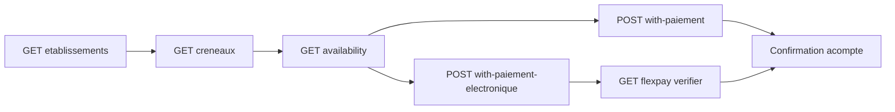

# MODULE 11 — Restaurant (intégration Vue.js + Flutter)

> Retour : [Document maître](DOCUMENTATION_COMPLETE_INTEGRATION_FRONTEND.md)
>
> Préfixe routes : **`/api/restaurants/*`**
>
> Module **autonome** : ne pas réutiliser `/api/FlexPay/*`, `/api/events/*`, `/api/sites-touristiques/*`, ni les DTOs Transport / Evenement / Site Touristique.
>
> Workflow métier : [DOCUMENTATION_WORKFLOW_RESTAURANT_V1.md](../05_transport_sync/DOCUMENTATION_WORKFLOW_RESTAURANT_V1.md)  
> Analyse backend : [ANALYSE_V1_RESTAURANT.md](../11_analyses_plans/ANALYSE_V1_RESTAURANT.md)  
> Pattern SignalR (adapter les routes) : [INTEGRATION_SIGNALR_EVENEMENT_FLEXPAY.md](INTEGRATION_SIGNALR_EVENEMENT_FLEXPAY.md)  
> Déploiement SQL : [`Scripts/README_DEPLOIEMENT_RESTAURANT_V1.md`](../../../Scripts/README_DEPLOIEMENT_RESTAURANT_V1.md)

Ce guide permet de brancher :

- **Vue 3** — back-office société (admin / guichet acompte)
- **Flutter** — app client (réservation + acompte FlexPay)

**V1 : pas de gate QR / check-in salle** (Phase 6+).

### Prérequis permissions (évite 403 Admin / Gerant / Caissier / Client)

Sur une base **déjà peuplée**, exécuter  
[`assign_restaurant_permissions_admin_gerant.sql`](../../../Scripts/assign_restaurant_permissions_admin_gerant.sql)  
avant les appels Write (Admin/Gerant) ou vente d’acompte (Client / Caissier : `Hold.Create` + `Reservation.Confirm`).  
Diagnostic : [`diagnostic_permissions_site_touristique_restaurant.sql`](../../../Scripts/diagnostic_permissions_site_touristique_restaurant.sql).

---

## 0. Glossaire critique

| Champ / terme | Signification |
|---------------|---------------|
| `idRestaurant` | **Établissement** produit (restaurant) |
| `idSite` | **Guichet marchand** FlexPay / caisse (entité plateforme `Site`) |
| `idRestaurantCreneau` | Créneau sellable (date + plage horaire UTC) |
| `idRestaurantZone` | Zone / salle (Mode B ClassQuota) — ex. Terrasse, VIP |
| `idReservation` (SignalR) | = `idRestaurantReservation` |
| Acompte | Montant encaissé à la réservation — **pas** l’addition repas |

Ne pas confondre `idSite` (guichet) avec `idRestaurant` (établissement).

---

## 1. Architecture parcours client



| Étape | Endpoint |
|-------|----------|
| Catalogue établissements | `GET /api/restaurants/etablissements` |
| Créneaux | `GET /api/restaurants/creneaux` |
| Détail | `GET /api/restaurants/creneaux/{id}` |
| Dispo | `GET /api/restaurants/creneaux/{id}/availability` |
| Acompte CASH | `POST /api/restaurants/reservations/with-paiement` |
| Acompte FlexPay | `POST /api/restaurants/reservations/with-paiement-electronique` |
| Poll | `GET /api/restaurants/flexpay/verifier/{orderNumber}` |
| Annulation | `POST /api/restaurants/reservations/{id}/cancel` |

**Façades uniquement** pour l’achat (pas d’endpoints hold/confirm séparés côté front).

---

## 2. Personas et écrans

| Persona | Stack | Écrans | Permissions |
|---------|-------|--------|-------------|
| Admin / guichet | Vue 3 + Axios + Pinia | Établissements, zones, créneaux + publish, vente CASH acompte, résas, dashboard | `Etablissement.*`, `Zone.*`, `Hold.Create`, `Reservation.Confirm`, `Dashboard.Read` |
| Client voyageur | Flutter + Dio | Catalogue restos/créneaux, panier couverts, FlexPay acompte, confirmation | `Etablissement.Read`, `Hold.Create`, `Reservation.Confirm` |

**Pas de persona gate V1.**

Guards : [MODULE_01_AUTH_ET_PERMISSIONS.md](MODULE_01_AUTH_ET_PERMISSIONS.md).

---

## 3. Permissions

| Permission | Usage front |
|------------|-------------|
| `Restaurant.Etablissement.Read` | Listes établissements / créneaux / résas |
| `Restaurant.Etablissement.Write` | CRUD établissement, créneau, publish |
| `Restaurant.Zone.Read` / `.Write` | Mode B (zones) |
| `Restaurant.Hold.Create` | **Obligatoire** avec Confirm pour les 2 POST acompte |
| `Restaurant.Reservation.Confirm` | Acompte + verify FlexPay + cancel |
| `Restaurant.Dashboard.Read` | Dashboard / widget |

**Rôle Client** : `Etablissement.Read` + `Hold.Create` + `Reservation.Confirm` (sinon **403** sur acompte électronique).

Matrice : [MATRICE_ROLES_PERMISSIONS.md](MATRICE_ROLES_PERMISSIONS.md).

---

## 4. Contrat API — configuration (Vue admin)

### 4.1 Créer / publier un établissement

```json
POST /api/restaurants/etablissements
{
  "codeRestaurant": "RESTO-01",
  "nom": "Le Fleuve",
  "description": "Cuisine congolaise",
  "adresse": "Gombe, Kinshasa",
  "acomptePourcentDefaut": 20,
  "idSite": 1
}
```

Puis : `PUT /api/restaurants/etablissements/{id}/publish`.

`idSite` = guichet FlexPay / caisse de la société.  
`acomptePourcentDefaut` : utilisé pour le calcul d’acompte si le créneau n’a pas de `montantAcompte` fixe.

### 4.2 Zones (Mode B uniquement)

```json
POST /api/restaurants/zones
{
  "idRestaurant": 1,
  "code": "TERR",
  "libelle": "Terrasse",
  "description": "Extérieur"
}
```

Nécessaire **avant** un créneau `ClassQuota`.

### 4.3 Créneau GlobalQuota

```json
POST /api/restaurants/creneaux
{
  "idRestaurant": 1,
  "dateService": "2026-09-15",
  "startAtUtc": "2026-09-15T18:00:00Z",
  "endAtUtc": "2026-09-15T21:00:00Z",
  "inventoryMode": "GlobalQuota",
  "codeDevise": "CDF",
  "montantAcompte": null,
  "globalQuota": {
    "capaciteTotale": 40,
    "prixUnitaire": 25000
  }
}
```

Puis : `PUT /api/restaurants/creneaux/{id}/publish`.

Si `montantAcompte` est null :  
`acompteUnitaire = prixUnitaire × acomptePourcentDefaut / 100`.

### 4.4 Créneau ClassQuota (zones)

```json
POST /api/restaurants/creneaux
{
  "idRestaurant": 1,
  "dateService": "2026-09-15",
  "startAtUtc": "2026-09-15T18:00:00Z",
  "endAtUtc": "2026-09-15T21:00:00Z",
  "inventoryMode": "ClassQuota",
  "codeDevise": "CDF",
  "zoneQuotas": [
    { "idRestaurantZone": 1, "capaciteTotale": 20, "prixUnitaire": 30000 },
    { "idRestaurantZone": 2, "capaciteTotale": 10, "prixUnitaire": 50000 }
  ]
}
```

### 4.5 Planification multi-plages (V1.1)

```json
POST /api/restaurants/planifications
{
  "libelle": "Service week-end",
  "idRestaurant": 1,
  "joursSemaine": [5, 6],
  "inventoryMode": "GlobalQuota",
  "codeDevise": "CDF",
  "montantAcompte": null,
  "statut": true,
  "plages": [
    {
      "ordre": 0,
      "libelle": "Midi",
      "startTime": "12:00:00",
      "endTime": "14:30:00",
      "globalQuota": { "capaciteTotale": 40, "prixUnitaire": 25000 }
    },
    {
      "ordre": 1,
      "libelle": "Soir",
      "startTime": "19:00:00",
      "endTime": "22:00:00",
      "globalQuota": { "capaciteTotale": 50, "prixUnitaire": 30000 }
    }
  ]
}
```

Génération :

```json
POST /api/restaurants/planifications/{id}/generer
{
  "mode": "PeriodePersonnalisee",
  "dateDebut": "2026-09-01",
  "dateFin": "2026-09-30",
  "publierApresGeneration": false
}
```

Permissions : `Restaurant.Etablissement.Read` / `Write`.  
Idempotence : ignore si créneau déjà présent (`idRestaurant` + `dateService` + `startAtUtc`).

---

## 5. Contrat API — vente (Vue guichet + Flutter)

### 5.1 Catalogue / détail / availability

- `GET /api/restaurants/etablissements` — cartes Published (souvent anonyme / Client).
- `GET /api/restaurants/creneaux` — filtres date / resto / société.
- `GET /api/restaurants/creneaux/{id}` — détail + inventaire.
- `GET /api/restaurants/creneaux/{id}/availability` — stock live avant acompte.

Champs UI utiles : `nom`, `dateService`, `startAtUtc` / `endAtUtc`, `inventoryMode`, `idSite` guichet.

**Achat Client** : réservation rattachée à la **société du restaurant**, pas à `utilisateur.idSociete` du JWT client.

### 5.2 Body acompte commun

```json
{
  "idRestaurantCreneau": 10,
  "customerRef": "optionnel",
  "idempotencyKey": "uuid-optionnel",
  "items": [],
  "paiement": {}
}
```

#### `items[]` selon `inventoryMode`

| Mode | `items` |
|------|---------|
| `GlobalQuota` | `[{ "quantity": 2 }]` |
| `ClassQuota` | `[{ "zoneId": 3, "quantity": 2 }]` |

Ids `zoneId` issus du détail / availability (`idRestaurantZone`).

#### CASH — `POST /api/restaurants/reservations/with-paiement`

```json
{
  "idRestaurantCreneau": 10,
  "customerRef": "GUICHET-42",
  "idempotencyKey": "cash-resto-001",
  "items": [{ "quantity": 2 }],
  "paiement": {
    "methodePaiement": "CASH",
    "referenceTransaction": "CAISSE-001",
    "idSite": 1
  }
}
```

| Champ réponse | Valeur typique |
|---------------|----------------|
| `transactionStatut` | `Succes` |
| `reservation.status` | `CONFIRMED` |
| `payment.status` | `SUCCEEDED` |
| `payment.montant` | Total acompte (pas le prix repas entier) |

#### FlexPay — `POST /api/restaurants/reservations/with-paiement-electronique`

Mobile Money :

```json
{
  "idRestaurantCreneau": 10,
  "customerRef": "243900000001",
  "items": [{ "quantity": 2 }],
  "paiement": {
    "methodePaiement": "MOBILE_MONEY",
    "phone": "243900000001",
    "idSite": 1,
    "codeDevisePaiement": "CDF"
  }
}
```

Carte : `methodePaiement: "CARTE_BANCAIRE"` (pas de `phone`) ; utiliser `paymentUrl` en WebView.

| Champ | Usage |
|-------|--------|
| `transactionStatut` | `EnAttente` |
| `reservation.status` | `HOLD` |
| `orderNumber` | poll + SignalR |
| `paymentUrl` | WebView carte |
| `reservationExpiresAtUtc` | compte à rebours hold |

**Ne jamais** appeler `POST /api/restaurants/flexpay/callback` depuis le front.

Sur `paymentPending: false` sans confirmation → sortir du pending (refus, cancel, hold expiré).

---

## 6. SignalR FlexPay (Vue + Flutter)

Même hub `/hubs/notifications`, **mêmes noms d’events** que transport / événement :

| Event | Quand |
|-------|--------|
| `FlexPayPaymentConfirmed` | Paiement OK |
| `FlexPayPaymentFailed` | Refus FlexPay **ou** hold expiré (job) |

### Règles front

1. Corréler `payload.orderNumber` avec le pending local.
2. Flag `settled` pour éviter double traitement (push + poll).
3. Store pending : `domain: 'restaurant'` (ne pas confondre avec `event` / `transport` / `siteTouristique`).
4. Poll secours : `GET /api/restaurants/flexpay/verifier/{orderNumber}` toutes les **~3 s**.
5. `POST .../reservations/{id}/cancel` = **optionnel** (annulation anticipée MM).
6. Ne pas traiter `onclose` hub comme échec paiement.

### Exemple Vue (extrait)

```js
connection.on('FlexPayPaymentConfirmed', async (payload) => {
  if (!pending.orderNumber || payload.orderNumber !== pending.orderNumber) return;
  if (pending.settled || pending.domain !== 'restaurant') return;
  pending.settled = true;
  const { data } = await api.get(
    `/restaurants/flexpay/verifier/${encodeURIComponent(payload.orderNumber)}`
  );
  onRestaurantPaymentSuccess(data);
});

connection.on('FlexPayPaymentFailed', (payload) => {
  if (!pending.orderNumber || payload.orderNumber !== pending.orderNumber) return;
  if (pending.settled || pending.domain !== 'restaurant') return;
  pending.settled = true;
  onRestaurantPaymentFailed(payload.message || 'Paiement échoué');
});
```

### Exemple Flutter (extrait)

```dart
hub.on('FlexPayPaymentConfirmed', (args) async {
  final payload = args![0] as Map;
  if (payload['orderNumber'] != pendingOrder) return;
  if (settled || domain != 'restaurant') return;
  settled = true;
  final res = await api.get('/restaurants/flexpay/verifier/$pendingOrder');
  onSuccess(res.data);
});

hub.on('FlexPayPaymentFailed', (args) {
  final payload = args![0] as Map;
  if (payload['orderNumber'] != pendingOrder) return;
  if (settled || domain != 'restaurant') return;
  settled = true;
  onFailed(payload['message'] as String? ?? 'Paiement échoué');
});
```

Détail pattern partagé : [INTEGRATION_SIGNALR_EVENEMENT_FLEXPAY.md](INTEGRATION_SIGNALR_EVENEMENT_FLEXPAY.md) — **remplacer** `/events/flexpay` par `/restaurants/flexpay`.

---

## 7. Dashboard (Vue admin)

Permission : `Restaurant.Dashboard.Read`.

| Endpoint | Usage |
|----------|--------|
| `GET /api/restaurants/dashboard?month=yyyy-MM` | KPIs société JWT (`idSociete` si Super-Admin) |
| `GET /api/restaurants/dashboard/super-admin?month=` | Agrégat multi-sociétés |
| `GET /api/restaurants/dashboard/widget?month=` | Résumé compact |

**KPIs V1** (pas de tickets) : établissements publiés, créneaux publiés / actifs, résas confirmées mois/jour, holds, montant acomptes `SUCCEEDED`, breakdown HOLD/CONFIRMED/CANCELLED/EXPIRED, revenu par provider (CASH / FLEXPAY) et devise, top 5 créneaux CA acompte, listes récentes.

---

## 8. Erreurs UI

| Situation | Signal | Comportement |
|-----------|--------|--------------|
| Stock insuffisant | 409 | Message + recharger availability |
| Hold / paiement expiré | verifier `paymentPending: false` / SignalR Failed | Nouvelle réservation |
| FlexPay déjà PENDING | `EnAttente` | Continuer poll, ne pas relancer |
| Créneau Draft non publié | 404 / métier | Admin doit publish |
| Permission manquante | 403 | Masquer l’action |
| Confusion acompte / addition | — | Afficher clairement « acompte » dans l’UI |

---

## 9. Checklist intégration

### Vue (admin / guichet)

- [ ] CRUD établissement + publish
- [ ] Zones si Mode B
- [ ] Créneaux GlobalQuota / ClassQuota + publish
- [ ] Vente CASH `with-paiement` (acompte)
- [ ] (Optionnel) FlexPay guichet + SignalR / poll
- [ ] Dashboard + widget
- [ ] Distinguer `idSite` vs `idRestaurant` vs `idRestaurantCreneau` / zone

### Flutter (client)

- [ ] Catalogue établissements / créneaux Published
- [ ] Builder `items[]` selon `inventoryMode` (`zoneId` en Mode B)
- [ ] `with-paiement-electronique` + SignalR + poll verifier (`domain: 'restaurant'`)
- [ ] Confirmation acompte (pas de QR gate V1)
- [ ] Ne jamais appeler `/api/events/*`, `/api/sites-touristiques/*` ni `/api/FlexPay/*`

### Tests manuels

1. CASH GlobalQuota → résa `CONFIRMED` + paiement `SUCCEEDED`  
2. FlexPay MM → Confirmed (SignalR ou poll)  
3. Hold expiré sans POST cancel → Failed  
4. Mode B zones (`zoneId`)  
5. Dashboard mois courant après une vente CASH  

---

## 10. Référence routes rapide

| Ressource | Préfixe |
|-----------|---------|
| Établissements | `api/restaurants/etablissements` |
| Zones | `api/restaurants/zones` |
| Créneaux | `api/restaurants/creneaux` |
| Planifications | `api/restaurants/planifications` |
| Réservations | `api/restaurants/reservations` |
| FlexPay | `api/restaurants/flexpay` |
| Dashboard | `api/restaurants/dashboard` |

Scripts SQL : voir [`Scripts/README_DEPLOIEMENT_RESTAURANT_V1.md`](../../../Scripts/README_DEPLOIEMENT_RESTAURANT_V1.md)  
(`production_restaurant_v1.sql`, `_phase2_reservations.sql`, `_phase4_zones.sql`, hold expiration, **`assign_restaurant_permissions_admin_gerant.sql`**).
