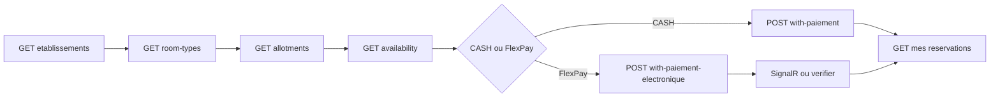

# MODULE 14 — Hôtel (intégration Vue.js + Flutter)

> Retour : [Document maître](DOCUMENTATION_COMPLETE_INTEGRATION_FRONTEND.md)
>
> Préfixe routes : **`/api/hotels/*`**
>
> Module **autonome** : ne pas réutiliser les DTOs ni les routes Transport, Événement, Site Touristique ou Restaurant.
>
> Workflow métier : [DOCUMENTATION_WORKFLOW_HOTEL_V1.md](../05_transport_sync/DOCUMENTATION_WORKFLOW_HOTEL_V1.md)  
> **Guide implémentation Vue/Flutter** : [INTEGRATION_HOTEL_VUE_FLUTTER.md](INTEGRATION_HOTEL_VUE_FLUTTER.md)  
> Analyse backend : [ANALYSE_V1_HOTEL.md](../11_analyses_plans/ANALYSE_V1_HOTEL.md)  
> Pattern SignalR : [INTEGRATION_SIGNALR_EVENEMENT_FLEXPAY.md](INTEGRATION_SIGNALR_EVENEMENT_FLEXPAY.md)  
> Photos S3 : [MODULE_13_PHOTOS_STOCKAGE_S3.md](MODULE_13_PHOTOS_STOCKAGE_S3.md) + [INTEGRATION_PHOTOS_S3_VUE_FLUTTER.md](INTEGRATION_PHOTOS_S3_VUE_FLUTTER.md)  
> Déploiement SQL : [`Scripts/README_DEPLOIEMENT_HOTEL_V1.md`](../../../Scripts/README_DEPLOIEMENT_HOTEL_V1.md)  
> Permissions : [`assign_hotel_permissions_admin_gerant.sql`](../../../Scripts/assign_hotel_permissions_admin_gerant.sql)

Document **contract-first** (payloads API, permissions, routes). **Guide d’implémentation complet** (écrans, Pinia, Axios, Dio, SignalR, types, tests, FAQ) : **[INTEGRATION_HOTEL_VUE_FLUTTER.md](INTEGRATION_HOTEL_VUE_FLUTTER.md)** — document autonome pour la partie Hôtel côté front.

Ce module couvre l’Hôtel V1 livré en **Phases 1–7e** :

- **Vue 3** — admin, guichet, réception (7c–7e), dashboard ;
- **Flutter client** — catalogue, disponibilité multi-nuit, acompte FlexPay, mes réservations.

Il n’existe **ni ticket QR ni contrôle gate hôtel en V1**. Phases livrées : allotments (2), réservations CASH/FlexPay (3–4), client/dashboard (5), planifications (7a), GlobalQuota (7b), chambres/assign (7c), check-in/out (7d), extras réception (7e).

### Prérequis permissions (évite 403 Admin / Gérant / Caissier / Client)

Sur une base **déjà peuplée**, exécuter [`assign_hotel_permissions_admin_gerant.sql`](../../../Scripts/assign_hotel_permissions_admin_gerant.sql) avant les appels Write ou vente d’acompte (Client / Caissier : `Hotel.Hold.Create` + `Hotel.Reservation.Confirm`).

---

## 0. Glossaire critique

| Champ / terme | Signification |
|---------------|---------------|
| `idHotel` | Établissement hôtelier proposé au catalogue |
| `idSite` | Guichet marchand / caisse utilisé pour CASH ou FlexPay |
| `roomType` / `idHotelRoomType` | Type de chambre (Standard, Suite…), pas une chambre physique |
| Allotment / `NightDate` | Capacité et prix d’un type de chambre pour **une nuit** |
| `checkInDate` / `checkOutDate` | Intervalle semi-ouvert `[checkIn, checkOut)` ; le check-out est exclusif |
| Acompte | Montant encaissé à la réservation, distinct du total du séjour |
| `idReservation` (SignalR) | = `idHotelReservation` |
| `checkInDate` / `checkedInAtUtc` | Dates **vendues** vs horodatage **réel** check-in réception (7d) |
| `montantSejour` / `montantSousTotal` | Total séjour vs **acompte** encaissé à la réservation |
| `montantExtras` | Somme lignes extras (7e) — informatif, hors acompte V1 |

Ne pas confondre `idHotel` et `idSite`. Exemple : du 10 au 12 signifie deux nuits, celles du 10 et du 11.

---

## 1. Architecture du parcours



| Étape | Endpoint |
|-------|----------|
| Catalogue | `GET /api/hotels/etablissements` |
| Types publiés | `GET /api/hotels/room-types?idHotel={id}` |
| Calendrier | `GET /api/hotels/allotments?idHotel={id}&from=2026-09-10&to=2026-09-13` |
| Disponibilité séjour | `GET /api/hotels/availability?idHotel={id}&from=...&to=...&roomTypeId=...` |
| Acompte CASH | `POST /api/hotels/reservations/with-paiement` |
| Acompte FlexPay | `POST /api/hotels/reservations/with-paiement-electronique` |
| Vérification | `GET /api/hotels/flexpay/verifier/{orderNumber}` |
| Mes réservations | `GET /api/hotels/reservations/client/{idClient}` |

---

## 2. Personas et écrans

| Persona | Stack | Écrans | Permissions |
|---------|-------|--------|-------------|
| Admin / gérant | Vue 3 + Axios + Pinia | Établissements + photos, room-types, allotments/nights, planifs, chambres, extras catalogue, dashboard | `Hotel.Etablissement.*`, `Hotel.RoomType.*`, `Hotel.Dashboard.Read` |
| Guichet / caissier | Vue 3 | Availability, vente CASH / FlexPay, recherche / annulation réservation | Read + `Hotel.Hold.Create`, `Hotel.Reservation.Confirm` |
| **Réception** | Vue 3 | Détail résa CONFIRMED → assign-rooms → check-in → extras → check-out | `Hotel.Etablissement.Read` / `.Write` |
| Client voyageur | Flutter + Dio | Catalogue, choix dates/type, FlexPay, mes réservations | Read + `Hotel.Hold.Create`, `Hotel.Reservation.Confirm` |

Il n’y a pas de persona gate hôtel en V1. Détail écrans : [INTEGRATION_HOTEL_VUE_FLUTTER.md §1](INTEGRATION_HOTEL_VUE_FLUTTER.md).

---

## 3. Permissions

| Permission | Usage frontend |
|------------|----------------|
| `Hotel.Etablissement.Read` | Lire hôtels, allotments et réservations |
| `Hotel.Etablissement.Write` | Créer/modifier/publier hôtels et allotments, planifications + `/generer`, gérer les photos |
| `Hotel.RoomType.Read` | Lire les types de chambres |
| `Hotel.RoomType.Write` | Créer/modifier/publier les types |
| `Hotel.Hold.Create` | Requis par les deux façades d’achat |
| `Hotel.Reservation.Confirm` | Confirmer acompte, verifier/abandon FlexPay, annuler |
| `Hotel.Dashboard.Read` | Dashboard, super-admin et widget |

Sur une base existante, exécuter [`assign_hotel_permissions_admin_gerant.sql`](../../../Scripts/assign_hotel_permissions_admin_gerant.sql). Le script attribue toutes les permissions Hôtel aux Admin/Gérant, les droits d’achat au Client/Caissier et les droits de lecture financière au Financier.

---

## 4. Contrat API — configuration (Vue admin)

### 4.1 Établissement et photos

```json
POST /api/hotels/etablissements
{
  "codeHotel": "HOTEL-01",
  "nom": "Hôtel du Fleuve",
  "description": "Séjour à Kinshasa",
  "adresse": "Gombe, Kinshasa",
  "acomptePourcentDefaut": 20,
  "idSite": 5
}
```

Puis `PUT /api/hotels/etablissements/{id}/publish`.

Pour les photos, utiliser de préférence le multipart décrit dans [MODULE_13](MODULE_13_PHOTOS_STOCKAGE_S3.md) :

| Méthode | Route |
|---------|-------|
| GET | `/api/hotels/etablissements/{id}/photos` |
| GET | `/api/hotels/etablissements/{id}/photos/{photoId}/content` |
| POST | `/api/hotels/etablissements/{id}/photos` (`multipart/form-data`) |
| PUT | `/api/hotels/etablissements/{id}/photos` (replace-all multipart) |
| PUT | `/api/hotels/etablissements/{id}/photos/{photoId}/ordre` |
| DELETE | `/api/hotels/etablissements/{id}/photos/{photoId}` |

Afficher `photoUrl` / `photoCouverture`, pas le base64 legacy.

### 4.2 Type de chambre Draft → Published

```json
POST /api/hotels/room-types
{
  "idHotel": 1,
  "code": "SUITE",
  "libelle": "Suite",
  "description": "Suite deux personnes",
  "capacitePersonnesMax": 2,
  "prixNuitReference": 120000,
  "codeDevise": "CDF"
}
```

Puis `PUT /api/hotels/room-types/{id}/publish`.

### 4.3 Allotment d’une nuit

```json
POST /api/hotels/allotments
{
  "idHotel": 1,
  "idHotelRoomType": 2,
  "nightDate": "2026-09-10",
  "capaciteTotale": 8,
  "prixNuit": 120000,
  "codeDevise": "CDF"
}
```

Puis `PUT /api/hotels/allotments/{id}/publish`.

### 4.4 Batch simple sur une plage

```json
POST /api/hotels/allotments/batch
{
  "idHotel": 1,
  "idHotelRoomType": 2,
  "from": "2026-09-10",
  "to": "2026-09-15",
  "capaciteTotale": 8,
  "prixNuit": 120000,
  "codeDevise": "CDF",
  "skipExisting": true
}
```

`from` est inclusif et `to` exclusif. Le résultat expose `createdCount`, `skippedCount` et `created[]`. Les allotments créés restent Draft et doivent être publiés individuellement.

### 4.5 Planifications (Phase 7a)

Templates récurrents (jours de semaine × lignes type/capacité/prix) — miroir Site Touristique.

```http
POST /api/hotels/planifications
PUT /api/hotels/planifications/{id}
PUT /api/hotels/planifications/{id}/toggle-statut
DELETE /api/hotels/planifications/{id}
POST /api/hotels/planifications/{id}/generer
```

Exemple `/generer` :

```json
{
  "mode": "PeriodePersonnalisee",
  "dateDebut": "2026-10-01",
  "dateFin": "2026-10-31",
  "publierApresGeneration": false
}
```

Modes : `SemaineCourante`, `MoisCourant`, `MoisProchain`, `PeriodePersonnalisee`. Idempotent sur UQ `(idHotel, idHotelRoomType, nightDate)`. Update du template **ne mute pas** les allotments déjà générés.

### 4.5bis GlobalQuota — nuits hôtel (Phase 7b)

Mode **exclusif** avec ClassQuota (XOR par hôtel). Pool capacité/prix **par nuit** sans type de chambre.

```json
POST /api/hotels/nights
{
  "idHotel": 1,
  "nightDate": "2026-10-05",
  "capaciteTotale": 50,
  "prixNuit": 80000,
  "codeDevise": "CDF"
}
```

Puis `PUT /api/hotels/nights/{id}/publish`.

Batch plage :

```json
POST /api/hotels/nights/batch
{
  "idHotel": 1,
  "from": "2026-10-01",
  "to": "2026-10-31",
  "capaciteTotale": 50,
  "prixNuit": 80000,
  "codeDevise": "CDF",
  "skipExisting": true
}
```

Availability GlobalQuota :

```http
GET /api/hotels/availability?idHotel=1&from=2026-10-05&to=2026-10-08&inventoryMode=GlobalQuota
```

Achat (CASH ou FlexPay) — `items` **sans** `roomTypeId` :

```json
"items": [{ "quantity": 2 }]
```

ClassQuota conserve `{ "roomTypeId": 2, "quantity": 1 }`.

### 4.5ter Chambres physiques + attribution (Phase 7c)

Catalogue opérationnel (pas un mode inventaire SeatNumbered) :

```http
GET/POST /api/hotels/rooms
GET/PUT/DELETE /api/hotels/rooms/{id}
POST|PUT /api/hotels/reservations/{id}/assign-rooms
```

Permissions : `Hotel.Etablissement.Read` / `.Write`. Body assign (replace-all) :

```json
{
  "items": [
    { "idHotelReservationLine": 12, "idHotelRoom": 5 }
  ]
}
```

Règles : résa **CONFIRMED** ; 1 chambre par unité de `quantity` ; type compatible en ClassQuota ; refus **409** si chevauchement `[checkIn, checkOut)` avec une autre résa CONFIRMED sur la même chambre. L’annulation libère les attributions.

### 4.5quater Check-in / check-out réception (Phase 7d)

```http
POST|PUT /api/hotels/reservations/{id}/check-in
POST|PUT /api/hotels/reservations/{id}/check-out
```

Permissions : `Hotel.Etablissement.Write`. Réponse = résa enrichie (`checkedInAtUtc`, `checkedOutAtUtc`).

Règles : résa **CONFIRMED** ; check-in sans attribution préalable ; check-out requiert check-in ; idempotent (re-POST sans modifier le timestamp) ; annulation remet les timestamps à null. Ne pas confondre `checkInDate` (séjour vendu) et `checkedInAtUtc` (arrivée réelle).

### 4.5quinquies Extras réception (Phase 7e)

```http
GET/POST /api/hotels/extras
GET/PUT/DELETE /api/hotels/extras/{id}
POST|PUT /api/hotels/reservations/{id}/extras
```

Permissions : `Hotel.Etablissement.Read` / `.Write`. Body set extras (replace-all) :

```json
{
  "items": [
    { "idHotelExtra": 3, "quantity": 2 }
  ]
}
```

Réponse résa enrichie : `extras[]`, `montantExtras` (somme lignes). `PricingUnit` catalogue : `PerStay` (`prix × quantity`) ou `PerNight` (`prix × quantity × nombreNuits`). **`montantSejour` inchangé** — encaissement extras hors plateforme V1. Règles : résa **CONFIRMED** ; extra actif du même hôtel ; liste vide efface les lignes ; annulation supprime les extras.

### 4.6 Règles de publication

1. Publier d’abord l’établissement.
2. Publier ensuite le type de chambre.
3. Publier enfin chaque allotment (ou `publierApresGeneration: true` à la génération).
4. Une availability vendable exige les trois parents en `Published`.

---

## 5. Contrat API — vente (Vue guichet + Flutter)

### 5.1 Availability

```http
GET /api/hotels/availability?idHotel=1&from=2026-09-10&to=2026-09-13&roomTypeId=2
```

La réponse expose les nuits de `[from, to)`, leur capacité, `quantiteHold`, `quantiteVendue`, `quantiteDisponible`, leur prix et `minDisponible` quand un seul type est filtré.

Toujours recharger l’availability juste avant l’achat. Une réservation est atomique sur toutes les nuits : si une nuit est indisponible, tout le hold échoue.

### 5.2 CASH — `POST /api/hotels/reservations/with-paiement`

```json
{
  "idHotel": 1,
  "checkInDate": "2026-09-10",
  "checkOutDate": "2026-09-13",
  "customerRef": "GUICHET-42",
  "idClient": 42,
  "idempotencyKey": "hotel-cash-001",
  "items": [
    { "roomTypeId": 2, "quantity": 1 }
  ],
  "paiement": {
    "methodePaiement": "CASH",
    "referenceTransaction": "CAISSE-001",
    "idSite": 5,
    "idempotencyKey": "hotel-cash-payment-001"
  }
}
```

Résultat attendu : `transactionStatut: "Succes"`, réservation `CONFIRMED`, paiement `SUCCEEDED`.

### 5.3 FlexPay — `POST /api/hotels/reservations/with-paiement-electronique`

```json
{
  "idHotel": 1,
  "checkInDate": "2026-09-10",
  "checkOutDate": "2026-09-13",
  "customerRef": "243900000001",
  "idempotencyKey": "hotel-mm-001",
  "items": [
    { "roomTypeId": 2, "quantity": 1 }
  ],
  "paiement": {
    "methodePaiement": "MOBILE_MONEY",
    "phone": "243900000001",
    "codeDevisePaiement": "CDF",
    "idSite": 5,
    "idempotencyKey": "hotel-mm-payment-001"
  }
}
```

Pour une carte, utiliser `methodePaiement: "CARTE_BANCAIRE"` puis ouvrir `paymentUrl`.

Hôtel utilise le **Plan A** : aucune réservation métier n’est créée avant le succès FlexPay. Corréler l’attente avec `orderNumber`; la réservation définitive arrive après callback, SignalR ou `verifier`.

`paiement.idSite` est le guichet marchand. Le montant de `payment.montant` / `montantSousTotal` est l’**acompte** ; `montantSejour` représente le total du séjour.

---

## 6. SignalR FlexPay

Hub : `/hubs/notifications`. Événements : `FlexPayPaymentConfirmed` et `FlexPayPaymentFailed`.

| Règle | Détail |
|-------|--------|
| Domaine pending | `domain: 'hotel'` (ne pas confondre avec `restaurant`, `event`, etc.) |
| Déduplication | Flag `settled` entre SignalR et poll |
| Vérification | `GET /api/hotels/flexpay/verifier/{orderNumber}?idSociete={hotelSociete}` |
| Poll secours | ~3 s |
| Abandon | `POST /api/hotels/flexpay/abandon/{orderNumber}` |
| Interdit | `POST /api/hotels/flexpay/callback` depuis le frontend |

Dans un payload confirmé, `idReservation` = `idHotelReservation`. Plan A : pas de résa métier avant succès FlexPay.

Exemples code Vue/Flutter : [INTEGRATION_HOTEL_VUE_FLUTTER.md §4](INTEGRATION_HOTEL_VUE_FLUTTER.md). Pattern partagé : [INTEGRATION_SIGNALR_EVENEMENT_FLEXPAY.md](INTEGRATION_SIGNALR_EVENEMENT_FLEXPAY.md).

---

## 7. Mes réservations

| Besoin | Route |
|--------|-------|
| Liste tenantée | `GET /api/hotels/reservations?idSociete={hotelSociete}&status=ALL&idHotel={id}` |
| Liste client cross-société | `GET /api/hotels/reservations/client/{idClient}?status=ALL` |
| Détail | `GET /api/hotels/reservations/{id}?idSociete={hotelSociete}` |
| Annulation | `POST /api/hotels/reservations/{id}/cancel?idSociete={hotelSociete}` |

Le statut par défaut des listes est `CONFIRMED`; utiliser `status=ALL` pour inclure HOLD, CANCELLED et EXPIRED. Le backend applique l’ownership client (`IdUtilisateur` / `IdClient`).

Afficher : hôtel, dates, `nombreNuits`, lignes/type/quantité, `montantSejour`, acompte (`montantSousTotal` / paiement), `montantExtras`, attributions chambres, timestamps check-in/out, devise et statut. Aucun ticket ni QR n’est attendu.

Exemple réponse détail (`GET /api/hotels/reservations/{id}`) :

```json
{
  "idHotelReservation": 42,
  "status": "CONFIRMED",
  "checkInDate": "2026-09-10T00:00:00",
  "checkOutDate": "2026-09-13T00:00:00",
  "nombreNuits": 3,
  "checkedInAtUtc": "2026-09-10T14:30:00Z",
  "checkedOutAtUtc": null,
  "montantSejour": 300000,
  "montantSousTotal": 75000,
  "montantExtras": 40000,
  "codeDevise": "CDF",
  "inventoryMode": "ClassQuota",
  "lines": [
    {
      "idHotelReservationLine": 12,
      "lineType": "ClassQuota",
      "idHotelRoomType": 2,
      "quantity": 1,
      "montantLigne": 300000
    }
  ],
  "payments": [
    {
      "status": "SUCCEEDED",
      "montant": 75000,
      "provider": "CASH"
    }
  ],
  "roomAssignments": [
    {
      "idHotelRoom": 5,
      "numero": "201",
      "idHotelReservationLine": 12
    }
  ],
  "extras": [
    {
      "idHotelExtra": 3,
      "code": "PARK",
      "libelle": "Parking",
      "pricingUnit": "PerStay",
      "quantity": 2,
      "prixUnitaireSnapshot": 10000,
      "montantLigne": 20000
    }
  ]
}
```

---

## 8. Dashboard (Vue admin)

Permission : `Hotel.Dashboard.Read`.

| Endpoint | Usage |
|----------|-------|
| `GET /api/hotels/dashboard?month=yyyy-MM&idSociete=` | KPIs société JWT ; `idSociete` explicite pour Super-Admin |
| `GET /api/hotels/dashboard/super-admin?month=yyyy-MM` | Agrégat multi-sociétés, Super-Admin uniquement |
| `GET /api/hotels/dashboard/widget?month=yyyy-MM&idSociete=` | Résumé compact |

Présenter les KPIs comme des réservations et **acomptes**, pas comme un chiffre d’affaires hôtelier total.

---

## 9. Erreurs UI

| Situation | Signal | Comportement |
|-----------|--------|--------------|
| Oversell sur une nuit | 409 | Afficher la nuit/type indisponible puis recharger availability |
| Allotment manquant | 400 / conflit métier | Signaler que toutes les nuits doivent être configurées |
| Hôtel, room-type ou allotment Draft | vide / erreur métier | Publier les parents dans l’ordre |
| Permission manquante | 403 | Masquer l’action et afficher « accès refusé » |
| Check-out non postérieur | 400 | Exiger `checkOutDate > checkInDate` |
| Acompte confondu avec total | — | Afficher séparément « acompte payé » et « total séjour » |
| FlexPay refusé / expiré | `paymentPending: false` ou SignalR Failed | Fermer le pending et proposer une nouvelle tentative |
| Assign chambre chevauchante (7c) | 409 | Message conflit + proposer autre chambre |
| Extras sur HOLD / CANCELLED | 400 | Masquer action extras ; résa CONFIRMED requise |
| Check-out sans check-in | 400 | Exiger check-in avant check-out |
| Confusion dates séjour / arrivée | — | `checkInDate` ≠ `checkedInAtUtc` |

---

## 10. Checklist intégration

> Détail implémentation et tests manuels : [INTEGRATION_HOTEL_VUE_FLUTTER.md §6](INTEGRATION_HOTEL_VUE_FLUTTER.md).

### Vue (admin / guichet / dashboard)

- [ ] CRUD établissement Draft + publish + photos multipart MODULE_13
- [ ] CRUD room-types Draft + publish
- [ ] Allotment unitaire et batch `[from, to)` + publication
- [ ] Nuits globales GlobalQuota `/api/hotels/nights` (+ batch/publish) si mode Global
- [ ] Catalogue chambres `/api/hotels/rooms` + `assign-rooms` post-confirm (réception)
- [ ] Check-in / check-out `…/check-in`, `…/check-out` (timestamps réception)
- [ ] Catalogue extras `/api/hotels/extras` + `…/extras` post-confirm (montant informatif)
- [ ] Planifications templates + `POST …/planifications/{id}/generer` (Class ou Global)
- [ ] Availability calendrier (`inventoryMode` Class ou Global)
- [ ] Vente CASH `with-paiement`
- [ ] Recherche, détail et annulation des réservations
- [ ] Dashboard société + super-admin + widget
- [ ] Guards `Hotel.*`
- [ ] Distinguer `idHotel`, `idSite`, `roomTypeId` et `NightDate`
- [ ] Distinguer acompte et total séjour

### Flutter (client)

- [ ] Catalogue établissements Published + `photoUrl`
- [ ] Room-types Published et sélection `[checkIn, checkOut)`
- [ ] Availability et `minDisponible`
- [ ] FlexPay + SignalR/poll avec `domain: 'hotel'`
- [ ] Mes réservations cross-société + détail + cancel
- [ ] Aucun écran ticket QR / gate hôtel
- [ ] Ne jamais appeler `/api/FlexPay/*`, `/api/events/*`, `/api/sites-touristiques/*` ou `/api/restaurants/*`

---

## 11. Référence routes rapide

| Ressource | Routes principales |
|-----------|--------------------|
| Établissements | `GET/POST /api/hotels/etablissements`, `GET/PUT /api/hotels/etablissements/{id}`, `PUT .../{id}/publish` |
| Photos | `/api/hotels/etablissements/{id}/photos/*` |
| Types de chambres | `GET/POST /api/hotels/room-types`, `GET/PUT /api/hotels/room-types/{id}`, `PUT .../{id}/publish` |
| Allotments | `GET/POST /api/hotels/allotments`, `POST .../batch`, `GET/PUT .../{id}`, `PUT .../{id}/publish` |
| Nuits globales | `GET/POST /api/hotels/nights`, `POST .../batch`, `GET/PUT .../{id}`, `PUT .../{id}/publish` |
| Planifications | `GET/POST /api/hotels/planifications`, `PUT .../{id}`, `PUT .../{id}/toggle-statut`, `DELETE .../{id}`, `POST .../{id}/generer` |
| Availability | `GET /api/hotels/availability?idHotel=&from=&to=&roomTypeId=&inventoryMode=` |
| Chambres physiques | `GET/POST /api/hotels/rooms`, `GET/PUT/DELETE .../rooms/{id}` |
| Réservations | `POST /api/hotels/reservations/with-paiement`, `POST .../with-paiement-electronique`, `GET /api/hotels/reservations*`, `POST .../{id}/cancel` |
| Attribution | `POST|PUT /api/hotels/reservations/{id}/assign-rooms` |
| Check-in / out | `POST|PUT .../reservations/{id}/check-in`, `POST|PUT .../check-out` |
| Extras | `GET/POST /api/hotels/extras`, `GET/PUT/DELETE .../extras/{id}`, `POST|PUT .../reservations/{id}/extras` |
| FlexPay | `GET /api/hotels/flexpay/verifier/{orderNumber}`, `POST /api/hotels/flexpay/abandon/{orderNumber}` |
| Dashboard | `GET /api/hotels/dashboard`, `GET .../super-admin`, `GET .../widget` |

Scripts SQL : [`Scripts/README_DEPLOIEMENT_HOTEL_V1.md`](../../../Scripts/README_DEPLOIEMENT_HOTEL_V1.md).  
Guide Vue/Flutter : [INTEGRATION_HOTEL_VUE_FLUTTER.md](INTEGRATION_HOTEL_VUE_FLUTTER.md).
