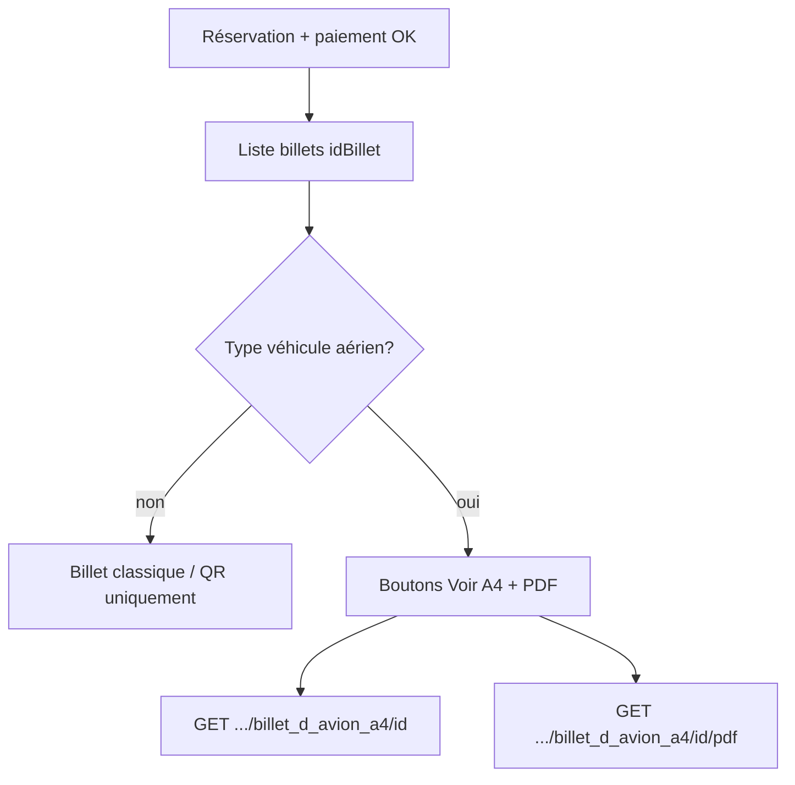

# MODULE — Intégration Billet d’avion A4

> Retour : [Document maître](DOCUMENTATION_COMPLETE_INTEGRATION_FRONTEND.md) · Mapping champs : [`Reports/doc.md`](../../../Reports/doc.md)

---

## 1. Objectif

Ajouter l’émission / consultation d’un **billet d’avion format A4** pour les compagnies dont le véhicule est de type **aérien**, **sans remplacer** la billetterie transport existante (terrestre, QR, embarquement).

| Ce que c’est | Ce que ce n’est pas |
|---|---|
| Vue HTML + PDF A4 à partir d’un `idBillet` déjà émis | Un nouveau cycle de réservation / paiement |
| Réservé au type véhicule **aérien** | Applicable aux bus / terrestre |
| Complément UX compagnies aériennes | Remplacement de `GET /api/Billet/{id}` |

---

## 2. Prérequis métier

1. Une **réservation** avec paiement et billet(s) émis (workflow classique `Reservation` + `Billet`).
2. Le voyage associé utilise un véhicule dont `TypeVehicule.Libelle` contient **« aérien »** (accents ignorés : `Aérien`, `aerien`, `Compagnie Aérienne`, …).
3. L’appelant est authentifié (**JWT Bearer**), comme les autres routes `Billet`.

### Comment obtenir `idBillet`

| Source | Champ |
|---|---|
| `GET /api/Reservation/{id}` | `billet.idBillet` ou `billets[].idBillet` |
| `GET /api/Billet` / `GET /api/Billet/{id}` | `idBillet` |
| Réponse post-réservation `with-passengers-and-paiement` | `billets[].idBillet` |

Pour un billet multi-passagers : un PDF / preview **par** `idBillet` (un passager / siège).

---

## 3. Endpoints

Contrôleur : `BilletController`  
Base : `/api/Billet`

| Méthode | Route | Description | Content-Type succès |
|---|---|---|---|
| `GET` | `/api/Billet/billet_d_avion_a4/{id}` | Prévisualisation navigateur (HTML) | `text/html; charset=utf-8` |
| `GET` | `/api/Billet/billet_d_avion_a4/{id}/pdf` | Téléchargement PDF | `application/pdf` |

`{id}` = **`idBillet`** (`integer`).

### Auth

```http
Authorization: Bearer {access_token}
```

### Exemples

**Prévisualiser**

```http
GET /api/Billet/billet_d_avion_a4/42 HTTP/1.1
Host: {api-host}
Authorization: Bearer {token}
Accept: text/html
```

**Télécharger le PDF**

```http
GET /api/Billet/billet_d_avion_a4/42/pdf HTTP/1.1
Host: {api-host}
Authorization: Bearer {token}
Accept: application/pdf
```

Fichier PDF typique : `billet_d_avion_a4-42.pdf`.

---

## 4. Codes de réponse

| Code | Cas | Corps |
|---|---|---|
| `200` | Succès | HTML inline **ou** fichier PDF |
| `401` | Non authentifié | — |
| `404` | Billet inexistant | `{ "message": "Billet avec l'ID {id} non trouvé" }` |
| `409` | Véhicule **non aérien** | `{ "message": "Le billet A4 est réservé aux billets de type véhicule aérien." }` |
| `500` | Template manquant / erreur serveur | `{ "message": "..." }` |

### Comportement front recommandé

```
si type véhicule aérien (ou tentative 200) :
  afficher bouton « Voir billet A4 » / « Télécharger PDF »
sinon :
  ne pas proposer ces actions (ou gérer le 409 sans alerte bloquante)
```

Détection côté front (optionnelle, avant l’appel) : `LibelleTypeVehicule` / type véhicule du voyage contient « aérien ».  
Sinon : appeler l’endpoint et traiter `409`.

---

## 5. Intégration Vue.js

### Prévisualisation (iframe ou nouvel onglet)

```ts
// ouvrir la prévisualisation authentifiée
async function openBilletAvionPreview(idBillet: number, token: string) {
  const res = await fetch(`${API_BASE}/api/Billet/billet_d_avion_a4/${idBillet}`, {
    headers: { Authorization: `Bearer ${token}`, Accept: 'text/html' }
  })
  if (res.status === 409) {
    // non aérien
    return
  }
  if (!res.ok) throw new Error(await res.text())
  const html = await res.text()
  const w = window.open('', '_blank')
  if (w) {
    w.document.open()
    w.document.write(html)
    w.document.close()
  }
}
```

### PDF (téléchargement)

```ts
async function downloadBilletAvionPdf(idBillet: number, token: string) {
  const res = await fetch(`${API_BASE}/api/Billet/billet_d_avion_a4/${idBillet}/pdf`, {
    headers: { Authorization: `Bearer ${token}`, Accept: 'application/pdf' }
  })
  if (res.status === 409 || res.status === 404) {
    // afficher message métier
    return
  }
  if (!res.ok) throw new Error(await res.text())
  const blob = await res.blob()
  const url = URL.createObjectURL(blob)
  const a = document.createElement('a')
  a.href = url
  a.download = `billet_d_avion_a4-${idBillet}.pdf`
  a.click()
  URL.revokeObjectURL(url)
}
```

> La prévisualisation HTML est **nettoyée** côté API (pas de branding moteur de rapport dans la page). Titre typique : `Billet — {NomSociété}`.

---

## 6. Intégration Flutter

```dart
Future<void> openBilletAvionPdf(int idBillet, String token) async {
  final uri = Uri.parse('$apiBase/api/Billet/billet_d_avion_a4/$idBillet/pdf');
  final res = await http.get(uri, headers: {
    'Authorization': 'Bearer $token',
    'Accept': 'application/pdf',
  });
  if (res.statusCode == 409) {
    // non aérien
    return;
  }
  if (res.statusCode != 200) {
    throw Exception('Erreur billet A4: ${res.statusCode}');
  }
  // sauvegarder / ouvrir avec open_filex, printing, etc.
  final bytes = res.bodyBytes;
  // ...
}
```

Pour la preview HTML : charger l’URL dans un `WebView` avec header `Authorization`, ou récupérer le HTML puis `WebViewController.loadHtmlString`.

---

## 7. Données affichées (mapping)

Sources principales : billet + réservation + voyage (+ config société).  
Équivalent métier des payloads `GET /api/Reservation/{id}` et `GET /api/Billet`.

| Zone billet A4 | Champ API / modèle |
|---|---|
| Nom client (avant « thank you for your booking ») | `Client.NomClient` |
| Booking Reference | `idReservation` |
| Issue Officer | `Site.NomSite` (`idSite` du billet) |
| Phone Number | `ReservationPassenger.Telephone` sinon `Client.Telephone` |
| Passager | `ReservationPassenger.NomComplet` |
| Email | `ReservationPassenger.Email` |
| Seat | `codeSiege` / `Siege.CodeSiege` |
| E-ticket / référence | `idReservationPassenger` |
| Date | `dateVoyage` / `Voyage.DateDepart` → `dd/MM/yyyy` |
| Flight / avion | `aliasVehicule` |
| From / To | `villeDepart` / `villeArrivee` |
| Depart | `heureVoyage` → `HH:mm` |
| Fare Type (`classe_siege`) | `CategorieSiege.Libelle` |
| Baggage | `ConfigSociete.PoidsBagageParKiloOffert` (ex. `20 kg`) |
| Arrive / Cabin | non renseignés (pas de champ modèle) |

Détail exhaustif : [`Reports/doc.md`](../../../Reports/doc.md).

---

## 8. Parcours UX suggéré



Emplacements UI typiques :
- Détail réservation (admin / guichet)
- Détail billet après émission
- Espace client (si exposé) après paiement réussi

---

## 9. Configuration société (aérien)

| Élément | Rôle |
|---|---|
| `TypeVehicule.Libelle` | Doit identifier l’aérien (contient « aérien ») |
| `ConfigSociete.PoidsBagageParKiloOffert` | Franchise bagages affichée sur le billet |
| `Site.NomSite` | Affiché comme « Issue Officer » |
| Template `Reports/Billet_A4.frx` | Mis à jour côté serveur (déployé avec l’API) |

Logo / affiche pub : encore embarqués dans le template ; branchement dynamique `Societe.Logo` prévu plus tard.

---

## 10. Checklist d’intégration front

- [ ] Récupérer `idBillet` depuis réservation ou liste billets  
- [ ] N’afficher les actions A4 que pour les voyages / sociétés aériennes (ou gérer `409`)  
- [ ] Appeler preview avec JWT + afficher HTML (iframe / onglet / WebView)  
- [ ] Appeler PDF avec JWT + téléchargement blob / fichier  
- [ ] Gérer `404` / `409` / `401` / `500`  
- [ ] Ne pas casser le flux billet terrestre / QR / embarquement existant  

---

## 11. Hors scope (volontaire)

- Modification du workflow `Reservation` / `Paiement` / émission QR  
- Remplacement de `GET /api/Billet/{id}`  
- Heure d’arrivée et cabine (champs absents du modèle actuel)  
- Logo dynamique et bandeau pub dynamiques  

---

## 12. Références code

| Élément | Fichier |
|---|---|
| Endpoints | `Controllers/BilletController.cs` |
| Génération | `Services/BilletReportService.cs` |
| Contrat service | `Services/Repositories/IBilletReportService.cs` |
| Template | `Reports/Billet_A4.frx` |
| Mapping champs | `Reports/doc.md` |
| Tests | `Tests/BilletReportServiceTests.cs` |
