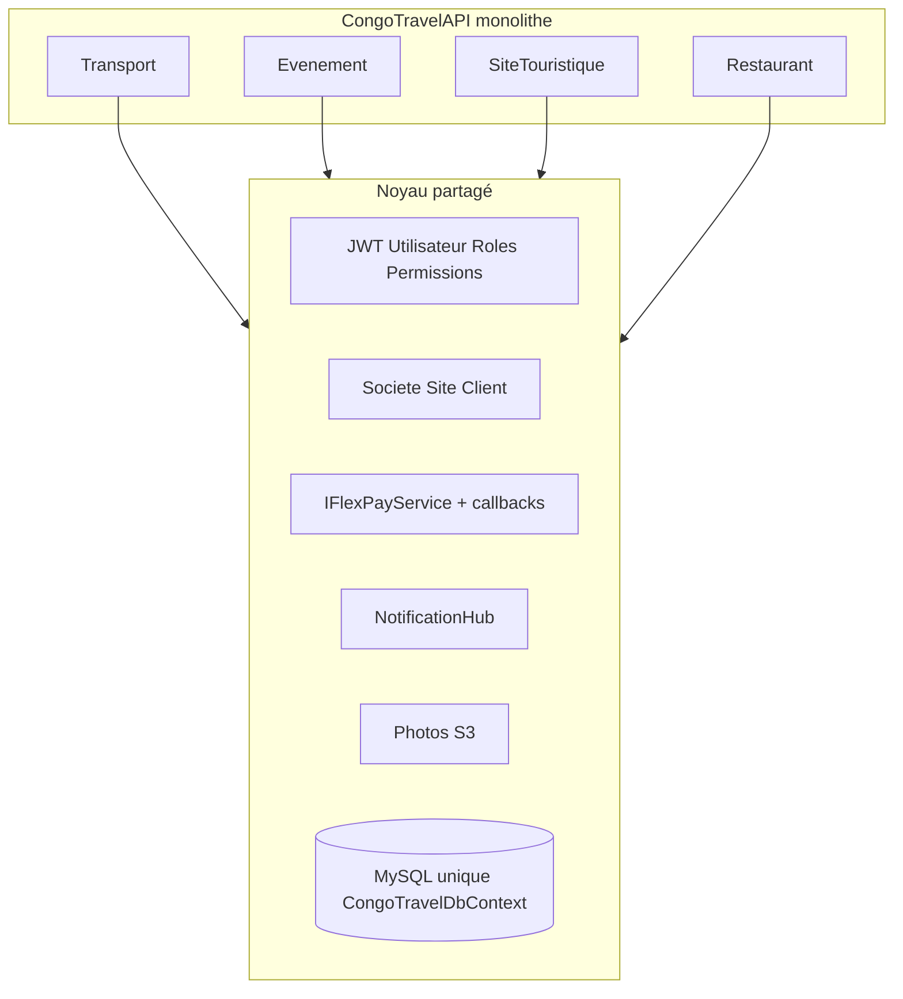

# ADR / Analyse — Microservices par domaine (Transport / Événement / Site / Restaurant)

> Date : 2026-08-27  
> Statut : **Recommandation adoptée** — rester monolithe modulaire ; microservices uniquement sur trigger métier.  
> Contexte : CongoTravelAPI (ASP.NET Core 6, MySQL unique, `CongoTravelDbContext`).

---

## 1. Verdict

**Pas de split microservices maintenant.** L’API est déjà un **monolithe modulaire** (slices Evenement / SiteTouristique / Restaurant + Transport). C’est le stade adapté.

Passer aux microservices seulement quand un domaine exige une **échelle**, une **équipe** ou un **cycle de release** que le monolithe ne peut plus absorber. Aujourd’hui, le ROI d’un découpage complet est faible face au coût (auth, FlexPay, SignalR, tenancy, ops).

---

## 2. État actuel

| Élément | Réalité repo |
|---------|----------------|
| Process | 1 app `CongoTravel.csproj` |
| Données | 1 MySQL, 1 `CongoTravelDbContext` (partials domaine) |
| Frontières utiles | `Services/Evenement|SiteTouristique|Restaurant/`, DI `Add*Ticketing` |
| Paiements | Transport : `Paiement` ; satellites : `*Payment` dédiés — même `IFlexPayService` |
| Couplage dur | JWT + permissions, `Societe`/`Site`/`Client`, FlexPay, SignalR, photos S3, reversements |

Les domaines satellite sont **plus extractibles** que le Transport (historique, reporting finance, `Paiement` partagé).

---

## 3. Bénéfices (plus tard)

| Bénéfice | Pertinence CongoTravel |
|----------|------------------------|
| Scale indépendant (pics billetterie) | Réel **si** un domaine sature seul |
| Releases / équipes autonomes | Utile avec **plusieurs équipes** dédiées |
| Isolation de panne | Un crash événement n’arrête pas le transport |
| Stack différente | Peu pertinent (tout .NET aujourd’hui) |
| Alignement produit vertical | Déjà partiellement obtenu via folders / DI |

---

## 4. Inconvénients / risques sur ce projet

1. **Identité & tenancy** — sans Auth/Tenant partagé (ou sync), le split casse JWT, permissions et multi-société.
2. **Rail FlexPay** — un merchant, plusieurs callbacks, reversements : risque double débit, payouts incohérents.
3. **SignalR** — hub unique → gateway + Redis backplane ou notifs dupliquées.
4. **Transactions** — EF local aujourd’hui ; en microservices = saga / outbox (holds, AR, billets).
5. **Ops** — N déploiements, healthchecks, logs corrélés, migrations.
6. **Fronts Vue / Flutter** — BFF ou API gateway, latence, versioning de contrats.
7. **Reporting** — finance encore Transport-centrée ; agrégation cross-domaine à reconstruire.
8. **Coût équipe** — petite équipe : le monolithe reste plus rapide à livrer.

---

## 5. Chemin recommandé

### Phase A — Monolithe, durcir les modules (maintenant)

- Garder **1 deploy / 1 DB**.
- Renforcer les frontières (éviter les accès EF croisés « sales », contrats internes clairs).
- Traiter Auth, FlexPay, SignalR, Photos, Notifications comme **modules partagés** explicites.

### Phase B — Modular monolith extractible

- Projects / packages : `CongoTravel.Transport`, `.Evenement`, `.SiteTouristique`, `.Restaurant`, `.SharedKernel` (auth, tenancy, FlexPay gateway).
- Même process, mêmes tables au début.

### Phase C — Microservices seulement si trigger

Exemples de triggers : équipe dédiée, charge ~10× sur un domaine, release isolée obligatoire, isolation données.

- **Avant** tout split métier : stabiliser / extraire **Auth/Tenant** + **Payments/FlexPay gateway** + **Notifications**.
- Ordre d’extraction probable : **Événement ou Restaurant** → Site → **Transport en dernier**.
- **Ne pas** découper les 4 services d’un coup.

---

## 6. Quand ne pas le faire

- Une seule équipe sur tous les domaines.
- Priorité = features (embarquement, payouts, photos, AR) plutôt que scale.
- Ops encore immature (CI/CD multi-service, observabilité, secrets).

---

## 7. Décision

| Choix | Détail |
|-------|--------|
| Court terme | Rester monolithe modulaire (Phase A) |
| Moyen terme | Modular monolith (Phase B) si la base code grossit / multi-équipes |
| Long terme | Microservice **domaine par domaine** (Phase C) sur trigger concret |

Les 4 verticales sont déjà proches de bounded contexts — atout pour un split futur. Trop tôt, la complexité se déplace vers le réseau, FlexPay et l’identité, sans gain clair pour les fronts.

---

## 8. Références code

- DI domaines : `Extensions/*ServiceCollectionExtensions.cs`, `Program.cs`
- FlexPay partagé : `Services/FlexPayService.cs`, callbacks par domaine
- SignalR : `Hubs/NotificationHub.cs`
- Tenancy : `Societe`, `Site`, `Client`, `Utilisateur` + `PermissionAttribute`
- Front integration : `Documentation/Themes/09_frontend_integration/`
