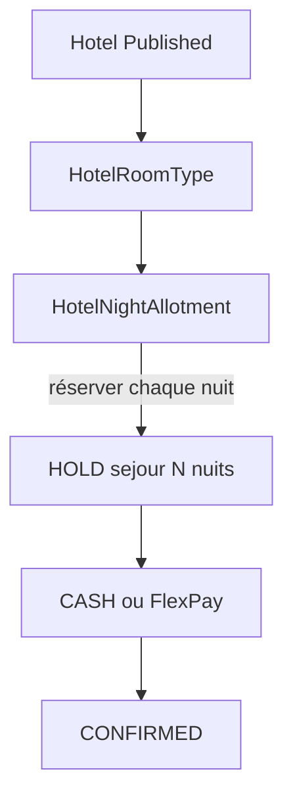
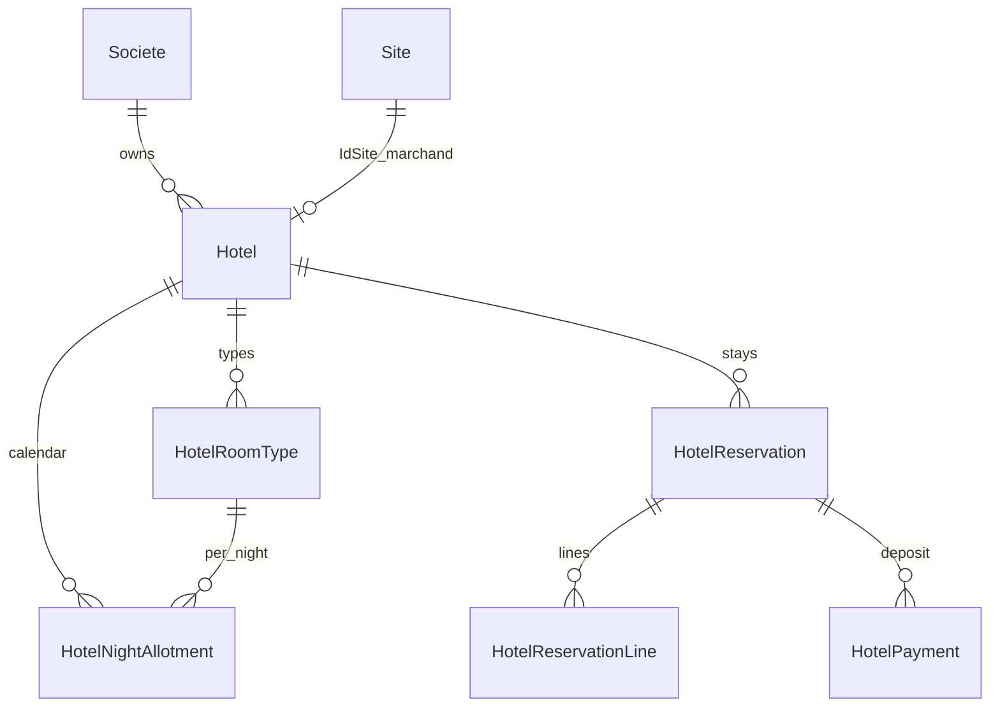
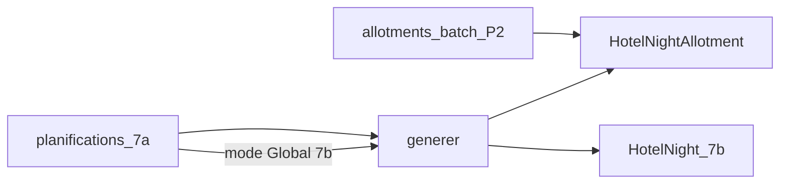
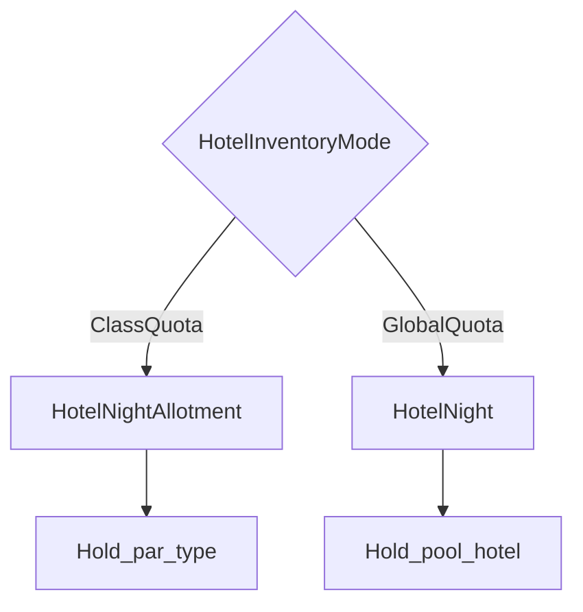
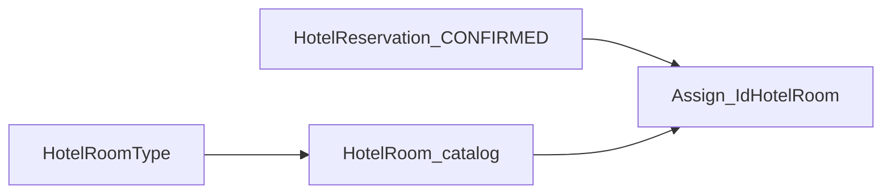
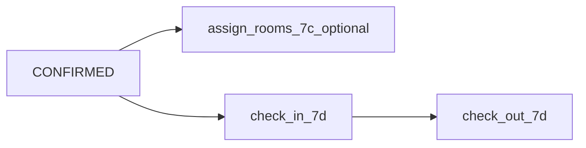
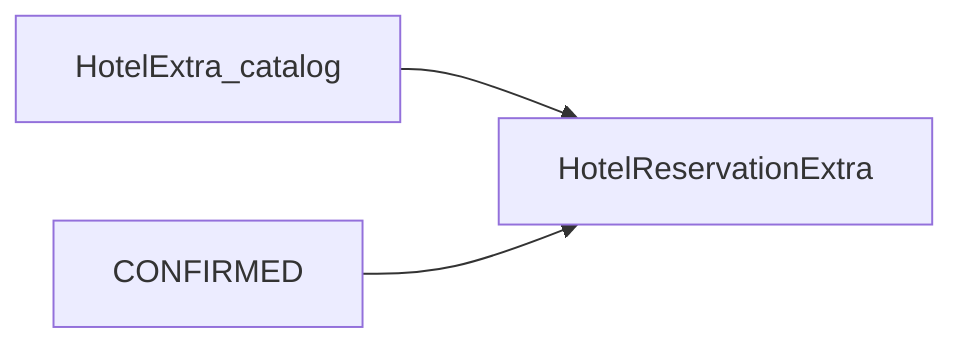

# ANALYSE V1 — Réservation Chambres d’Hôtel

## Contexte et objectif

Étendre la plateforme CongoTravel en **Partie 5** : réservation de **chambres** pour un hôtel (séjour multi-nuit + acompte), sans impacter Transport, Événement, Site Touristique ni Restaurant.

Stratégie : **vertical isolé** (même approche qu’Evenement / Site Touristique / Restaurant) + pattern TicketingCore **documentaire uniquement** (pas de tables EF communes).

| Module | Rôle |
|--------|------|
| Transport | Réservation voyage — inchangé |
| Evenement | Billetterie sessions — inchangé |
| SiteTouristique | Accès lieu + journée — inchangé |
| Restaurant | Réservation couverts + créneau — inchangé |
| **Hôtel** | Réservation chambres + séjour multi-nuit + acompte — **ce document** |
| Infra partagée | JWT/RBAC, `Societe`, `Site` (guichet), FlexPay client, SignalR hub, multi-devise, photos S3 |

---

## Décisions produit V1

| Choix | Décision |
|-------|----------|
| Inventaire | **Types de chambres + quota par nuit** (`ClassQuota`) / **GlobalQuota** (7b) — pas d’attribution de numéro **à la vente** ; catalogue + assign post-confirm = **7c** |
| Unité vendable | **Séjour** : `checkInDate` → `checkOutDate` (N nuits = intervalle semi-ouvert `[checkIn, checkOut)`) |
| Allotments one-shot | `POST /api/hotels/allotments/batch` `[from, to)` — **Phase 2 fait** (raccourci, pas un template) |
| Ensuite (post-V1) | **7a**–**7e** **fait** |
| Paiement | **Acompte** CASH + FlexPay à la réservation (montant configurable, même esprit Restaurant) |
| Préfixe | `Hotel*` + `/api/hotels/*` |

**Pourquoi pas de chambre numérotée en V1 ?** Livraison plus rapide, alignée Site/Restaurant ClassQuota ; l’attribution physique reste opérationnelle à l’arrivée (réception).

**Pourquoi multi-nuit dès V1 ?** Cœur métier hôtelier : un séjour de 3 nuits doit réserver la capacité **sur chaque nuit** du type choisi. Un « créneau unique » (Restaurant) ou une « journée » (Site) ne suffit pas.

---

## 0) Glossaire anti-collision

| Terme | Signifie | Ne pas confondre avec |
|-------|----------|------------------------|
| `Site` / `IdSite` | Guichet opérationnel / marchand FlexPay | L’établissement hôtel |
| `Hotel` / `IdHotel` | Établissement hôtelier (produit catalogue) | Table SQL générique / `Sites` |
| `HotelRoomType` | Type de chambre (Standard, Suite…) | Chambre physique numérotée |
| `HotelNightAllotment` | Capacité / compteurs pour **une nuit** × un type (`ClassQuota`) | `HotelNight` (pool global Phase 7b) |
| `HotelNight` | Pool global **une nuit** × hôtel (`GlobalQuota`, **Phase 7b**) | `HotelNightAllotment` (par type) |
| `HotelPlanification` | Template récurrent → génération inventaire (**Phase 7a** ; étendu Global en 7b) | `POST …/allotments/batch` one-shot (Phase 2) |
| `HotelRoom` | Chambre physique numérotée — catalogue + attribution (**Phase 7c**) | `HotelRoomType` ; pas d’unité inventaire SeatNumbered |
| `HotelReservation` | Séjour (HOLD → CONFIRMED…) | Transport `Reservation` / Evenement / Site / Restaurant |
| `idReservation` (SignalR) | = `IdHotelReservation` | Autres domaines billetterie |

---

## 1) InventoryMode (ClassQuota V1 + GlobalQuota Phase 7b)

### Enum `HotelInventoryMode` (exclusif)

- **`ClassQuota` (V1, défaut)** : capacité de **chambres** par `HotelRoomType` et **par nuit** (`HotelNightAllotment`).
- **`GlobalQuota` (Phase 7b)** : pool unique de chambres de l’hôtel **par nuit** (`HotelNight`) — **sans** distinguer les types.
- **XOR exclusif** (miroir Site journée / Restaurant créneau) : une unité inventaire (ou un template planif) est **soit** ClassQuota **soit** GlobalQuota — **pas** d’hybride double contrainte.
- **Pas de `SeatNumbered` / chambres numérotées comme mode inventaire** — Phase **7c** = catalogue + attribution post-confirm (voir §6quater), **sans** 3ᵉ `HotelInventoryMode`.

### Différenciateur multi-nuit (ClassQuota V1)



Pour un séjour `[checkIn, checkOut)` de N nuits et une quantité Q du type T :

1. Pour chaque nuit `d` dans `[checkIn, checkOut)` : allouer Q sur l’allotment `(Hotel, T, d)`.
2. Oversell interdit **nuit par nuit** : `Hold + Vendue ≤ Capacité` pour chaque allotment touché.
3. Échec partiel → rollback atomique de tout le hold (pas de réservation « à moitié »).

### Différenciateur multi-nuit (GlobalQuota Phase 7b)

Pour un séjour et une quantité Q (sans type) :

1. Pour chaque nuit `d` dans `[checkIn, checkOut)` : allouer Q sur le pool `(Hotel, d)` (`HotelNight`).
2. Même invariant oversell + rollback atomique.

### Invariants

1. Pas de survente (`Hold + Vendue ≤ Capacité` en **chambres**, par unité inventaire et par nuit).
2. Hold temporaire avant paiement d’acompte ; expiration automatique sur **toutes** les nuits du séjour.
3. Confirmation d’acompte idempotente.
4. Annulation / expiration restitue la capacité sur chaque nuit.
5. Ligne ClassQuota V1 : `{ roomTypeId, quantity }` ; ligne GlobalQuota 7b : `{ quantity }` (**sans** `roomTypeId`).
6. `checkOut` exclusif : 2 nuits du 10 au 12 = nuits du 10 et du 11 (pas le 12).
7. Mode exclusif : ne pas mélanger Class et Global sur le même séjour / la même nuit.

## 2) Modèle domaine



| Entité | Analogie | Rôle |
|--------|----------|------|
| `Hotel` | `Restaurant` / `SiteTouristiqueLieu` | Établissement : code, nom, adresse, statut, `IdSociete`, `IdSite`, acompte défaut (%), devise |
| `HotelRoomType` | `RestaurantZone` / `SiteTouristiqueClasse` | Catalogue types (code, libellé, capacité max personnes indicative, prix nuit de référence) |
| `HotelNightAllotment` | `SiteTouristiqueJournee` × quota | Une **nuit** (`NightDate`) × type : `Capacite`, `Hold`, `Vendue`, prix nuit effectif optionnel |
| `HotelReservation` | résa Restaurant / Site | Séjour : `CheckInDate`, `CheckOutDate`, `NombreNuits`, statut HOLD→… ; `IdUtilisateur` / `IdClient` |
| `HotelReservationLine` | ligne billetterie | `{ IdHotelRoomType, Quantity }` (+ éventuellement détail nuit si besoin audit) |
| `HotelPayment` | paiement acompte | PENDING → SUCCEEDED / FAILED / REFUNDED |
| `HotelCommandeEnAttente` | staging FlexPay | Même Plan A que Restaurant / Evenement |
| `HotelPhoto` | photos S3 | Couverture / galerie (MODULE_13) |

**Pourquoi un allotment par nuit et pas seulement un type ?** Chaque nuit a sa capacité restante ; un week-end saturé ne doit pas bloquer les nuits de semaine du même type.

### États

- Hôtel / RoomType / Allotment : `Draft` → `Published` → `Closed` / `Cancelled` (allotments Closeds = non vendables)
- Réservation : `HOLD` → `CONFIRMED` | `EXPIRED` | `CANCELLED`
- Paiement acompte : `PENDING` → `SUCCEEDED` | `FAILED` | `REFUNDED`

### Tickets / gate

**Pas de ticket QR d’entrée en V1.** Confirmation = réservation confirmée + reçu acompte.  
Chambres numérotées : catalogue + attribution staff post-confirm (**Phase 7c**, §6quater).  
Check-in / check-out timestamps réception (**Phase 7d**, §6quinquies) — livré.

### Config société

- `DureeHoldHotelMinutes` (défaut 15, clamp 1–120) — distinct des holds Evenement / Site / Restaurant.
- Kill-switch FlexPay : `FlexPay:HotelEnabled` (même esprit `FlexPay:RestaurantEnabled`).

---

## 3) Isolation technique

| Couche | Convention |
|--------|------------|
| Namespaces | `Models/Hotel`, `Services/Hotel`, `Helpers/Hotel`, `DTOs/Hotel` |
| Routes | `/api/hotels/{etablissements\|room-types\|allotments\|availability\|reservations\|flexpay\|dashboard}` (+ `planifications` en **Phase 7a**) |
| DI | `AddHotelReservations()` |
| Permissions | `Hotel.*` |
| EF | `CongoTravelDbContext.Hotel.cs` |
| SQL | `Scripts/production_hotel_*.sql` |
| FlexPay | `/api/hotels/flexpay/*` + table `HotelPayments` |

**Ne pas** réutiliser : `Reservation` / `Billet` / `Evenement*` / `SiteTouristique*` / `Restaurant*` / `CommandeReservationEnAttente` / `/api/FlexPay/*` / `/api/events/*` / `/api/sites-touristiques/*` / `/api/restaurants/*`.

**Partager uniquement** : JWT, `Societe`, `Site` (guichet), `IFlexPayService`, `IFlexPayRealtimeNotifier`, résolution marchand, convertisseur devise, photos S3.

Pas d’abstraction générique TicketingCore en code V1 : **duplication assumée** du pattern ([ADR_MICROSERVICES_PAR_DOMAINE.md](ADR_MICROSERVICES_PAR_DOMAINE.md)).

---

## 4) Contrat API (résumé)

### Configuration back-office

1. `POST /api/hotels/etablissements` → publish  
2. CRUD `room-types` (Draft → Published)  
3. CRUD / `POST …/allotments/batch` one-shot `[from, to)` (nuit × type + capacité + prix) → publish — **Phase 2 fait**  
4. **Phase 7a** : templates récurrents `/api/hotels/planifications` + `POST {id}/generer` (ne remplace pas le batch simple)  

### Catalogue & disponibilité (Client / public Published)

- `GET /api/hotels/etablissements` — catalogue cross-société (même règle Session/Lieu/Restaurant Published)  
- `GET /api/hotels/availability?idHotel=&from=&to=&roomTypeId=` — capacité restante **par nuit** et/ou synthèse min disponible sur le séjour  

### Façades achat acompte

- `POST /api/hotels/reservations/with-paiement` (CASH)  
- `POST /api/hotels/reservations/with-paiement-electronique` (FlexPay)  

Payload typique V1 :

```json
{
  "idHotel": 1,
  "checkInDate": "2026-09-10",
  "checkOutDate": "2026-09-13",
  "items": [{ "roomTypeId": 2, "quantity": 1 }],
  "paiement": { "idSite": 5, "mode": "CASH" },
  "idClient": 42
}
```

Montant facturé = **acompte** ( % défaut hôtel ou montant forfaitaire configurable ), pas forcément le total séjour.  
Total séjour indicatif = Σ (prix nuit × quantity) sur les N nuits — exposé en lecture pour l’UI.

### FlexPay

- Callback / verifier / abandon sous `/api/hotels/flexpay/*`
- SignalR : `FlexPayPaymentConfirmed` / `FlexPayPaymentFailed`
- Corrélation front : `orderNumber` + `domain: 'hotel'`
- Hold expiré → FAILED + SignalR Failed
- Client cross-org : `?idSociete=` = société de l’hôtel (pattern FlexPayVerifier Evenement / Restaurant)

### Mes réservations (Client)

- Liste par organisateur : `GET /api/hotels/reservations?idSociete={hotelSociete}` (self-scope JWT)  
- Cross-organisateur (recommandé) : `GET /api/hotels/reservations/client/{idClient}` — même esprit Evenement  
- Détail : `GET /api/hotels/reservations/{id}?idSociete=` + ownership  

### Permissions

| Permission | Usage |
|------------|--------|
| `Hotel.Etablissement.Read` / `.Write` | Hôtels, allotments |
| `Hotel.RoomType.Read` / `.Write` | Types de chambres |
| `Hotel.Hold.Create` | Avec Confirm pour façades |
| `Hotel.Reservation.Confirm` | Acompte, verify, cancel |
| `Hotel.Dashboard.Read` | Dashboard |

Client : Read + Hold.Create + Reservation.Confirm (assign SQL miroir Restaurant/Evenement).

---

## 5) Orchestration inventaire & tenancy

### Strategies

- `IHotelInventory{Hold|Confirm|Cancel}Strategy` + factory (V1 : ClassQuota multi-nuit ; Phase 7b : factory par `HotelInventoryMode` + strategies GlobalQuota).
- Hold : pour chaque nuit du séjour × chaque ligne, incrémenter `Hold` si capacité OK (transaction unique).
- Confirm : `Hold` → `Vendue` sur les mêmes unités inventaire.
- Cancel / Expire : restituer `Hold` ou `Vendue` selon l’état.

### Job

- `HotelHoldExpirationHostedService` + procédure SQL `sp_ExpireHotelHolds` + FlexPay fail + SignalR.

### Tenancy

| Acteur | Règle |
|--------|--------|
| Staff écritures | JWT société ; autre `idSociete` → 403 |
| Catalogue public / Client | Hôtels / types / allotments **Published** cross-société |
| Achat Client | Société **propriétaire de l’hôtel** (pas `utilisateur.idSociete` JWT) |
| Lectures résa Client | Ownership `IdUtilisateur` / `IdClient` JWT ; staff mismatch → 403 |
| Super-Admin | `?idSociete=` explicite |

---

## 6) Phasage livraison

| Phase | Contenu | Statut |
|-------|---------|--------|
| **0 — Analyse** | Ce document | **fait** |
| **1 — Squelette** | Entités + EF + permissions + DI + CRUD établissement / room-types Draft + publish | **fait** |
| **2 — Allotments + disponibilité** | Nuit × type, capacité, calendrier, `GET availability`, **`POST …/allotments/batch` one-shot** | **fait** |
| **3 — ClassQuota + acompte CASH** | Hold multi-nuit / confirm / cancel + façades CASH + expiration | **fait** |
| **4 — FlexPay acompte** | Plan A sans réservation avant succès : init / callback / verifier / abandon + SignalR + kill-switch | **fait** |
| **5 — Client mes résas + dashboard** | Liste client cross-org, KPIs, ownership | **fait** |
| **6 — MODULE front** | `MODULE_14_HOTEL.md` + `INTEGRATION_HOTEL_VUE_FLUTTER.md` + workflow Vue/Flutter | **fait** |
| **7a — Planifications** | Templates récurrents + `POST …/planifications/{id}/generer` → `HotelNightAllotment` | **fait** |
| **7b — GlobalQuota** | Pool hôtel × nuit (`HotelNight`) + strategies + planif Global — mode exclusif | **fait** |
| **7c — HotelRoom** | Catalogue chambres numérotées + attribution post-confirm (pas SeatNumbered-at-booking) | **fait** (voir §6quater) |
| **7d — Check-in réception** | Timestamps arrivée / départ staff (pas nouveau statut résa) | **fait** (voir §6quinquies) |
| **7e — Extras** | Petit-déj, parking, etc. | **fait** (voir §6sexies) |

**Clarification** : le batch contiguous `POST /api/hotels/allotments/batch` est **Phase 2**, pas Phase 7. Phase **7a** = templates ClassQuota. Phase **7b** = mode `GlobalQuota` exclusif (pas d’hybride). Phase **7c** = catalogue physique + assign. Phase **7d** = check-in/out timestamps. Phase **7e** = extras réception post-confirm, inventaire **inchangé**.



---

## 6bis) Phase 7a — Planifications (**livré** ClassQuota)

Miroir **Site Touristique** (unité = date calendaire) + quotas **par type** comme ClassQuota Site ; **pas** de plages horaires Restaurant.

### Entités cibles

| Entité | Rôle |
|--------|------|
| `HotelPlanification` | Template : `IdHotel`, `Libelle`, `JoursSemaine` (JSON 0–6), `CodeDevise?`, `Statut` (actif/inactif) |
| `HotelPlanificationLigne` | Snapshot ClassQuota : `IdHotelRoomType`, `CapaciteTotale`, `PrixNuit` (une ou plusieurs lignes par template) |
| `HotelPlanifGenerationLog` | Période demandée, compteurs créés/ignorés/échecs, `DetailsJson` |
| Lien optionnel | `HotelNightAllotment.IdHotelPlanification` (FK nullable) pour traçabilité |

Update template **ne mute pas** les allotments déjà générés. Delete : soft-disable si allotments / résas liées ; sinon hard delete si inventaire vide.

### Routes (`/api/hotels/planifications`)

| Method | Route |
|--------|-------|
| GET | `/`, `/{id}` |
| POST | `/` |
| PUT | `/{id}`, `/{id}/toggle-statut` |
| DELETE | `/{id}` |
| POST | `/{id}/generer` |

Permissions : réutiliser `Hotel.Etablissement.Read` (GET) / `Hotel.Etablissement.Write` (CRUD + générer).

### Génération

1. Charger planif + lignes ; refuser si inactive / aucune ligne.
2. Résoudre la période via mode (`SemaineCourante`, `MoisCourant`, `MoisProchain`, `PeriodePersonnalisee` + `dateDebut`/`dateFin`) — même enum d’esprit Restaurant/Site.
3. Filtrer les dates par `JoursSemaine`.
4. Pour chaque date × chaque ligne type : si allotment `(IdHotel, IdHotelRoomType, NightDate)` existe → ignore (idempotent) ; sinon créer **Draft** ; option `publierApresGeneration`.
5. Persister `HotelPlanifGenerationLog` ; retourner résumé + détail (`Cree` / `Ignore` / `Echec`).

Payload minimal `/generer` :

```json
{
  "mode": "PeriodePersonnalisee",
  "dateDebut": "2026-10-01",
  "dateFin": "2026-10-31",
  "publierApresGeneration": false
}
```

### SQL

`Scripts/production_hotel_phase7a_planification.sql` — tables planif / lignes / log + FK optionnelle sur allotments (**livré**).

### Extension 7b

En Phase 7b, le template porte `InventoryMode` : Class → lignes types (actuel) ; Global → snapshot capacité/prix unique et génération de `HotelNight` (voir §6ter).

### Hors 7a

`GlobalQuota` (7b), chambres numérotées (7c), check-in (7d), extras (7e) — non inclus dans le livrable 7a.

---

## 6ter) Phase 7b — GlobalQuota (esquisse)

Miroir **Site Touristique / Restaurant** : `InventoryMode` **exclusif** (`ClassQuota` XOR `GlobalQuota`). **Pas** d’hybride (double contrainte type + pool).



### Entités cibles

| Élément | Rôle |
|---------|------|
| `HotelInventoryMode` | Enum : `ClassQuota` \| `GlobalQuota` |
| `HotelNight` | Une nuit calendaire × hôtel : `NightDate`, `CapaciteTotale`, `QuantiteHold`, `QuantiteVendue`, `PrixNuit`, `CodeDevise`, `Status` (Draft/Published…), UQ `(IdHotel, NightDate)` |
| FK optionnelle | `HotelNight.IdHotelPlanification` (comme allotments) |
| Planif 7a étendue | `HotelPlanification.InventoryMode` + pour Global : champs capacité/prix template (ou entité `HotelPlanifGlobalQuota` 1–1) à la place des `HotelPlanificationLigne` |
| Réservation | Ligne Global : `{ quantity }` ; stocker éventuellement `IdHotelNight` sur la ligne (audit) ; pas de `IdHotelRoomType` |

Hôtels / inventaires **existants** restent `ClassQuota` (migration : défaut ClassQuota, zéro rewrite forcé).

### Config & routes (cible)

| Surface | Routes / comportement |
|---------|------------------------|
| Nuits globales | CRUD + publish sous `/api/hotels/nights` (ou `/global-allotments`) — miroir allotments ; batch `[from, to)` |
| Planif | Même `/planifications` : create/update avec `inventoryMode` ; `/generer` crée `HotelNight` si Global |
| Availability | `GET /availability` retourne `inventoryMode` + soit synthèse par type, soit pool global min sur séjour |
| Achat | CASH / FlexPay : body Class inchangé ; body Global sans `roomTypeId` |

Permissions : réutiliser `Hotel.Etablissement.Read` / `.Write`, `Hotel.Hold.Create`, `Hotel.Reservation.Confirm`.

### Strategies & DI

- `HotelGlobalQuotaHoldStrategy` / `Confirm` / `Cancel` (multi-nuit sur `HotelNight`)
- Factory `GetStrategy(HotelInventoryMode)` (comme Site/Restaurant)
- ClassQuota strategies actuelles **inchangées**

### SQL prévu (nom seulement)

`Scripts/production_hotel_phase7b_global_quota.sql` — table `HotelNights` (+ contraintes stock) ; colonnes `InventoryMode` sur planif / réservation ; `HotelPlanifGlobalQuotas` ; lignes nullable + `LineType` (**livré**).

### Hors 7b

Hybride Class+Global, chambres numérotées (7c), check-in (7d), extras (7e).

---

## 6quater) Phase 7c — HotelRoom (**livré**)

**Pas** de 3ᵉ `HotelInventoryMode.SeatNumbered`. Inventaire reste ClassQuota XOR GlobalQuota (7b). `HotelRoom` = **catalogue physique** + **attribution** sur une réservation **CONFIRMED** (esprit réception / à l’arrivée), sans consommer un « siège » à la vente comme Evenement Mode A.



### Pourquoi pas SeatNumbered-at-booking

- Hold multi-nuit × chambre numérotée = nouveau strategy stack + conflit avec Class/Global déjà livrés.
- Décision produit V1 : attribution physique opérationnelle à l’arrivée ; timestamps check-in restent **7d**.

### Entités cibles

| Élément | Rôle |
|---------|------|
| `HotelRoom` | `IdHotel`, `IdHotelRoomType`, `Numero` (UQ par hôtel), étage / libellé optionnels, `Statut` (actif) |
| Attribution | Sur lignes ou table de liaison : `IdHotelReservation` (+ ligne) → `IdHotelRoom` ; une chambre pour une « unité » de quantity Class, ou N chambres pour quantity N |
| Capacité inventaire | **Inchangée** — hold Class/Global ne sélectionne pas de numéro ; ops aligne capacité allotment ≈ nb chambres si besoin |

### Routes (cible)

| Surface | Comportement |
|---------|----------------|
| Catalogue | CRUD `/api/hotels/rooms` — `Hotel.Etablissement.Read` / `.Write` |
| Attribution | `PUT`/`POST /api/hotels/reservations/{id}/assign-rooms` (staff) : body liste `{ idHotelRoom }` ou map ligne→chambres ; résa **CONFIRMED** ; chambres du même hôtel (et type compatible si Class) |
| Libération | Annulation résa / ré-assign : libère les chambres ; `DELETE` assign ou re-POST remplace |

### Règles de chevauchement

Refus (409) si la chambre est déjà attribuée à une autre réservation **CONFIRMED** dont `[checkIn, checkOut)` chevauche le séjour cible.

### Lien Phase 7d

`ArrivedAtUtc` / `CheckedOutAtUtc` (ou équivalent) = **Phase 7d** — hors 7c. L’attribution 7c peut précéder le check-in sans l’exiger.

### SQL

`Scripts/production_hotel_phase7c_rooms.sql` — tables `HotelRooms` + `HotelRoomAssignments` (**livré**).

### Hors 7c

- `InventoryMode.SeatNumbered` / sélection de chambre à la vente FlexPay/CASH
- Plan d’étage graphique, clés / serrures, OTA
- Check-in timestamps (7d), extras (7e)

---

## 6quinquies) Phase 7d — Check-in réception (**livré**)

Opérations staff sur réservation **CONFIRMED** : enregistrer l’arrivée et le départ réels sans QR/gate ni nouveau statut enum.



### Champs cibles

| Élément | Rôle |
|---------|------|
| `CheckedInAtUtc` | Nullable sur `HotelReservation` — horodatage check-in réception |
| `CheckedOutAtUtc` | Nullable — horodatage check-out réception |

Pas de statut `CHECKED_IN` : le statut métier reste `CONFIRMED` jusqu’à annulation.

### Routes (cible)

| Surface | Comportement |
|---------|----------------|
| Check-in | `POST|PUT /api/hotels/reservations/{id}/check-in` — `Hotel.Etablissement.Write` |
| Check-out | `POST|PUT /api/hotels/reservations/{id}/check-out` — idem |

### Règles

- Check-in : résa **CONFIRMED** uniquement ; refus 400 si HOLD / EXPIRED / CANCELLED.
- Check-out : `CheckedInAtUtc` requis ; refus 400 si absent ou si déjà `CheckedOutAtUtc` (sauf idempotence no-op).
- Idempotence : re-POST check-in si déjà check-in → 200 OK sans modifier le timestamp ; idem check-out.
- Attribution 7c **non requise** pour check-in ; check-in **non requis** pour assign.
- Inventaire Class/Global **inchangé** — timestamps n’affectent pas hold/vendue.
- Annulation : `CancelAsync` remet `CheckedInAtUtc` / `CheckedOutAtUtc` à null (avec libération assignments 7c).

### SQL

`Scripts/production_hotel_phase7d_checkin.sql` — colonnes nullable sur `HotelReservations` (**livré**).

### Hors 7d

- Statut enum `CHECKED_IN`, check-in par `HotelRoomAssignment`, early release overlap 7c, extras (7e livré §6sexies), folio / solde.

---

## 6sexies) Phase 7e — Extras réception (**livré**)

Catalogue d’extras par hôtel (petit-déj, parking…) + lignes sur réservation **CONFIRMED** post-confirm. Montants **informatifs** — encaissement solde/extras hors plateforme V1 ; pas de mutation de `MontantSejour` / acompte déjà payé.



### Entités cibles

| Élément | Rôle |
|---------|------|
| `HotelExtra` | `IdHotel`, `Code` (UQ hôtel), `Libelle`, `PrixUnitaire`, `CodeDevise`, `PricingUnit` (`PerStay` \| `PerNight`), `IsActif` |
| `HotelReservationExtra` | `IdHotelReservation`, `IdHotelExtra`, `Quantity`, `PrixUnitaireSnapshot`, `MontantLigne`, `CodeDevise` |

### Calcul `MontantLigne`

| `PricingUnit` | Formule |
|---------------|---------|
| `PerStay` | `PrixUnitaire × Quantity` |
| `PerNight` | `PrixUnitaire × Quantity × NombreNuits` |

Snapshot du prix catalogue au moment de l’ajout ; `montantExtras` = somme des lignes (champ séparé dans la réponse résa).

### Routes (cible)

| Surface | Comportement |
|---------|----------------|
| Catalogue | CRUD `/api/hotels/extras` — `Hotel.Etablissement.Read` / `.Write` |
| Ajout réception | `POST\|PUT /api/hotels/reservations/{id}/extras` — body `{ items: [{ idHotelExtra, quantity }] }`, replace-all |
| Prérequis | Résa **CONFIRMED** ; extra actif, même hôtel ; `Quantity > 0` |

### Règles

- Staff post-confirm uniquement ; refus 400 sur HOLD / EXPIRED / CANCELLED.
- Replace-all : re-POST remplace toutes les lignes ; liste vide efface les extras.
- Annulation résa : supprime les lignes extras (avec libération assignments 7c et timestamps 7d).
- Inventaire Class/Global **inchangé**.
- Paiement FlexPay extras, folio/TVA, clés/serrures, ménage planifié : **hors 7e**.

### SQL

`Scripts/production_hotel_phase7e_extras.sql` — tables `HotelExtras`, `HotelReservationExtras` (**livré**).

### Hors 7e

- FlexPay/CASH paiement extras sur plateforme
- Modification `MontantSejour` / acompte historique
- Extras à la vente initiale (hold)
- Folio complet / solde à l’arrivée

---

## 7) Hors scope V1 / reporté

### Reporté en Phase 7x (roadmap proche)

- **7a** Templates planifications ClassQuota (voir §6bis) — **fait**
- **7b** `GlobalQuota` hôtel × nuit (voir §6ter) — **fait**
- **7c** Catalogue `HotelRoom` + attribution post-confirm (voir §6quater) — **fait**
- **7d** Check-in / check-out réception (voir §6quinquies) — **fait**
- **7e** Extras réception (voir §6sexies) — **fait**
- Ménage, clés / serrures

### Vraiment hors roadmap proche

- SeatNumbered-at-booking (3ᵉ mode inventaire hôtel)
- Hybride ClassQuota + GlobalQuota simultanés sur une même nuit
- Channel manager / OTA (Booking, Airbnb…)
- Facturation TVA fine / folio complet / solde à l’arrivée (hors acompte V1)
- Ticket QR gate (sauf besoin métier explicite plus tard)
- Overbooking volontaire / yield management avancé
- Partage de tables EF avec les autres verticaux
- Factorisation TicketingCore en package partagé

---

## 8) Risques

1. Ambiguïté front `idSite` (guichet FlexPay) vs `idHotel` (établissement).
2. Acompte vs total séjour : documenter clairement que V1 facture l’acompte ; le solde peut rester hors plateforme.
3. Fuseaux / dates locales : stocker `NightDate` en date calendaire hôtel (pas un Instant ambigu) ; documenter la timezone société.
4. Concurrence multi-nuit : transaction unique + verrouillage allotments / nights ordonnés (évite deadlocks).
5. Duplication vs Restaurant / Site / Evenement — acceptable ; factoriser après stabilisation de 3+ verticaux (déjà 4).
6. Génération d’inventaire manquant : refus explicite si une nuit du séjour n’a pas d’unité Published (type ou pool).
7. Confusion batch one-shot (P2) vs templates 7a : le front doit exposer clairement les deux parcours.
8. Confusion Class vs Global (7b) : UI et API doivent afficher `inventoryMode` et valider le body d’achat en conséquence.
9. Confusion `HotelRoomType` vs `HotelRoom` (7c) : le client n’achète pas un numéro ; le staff attribue après confirm.
10. Confusion `CheckInDate` (séjour vendu) vs `CheckedInAtUtc` (7d, arrivée réelle réception).

---

## 9) Références

- Blueprint inventaire : [`ANALYSE_V1_BILLETTERIE_3_MODES_INVENTAIRE.md`](ANALYSE_V1_BILLETTERIE_3_MODES_INVENTAIRE.md) (SeatNumbered Evenement = **non** calqué en hôtel 7c)
- Site Touristique (calendrier date + **planif** + **GlobalQuota**) : [`ANALYSE_V1_SITE_TOURISTIQUE.md`](ANALYSE_V1_SITE_TOURISTIQUE.md)
- Restaurant (établissement + acompte + **planif** + **GlobalQuota**) : [`ANALYSE_V1_RESTAURANT.md`](ANALYSE_V1_RESTAURANT.md)
- Miroirs planif / inventaire front : [`MODULE_10_SITE_TOURISTIQUE.md`](../09_frontend_integration/MODULE_10_SITE_TOURISTIQUE.md), [`MODULE_11_RESTAURANT.md`](../09_frontend_integration/MODULE_11_RESTAURANT.md)
- ADR monolithe modulaire : [`ADR_MICROSERVICES_PAR_DOMAINE.md`](ADR_MICROSERVICES_PAR_DOMAINE.md)
- Front Hôtel (contrats API) : [`MODULE_14_HOTEL.md`](../09_frontend_integration/MODULE_14_HOTEL.md)
- Guide implémentation Vue/Flutter : [`INTEGRATION_HOTEL_VUE_FLUTTER.md`](../09_frontend_integration/INTEGRATION_HOTEL_VUE_FLUTTER.md)
- Workflow Hôtel : [`DOCUMENTATION_WORKFLOW_HOTEL_V1.md`](../05_transport_sync/DOCUMENTATION_WORKFLOW_HOTEL_V1.md)
- Photos S3 : [`MODULE_13_PHOTOS_STOCKAGE_S3.md`](../09_frontend_integration/MODULE_13_PHOTOS_STOCKAGE_S3.md)
