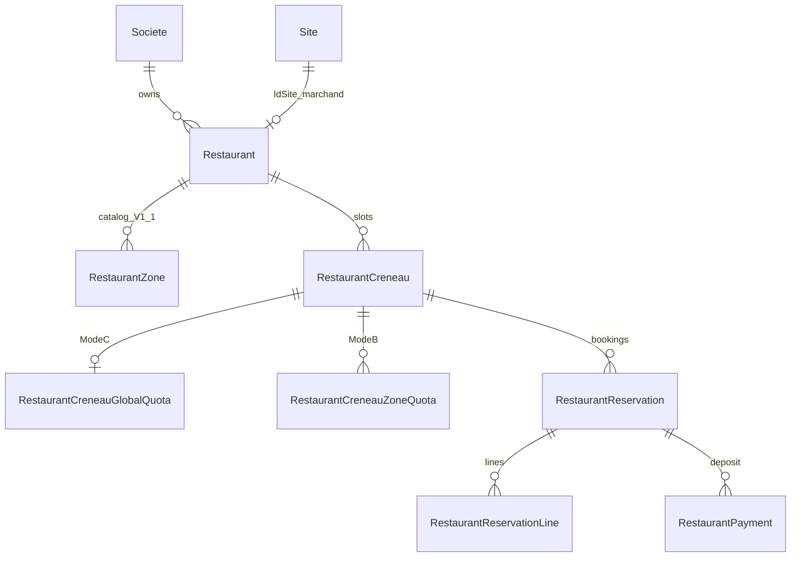

# ANALYSE V1 — Réservation Restaurant

## Contexte et objectif

Étendre la plateforme CongoTravel en **Partie 4** : réservation de **couverts** pour un restaurant (créneau horaire + acompte), sans impacter Transport, Événement ni Site Touristique.

Stratégie : **vertical isolé** (même approche qu’Evenement / Site Touristique) + pattern TicketingCore **documentaire uniquement** (pas de tables EF communes).

| Module | Rôle |
|--------|------|
| Transport | Réservation voyage — inchangé |
| Evenement | Billetterie sessions — inchangé |
| SiteTouristique | Accès lieu + journée — inchangé |
| **Restaurant** | Réservation couverts + créneau + acompte — **ce document** |
| Infra partagée | JWT/RBAC, `Societe`, `Site` (guichet), FlexPay client, SignalR hub, multi-devise |

---

## Décisions produit V1

| Choix | Décision |
|-------|----------|
| Inventaire | **Couverts par créneau** (`GlobalQuota`) — pas d’attribution de table numérotée à la réservation |
| Ensuite | **Zones** (`ClassQuota` : Terrasse / Salle…) en V1.1 |
| Plus tard | Tables numérotées (`RestaurantTable`), plan de salle, check-in salle |
| Paiement | **Acompte** CASH + FlexPay à la réservation (montant configurable) |
| Préfixe | `Restaurant*` + `/api/restaurants/*` |

**Pourquoi pas de table numérotée en V1 ?** Livraison plus rapide, alignée C→B ; l’attribution de table reste opérationnelle à l’arrivée.

---

## 0) Glossaire anti-collision

| Terme | Signifie | Ne pas confondre avec |
|-------|----------|------------------------|
| `Site` / `IdSite` | Guichet opérationnel / marchand FlexPay | L’établissement restaurant |
| `Restaurant` / `IdRestaurant` | Établissement (produit catalogue) | Table SQL générique / `Sites` |
| `RestaurantCreneau` | Offre sellable (date + plage horaire) | `SiteTouristiqueJournee` (journée sans heure) |
| `RestaurantZone` | Zone de salle (V1.1) | `EvenementClasse` / `SiteTouristiqueClasse` |
| `RestaurantTable` | Table numérotée (**hors V1**) | Mot-clé SQL `TABLE` ; éviter l’entité nue `Table` |
| `idReservation` (SignalR) | = `IdRestaurantReservation` | Transport / Evenement / SiteTouristique |

---

## 1) InventoryMode V1 (C puis B)

### Enum

- `GlobalQuota` (Mode C) : capacité globale de **couverts** du créneau.
- `ClassQuota` / zones (Mode B, V1.1) : capacité par `RestaurantZone`.
- **Pas de SeatNumbered / tables numérotées en V1.**

### Invariants

1. Pas de survente (`Hold + Vendue ≤ Capacité` en couverts).
2. Hold temporaire avant paiement d’acompte ; expiration automatique.
3. Confirmation d’acompte idempotente.
4. Annulation / expiration restitue les couverts.
5. Mode C : ligne `{ quantity }` (= nombre de couverts) ; Mode B : `{ zoneId, quantity }`.

---

## 2) Modèle domaine



| Entité | Analogie | Rôle |
|--------|----------|------|
| `Restaurant` | `SiteTouristiqueLieu` | Établissement : code, nom, adresse, statut, `IdSociete`, `IdSite`, acompte défaut (%) |
| `RestaurantCreneau` | `EvenementSession` / `Journee` | `DateService` + `StartAtUtc` / `EndAtUtc`, `InventoryMode`, statut, montant acompte |
| `RestaurantZone` | `EvenementClasse` | Catalogue zones (V1.1) |
| `*GlobalQuota` / `*ZoneQuota` | quotas billetterie | Capacité couverts + Hold/Vendue (+ prix unitaire acompte si besoin) |
| `RestaurantReservation` | résa billetterie | HOLD → CONFIRMED / EXPIRED / CANCELLED ; `NombreCouverts` ; `IdUtilisateur` |
| `RestaurantPayment` | paiement acompte | PENDING → SUCCEEDED / FAILED / REFUNDED |

**Pourquoi un `Creneau` et pas seulement une date ?** Le restaurant se réserve sur une **plage horaire** (ex. 19:00–21:00) ; c’est le cœur métier, absent du Site Touristique V1 « journée ».

### États

- Restaurant / Créneau : `Draft` → `Published` → `Closed` / `Cancelled`
- Réservation : `HOLD` → `CONFIRMED` | `EXPIRED` | `CANCELLED`
- Paiement acompte : `PENDING` → `SUCCEEDED` | `FAILED` | `REFUNDED`

### Tickets / gate

**Pas de ticket QR d’entrée en V1.** Confirmation = réservation confirmée + reçu acompte.  
Check-in salle optionnel V1.2 (`ArrivedAtUtc`).

### Config société

- `DureeHoldRestaurantMinutes` (défaut 15, clamp 1–120) — distinct des holds Evenement / Site Touristique.

---

## 3) Isolation technique

| Couche | Convention |
|--------|------------|
| Namespaces | `Models/Restaurant`, `Services/Restaurant`, `Helpers/Restaurant`, `DTOs/Restaurant` |
| Routes | `/api/restaurants/{etablissements\|zones\|creneaux\|reservations\|flexpay\|dashboard}` |
| DI | `AddRestaurantReservations()` |
| Permissions | `Restaurant.*` |
| EF | `CongoTravelDbContext.Restaurant.cs` |
| SQL | `Scripts/production_restaurant_*.sql` |
| FlexPay | `/api/restaurants/flexpay/*` + table `RestaurantPayments` |

**Ne pas** réutiliser : `Reservation` / `Billet` / `Evenement*` / `SiteTouristique*` / `CommandeReservationEnAttente` / `/api/FlexPay/*` / `/api/events/*` / `/api/sites-touristiques/*`.

**Partager uniquement** : JWT, `Societe`, `Site` (guichet), `IFlexPayService`, `IFlexPayRealtimeNotifier`, résolution marchand, convertisseur devise.

Pas d’abstraction générique TicketingCore en code V1 : **duplication assumée** du pattern.

---

## 4) Contrat API (résumé)

### Configuration back-office

1. `POST /api/restaurants/etablissements` → publish  
2. (V1.1) CRUD zones  
3. `POST /api/restaurants/creneaux` (Draft + quotas) → publish  
4. V1.1 : planification batch de créneaux multi-plages (`/api/restaurants/planifications`) — **fait** (Phase 6 planif)

### Façades achat acompte

- `POST /api/restaurants/reservations/with-paiement` (CASH)
- `POST /api/restaurants/reservations/with-paiement-electronique` (FlexPay)

Items Mode C :

```json
{ "quantity": 4 }
```

Items Mode B (V1.1) :

```json
{ "zoneId": 1, "quantity": 4 }
```

Montant facturé = **acompte** (créneau ou % défaut restaurant), pas l’addition repas.

### FlexPay

- Callback / verifier / abandon sous `/api/restaurants/flexpay/*`
- SignalR : `FlexPayPaymentConfirmed` / `FlexPayPaymentFailed`
- Corrélation front : `orderNumber` + `domain: 'restaurant'`
- Hold expiré → FAILED + SignalR Failed

### Permissions

| Permission | Usage |
|------------|--------|
| `Restaurant.Etablissement.Read` / `.Write` | Établissements, créneaux |
| `Restaurant.Zone.Read` / `.Write` | Zones V1.1 |
| `Restaurant.Hold.Create` | Avec Confirm pour façades |
| `Restaurant.Reservation.Confirm` | Acompte, verify, cancel |
| `Restaurant.Dashboard.Read` | Dashboard |

Client : Read + Hold.Create + Reservation.Confirm.

---

## 5) Orchestration inventaire

- Strategies `IRestaurantInventory{Hold|Confirm|Cancel}Strategy` + factories.
- Job : `RestaurantHoldExpirationHostedService` + `sp_ExpireRestaurantHolds` + FlexPay fail + SignalR.
- Tenancy : staff = JWT société ; Client catalogue Published cross-société ; achat = société du restaurant ; `IdUtilisateur` pour SignalR.

---

## 6) Phasage livraison

| Phase | Contenu |
|-------|---------|
| **0 — Analyse** | Ce document |
| **1 — Squelette** | Entités + EF + permissions + DI + CRUD établissement / créneau Draft + publish — **fait** (`Scripts/production_restaurant_v1.sql`, `Scripts/assign_restaurant_permissions_admin_gerant.sql`) |
| **2 — Mode C + acompte CASH** | Hold/confirm/cancel + façades CASH + expiration — **fait** (`Scripts/production_restaurant_phase2_reservations.sql`, `Scripts/production_restaurant_hold_expiration_procedure_only.sql`) |
| **3 — FlexPay acompte** | Init/callback/verifier + SignalR — **fait** (`/api/restaurants/flexpay/*`, `RestaurantFlexPay*`, kill-switch `FlexPay:RestaurantEnabled`) |
| **4 — Zones Mode B** | `RestaurantZone` + ZoneQuota — **fait** (`Scripts/production_restaurant_phase4_zones.sql`, `api/restaurants/zones`, ClassQuota strategies) |
| **5 — Dashboard + MODULE_11** | KPIs + guide Vue/Flutter — **fait** (`/api/restaurants/dashboard`, [`MODULE_11_RESTAURANT.md`](../09_frontend_integration/MODULE_11_RESTAURANT.md), [`DOCUMENTATION_WORKFLOW_RESTAURANT_V1.md`](../05_transport_sync/DOCUMENTATION_WORKFLOW_RESTAURANT_V1.md)) |
| **6+** | Planif batch créneaux ; `RestaurantTable` ; check-in salle |


---

## 7) Hors scope V1

- Menu / commande plats / addition complète
- Tables numérotées / plan de salle
- Ticket QR d’entrée
- Auto-publish / génération batch de créneaux (V1.1+)
- Partage de tables EF avec les autres verticaux

---

## 8) Risques

1. Ambiguïté front `idSite` (guichet) vs `idRestaurant` (établissement).
2. Acompte vs prix repas : documenter clairement que V1 ne gère pas l’addition.
3. Duplication vs SiteTouristique / Evenement — acceptable ; factoriser après 3+ verticaux stables.
4. Créneaux chevauchants : unique / règles métier à définir à l’implémentation (ex. pas de chevauchement Published pour le même resto).

---

## 9) Références

- Blueprint Evenement : [`ANALYSE_V1_BILLETTERIE_3_MODES_INVENTAIRE.md`](ANALYSE_V1_BILLETTERIE_3_MODES_INVENTAIRE.md)
- Site Touristique : [`ANALYSE_V1_SITE_TOURISTIQUE.md`](ANALYSE_V1_SITE_TOURISTIQUE.md)
- Front ST (miroir) : [`MODULE_10_SITE_TOURISTIQUE.md`](../09_frontend_integration/MODULE_10_SITE_TOURISTIQUE.md)
- Front Restaurant : [`MODULE_11_RESTAURANT.md`](../09_frontend_integration/MODULE_11_RESTAURANT.md)
- Workflow Restaurant : [`DOCUMENTATION_WORKFLOW_RESTAURANT_V1.md`](../05_transport_sync/DOCUMENTATION_WORKFLOW_RESTAURANT_V1.md)
