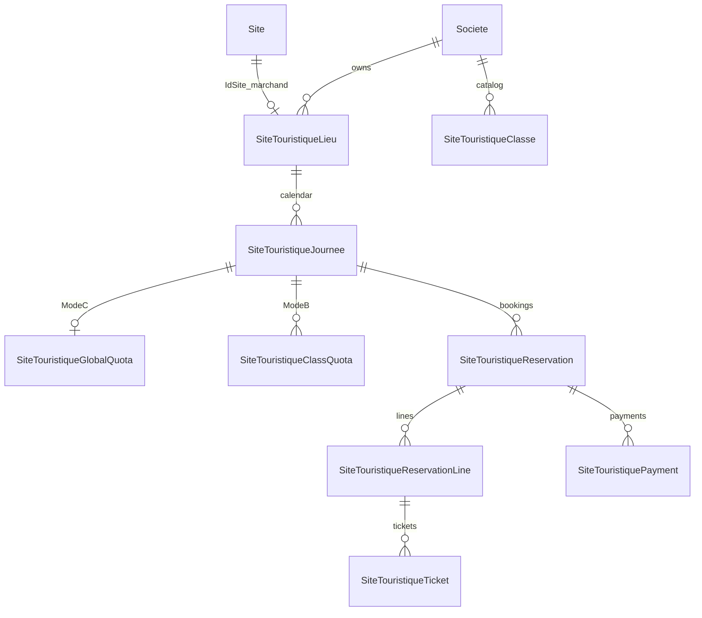

# ANALYSE V1 — Billetterie Site Touristique

## Contexte et objectif

Étendre la plateforme CongoTravel en **Partie 3** : vente de billets d’accès à un **site touristique** (parc, musée, monument…), sans impacter Transport (Partie 1) ni Événement (Partie 2).

**Partie 4** (Restaurant) : voir [`ANALYSE_V1_RESTAURANT.md`](ANALYSE_V1_RESTAURANT.md).

Stratégie : **vertical isolé** (même approche qu’Evenement) + pattern TicketingCore **documentaire uniquement** (pas de tables partagées).

| Module | Rôle |
|--------|------|
| Transport | Réservation voyage — inchangé |
| Evenement | Billetterie sessions — inchangé |
| **SiteTouristique** | Accès lieu + journée de visite — **ce document** |
| Infra partagée | JWT/RBAC, `Societe`, `Site` (guichet), FlexPay client, SignalR hub, multi-devise |

---

## 0) Glossaire anti-collision

| Terme | Signifie | Ne pas confondre avec |
|-------|----------|------------------------|
| `Site` / `IdSite` | Guichet opérationnel / marchand FlexPay | Le produit touristique |
| `SiteTouristique` / `IdSiteTouristique` | Lieu / attraction (produit) | Table `Sites` |
| `SiteTouristiqueLieu` | Classe C# du lieu (évite clash namespace) | Table SQL `SiteTouristiques` |
| `SiteTouristiqueJournee` | Offre sellable pour une **date** de visite | Session événement |
| `Destination` | Paire villes transport | POI touristique |

---

## 1) InventoryMode V1 (C puis B)

### Enum

- `GlobalQuota` (Mode C) : capacité globale de la journée.
- `ClassQuota` (Mode B) : capacité / prix par classe (Adulte, Enfant…).
- **Pas de `SeatNumbered` ni créneaux en V1.**

### Invariants

1. Pas de survente (`Hold + Vendue ≤ Capacité`).
2. Hold temporaire avant paiement ; expiration automatique.
3. Confirmation de paiement idempotente.
4. Annulation / expiration restitue la capacité.
5. Mode C : ligne `{ quantity }` ; Mode B : ligne `{ classId, quantity }`.

---

## 2) Modèle domaine



| Entité | Analogie Evenement | Rôle |
|--------|-------------------|------|
| `SiteTouristiqueLieu` | (catalogue lieu) | Produit permanent : code, nom, description, statut, `IdSociete`, `IdSite` |
| `SiteTouristiqueJournee` | `EvenementSession` | Date de visite + `InventoryMode` + statut Draft/Published/Closed/Cancelled |
| `SiteTouristiqueClasse` | `EvenementClasse` | Catalogue tarifs société |
| `*GlobalQuota` / `*ClassQuota` | idem | Capacité + prix + compteurs |
| `*Reservation` / `*Line` / `*Payment` / `*Ticket` | idem | Cycle HOLD → CONFIRMED / EXPIRED / CANCELLED ; tickets ISSUED → USED / VOID |

**Pourquoi une `Journee` ?** Chaque jour a sa capacité et ses compteurs atomiques, sans polluer le catalogue permanent du lieu.

### États

- Lieu / Journée : `Draft` → `Published` → `Closed` / `Cancelled`
- Réservation : `HOLD` → `CONFIRMED` | `EXPIRED` | `CANCELLED`
- Paiement : `PENDING` → `SUCCEEDED` | `FAILED` | `REFUNDED`
- Ticket : `ISSUED` → `USED` | `VOID`

### Config société

- `DureeHoldSiteTouristiqueMinutes` (défaut 15, clamp 1–120) — **distinct** de `DureeHoldEvenementMinutes`
- Entrée ticket V1 : jour UTC = `DateVisite` de la journée

---

## 3) Isolation technique

| Couche | Convention |
|--------|------------|
| Namespaces | `Models/SiteTouristique`, `Services/SiteTouristique`, `Helpers/SiteTouristique`, `DTOs/SiteTouristique` |
| Routes | `/api/sites-touristiques/{lieux\|journees\|classes\|reservations\|tickets\|flexpay\|dashboard}` |
| DI | `AddSiteTouristiqueTicketing()` |
| Permissions | `SiteTouristique.*` |
| EF | `CongoTravelDbContext.SiteTouristique.cs` |
| SQL | `Scripts/production_site_touristique_*.sql` |
| FlexPay | `/api/sites-touristiques/flexpay/*` + table `SiteTouristiquePayments` |

**Ne pas** réutiliser : `Reservation` / `Billet` / `Paiement` / `Evenement*` / `CommandeReservationEnAttente` / `/api/FlexPay/*` / `/api/events/*`.

**Partager uniquement** : JWT, `Societe`, `Site` (guichet), `IFlexPayService`, `IFlexPayRealtimeNotifier`, résolution marchand, convertisseur devise.

Pas d’abstraction générique `TicketingCore` en code V1 : **duplication assumée** du pattern Evenement ; factoriser plus tard si 3+ verticaux le justifient.

---

## 4) Contrat API (résumé)

### Façades achat

- `POST /api/sites-touristiques/reservations/with-paiement` (CASH)
- `POST /api/sites-touristiques/reservations/with-paiement-electronique` (FlexPay)

Items :

```json
// GlobalQuota
{ "quantity": 2 }

// ClassQuota
{ "classId": 1, "quantity": 2 }
```

### FlexPay

- Callback : `POST /api/sites-touristiques/flexpay/callback`
- Verifier : `GET /api/sites-touristiques/flexpay/verifier/{orderNumber}`
- SignalR : mêmes events `FlexPayPaymentConfirmed` / `FlexPayPaymentFailed` ; `idReservation` = `IdSiteTouristiqueReservation`
- Hold expiré (job) → payment FAILED + SignalR Failed

### Gate

- `GET /api/sites-touristiques/tickets/{code}/check`
- `POST /api/sites-touristiques/tickets/{code}/use`

### Permissions

| Permission | Usage |
|------------|--------|
| `SiteTouristique.Lieu.Read` / `.Write` | Lieux, journées, dispo |
| `SiteTouristique.Classe.Read` / `.Write` | Classes Mode B |
| `SiteTouristique.Hold.Create` | Avec Confirm pour les façades achat |
| `SiteTouristique.Reservation.Confirm` | Achat, verify, cancel |
| `SiteTouristique.Ticket.Check` / `.Use` | Contrôle entrée |
| `SiteTouristique.Dashboard.Read` | Dashboard |

Client : Read + Hold.Create + Reservation.Confirm (miroir Evenement).

---

## 5) Orchestration inventaire

Strategies `ISiteTouristiqueInventory{Hold|Confirm|Cancel}Strategy` + factories par mode.

Job : `SiteTouristiqueHoldExpirationHostedService` → `sp_ExpireSiteTouristiqueHolds` → FlexPay PENDING→FAILED + SignalR.

Tenancy : staff = JWT société ; Client catalogue Published cross-société ; achat rattaché à la société du lieu ; `IdUtilisateur` pour SignalR.

---

## 6) Phasage livraison

| Phase | Contenu | Statut cible |
|-------|---------|--------------|
| 0 | Cette analyse | Doc |
| 1 | Entités + EF + permissions + DI + CRUD lieu/journée | Code |
| 2 | GlobalQuota + CASH + tickets + expiration | Code |
| 3 | FlexPay + SignalR | Code |
| 4 | Classes + ClassQuota | Code |
| 5 | check/use + dashboard | Code |
| 6 | MODULE_10 front | Doc |

**Hors V1** : créneaux horaires, billet ouvert, photos lieu, SeatNumbered, Partie 4 Restaurant.

---

## 6bis) V1.1 — Planification (templates → génération batch)

Module isolé calqué sur `PlanificationVoyage` :

| Élément | Détail |
|---------|--------|
| Template | `SiteTouristiquePlanification` + quotas Global/Class (snapshot) |
| Génération | `POST /api/sites-touristiques/planifications/{id}/generer` |
| Résultat | Journées **Draft** idempotentes sur `(IdSiteTouristique, DateVisite)` |
| Fenêtres ventes | `SalesOpenOffsetHours` / `SalesCloseOffsetHours` dérivés par date |
| Update template | **ne mute pas** les journées déjà générées |
| Delete | soft-disable si réservations liées ; sinon hard delete (journées vides + template) |
| Script | `Scripts/production_site_touristique_planification_v1.sql` |

Permissions : `SiteTouristique.Lieu.Read` (GET) / `SiteTouristique.Lieu.Write` (CRUD + générer).

---

## 7) Scripts & déploiement

Voir [`Scripts/README_DEPLOIEMENT_SITE_TOURISTIQUE_V1.md`](../../../Scripts/README_DEPLOIEMENT_SITE_TOURISTIQUE_V1.md).

- `production_site_touristique_ticketing_v1.sql`
- `production_site_touristique_planification_v1.sql`
- `production_site_touristique_hold_expiration_procedure_only.sql`
- `production_site_touristique_hold_expiration_job.sql` (optionnel)
- `assign_site_touristique_permissions_admin_gerant.sql`

---

## 8) Risques

1. Ambiguïté front `idSite` (guichet) vs `idSiteTouristique` (produit) — documenter dans MODULE_10.
2. Duplication vs Evenement — acceptable ; revue factorisation après stabilisation.
3. Calendrier : V1 manuelle ; V1.1 batch via planification (Draft → Publish toujours manuel).

---

## 9) Références

- Workflow métier : [`DOCUMENTATION_WORKFLOW_SITE_TOURISTIQUE_V1.md`](../05_transport_sync/DOCUMENTATION_WORKFLOW_SITE_TOURISTIQUE_V1.md)
- Blueprint Evenement : [`ANALYSE_V1_BILLETTERIE_3_MODES_INVENTAIRE.md`](ANALYSE_V1_BILLETTERIE_3_MODES_INVENTAIRE.md)
- Front : [`MODULE_10_SITE_TOURISTIQUE.md`](../09_frontend_integration/MODULE_10_SITE_TOURISTIQUE.md)
- Evenement front : [`MODULE_05_EVENEMENT_BILLETTERIE.md`](../09_frontend_integration/MODULE_05_EVENEMENT_BILLETTERIE.md)
