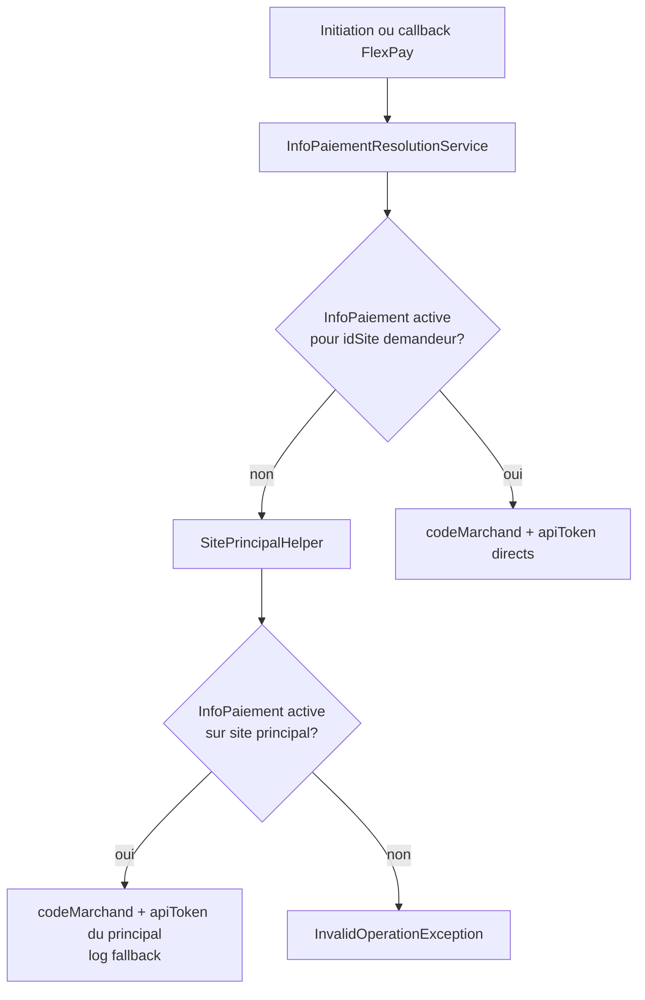
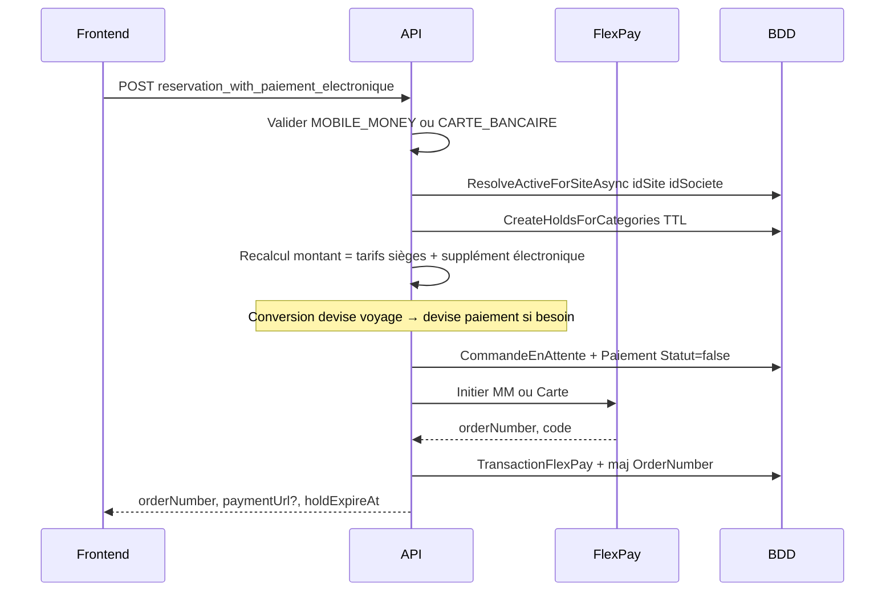
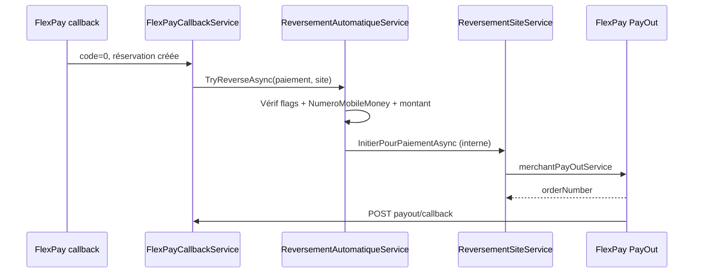

# Guide complet — Intégration FlexPay (paiement électronique) — CongoTravelAPI

Documentation portable pour intégrer **FlexPay** (Mobile Money + carte bancaire) dans **un autre projet**, en s’appuyant sur l’implémentation de référence CongoTravel (transport / réservations).

**Dernière mise à jour** : 28 mai 2026  
**Guide maître portage** : FlexPay + InfoPaiement + multi-devise + sites + PayOut + supplément électronique (ce document)  
**Référence prestataire (générique)** : [`Integration-FlexPay-From-LexMusicaAPI.md`](Integration-FlexPay-From-LexMusicaAPI.md)  
**Multi-devise (référence détaillée optionnelle)** : [`Integration-MultiDevise-From-CongoTravelAPI.md`](Integration-MultiDevise-From-CongoTravelAPI.md) — contenu canonique intégré en [§10](#10-multi-devise-et-flexpay)  
**PayOut / reversement site (détail métier)** : [`Documentation/Themes/06_facturation_paiement/FLEXPAY_PAYOUT_REVERSEMENT_SITE.md`](Documentation/Themes/06_facturation_paiement/FLEXPAY_PAYOUT_REVERSEMENT_SITE.md)  
**Intégration Flutter** : [`Documentation/Themes/09_frontend_integration/INTEGRATION_FLUTTER_FLEXPAY.md`](Documentation/Themes/09_frontend_integration/INTEGRATION_FLUTTER_FLEXPAY.md)  
**Scripts SQL** : [`Scripts/FlexPay-only-migrations.sql`](Scripts/FlexPay-only-migrations.sql), [`Scripts/production_payout_reversement_migrations.sql`](Scripts/production_payout_reversement_migrations.sql), [`Scripts/production_mont_add_paie_electronique_only.sql`](Scripts/production_mont_add_paie_electronique_only.sql), [`Scripts/verify-infopaiement-site-fallback.sql`](Scripts/verify-infopaiement-site-fallback.sql)  
**Règles opérationnelles** : [`Documentation/Themes/06_facturation_paiement/FLEXPAY_STATUT_PAIEMENT_RULES.md`](Documentation/Themes/06_facturation_paiement/FLEXPAY_STATUT_PAIEMENT_RULES.md)

---

## Résumé exécutif

| Élément | Valeur |
|---------|--------|
| Prestataire | FlexPay (RDC) — Mobile Money, Visa/Mastercard |
| Méthodes électroniques | `MOBILE_MONEY`, `CARTE_BANCAIRE` uniquement |
| Guichet | `CASH` — **sans** FlexPay (endpoint séparé) |
| Confirmation | Callback HTTPS public `POST /api/FlexPay/callback` (`code == "0"`) |
| Secours | `GET /api/FlexPay/verifier/{orderNumber}` (JWT) |
| Règle métier clé | **Réservation + billets uniquement après callback succès** |
| Attente | Holds sièges TTL + `CommandeReservationEnAttente` (pas de ligne `Reservation`) |
| Marchand | **1 config FlexPay par site** (`InfoPaiementSociete`) ; **repli site principal** si satellite sans config |
| Paiement | **Intégral uniquement** (pas de partiel FlexPay) |
| Devises FlexPay | `CDF` ou `USD` (choix client, conversion via taux société — voir [§10](#10-multi-devise-et-flexpay)) |
| Supplément électronique | `ConfigSociete.MontAddPaieElectronique` × `nombreDePlace` — **FlexPay uniquement**, pas CASH ([§6.4](#64-configsociete--supplément-et-reversement)) |
| Reversement site (PayOut) | Manuel (`POST /api/ReversementSite`) ou **auto** après callback succès ([§7.4](#74-reversement-automatique-post-callback)) |
| Bénéficiaire PayOut | `Site.NumeroMobileMoney` (jamais saisi dans le body reversement) |

**Démarrage rapide (autre projet)**

1. Lire les [décisions métier](#2-décisions-métier-validées) et l’[architecture](#3-architecture).
2. Appliquer le [schéma SQL](#6-modèle-de-données-et-sql) + [InfoPaiement / sites](#63-infopaiement-par-site-et-repli-site-principal).
3. Porter `FlexPayService` + `FlexPayCallbackService` + `InfoPaiementResolutionService` + config `appsettings`.
4. Exposer callback **HTTPS public** (`[AllowAnonymous]`).
5. Séparer strictement le flux **CASH** du flux **électronique**.
6. Configurer multi-devise ([§10](#10-multi-devise-et-flexpay)) si conversion CDF/USD requise.
7. Tester : initiation → callback `code=0` → idempotence (double callback) ; satellite sans InfoPaiement → repli principal.
8. Configurer `ConfigSociete` (supplément électronique, reversement auto) et `Sites.NumeroMobileMoney` si PayOut activé ([§6.4](#64-configsociete--supplément-et-reversement), [§7.4](#74-reversement-automatique-post-callback)).

---

## Table des matières

1. [Décisions métier validées](#2-décisions-métier-validées)
2. [Architecture](#3-architecture)
3. [API FlexPay externe (prestataire)](#4-api-flexpay-externe-prestataire)
4. [Configuration CongoTravel](#5-configuration-congotravel)
5. [Modèle de données et SQL](#6-modèle-de-données-et-sql) — incl. [§6.3 InfoPaiement / repli site principal](#63-infopaiement-par-site-et-repli-site-principal), [§6.4 ConfigSociete](#64-configsociete--supplément-et-reversement), [§6.5 ReversementsSite](#65-reversementssite-et-sitesnumeromobilemoney)
6. [Flux détaillés](#7-flux-détaillés) — incl. [§7.4 Reversement auto](#74-reversement-automatique-post-callback)
7. [Endpoints API CongoTravel](#8-endpoints-api-congotravel) — incl. [§8.6 PayOut / reversement](#86-reversement-site-payout), [§8.7 Config société](#87-config-société-flexpay--reversement)
8. [Isolation CASH / sync / reporting](#9-isolation-cash--sync--reporting)
9. [Multi-devise et FlexPay](#10-multi-devise-et-flexpay)
10. [Services .NET à porter](#11-services-net-à-porter)
11. [Intégration frontend](#12-intégration-frontend)
12. [Porter vers un autre projet](#13-porter-vers-un-autre-projet)
13. [Déploiement et exploitation](#14-déploiement-et-exploitation)
14. [Fichiers source](#15-fichiers-source)
15. [Checklist de validation](#16-checklist-de-validation)
16. [Glossaire](#17-glossaire)
17. [Annexe — exemples JSON portables](#18-annexe--exemples-json-portables)

---

## 2. Décisions métier validées

| # | Décision | Impact technique |
|---|----------|------------------|
| 1 | `CASH` ≠ FlexPay | Deux endpoints / deux services ; garde `MethodePaiementHelper` |
| 2 | Réservation **après** callback | Pas de `Reservation` ni billet avant `code == "0"` |
| 3 | Holds sièges pendant l’attente | Table `SiegeHoldEnAttente` + TTL (`FlexPay:SeatHoldMinutes`, défaut 15 min) |
| 4 | Pas de paiement partiel FlexPay | Montant serveur recalculé ; rejet si écart > tolérance |
| 5 | 1 marchand / site | Table `InfoPaiementSociete`, `UNIQUE (IdSite)` |
| 6 | Config marchand par super-admin | CRUD `InfoPaiementSociete` ; token jamais renvoyé en clair |
| 7 | Multi-devise au paiement | Client choisit `CodeDevisePaiement` ; conversion voyage → devise paiement |
| 8 | Idempotence callback | Pas de double réservation si FlexPay renvoie 2× le callback |
| 9 | Audit | `CallbackFlexPay` + `TransactionFlexPay` pour chaque tentative |
| 10 | Repli site principal | Satellite sans `InfoPaiement` active → config du site principal (`IsSitePrincipal`) ; `idSite` opérationnel = demandeur |
| 11 | Supplément paiement électronique | `montAddPaieElectronique × nombreDePlace` ajouté au montant FlexPay ; **exclu** du guichet CASH |
| 12 | Reversement PayOut | Virement Mobile Money vers `Site.NumeroMobileMoney` ; manuel ou auto post-callback |
| 13 | Part + frais reversement | `max(0, MontantPaye × % − FraisPlateforme converti)` sur le total encaissé (inclut supplément) |
| 14 | Réservation préservée si PayOut échoue | Échec reversement auto → log + statut `Echec` ; la réservation confirmée n’est **pas** annulée |

**Équivalent générique (autre domaine)** : remplacer *Réservation* par *Commande*, *Siège* par *Stock*, *Billet* par *Document*, *Site* par *Point de vente* — le pattern « en attente + callback + finalisation + résolution marchand » reste identique.

---

## 3. Architecture

```
┌──────────────┐     JWT      ┌─────────────────────────────────────────────┐
│   Frontend   │─────────────▶│ CongoTravel API                               │
│              │              │  POST .../reservation_with_paiement_electronique │
└──────┬───────┘              │       → FlexPayReservationService            │
       │                      │       → holds + CommandeEnAttente + Paiement   │
       │                      │       → FlexPayService → API FlexPay         │
       │                      └──────────────────┬──────────────────────────┘
       │                                         │
       │   CASH (guichet)                        │ Bearer + merchant/site
       ▼                                         ▼
 POST .../reservation_with_paiement      ┌───────────────┐
 (CashReservationWithPaiementService)    │  API FlexPay  │
       │                                  │  MM / Carte   │
       │ immédiat                         └───────┬───────┘
       ▼                                          │
 Réservation + sièges CONFIRME                     │ POST callback (sans JWT)
                                                    ▼
                                           ┌────────────────────┐
                                           │ POST /api/FlexPay/ │
                                           │      callback     │
                                           │ FlexPayCallback   │
                                           │ Service → Résa.   │
                                           └────────┬─────────┘
                                                    │ si auto activé
                                                    ▼
                                           ┌────────────────────┐
                                           │ ReversementAutomatique│
                                           │ → PayOut FlexPay →  │
                                           │ Site.NumeroMobileMoney│
                                           │ POST payout/callback│
                                           └────────────────────┘
```

**Flux PayOut (reversement)** — distinct du paiement entrant :

```
JWT  POST /api/ReversementSite  ──►  FlexPay merchantPayOutService  ──►  wallet site
                                              │
                                              ▼
                              POST /api/FlexPay/payout/callback (public)
```

### Couches

| Couche | Composant CongoTravel | Rôle |
|--------|----------------------|------|
| HTTP client | `FlexPayService` | Appels Mobile Money, Carte v1.1, Check |
| Initiation métier | `FlexPayReservationService` | Holds, commande en attente, appel FlexPay |
| Callback métier | `FlexPayCallbackService` | Audit, idempotence, réservation, billets |
| Disponibilité sièges | `ISiegeDisponibiliteService` | CONFIRME + holds non expirés |
| Guichet | `CashReservationWithPaiementService` | Wrapper CASH-only sur flux existant |
| Config marchand | `InfoPaiementSociete` + controller | Token / code marchand par site |
| Résolution marchand | `InfoPaiementResolutionService` | Direct site demandeur ou repli site principal |
| Site principal | `SitePrincipalHelper` | `IsSitePrincipal` + `Statut` par société |
| Supplément électronique | `ElectronicPaymentSupplementHelper` | Montant additionnel par place (FlexPay only) |
| Reversement manuel | `ReversementSiteService` | Initiation PayOut vers `NumeroMobileMoney` |
| Reversement auto | `ReversementAutomatiqueService` | Déclenché après callback paiement succès |
| Montant reversement | `PaiementElectroniqueReversementMontantResolver` | `% MontantPaye − FraisPlateforme` |
| Callback PayOut | `FlexPayPayOutCallbackService` | Finalise `ReversementsSite` |

---

## 4. API FlexPay externe (prestataire)

> Détail exhaustif (PayOut, tous les champs JSON, troubleshooting) : voir [`Integration-FlexPay-From-LexMusicaAPI.md`](Integration-FlexPay-From-LexMusicaAPI.md).

### 4.1 URLs (défaut CongoTravel)

| Usage | URL |
|-------|-----|
| Mobile Money | `https://backend.flexpay.cd/api/rest/v1/paymentService` |
| Carte v1.1 | `https://cardpayment.flexpay.cd/v1.1/pay` |
| Vérification | `https://apicheck.flexpaie.com/api/rest/v1/check/{orderNumber}` |
| **PayOut (reversement)** | `https://backend.flexpay.cd/api/rest/v1/merchantPayOutService` |

### 4.2 Mobile Money — corps envoyé

```json
{
  "merchant": "CODE_MARCHAND",
  "type": "1",
  "reference": "RT-abc123...",
  "phone": "243900000000",
  "amount": "71250",
  "currency": "CDF",
  "callbackUrl": "https://votre-api.example/api/FlexPay/callback",
  "return_url": "https://votre-api.example/api/FlexPay/callback"
}
```

- `amount` : entier pour **CDF** ; décimal pour **USD**.
- Header HTTP : `Authorization: Bearer {token}` (token marchand).

### 4.3 Carte bancaire v1.1 — corps envoyé

```json
{
  "authorization": "Bearer {token}",
  "merchant": "CODE_MARCHAND",
  "reference": "RT-abc123...",
  "amount": 25,
  "currency": "USD",
  "description": "Réservation voyage 42",
  "callback_url": "https://.../api/FlexPay/callback",
  "approve_url": "https://.../api/FlexPay/approve",
  "cancel_url": "https://.../api/FlexPay/cancel",
  "decline_url": "https://.../api/FlexPay/decline"
}
```

Réponse succès : `code == "0"`, `orderNumber`, souvent `paymentUrl` → rediriger le navigateur.

### 4.4 Callback FlexPay (entrant)

```json
{
  "code": "0",
  "reference": "RT-abc123def45678",
  "providerReference": "REF-OPERATEUR",
  "orderNumber": "FP123456789",
  "amount": "71250",
  "amountCustomer": "71250",
  "phone": "243900000000",
  "currency": "CDF",
  "createdAt": "2026-05-21T10:00:00",
  "channel": "orange"
}
```

| `code` | Signification |
|--------|----------------|
| `"0"` | Succès → finaliser la commande métier |
| Autre | Échec → libérer holds, marquer paiement en échec |

**Toujours répondre HTTP 200** au callback si le message est traité (même idempotent), pour éviter les retries infinies côté FlexPay.

### 4.5 Réponse initiation (`FlexPayPaymentResponseDto`)

| Champ | Description |
|-------|-------------|
| `code` | `"0"` = accepté par FlexPay |
| `message` | Message lisible |
| `orderNumber` | Identifiant transaction (à stocker) |
| `paymentUrl` / `redirectUrl` / `url` | Redirection carte (premier non vide) |

---

## 5. Configuration CongoTravel

### 5.1 `appsettings.json`

```json
{
  "FlexPay": {
    "Enabled": true,
    "SeatHoldMinutes": 15,
    "CallbackBaseUrl": "https://votre-domaine-api.example/api/FlexPay/callback",
    "MobileMoneyUrl": "https://backend.flexpay.cd/api/rest/v1/paymentService",
    "CardPaymentUrl": "https://cardpayment.flexpay.cd/v1.1/pay",
    "CheckTransactionUrl": "https://apicheck.flexpaie.com/api/rest/v1/check",
    "PayOutUrl": "https://backend.flexpay.cd/api/rest/v1/merchantPayOutService",
    "PayOutPendingMinutes": 15,
    "AutoReversementEnabled": true,
    "ForceProductionCallbackInDev": false
  }
}
```

| Clé | Description |
|-----|-------------|
| `Enabled` | `false` = refus initiation électronique (dev/local) |
| `SeatHoldMinutes` | Durée des holds sièges (défaut si non surchargé par `ConfigSociete.DureeHoldFlexPayMinutes`) |
| `CallbackBaseUrl` | URL **HTTPS publique** du callback paiement entrant (obligatoire en prod) |
| `PayOutUrl` | Endpoint FlexPay Merchant PayOut |
| `PayOutPendingMinutes` | Fenêtre anti double-clic reversement manuel `EnAttente` (défaut 15 min) |
| `AutoReversementEnabled` | Kill-switch **global** reversement auto post-paiement (défaut `true`) |
| `ForceProductionCallbackInDev` | En dev, utiliser `CallbackBaseUrl` même en localhost |

### 5.2 Callback URL en développement

Logique `FlexPayUrlHelper.ResolveCallbackUrl` :

| Contexte | URL utilisée |
|----------|----------------|
| Production | Toujours `CallbackBaseUrl` |
| Dev + host public (ngrok, domaine) | `{Scheme}://{Host}/api/FlexPay/callback` |
| Dev + localhost | `CallbackBaseUrl` (tunnel vers env accessible par FlexPay) |

Les URLs carte `approve` / `cancel` / `decline` sont dérivées de `CallbackBaseUrl` (suffixe `/callback` retiré).

### 5.3 Enregistrement DI (`Program.cs`)

```csharp
builder.Services.Configure<FlexPayOptions>(
    builder.Configuration.GetSection(FlexPayOptions.SectionName));
builder.Services.AddHttpClient("FlexPay");
builder.Services.AddScoped<IFlexPayService, FlexPayService>();
builder.Services.AddScoped<IFlexPayReservationService, FlexPayReservationService>();
builder.Services.AddScoped<IFlexPayCallbackService, FlexPayCallbackService>();
builder.Services.AddScoped<IFlexPayPayOutCallbackService, FlexPayPayOutCallbackService>();
builder.Services.AddScoped<ICashReservationWithPaiementService, CashReservationWithPaiementService>();
builder.Services.AddScoped<ISiegeDisponibiliteService, SiegeDisponibiliteService>();
builder.Services.AddScoped<IInfoPaiementResolutionService, InfoPaiementResolutionService>();
builder.Services.AddScoped<IReversementSiteService, ReversementSiteService>();
builder.Services.AddScoped<IReversementAutomatiqueService, ReversementAutomatiqueService>();
builder.Services.AddScoped<IReversementMontantResolver, PaiementElectroniqueReversementMontantResolver>();
builder.Services.AddScoped<IDeviseMontantConverter, DeviseMontantConverter>();
```

---

## 6. Modèle de données et SQL

### 6.1 Tables métier FlexPay

#### `CommandesReservationEnAttente`

Commande transport **non confirmée** (payload JSON complet).

| Colonne | Type | Description |
|---------|------|-------------|
| `IdCommandeReservationEnAttente` | GUID PK | |
| `IdSociete`, `IdSite`, `IdUtilisateur` | int | |
| `MethodePaiement` | string | `MOBILE_MONEY` / `CARTE_BANCAIRE` |
| `MontantVoyage`, `CodeDeviseVoyage` | | Tarif calculé côté voyage |
| `MontantFlexPay`, `CodeDevisePaiement` | | Montant envoyé à FlexPay |
| `TauxVersDevisePaiement` | decimal | Snapshot conversion |
| `OrderNumberFlexPay`, `ReferenceFlexPay` | string | Réf. FlexPay |
| `PayloadMetierJson` | longtext | Snapshot `InitiateFlexPayReservationDto` |
| `IdPaiementEnAttente` | int FK | Lien `Paiements` |
| `DateExpiration` | datetime | Aligné sur TTL holds |

#### `SiegeHoldsEnAttente`

| Colonne | Description |
|---------|-------------|
| `IdVoyage`, `IdSiege` | Siège bloqué |
| `IdCommandeReservationEnAttente` | Lien commande |
| `ExpireAt` | Fin du hold |

**Contrainte** : `UNIQUE (IdVoyage, IdSiege)` — un siège ne peut être hold qu’une fois par voyage.

#### `InfoPaiementsSociete`

Configuration marchand FlexPay **par site** (1 ligne max par `IdSite`).

| Colonne | Type | Description |
|---------|------|-------------|
| `IdInfoPaiementSociete` | int PK | |
| `IdSociete` | int FK | Société propriétaire |
| `IdSite` | int FK | **UNIQUE** — 1 marchand / site en admin |
| `CodeMarchand` | varchar(100) | Code FlexPay |
| `ApiToken` | varchar(500) | Bearer (stockage sécurisé ; masqué en API) |
| `ActifMobileMoney` | bool | Autoriser MM |
| `ActifCarteBancaire` | bool | Autoriser carte |
| `Statut` | bool | Config active (`false` = ignorée à la résolution) |
| `DateCreation`, `DateModification` | datetime | |

**Index** : `UNIQUE (IdSite)`.

> Voir [§6.3](#63-infopaiement-par-site-et-repli-site-principal) pour le **repli runtime** vers le site principal lorsque le satellite n’a pas de ligne active.

#### `TransactionsFlexPay`

Suivi technique par transaction (orderNumber, statuts, lien commande / paiement / réservation).

#### `CallbacksFlexPay`

Audit brut de chaque POST callback (payload, IP, succès traitement).

#### Extension `Paiements`

| Colonne | FlexPay |
|---------|---------|
| `Statut` | `false` à l’initiation, `true` au callback OK |
| `StatutPaiementMetier` | `EnAttente` → `Reussi` / `Echec` |
| `IdReservation` | `null` jusqu’au callback |

### 6.2 Migrations EF

| Migration | Contenu |
|-----------|---------|
| `20260524142738_FlexPayRegressionFoundation` | Holds, commandes en attente, `StatutPaiementMetier` |
| `20260524144823_FlexPayCallbackAndInfoPaiement` | `InfoPaiementSociete`, `TransactionsFlexPay`, `CallbacksFlexPay` |
| `20260618112928_SiteNumeroMobileMoney` | `Sites.NumeroMobileMoney` |
| `20260618124839_ReversementSiteFlexPayPayOut` | Table `ReversementsSite`, PayOut FlexPay |
| `20260618133404_ReversementAutoPaiementElectronique` | `ConfigSociete.AutoReversementPaiementElectronique` |
| `20260618134551_PourcentageReversementSiteConfig` | `ConfigSociete.PourcentageReversementSite` (défaut 100) |
| `20260618135910_FraisPlateformeConfig` | `ConfigSociete.FraisPlateforme`, `CodeDeviseFraisPlateforme` |
| `20260618171505_MontAddPaieElectroniqueConfig` | `ConfigSociete.MontAddPaieElectronique`, `CodeDeviseMontAddPaieElectronique` |

Scripts SQL autonomes :

| Script | Usage |
|--------|-------|
| [`Scripts/FlexPay-only-migrations.sql`](Scripts/FlexPay-only-migrations.sql) | DDL FlexPay initial (holds, InfoPaiement, callbacks) |
| [`Scripts/production_payout_reversement_migrations.sql`](Scripts/production_payout_reversement_migrations.sql) | **Complet** PayOut + ConfigSociete (6 migrations, idempotent MySQL 8+) |
| [`Scripts/production_config_societe_incremental.sql`](Scripts/production_config_societe_incremental.sql) | Incrémental ConfigSociete (%, frais, supplément) si PayOut déjà en prod |
| [`Scripts/production_mont_add_paie_electronique_only.sql`](Scripts/production_mont_add_paie_electronique_only.sql) | Uniquement `MontAddPaieElectronique` |

Migration colonne site principal : `SiteIsSitePrincipal` (`Sites.IsSitePrincipal`).

### 6.3 InfoPaiement par site et repli site principal

Lors d’un **paiement électronique** (initiation FlexPay ou callback / verifier), si le site demandeur n’a pas de `InfoPaiementSociete` **active**, le backend récupère automatiquement celle du **site principal actif** de la même société.



**Service** : `InfoPaiementResolutionService.ResolveActiveForSiteAsync(idSite, idSociete)`  
**Fichiers** : `Services/InfoPaiementResolutionService.cs`, `Helpers/SitePrincipalHelper.cs`

#### Règles

| Sujet | Comportement |
|-------|--------------|
| Site satellite sans ligne InfoPaiement | Repli vers site principal (`IsSitePrincipal = true`, `Statut = true`) |
| Satellite avec InfoPaiement **inactive** (`Statut = false`) | Traitée comme absente → **repli** |
| Satellite avec InfoPaiement **active** | Utilise **sa** config (pas de repli) |
| `idSite` sur réservation / paiement / commande en attente | Toujours le site **demandeur** (guichet satellite) |
| `codeMarchand` + `apiToken` FlexPay | Peuvent provenir du site principal en repli |
| API admin `GET /api/InfoPaiementSociete/site/{idSatellite}` | **404** si pas de ligne — normal : le repli n’apparaît qu’au runtime FlexPay |
| Log repli | `FlexPay InfoPaiement fallback — site demandeur X → site principal Y` |

#### Prérequis production

1. **Un** site avec `IsSitePrincipal = 1` et `Statut = 1` par société
2. `InfoPaiementSociete` **active** sur ce site principal (`Statut = 1`)
3. Nouveaux sites via `POST /api/Site` : `isSitePrincipal: false` par défaut — pas obligatoire de créer une InfoPaiement pour chaque satellite
4. Bootstrap société : le site créé à l’init est principal ; satellites ajoutés ensuite

#### Audit SQL (UAT / prod)

Script : [`Scripts/verify-infopaiement-site-fallback.sql`](Scripts/verify-infopaiement-site-fallback.sql)

- Sociétés avec 0 ou >1 site principal actif (anomalie)
- Site principal sans InfoPaiement active (repli impossible)
- Satellites actifs sans InfoPaiement propre (candidats repli attendu)

#### Rattrapage sociétés existantes (satellites)

Les satellites **n’ont pas besoin** d’une ligne InfoPaiement si le principal est configuré. Pour les sociétés sans site principal marqué, appliquer la migration `SiteIsSitePrincipal` et le script de backfill documenté dans `DOCUMENTATION_API_SITE.md`.

### 6.4 ConfigSociete — supplément et reversement

Champs exposés via `GET/PUT /api/Societe/{id}/config` et **snapshot sur les réponses Voyage** (`VoyageResponseDto` — listes, détail, paginé) :

| Champ API | Rôle | Défaut |
|-----------|------|--------|
| `montAddPaieElectronique` | Montant additionnel **par place** pour MOBILE_MONEY / CARTE_BANCAIRE | `0` |
| `codeDeviseMontAddPaieElectronique` | Devise du supplément (`CDF`, `USD`, ou `null` = devise du voyage) | `null` |
| `autoReversementPaiementElectronique` | Active le PayOut auto après callback FlexPay succès | `false` |
| `pourcentageReversementSite` | Part du `MontantPaye` à reverser (0–100 %) | `100` |
| `fraisPlateforme` | Montant fixe déduit du reversement | `0` |
| `codeDeviseFraisPlateforme` | Devise des frais (`CDF`, `USD`, ou `null` = devise du paiement) | `null` |

> Le supplément électronique n’est **pas** stocké sur la table `Voyages` : enrichissement runtime depuis `ConfigSociete` (`VoyageConfigEnrichmentHelper`).

**Formule montant attendu à l’initiation FlexPay** :

```
montantAttendu = tarifs sièges + (montAddPaieElectronique × nombreDePlace)
```

- Conversion du supplément en devise voyage via `TauxChanges` si besoin (`ElectronicPaymentSupplementHelper`).
- Le total est ensuite converti en `codeDevisePaiement` pour FlexPay.
- **Guichet CASH** : le supplément n’est **pas** appliqué.
- **Reversement auto** : le supplément est inclus dans `MontantPaye` après callback ; `%` et `fraisPlateforme` s’appliquent sur ce total.

### 6.5 ReversementsSite et Sites.NumeroMobileMoney

#### Extension `Sites`

| Colonne | Description |
|---------|-------------|
| `NumeroMobileMoney` | Wallet bénéficiaire PayOut (9–15 chiffres, ex. `243900000000`) — **jamais** saisi dans le body reversement |

#### Table `ReversementsSite`

| Colonne | Description |
|---------|-------------|
| `IdReversementSite` | PK |
| `IdSite`, `IdSociete`, `IdUtilisateur` | Traçabilité |
| `IdPaiement`, `IdReservation` | Lien reversement auto (nullable pour manuel) |
| `Origine` | `Manuel` ou `PaiementElectronique` |
| `NumeroMobileMoney` | Snapshot wallet au moment du PayOut |
| `Montant`, `CodeDevise` | Montant reversé |
| `Reference`, `OrderNumber`, `ProviderReference` | Références FlexPay |
| `Statut` | `0` EnAttente, `1` Succès, `2` Échec, `3` Annulé |
| `Motif` | Libellé libre (reversement manuel) |

Les callbacks PayOut sont audités dans `CallbacksFlexPay` (sans impact sur les réservations).

---

## 7. Flux détaillés

### 7.1 Initiation (`FlexPayReservationService.InitiateAsync`)



**Étapes serveur**

1. `MethodePaiementHelper.EnsureElectronicOnly`
2. `FlexPay:Enabled == true`
3. Résoudre marchand via `IInfoPaiementResolutionService.ResolveActiveForSiteAsync(idSite, idSociete)` (config directe ou repli site principal)
4. Vérifier `ActifMobileMoney` / `ActifCarteBancaire` sur la config **résolue**
5. Créer holds (`ISiegeDisponibiliteService.CreateHoldsForCategoriesAsync`)
6. Recalculer `montantAttendu` = tarifs sièges + supplément électronique (`ElectronicPaymentSupplementHelper`) — comparer à `dto.Paiement.MontantAPaye` (tolérance 0,05)
7. Conversion multi-devise si `CodeDeviseVoyage` ≠ `CodeDevisePaiement` ([§10](#10-multi-devise-et-flexpay))
8. Persister `CommandeReservationEnAttente` + `Paiement` (`Statut=false`, `StatutPaiementMetier=EnAttente`)
9. Appeler `IFlexPayService` (MM ou Carte) avec `codeMarchand` / token de la config résolue
10. Si `code != "0"` : libérer holds, lever erreur
11. Enregistrer `TransactionFlexPay`, mettre à jour `OrderNumberFlexPay`

### 7.2 Callback succès (`FlexPayCallbackService`)

1. Insérer `CallbackFlexPay` (audit).
2. **Idempotence** : si `Paiement.Statut == true` et `IdReservation` renseigné → `200` sans recréer.
3. Retrouver commande par `orderNumber` ou `reference`.
4. Si `code != "0"` : `MarkFailure` (release holds, échec paiement, supprimer commande).
5. Si `code == "0"` :
   - Valider montant callback vs `MontantFlexPay` (tolérance 0,05).
   - Désérialiser `PayloadMetierJson`.
   - Transaction DB : créer `Reservation` + passagers.
   - `ConfirmHoldsAsAllocationsAsync` → `VoyageSeatAllocation` CONFIRME.
   - Mettre à jour `Paiement` (intégral, `Statut=true`, `StatutPaiementMetier=Reussi`).
   - Supprimer `CommandeReservationEnAttente`.
   - Émettre billets (`BilletEmissionService`) hors transaction si échec billet non bloquant.
   - **Reversement auto** (si activé) : voir [§7.4](#74-reversement-automatique-post-callback).

### 7.3 Vérification manuelle (`VerifyAndFinalizeAsync`)

Si callback perdu : `GET` API FlexPay check → si statut `0`, rejouer la même logique que callback.

### 7.4 Reversement automatique (post-callback)

Déclenché **uniquement après** confirmation FlexPay (`POST /api/FlexPay/callback` avec `code=0`), une fois réservation et paiement finalisés — **pas** à l’initiation (`POST reservation_with_paiement_electronique`).



#### Conditions cumulatives

1. `FlexPay:Enabled` et `FlexPay:AutoReversementEnabled` = `true`
2. `ConfigSociete.AutoReversementPaiementElectronique` = `true` pour la société
3. `ConfigSociete.PourcentageReversementSite` > 0 (défaut 100 = totalité du `MontantPaye`)
4. Paiement électronique confirmé (`MOBILE_MONEY` ou `CARTE_BANCAIRE`)
5. Site avec `NumeroMobileMoney` valide
6. `InfoPaiementSociete` active (directe ou repli site principal)

#### Formule montant reversé

```
partPercent = MontantPaye × (PourcentageReversementSite / 100)
fraisConverti = FraisPlateforme converti en CodeDevisePaiement si besoin
montantReverse = max(0, partPercent − fraisConverti)
```

| MontantPaye | Devise | % | FraisPlateforme | Montant reversé |
|-------------|--------|---|-----------------|-----------------|
| 150 000 | CDF | 100 | 0 | 150 000 |
| 150 000 | CDF | 100 | 500 CDF | 149 500 |
| 150 000 | CDF | 95 | 500 CDF | 142 000 |

- Devise : `CodeDevisePaiement` du paiement (`CDF` ou `USD`)
- CDF : arrondi entier (exigence FlexPay) ; USD : 2 décimales
- Si conversion frais impossible (taux manquant) → pas de reversement auto (log warning)

#### Comportement

- Appel interne à `ReversementSiteService.InitierPourPaiementAsync` (pas d’appel HTTP vers `POST /api/ReversementSite`)
- Idempotence : un seul reversement par `IdPaiement` (callbacks FlexPay répétés ignorés)
- **Échec PayOut** : la réservation **reste confirmée** ; reversement marqué `Echec` ou log warning

---

## 8. Endpoints API CongoTravel

### 8.1 Initiation (JWT requis)

```http
POST /api/Reservation/reservation_with_paiement_electronique
Authorization: Bearer {token}
Content-Type: application/json
```

**Body**

> **Montant côté front** : lire le supplément depuis `VoyageResponseDto` (`GET /api/Voyage`) ou `GET /api/Societe/{id}/config` :
>
> ```
> montantAPaye = totalTarifsSieges + (montAddPaieElectronique × nombreDePlace)
> ```
>
> Puis convertir en `codeDevisePaiement` si différent de la devise voyage ([§10](#10-multi-devise-et-flexpay)). Si `montAddPaieElectronique = 0`, comportement inchangé (tarifs seuls).

```json
{
  "reservation": {
    "idVoyage": 10,
    "idClient": 5,
    "nombreDePlace": 1,
    "idUtilisateur": 3,
    "idSociete": 1,
    "idSite": 2,
    "passagers": [
      {
        "nomComplet": "Jean Dupont",
        "idCategorieSiege": 1,
        "telephone": "243900000000"
      }
    ]
  },
  "paiement": {
    "montantAPaye": 71250,
    "methodePaiement": "MOBILE_MONEY",
    "codeDevisePaiement": "CDF",
    "phone": "243900000000",
    "idUtilisateur": 3,
    "idSociete": 1,
    "idSite": 2
  }
}
```

**Réponse 200** — même enveloppe que `POST /api/Reservation/with-passengers-and-paiement` (`ReservationWithPaiementResponseDto`), avec `statut: "EnAttente"` et métadonnées FlexPay optionnelles.

```json
{
  "reservation": {
    "idReservation": 0,
    "idVoyage": 10,
    "idClient": 5,
    "idUtilisateur": 3,
    "idSociete": 1,
    "idSite": 2,
    "statutReservation": "EN_ATTENTE_PAIEMENT",
    "statut": false,
    "dateReservation": "2026-05-24T15:00:00Z",
    "dateCreation": "2026-05-24T15:00:00Z"
  },
  "paiement": {
    "idPaiement": 501,
    "montantAPaye": 71250,
    "montantPaye": 0,
    "statut": false,
    "idReservation": null,
    "referenceTransaction": "FP123456789"
  },
  "billets": [],
  "billet": null,
  "transactionId": "FP123456789",
  "statut": "EnAttente",
  "message": "Validez le paiement sur votre téléphone Mobile Money...",
  "dateCreation": "2026-05-24T15:00:00Z",
  "idCommandeReservationEnAttente": "3fa85f64-5717-4562-b3fc-2c963f66afa6",
  "orderNumberFlexPay": "FP123456789",
  "referenceFlexPay": "RT-3fa85f64-5717-45",
  "montantVoyage": 25,
  "codeDeviseVoyage": "USD",
  "montantFlexPay": 71250,
  "codeDevisePaiement": "CDF",
  "tauxApplique": 2850,
  "holdExpireAt": "2026-05-24T16:30:00Z",
  "paymentUrl": null,
  "flexPayAccepted": true
}
```

| Champ | Usage front |
|-------|-------------|
| `statut` | `"EnAttente"` tant que pas de callback ; ne pas exiger `reservation.idReservation > 0` |
| `transactionId` / `orderNumberFlexPay` | Polling `GET /api/FlexPay/verifier/{orderNumber}` |
| `paymentUrl` | Redirection si `CARTE_BANCAIRE` |
| `holdExpireAt` | Compte à rebours UI |
| `paiement.idPaiement` | Suivi paiement en attente |

### 8.2 Callback (public)

```http
POST /api/FlexPay/callback
Content-Type: application/json

{ "code": "0", "orderNumber": "...", "reference": "...", "amount": "71250", "currency": "CDF" }
```

**Réponse**

```json
{
  "message": "Réservation créée après confirmation FlexPay.",
  "result": {
    "success": true,
    "alreadyProcessed": false,
    "idReservation": 88,
    "idPaiement": 501
  }
}
```

### 8.3 Vérification (JWT)

```http
GET /api/FlexPay/verifier/FP123456789
Authorization: Bearer {token}
```

**Réponse pending** (200) — format court :

```json
{
  "success": true,
  "paymentPending": true,
  "message": "Paiement en attente de validation Mobile Money.",
  "idPaiement": 122
}
```

**Réponse succès** (200) — **`ReservationWithPaiementResponseDto`** (identique guichet, avec `billets`) :

```json
{
  "reservation": { "idReservation": 154, "statutReservation": "CONFIRMEE" },
  "paiement": { "idPaiement": 122, "statut": true },
  "billets": [{ "idBillet": 1, "qrCode": "..." }],
  "statut": "Succes",
  "transactionId": "FP123456789"
}
```

Détection côté front : présence de la clé `reservation` → parser `ReservationWithPaiementResponseDto` ; présence de `paymentPending` → continuer le polling.

### 8.4 Configuration marchand (super-admin)

| Méthode | Route |
|---------|-------|
| GET | `/api/InfoPaiementSociete/site/{idSite}` |
| POST | `/api/InfoPaiementSociete` |
| PUT | `/api/InfoPaiementSociete/{id}` |
| DELETE | `/api/InfoPaiementSociete/{id}` |

**Création**

```json
{
  "idSociete": 1,
  "idSite": 2,
  "codeMarchand": "MON_CODE",
  "apiToken": "Bearer xxxxx",
  "actifMobileMoney": true,
  "actifCarteBancaire": true,
  "statut": true
}
```

Réponse : `apiTokenMasked` uniquement (ex. `********1234`).

### 8.5 Guichet CASH (inchangé fonctionnellement)

```http
POST /api/Reservation/reservation_with_paiement
POST /api/Reservation/with-passengers-and-paiement
```

Uniquement `CASH` (ou alias espèces). Passe par `CashReservationWithPaiementService` → réservation immédiate. **Le supplément électronique ne s’applique pas.**

### 8.6 Reversement site (PayOut)

| Méthode | Route | Auth | Permission |
|---------|-------|------|------------|
| POST | `/api/ReversementSite` | JWT | `ReversementSite.Create` |
| GET | `/api/ReversementSite/{id}` | JWT | `ReversementSite.Read` |
| GET | `/api/ReversementSite/site/{idSite}?pageNumber=1&pageSize=20` | JWT | `ReversementSite.Read` |
| GET | `/api/ReversementSite/verifier/{orderNumber}` | JWT | `ReversementSite.Read` |

**Initiation manuelle**

```json
{
  "idSite": 71,
  "idSociete": 60,
  "montant": 150000,
  "codeDevise": "CDF",
  "motif": "Reversement recettes guichet"
}
```

- Le **bénéficiaire** est toujours `Site.NumeroMobileMoney` (lu côté serveur).
- Le marchand débiteur est résolu via `InfoPaiementSociete` (même repli site principal que les paiements entrants).

**Callback PayOut (public)**

```http
POST /api/FlexPay/payout/callback
Content-Type: application/json
```

Corps identique au callback paiement entrant (`code`, `reference`, `orderNumber`, montants, `phone`, `channel`). Toujours répondre HTTP 200 si traité.

`statut` reversement : `0` EnAttente, `1` Succès, `2` Échec, `3` Annulé.

### 8.7 Config société FlexPay / reversement

```http
GET /api/Societe/{idSociete}/config
PUT /api/Societe/{idSociete}/config
Authorization: Bearer {token}
```

Extrait body `PUT` :

```json
{
  "montAddPaieElectronique": 500,
  "codeDeviseMontAddPaieElectronique": "CDF",
  "autoReversementPaiementElectronique": true,
  "pourcentageReversementSite": 100,
  "fraisPlateforme": 500,
  "codeDeviseFraisPlateforme": "CDF"
}
```

Mettre à jour aussi `Sites.NumeroMobileMoney` via `PUT /api/Site/{id}` pour chaque site bénéficiaire de reversement.

---

## 9. Isolation CASH / sync / reporting

### 9.1 `MethodePaiementHelper`

| Méthode | Constante | FlexPay ? |
|---------|-----------|-----------|
| Guichet | `CASH` | Non |
| Mobile Money | `MOBILE_MONEY` | Oui |
| Carte | `CARTE_BANCAIRE` | Oui |

Garde-fous :

- `EnsureCashOnlyForGuichetEndpoint` — rejette MM/Carte sur endpoint CASH.
- `EnsureElectronicOnly` — rejette CASH sur endpoint électronique.
- `EnsureAllowedForSyncBatch` — rejette MM/Carte en sync offline.

### 9.2 Statuts paiement

| Champ | CASH | FlexPay initiation | FlexPay callback OK |
|-------|------|--------------------|---------------------|
| `Paiement.Statut` | `true` | `false` | `true` |
| `StatutPaiementMetier` | `Reussi` | `EnAttente` | `Reussi` |
| `IdReservation` | renseigné | `null` | renseigné |

**Reporting** (`FinanceReporting`, dashboards caissier) : filtrer `Statut == true` pour ne compter que l’argent réellement encaissé.

### 9.3 Sièges

| Flux | Sièges |
|------|--------|
| CASH | `VoyageSeatAllocation` CONFIRME immédiat |
| FlexPay attente | `SiegeHoldEnAttente` |
| FlexPay succès | Holds → CONFIRME |
| FlexPay échec / expiration | Holds supprimés |

`ISiegeDisponibiliteService` : indisponible = CONFIRME + holds non expirés.

---

## 10. Multi-devise et FlexPay

Module intégré au flux FlexPay : le client peut payer en **CDF** ou **USD** même si le voyage est tarifé dans l’autre devise.

**Principe fondamental** : ne jamais recalculer rétroactivement les montants passés — **figer le taux** et les montants convertis au moment de l’écriture (paiement, commande en attente, voyage).

Référence détaillée optionnelle : [`Integration-MultiDevise-From-CongoTravelAPI.md`](Integration-MultiDevise-From-CongoTravelAPI.md).

### 10.1 Concepts métier

| Concept | Description |
|---------|-------------|
| Devise principale | `Societe.CodeDevisePrincipale` (ex. `CDF`) — consolidation reporting |
| Devise d’origine | Devise saisie / affichée (prix voyage, paiement guichet, devise FlexPay choisie) |
| Snapshot | Copie figée à l’écriture : `CodeDevisePrincipale`, `TauxVersDevisePrincipale`, montants `*DevisePrincipale` |
| Taux | Table `TauxChanges` : paire orientée `Source → Cible`, `DateEffet`, historique |

### 10.2 Tables multi-devise

#### `DevisesMonetaires`

| Colonne | Description |
|---------|-------------|
| `IdSociete`, `CodeDevise` | **UNIQUE (IdSociete, CodeDevise)** |
| `Libelle`, `Symbole`, `Statut` | Référentiel par société |

#### `TauxChanges`

| Colonne | Description |
|---------|-------------|
| `IdSociete`, `CodeDeviseSource`, `CodeDeviseCible` | Paire orientée |
| `Taux` | `decimal(18,8)` — multiplicateur source → cible |
| `DateEffet`, `Statut` | Dernier taux avec `DateEffet <= dateRéférence` gagne |

#### Extensions liées au FlexPay

| Entité | Colonnes snapshot / conversion |
|--------|-------------------------------|
| `Paiements` | `CodeDevisePaiement`, `CodeDevisePrincipale`, `TauxVersDevisePrincipale`, `Montant*DevisePrincipale` |
| `Voyages` | `CodeDevisePrix`, `PrixDevisePrincipale`, taux snapshot |
| `CommandesReservationEnAttente` | `MontantVoyage`/`CodeDeviseVoyage`, `MontantFlexPay`/`CodeDevisePaiement`, `TauxVersDevisePaiement` |

Scripts SQL portage : `deploy_multidevise_phase1.sql`, `deploy_multidevise_phase23.sql`, `deploy_multidevise_full.sql`.

### 10.3 Algorithme de conversion

**Vers devise principale** (paiement guichet, voyage, preview) :

```
1. codePrincipale ← Societe.CodeDevisePrincipale (défaut CDF)
2. Si codeSource == codePrincipale → taux = 1
3. Sinon : dernier TauxChanges (Source→Principale, Statut, DateEffet <= dateRef)
4. montantConverti = Round(montantSource × taux, 2)
```

**Entre deux devises arbitraires** (FlexPay : voyage USD → paiement CDF) — `FlexPayReservationService.ConvertMontantAsync` :

```
1. Tenter taux direct : Source=voyage, Cible=paiement
2. Sinon taux inverse : Source=paiement, Cible=voyage → utiliser 1/taux
3. Sinon ERREUR métier
4. Si CodeDevisePaiement == CDF → Round(montant, 0) pour FlexPay / Mobile Money
```

**Date de référence** : `DatePaiement` (paiement), `DateDepart` (voyage), `UtcNow` (preview UI).

### 10.4 API Devise (référentiel + preview)

Route de base : `/api/Devise` — JWT (Admin, Super-Admin, Gérant).

| Méthode | Route | Description |
|---------|-------|-------------|
| GET | `/devises` | Devises actives (scope utilisateur) |
| GET | `/devises/societe/{idSociete}` | Liste par société |
| POST | `/taux-change` | Créer taux |
| GET | `/taux-change?idSociete=&source=&cible=` | Dernier taux de la paire |
| GET | `/preview-conversion?idSociete=&codeDeviseSource=&montant=&datePaiement=` | Simulation UI |

Exemple preview — voir [§18.4](#184-preview-conversion-multi-devise).

### 10.5 FlexPay + multi-devise (scénario complet)

Voyage tarifé en **USD**, paiement Mobile Money en **CDF**, supplément 500 CDF/place :

1. Calcul total passagers en `CodeDeviseVoyage` (tarifs sièges).
2. Ajouter supplément : `montAddPaieElectronique × nombreDePlace` (converti en devise voyage si besoin).
3. Client envoie `codeDevisePaiement: "CDF"` et `montantAPaye` dans cette devise (total incluant supplément).
4. Serveur convertit voyage → paiement via `TauxChanges` (direct ou inverse).
5. `MontantFlexPay` arrondi à l’entier si CDF.
6. Initiation FlexPay avec montant / devise paiement ; snapshot sur `CommandeReservationEnAttente`.
7. Au callback : validation montant callback vs `MontantFlexPay` (tolérance 0,05) ; `MontantPaye` inclut le supplément.
8. Si reversement auto activé : PayOut sur `% × MontantPaye − FraisPlateforme` ([§7.4](#74-reversement-automatique-post-callback)).

Champs réponse initiation typiques : `montantVoyage`, `codeDeviseVoyage`, `montantFlexPay`, `codeDevisePaiement`, `tauxApplique`.

Champs voyage (preview UI) : `montAddPaieElectronique`, `codeDeviseMontAddPaieElectronique` sur `VoyageResponseDto`.

### 10.6 Données initiales minimales (autre projet)

```sql
UPDATE Societes SET CodeDevisePrincipale = 'CDF' WHERE CodeDevisePrincipale IS NULL OR CodeDevisePrincipale = '';

INSERT INTO DevisesMonetaires (IdSociete, CodeDevise, Libelle, Symbole, Statut, DateCreation)
VALUES
  (1, 'CDF', 'Franc congolais', 'FC', 1, UTC_TIMESTAMP()),
  (1, 'USD', 'Dollar américain', '$', 1, UTC_TIMESTAMP());

INSERT INTO TauxChanges (IdSociete, CodeDeviseSource, CodeDeviseCible, Taux, DateEffet, Statut, DateCreation)
VALUES
  (1, 'USD', 'CDF', 2850.50, UTC_TIMESTAMP(), 1, UTC_TIMESTAMP()),
  (1, 'CDF', 'USD', 0.00035088, UTC_TIMESTAMP(), 1, UTC_TIMESTAMP());
```

### 10.7 Anti-patterns multi-devise

- Recalculer les montants historiques quand le taux change.
- Stocker uniquement la devise principale (perte d’audit).
- Oublier l’arrondi CDF pour FlexPay / Mobile Money.
- Supposer un taux bidirectionnel sans ligne inverse ou sans logique `1/taux`.
- Compter les paiements `Statut=false` (FlexPay en attente) dans le CA consolidé.

---

## 11. Services .NET à porter

| Interface / classe | Fichier | Priorité |
|--------------------|---------|----------|
| `IFlexPayService` | `Services/IFlexPayService.cs` | P0 |
| `FlexPayService` | `Services/FlexPayService.cs` | P0 |
| `IFlexPayCallbackService` | `Services/Repositories/IFlexPayCallbackService.cs` | P0 |
| `FlexPayCallbackService` | `Services/FlexPayCallbackService.cs` | P0 |
| `IFlexPayReservationService` | `Services/Repositories/IFlexPayReservationService.cs` | P0 |
| `FlexPayReservationService` | `Services/FlexPayReservationService.cs` | P0 — adapter domaine |
| `ISiegeDisponibiliteService` | `Services/SiegeDisponibiliteService.cs` | P0 si stock limité |
| `MethodePaiementHelper` | `Helpers/MethodePaiementHelper.cs` | P0 |
| `FlexPayUrlHelper` | `Helpers/FlexPayUrlHelper.cs` | P1 |
| `FlexPayTokenMaskHelper` | `Helpers/FlexPayTokenMaskHelper.cs` | P1 |
| `IInfoPaiementResolutionService` | `Services/Repositories/IInfoPaiementResolutionService.cs` | P0 |
| `InfoPaiementResolutionService` | `Services/InfoPaiementResolutionService.cs` | P0 — repli site principal |
| `SitePrincipalHelper` | `Helpers/SitePrincipalHelper.cs` | P0 si multi-sites |
| `CashReservationWithPaiementService` | `Services/CashReservationWithPaiementService.cs` | P0 pour non-régression |
| `ElectronicPaymentSupplementHelper` | `Helpers/ElectronicPaymentSupplementHelper.cs` | P1 — supplément par place |
| `VoyageConfigEnrichmentHelper` | `Helpers/VoyageConfigEnrichmentHelper.cs` | P1 — expose supplément sur VoyageResponseDto |
| `IReversementSiteService` | `Services/IReversementSiteService.cs` | P1 si PayOut |
| `ReversementSiteService` | `Services/ReversementSiteService.cs` | P1 — PayOut manuel + auto |
| `IReversementAutomatiqueService` | `Services/IReversementAutomatiqueService.cs` | P1 — post-callback |
| `PaiementElectroniqueReversementMontantResolver` | `Services/PaiementElectroniqueReversementMontantResolver.cs` | P1 — formule % − frais |
| `IFlexPayPayOutCallbackService` | `Services/IFlexPayPayOutCallbackService.cs` | P1 |
| `FlexPayPayOutCallbackService` | `Services/FlexPayPayOutCallbackService.cs` | P1 |
| `IDeviseMontantConverter` | `Services/DeviseMontantConverter.cs` | P1 — conversion supplément + frais |
| `DeviseController` + conversion | `Controllers/DeviseController.cs` | P1 si multi-devise |

**Adapter dans un autre projet** : remplacer la finalisation callback (`FinalizeSuccessAsync`) par votre use case (création commande, facture, licence, etc.) en conservant le pattern audit + idempotence.

---

## 12. Intégration frontend

### Mobile Money

1. Lire `montAddPaieElectronique` sur le voyage (`GET /api/Voyage/{id}`) ou config société.
2. Calculer `montantAPaye = tarifs sièges + (montAddPaieElectronique × nombreDePlace)` puis convertir en devise paiement si besoin.
3. Appeler `POST .../reservation_with_paiement_electronique`.
4. Afficher instructions : « Validez sur votre téléphone ».
5. Proposer lien / bouton « J’ai payé » → `GET /api/FlexPay/verifier/{orderNumber}`.
6. Optionnel : SignalR `/hubs/notifications` — événements `FlexPayPaymentConfirmed` / `FlexPayPaymentFailed`.

### Carte bancaire

1. Même initiation.
2. Rediriger vers `paymentUrl`.
3. Pages `approve` / `cancel` / `decline` informatives (pas de création auto réservation — le **callback serveur** fait foi).

### UX

- Afficher `montantFlexPay` + `codeDevisePaiement` après preview multi-devise.
- Afficher le détail supplément si `montAddPaieElectronique > 0` (ligne séparée dans le récap).
- Timer `holdExpireAt`.
- Désactiver le bouton payer si `FlexPay:Enabled` false côté config.
- **Ne pas** naviguer vers l’écran billet tant que `statut != Succes` ou `billets` vide (`billets: []` normal au POST).

Guide Flutter détaillé : [`Documentation/Themes/09_frontend_integration/INTEGRATION_FLUTTER_FLEXPAY.md`](Documentation/Themes/09_frontend_integration/INTEGRATION_FLUTTER_FLEXPAY.md).

---

## 13. Porter vers un autre projet

### Mapping conceptuel

| CongoTravel | Votre projet (exemple) |
|------------|-------------------------|
| `CommandeReservationEnAttente` | `OrderPending`, `CartPending` |
| `SiegeHoldEnAttente` | `InventoryHold` |
| `Reservation` | `Order`, `Subscription` |
| `Billet` | `Ticket`, `License` |
| `InfoPaiementSociete` | `MerchantConfig` par magasin |

### Checklist

- [ ] Séparer endpoint CASH et électronique.
- [ ] Tables en attente + audit callback + transaction FlexPay.
- [ ] Holds ressource limitée avec TTL.
- [ ] Callback HTTPS public + `[AllowAnonymous]`.
- [ ] Idempotence sur finalisation.
- [ ] Recalcul montant serveur (anti-fraude).
- [ ] Config marchand par point de vente / tenant + **repli site principal** si satellites sans config.
- [ ] Pas de paiement partiel FlexPay.
- [ ] Tests : initiation, callback OK, double callback, échec, expiration hold, **satellite sans InfoPaiement**.
- [ ] Multi-devise : taux seed + preview + voyage USD / paiement CDF ([§10](#10-multi-devise-et-flexpay)).
- [ ] Supplément électronique : montant rejeté si `montantAPaye` sans supplément alors que config > 0.
- [ ] CASH : supplément **non** appliqué (non-régression guichet).
- [ ] PayOut : `NumeroMobileMoney` sur site + reversement manuel OK.
- [ ] Reversement auto : callback succès → PayOut si flags activés ; idempotence par `IdPaiement`.
- [ ] Callback PayOut public `POST /api/FlexPay/payout/callback` → statut reversement mis à jour.

### Anti-patterns

- Créer la commande métier avant le callback.
- Réutiliser l’endpoint guichet pour Mobile Money.
- Exposer le token marchand en GET API.
- Oublier l’arrondi CDF.
- Compter les paiements `Statut=false` dans le CA.

---

## 14. Déploiement et exploitation

### Prérequis production

- [ ] `FlexPay:Enabled = true`
- [ ] `CallbackBaseUrl` HTTPS valide et routé vers l’API (paiement entrant **et** PayOut si activé)
- [ ] **Site principal actif** (`IsSitePrincipal = true`) avec `InfoPaiementSociete` **active** (satellites peuvent s’en resservir)
- [ ] `Sites.NumeroMobileMoney` renseigné pour les sites bénéficiaires de reversement
- [ ] `ConfigSociete` : supplément, reversement auto, `%`, frais plateforme selon politique métier
- [ ] Taux USD↔CDF (ou paires utilisées) configurés si multi-devise
- [ ] Migrations SQL appliquées (FlexPay + PayOut + `SiteIsSitePrincipal` + multi-devise si besoin)
- [ ] Redémarrage API après déploiement (seeder permissions `ReversementSite.*`)
- [ ] Firewall : autoriser callbacks entrants FlexPay (IPs prestataire si liste fournie)

### Monitoring

- Taux `CallbacksFlexPay.TraiteAvecSucces = false`
- Commandes en attente expirées (holds purgés)
- Écart montant callback vs attendu
- Volume `StatutPaiementMetier = Echec`

### Dev / ngrok

Utiliser `CallbackBaseUrl` pointant vers tunnel public ou `ForceProductionCallbackInDev: true`.

---

## 15. Fichiers source

| Fichier | Rôle |
|---------|------|
| `Services/FlexPayService.cs` | Client HTTP FlexPay |
| `Services/FlexPayReservationService.cs` | Initiation |
| `Services/FlexPayCallbackService.cs` | Callback + verify |
| `Services/CashReservationWithPaiementService.cs` | Garde CASH |
| `Services/SiegeDisponibiliteService.cs` | Holds + disponibilité |
| `Controllers/FlexPayController.cs` | Callback paiement + PayOut / verifier |
| `Controllers/ReversementSiteController.cs` | Reversement manuel |
| `Controllers/ReservationController.cs` | Endpoints réservation |
| `Controllers/InfoPaiementSocieteController.cs` | Config marchand |
| `Controllers/SocieteController.cs` | Config société (supplément, reversement) |
| `Services/InfoPaiementResolutionService.cs` | Résolution marchand + repli |
| `Services/ReversementSiteService.cs` | PayOut manuel + auto |
| `Services/ReversementAutomatiqueService.cs` | Déclenchement post-callback |
| `Services/PaiementElectroniqueReversementMontantResolver.cs` | Formule % − frais |
| `Services/FlexPayPayOutCallbackService.cs` | Callback PayOut |
| `Helpers/SitePrincipalHelper.cs` | Site principal actif |
| `Helpers/ElectronicPaymentSupplementHelper.cs` | Supplément par place |
| `Helpers/VoyageConfigEnrichmentHelper.cs` | Enrichissement VoyageResponseDto |
| `Helpers/MethodePaiementHelper.cs` | Normalisation méthodes |
| `Helpers/FlexPayUrlHelper.cs` | URLs callback |
| `Models/CommandeReservationEnAttente.cs` | |
| `Models/SiegeHoldEnAttente.cs` | |
| `Models/TransactionFlexPay.cs` | |
| `Models/CallbackFlexPay.cs` | |
| `Models/InfoPaiementSociete.cs` | |
| `Models/ReversementSite.cs` | |
| `Models/DTOs/FlexPay/FlexPayDtos.cs` | DTOs callback / config |
| `Models/DTOs/Reservation/InitiateFlexPayReservationDto.cs` | DTO initiation |
| `Models/DTOs/Voyage/VoyageResponseDto.cs` | `montAddPaieElectronique` snapshot config |
| `Configuration/FlexPayOptions.cs` | Options (PayOut, auto reversement) |
| `Tests/FlexPayRegressionTests.cs` | Tests non-régression FlexPay |
| `Tests/ReversementSiteTests.cs` | Tests PayOut + reversement auto |
| `Tests/ElectronicPaymentSupplementTests.cs` | Tests supplément électronique |
| `Tests/InfoPaiementResolutionServiceTests.cs` | Tests repli site principal |
| `Scripts/FlexPay-only-migrations.sql` | DDL FlexPay initial |
| `Scripts/production_payout_reversement_migrations.sql` | DDL PayOut + ConfigSociete (prod) |
| `Scripts/production_mont_add_paie_electronique_only.sql` | DDL supplément seul |
| `Scripts/verify-infopaiement-site-fallback.sql` | Audit sites / InfoPaiement |
| `Scripts/verify-flexpay-callback-state.sql` | Audit post-callback |
| `SMOKE_INFOPAIEMENT_SITE_FALLBACK.http` | Smoke satellite FlexPay |
| `Controllers/DeviseController.cs` | API multi-devise |
| `deploy_multidevise_phase1.sql` / `phase23.sql` | DDL multi-devise |

---

## 16. Checklist de validation

- [ ] `POST` électronique avec `MOBILE_MONEY` + téléphone → push FlexPay
- [ ] `POST` électronique avec `CARTE_BANCAIRE` → `paymentUrl`
- [ ] `POST` guichet avec `CASH` → réservation immédiate (non régression)
- [ ] `POST` guichet avec `MOBILE_MONEY` → **400**
- [ ] Callback `code=0` → réservation + billets + holds libérés
- [ ] Second callback → `alreadyProcessed: true`, une seule réservation
- [ ] Callback échec → pas de réservation, holds libérés
- [ ] `GET verifier` après succès FlexPay check API
- [ ] Sync batch avec MM → rejeté
- [ ] Dashboard CA : paiements en attente exclus
- [ ] Voyage USD + paiement CDF : montants cohérents
- [ ] `GET /api/Devise/preview-conversion` : conversion cohérente avec initiation FlexPay
- [ ] Site satellite **sans** InfoPaiement propre → initiation FlexPay OK (`paiement.idSite` = satellite)
- [ ] Log serveur : `FlexPay InfoPaiement fallback` lors du test satellite
- [ ] `GET /api/InfoPaiementSociete/site/{idSatellite}` → 404 attendu si pas de ligne admin
- [ ] Voyage avec `montAddPaieElectronique > 0` : montant initiation inclut supplément × places
- [ ] CASH guichet : montant **sans** supplément électronique
- [ ] Reversement auto : PayOut déclenché après callback si config activée + `NumeroMobileMoney` OK
- [ ] Second reversement auto même `IdPaiement` → ignoré (idempotence)
- [ ] `POST /api/ReversementSite` manuel → callback PayOut met statut à Succès
- [ ] `GET /api/Voyage/{id}` expose `montAddPaieElectronique` et `codeDeviseMontAddPaieElectronique`

---

## 17. Glossaire

| Terme | Définition |
|-------|------------|
| OrderNumber | Identifiant unique transaction FlexPay |
| Reference | Référence marchand (ex. `RT-{guid}`) |
| Hold | Verrou temporaire d’une ressource (siège) |
| Callback | Notification serveur-à-serveur post-paiement |
| Idempotence | Traiter 2× le même callback sans effet de bord |
| Devise paiement | Devise réellement débitée sur FlexPay |
| Site principal | Site `IsSitePrincipal = true` actif — source du repli InfoPaiement |
| Résolution marchand | `ResolveActiveForSiteAsync` : config directe ou fallback principal |
| Snapshot devise | Taux et montants convertis figés à l’écriture (non recalculés) |
| Supplément électronique | Montant additionnel par place (`MontAddPaieElectronique`) — FlexPay uniquement |
| PayOut | Virement FlexPay Merchant vers wallet Mobile Money du site |
| Reversement auto | PayOut déclenché après callback paiement succès (flags société + global) |
| NumeroMobileMoney | Wallet bénéficiaire reversement sur l’entité Site |

---

## 18. Annexe — exemples JSON portables

### 18.1 Initiation FlexPay (satellite, MOBILE_MONEY + CDF)

```http
POST /api/Reservation/reservation_with_paiement_electronique
Authorization: Bearer {tokenClient}
Content-Type: application/json
```

```json
{
  "reservation": {
    "idVoyage": 10,
    "idClient": 5,
    "nombreDePlace": 1,
    "idUtilisateur": 3,
    "idSociete": 1,
    "idSite": 99,
    "passagers": [
      {
        "idClient": 5,
        "idCategorieSiege": 1,
        "nomComplet": "Passager satellite FlexPay"
      }
    ]
  },
  "paiement": {
    "montantAPaye": 71250,
    "montantPaye": 71250,
    "methodePaiement": "MOBILE_MONEY",
    "phone": "+243900000001",
    "codeDevisePaiement": "CDF",
    "idUtilisateur": 3,
    "idSociete": 1,
    "idSite": 99
  }
}
```

`idSite: 99` = satellite sans InfoPaiement propre → repli vers site principal attendu.

### 18.2 Callback FlexPay succès

```json
{
  "code": "0",
  "reference": "RT-3fa85f64-5717-45",
  "providerReference": "REF-OPERATEUR",
  "orderNumber": "FP123456789",
  "amount": "71250",
  "amountCustomer": "71250",
  "phone": "243900000001",
  "currency": "CDF",
  "createdAt": "2026-05-21T10:00:00",
  "channel": "orange"
}
```

### 18.3 Callback FlexPay échec

```json
{
  "code": "1",
  "orderNumber": "FP123456789",
  "reference": "RT-3fa85f64-5717-45",
  "amount": "71250",
  "currency": "CDF"
}
```

### 18.4 Preview conversion multi-devise

```http
GET /api/Devise/preview-conversion?idSociete=1&codeDeviseSource=USD&montant=25&datePaiement=2026-05-08T10:30:00Z
Authorization: Bearer {token}
```

```json
{
  "idSociete": 1,
  "codeDeviseSource": "USD",
  "codeDevisePrincipale": "CDF",
  "datePaiement": "2026-05-08T10:30:00Z",
  "taux": 2850.50,
  "montantSource": 25,
  "montantConverti": 71262.50
}
```

### 18.5 Création InfoPaiement (super-admin)

```json
{
  "idSociete": 1,
  "idSite": 1,
  "codeMarchand": "MON_CODE_MARCHAND",
  "apiToken": "votre_token_bearer_flexpay",
  "actifMobileMoney": true,
  "actifCarteBancaire": true,
  "statut": true
}
```

Réponse : `apiTokenMasked` uniquement (ex. `********1234`).

### 18.6 Config société — supplément + reversement auto

```http
PUT /api/Societe/1/config
Authorization: Bearer {tokenAdmin}
Content-Type: application/json
```

```json
{
  "montAddPaieElectronique": 500,
  "codeDeviseMontAddPaieElectronique": "CDF",
  "autoReversementPaiementElectronique": true,
  "pourcentageReversementSite": 95,
  "fraisPlateforme": 500,
  "codeDeviseFraisPlateforme": "CDF"
}
```

### 18.7 Voyage — champs supplément (réponse API)

Extrait `GET /api/Voyage/41` :

```json
{
  "id": 41,
  "prix": 50000,
  "codeDevisePrix": "CDF",
  "montAddPaieElectronique": 500,
  "codeDeviseMontAddPaieElectronique": "CDF"
}
```

Fichiers smoke : [`SMOKE_INFOPAIEMENT_SITE_FALLBACK.http`](SMOKE_INFOPAIEMENT_SITE_FALLBACK.http).

---

*Document généré pour faciliter la réutilisation du module FlexPay CongoTravelAPI dans d’autres applications. Pour PayOut détaillé, voir [`FLEXPAY_PAYOUT_REVERSEMENT_SITE.md`](Documentation/Themes/06_facturation_paiement/FLEXPAY_PAYOUT_REVERSEMENT_SITE.md). Pour les détails API FlexPay bruts, compléter avec le guide LexMusica.*
