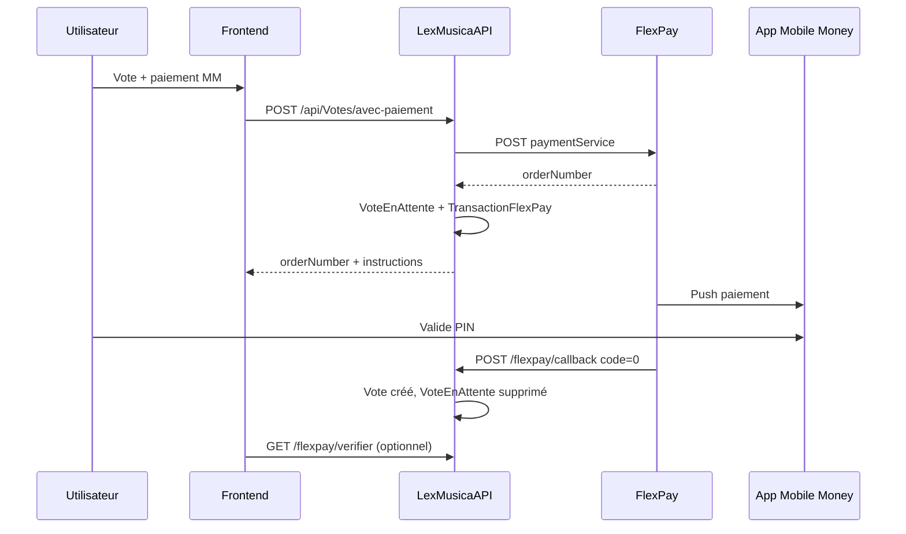
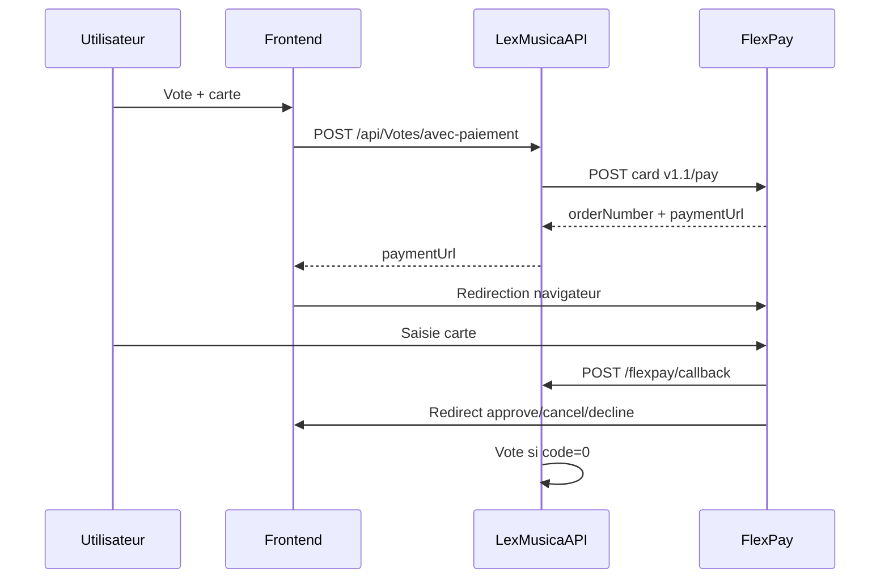
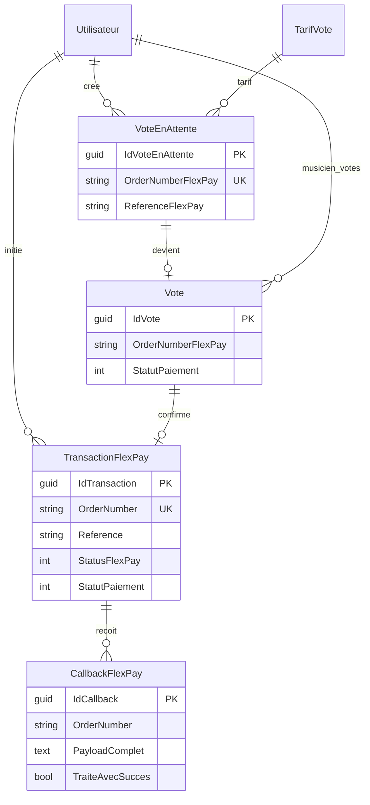

# Guide complet FlexPay — LexMusicaAPI

> **Implémentation transport (CongoTravel)** : voir [`Integration-FlexPay-From-CongoTravelAPI.md`](Integration-FlexPay-From-CongoTravelAPI.md)  
> (réservations, holds sièges, callback, `InfoPaiementSociete`, isolation CASH).

Documentation unique : intégration FlexPay (Mobile Money, carte bancaire, PayOut), endpoints, flux métier, frontend, scripts SQL (générique + LexMusica).

**Dernière mise à jour** : mai 2026  
**Version** : 2.0 (documentation consolidée)  
**Référence code** : `Services/FlexPayService.cs`, `Controllers/FlexPayController.cs`, `Controllers/VotesController.cs`  
**Script SQL tout-en-un** : `Scripts/FlexPay-Integration-Complete.sql`

---

## Résumé exécutif

| Élément | Valeur |
|---------|--------|
| Prestataire | FlexPay (RDC) — Mobile Money, Visa/Mastercard, PayOut |
| Initiation paiement | JWT — `POST /api/FlexPay/*` ou `POST /api/Votes/avec-paiement` |
| Confirmation paiement | Callback public — `POST /api/Votes/flexpay/callback` (`code == "0"`) |
| Secours | `GET /api/Votes/flexpay/verifier/{orderNumber}` |
| Tables BDD | `TransactionFlexPay`, `CallbackFlexPay`, `VoteEnAttente` + colonnes sur `Vote` |
| Règle métier | Le `Vote` n'est créé **qu'après** confirmation FlexPay |

**Démarrage rapide (autre projet)**

1. Copier `FlexPayService.cs` + DTOs + config `FlexPay` dans appsettings.
2. Exécuter `Scripts/FlexPay-Integration-Complete.sql` (ou section 8.2 schéma générique).
3. Exposer callback HTTPS public `[AllowAnonymous]`.
4. Tester avec `LexMusicaAPI.http` (section 22).

---

## Table des matières

1. [Vue d'ensemble](#1-vue-densemble)
2. [Architecture](#2-architecture)
3. [Configuration](#3-configuration)
4. [API FlexPay externe](#4-api-flexpay-externe)
5. [Endpoints LexMusicaAPI](#5-endpoints-lexmusicaapi)
6. [Flux métier complet](#6-flux-métier-complet)
7. [Modèle de données](#7-modèle-de-données)
8. [Scripts SQL complets](#8-scripts-sql-complets)
9. [Intégration dans un autre projet](#9-intégration-dans-un-autre-projet)
10. [Frontend](#10-frontend)
11. [Paiement par carte bancaire (détaillé)](#11-paiement-par-carte-bancaire-détaillé)
12. [Pièges et bonnes pratiques](#12-pièges-et-bonnes-pratiques)
13. [Checklist déploiement](#13-checklist-déploiement)
14. [Gestion des erreurs et debugging](#14-gestion-des-erreurs-et-debugging)
15. [Fichiers source](#15-fichiers-source)
16. [FlexPayService — référence complète](#16-flexpayservice--référence-complète)
17. [Catalogue des DTOs](#17-catalogue-des-dtos)
18. [Entités, repositories et DbContext](#18-entités-repositories-et-dbcontext)
19. [Mapping des statuts](#19-mapping-des-statuts)
20. [POST /api/Votes (création flexible)](#20-post-apivotes-création-flexible)
21. [Endpoints de test (Health)](#21-endpoints-de-test-health)
22. [Exemples LexMusicaAPI.http](#22-exemples-lexmusicaapihttp)
23. [EF Core et migration manuelle](#23-ef-core-et-migration-manuelle)
24. [Réponses API complètes (exemples)](#24-réponses-api-complètes-exemples)
25. [Script SQL tout-en-un](#25-script-sql-tout-en-un)
26. [Interface IFlexPayService](#26-interface-iflexpayservice)
27. [Diagramme entité-relation](#27-diagramme-entité-relation)
28. [Glossaire](#28-glossaire)
29. [Support](#29-support)

---

## 1. Vue d'ensemble

**FlexPay** est le prestataire de paiement utilisé pour :

- **Mobile Money** (Orange, Airtel, M-Pesa, Afrimoney, etc.) — push sur le téléphone du client
- **Carte bancaire** (Visa, Mastercard) — redirection vers une page sécurisée FlexPay
- **PayOut** — envoi d'argent électronique vers un numéro Mobile Money

L'intégration LexMusicaAPI repose sur **trois couches** :

| Couche | Rôle |
|--------|------|
| **API FlexPay** (externe) | Initie les paiements, envoie les callbacks, expose la vérification de statut |
| **`FlexPayService`** | Client HTTP .NET (token, format JSON, montants, logs) |
| **Métier + BDD** | Commande en attente, traitement callback, finalisation, audit |

**Principe fondamental** : ne jamais valider une commande métier (vote, facture, etc.) tant que FlexPay n'a pas confirmé le paiement (`code == "0"` dans le callback ou statut `0` via l'API check).

---

## 2. Architecture

```
Frontend (Vue.js, mobile, etc.)
        │
        ▼
┌───────────────────┐
│   Votre API       │  JWT sur initiation
│   (LexMusicaAPI)  │
└─────────┬─────────┘
          │ HTTP + Bearer token
          ▼
┌───────────────────┐
│   API FlexPay     │  Mobile Money / Carte / Check
└─────────┬─────────┘
          │
          ▼
   Opérateur MM / Banque
          │
          │ POST callback (sans auth)
          ▼
┌───────────────────┐
│  /flexpay/callback│  → BDD : CallbackFlexPay, TransactionFlexPay
│                   │  → Métier : créer entité ou supprimer "en attente"
└───────────────────┘
```

### Séquence type (Mobile Money)



1. Client appelle `POST /api/Votes/avec-paiement` (ou `POST /api/Votes` avec `typePaiement`).
2. L'API appelle FlexPay → reçoit `orderNumber`.
3. L'API crée `VoteEnAttente` + `TransactionFlexPay`.
4. FlexPay envoie un push à l'opérateur mobile.
5. Le client valide sur son téléphone.
6. FlexPay appelle `POST /api/Votes/flexpay/callback` avec `code: "0"`.
7. L'API crée le `Vote` définitif et supprime `VoteEnAttente`.

### Séquence type (Carte bancaire)



1. Mêmes étapes 1–3, avec en plus `paymentUrl` dans la réponse.
2. Le frontend redirige l'utilisateur vers `paymentUrl`.
3. Après paiement : callback serveur + redirection navigateur vers `approve` / `cancel` / `decline`.

---

## 3. Configuration

### 3.1 appsettings.json

```json
{
  "FlexPay": {
    "ApiToken": "Bearer VOTRE_TOKEN_FLEXPAY",
    "MobileMoneyUrl": "https://backend.flexpay.cd/api/rest/v1/paymentService",
    "CardPaymentUrl": "https://cardpayment.flexpay.cd/v1.1/pay",
    "CardPaymentV2Url": "https://cardpayment.flexpay.cd/v2/pay",
    "CheckTransactionUrl": "https://apicheck.flexpaie.com/api/rest/v1/check",
    "Merchant": "VOTRE_CODE_MERCHANT",
    "CallbackBaseUrl": "https://votre-domaine-api.example/api/Votes/flexpay/callback",
    "ForceProductionCallbackInDev": false
  }
}
```

Voir aussi `appsettings.Production.example.json` à la racine du projet.

| Clé | Description |
|-----|-------------|
| `ApiToken` | Token marchand FlexPay. Peut inclure `Bearer ` — le service le retire puis le renvoie correctement |
| `MobileMoneyUrl` | Endpoint Mobile Money et PayOut |
| `CardPaymentUrl` | Carte bancaire **v1.1** (utilisé en production LexMusica) |
| `CardPaymentV2Url` | Carte v2 (optionnel ; non branché par défaut dans le constructeur) |
| `CheckTransactionUrl` | Base URL pour `GET .../check/{orderNumber}` |
| `Merchant` | Code marchand par défaut |
| `CallbackBaseUrl` | URL **HTTPS publique** du callback (obligatoire en prod) |
| `ForceProductionCallbackInDev` | Si `true`, utilise `CallbackBaseUrl` même en développement |

### 3.2 Secrets en production

- Stocker `ApiToken` dans `appsettings.Local.json` sur le serveur (non écrasé par le ZIP de déploiement).
- Ne jamais committer le token réel.

### 3.3 Enregistrement des services (Program.cs)

```csharp
builder.Services.AddHttpClient<IFlexPayService, FlexPayService>();
builder.Services.AddScoped<ITransactionFlexPayRepository, TransactionFlexPayRepository>();
builder.Services.AddScoped<ICallbackFlexPayRepository, CallbackFlexPayRepository>();
builder.Services.AddScoped<IVoteEnAttenteRepository, VoteEnAttenteRepository>();
```

### 3.4 Callback en développement

FlexPay **rejette** les URLs avec `localhost`, `127.0.0.1` ou IP privée (`10.x`, `192.168.x`, `172.16–31.x`).

Solutions :

- Utiliser **ngrok** (ou équivalent) et pointer `CallbackBaseUrl` vers l'URL publique du tunnel.
- Ou définir `ForceProductionCallbackInDev: true` pour pointer vers l'API de staging/production (le callback mettra à jour la BDD distante).

---

## 4. API FlexPay externe

Tous les appels utilisent :

- Header : `Authorization: Bearer {token}`
- Header : `Accept: application/json`
- Body : `Content-Type: application/json`

### 4.1 Mobile Money

**POST** `{MobileMoneyUrl}`

| Champ | Obligatoire | Notes |
|-------|-------------|-------|
| `merchant` | Oui | Code marchand |
| `type` | Oui | `"1"` = Mobile Money |
| `reference` | Oui | **Maximum ~20 caractères** |
| `phone` | Oui | Chiffres uniquement, ex. `243900000000` |
| `amount` | Oui | **String** : `"10"` pas `"10.00"` si montant entier |
| `currency` | Oui | `CDF` ou `USD` |
| `callbackUrl` | Oui | camelCase, **sans** underscore |
| `return_url` | Oui | En pratique = même URL que `callbackUrl` |

Exemple corps :

```json
{
  "merchant": "CABINET_DANL",
  "type": "1",
  "reference": "VOTE-abc123def45678",
  "phone": "243900000000",
  "amount": "10",
  "currency": "USD",
  "callbackUrl": "https://api.example.com/api/Votes/flexpay/callback",
  "return_url": "https://api.example.com/api/Votes/flexpay/callback"
}
```

Réponse :

```json
{
  "code": "0",
  "message": "Opération réussie",
  "orderNumber": "FP123456789"
}
```

- `code = "0"` → initiation acceptée (push demandé à l'opérateur).
- `code != "0"` → erreur, aucun push.

### 4.2 Carte bancaire v1.1 (production LexMusica)

**POST** `{CardPaymentUrl}`

| Champ | Format |
|-------|--------|
| `authorization` | `"Bearer {token}"` **dans le corps JSON** |
| `merchant`, `reference`, `amount`, `currency`, `description` | |
| `callback_url`, `approve_url`, `cancel_url`, `decline_url` | **snake_case** |

Le token est aussi envoyé dans le header `Authorization`.

`amount` : nombre entier si possible (`25` au lieu de `25.00`).

Réponse : `code`, `message`, `orderNumber`, et éventuellement `url` / `paymentUrl` / `redirectUrl`.

### 4.3 PayOut

Même endpoint (`MobileMoneyUrl`) et structure que Mobile Money (`type: "1"`), avec `callbackUrl` + `return_url`.

**POST** `/api/FlexPay/PayOut` — corps identique à MobilePay (merchant, reference, phone, amount, currency, callbackUrl). Le merchant par défaut vient de la configuration (`FlexPay:Merchant`), pas du body pour l'appel service interne PayOut.

Utilisé pour envoyer de l'argent électronique au client (remboursement, gain, etc.).

### 4.4 Vérification du statut

**GET** `{CheckTransactionUrl}/{orderNumber}`

Réponse :

```json
{
  "code": "0",
  "message": "Transaction trouvée",
  "transaction": {
    "reference": "VOTE-abc123def45678",
    "orderNumber": "FP123456789",
    "status": "0",
    "amount": "10.00",
    "amountCustomer": "10.00",
    "currency": "USD",
    "createdAt": "2026-05-21T10:00:00",
    "channel": "orange"
  }
}
```

### 4.5 Codes `status` (transaction)

| status | Signification |
|--------|----------------|
| `0` | Succès |
| `1` | Échec |
| `2` | En attente |
| `3` | Remboursement en cours |
| `4` | Remboursé |
| `5` | Annulé |

### 4.6 Canaux (`channel`)

Exemples : `mpesa`, `orange`, `airtel`, `afrimoney`, `mastercard`, `visa`.

---

## 5. Endpoints LexMusicaAPI

### 5.1 Proxy FlexPay (JWT requis)

Base : `/api/FlexPay`

| Méthode | Route | Description |
|---------|-------|-------------|
| POST | `/MobilePay` | Initier Mobile Money |
| POST | `/CardPay` | Initier paiement carte (v1.1) |
| POST | `/PayOut` | Initier PayOut |

#### POST `/api/FlexPay/MobilePay`

```json
{
  "merchant": "CABINET_DANL",
  "reference": "VOTE-abc123def45678",
  "phone": "243900000000",
  "amount": 10,
  "currency": "USD",
  "callbackUrl": "https://api.example.com/api/Votes/flexpay/callback"
}
```

Réponse :

```json
{
  "code": "0",
  "message": "...",
  "orderNumber": "FP123456789",
  "debug": { "callbackUrl": "...", "returnUrlIncluded": true, ... }
}
```

#### POST `/api/FlexPay/CardPay`

```json
{
  "merchant": "CABINET_DANL",
  "reference": "VOTE-abc123def45678",
  "amount": 25,
  "currency": "USD",
  "description": "Vote VIP",
  "callbackUrl": "https://api.example.com/api/Votes/flexpay/callback",
  "approveUrl": "https://api.example.com/api/Votes/flexpay/approve",
  "cancelUrl": "https://api.example.com/api/Votes/flexpay/cancel",
  "declineUrl": "https://api.example.com/api/Votes/flexpay/decline"
}
```

#### POST `/api/FlexPay/PayOut`

Même structure que MobilePay (merchant, reference, phone, amount, currency, callbackUrl).

### 5.2 Flux métier votes (JWT requis)

Base : `/api/Votes`

| Méthode | Route | Description |
|---------|-------|-------------|
| POST | `/avec-paiement` | Initie paiement + crée `VoteEnAttente` + `TransactionFlexPay` |
| GET | `/flexpay/verifier/{orderNumber}` | Vérifie statut chez FlexPay + met à jour BDD |
| GET | `/attente/{idVoteEnAttente}` | Détail d'un vote en attente |
| GET | `/attente/orderNumber/{orderNumber}` | Vote en attente par OrderNumber FlexPay |
| GET | `/attente/utilisateur` | Liste des votes en attente de l'utilisateur connecté |
| POST | `/` (body avec `typePaiement`) | Création flexible → redirige vers `avec-paiement` si paiement détecté |

#### POST `/api/Votes/avec-paiement`

```json
{
  "idMusicien": "uuid-musicien",
  "idTarifVote": "uuid-tarif",
  "typePaiement": "mobile_money",
  "phone": "243900000000",
  "langue": 0
}
```

`typePaiement` accepté (normalisé côté serveur) :

- Mobile Money : `mobile_money`, `orange money`, `airtel money`, `mpesa`, etc.
- Carte : `carte`, `carte bancaire`, `card`

Réponse succès (extrait) :

```json
{
  "voteEnAttenteId": "uuid",
  "orderNumberFlexPay": "FP123456789",
  "referenceFlexPay": "VOTE-abc123def45678",
  "paiement": {
    "orderNumber": "FP123456789",
    "paymentUrl": null,
    "statut": "Push message envoyé - En attente de validation",
    "verificationUrl": "/api/Votes/flexpay/verifier/FP123456789"
  }
}
```

Pour la carte, `paymentUrl` contient l'URL de redirection FlexPay.

### 5.3 Endpoints publics (sans JWT)

| Méthode | Route | Appelé par |
|---------|-------|------------|
| POST | `/api/Votes/flexpay/callback` | Serveur FlexPay |
| GET | `/api/Votes/flexpay/approve?orderNumber=` | Navigateur (retour succès) |
| GET | `/api/Votes/flexpay/cancel?orderNumber=` | Navigateur (annulation) |
| GET | `/api/Votes/flexpay/decline?orderNumber=` | Navigateur (refus) |

#### Callback — corps attendu

```json
{
  "code": "0",
  "reference": "VOTE-abc123def45678",
  "providerReference": "REF-OPERATEUR",
  "orderNumber": "FP123456789",
  "amount": "10",
  "amountCustomer": "10",
  "phone": "243900000000",
  "currency": "USD",
  "createdAt": "2026-05-21T10:00:00",
  "channel": "orange"
}
```

Traitement :

- `code == "0"` → créer `Vote`, lier `TransactionFlexPay.IdVote`, supprimer `VoteEnAttente`.
- `code != "0"` → supprimer `VoteEnAttente`, conserver l'historique dans `CallbackFlexPay`.

Réponse : `200 OK` avec `{ "message": "Callback traité avec succès" }`.

> **Important** : il n'existe **pas** d'endpoint `GET /api/FlexPay/check/{orderNumber}` dans `FlexPayController`. La vérification côté LexMusica se fait via `GET /api/Votes/flexpay/verifier/{orderNumber}` ou directement `IFlexPayService.VerifierStatutTransactionAsync` (tests Health).

### 5.4 Codes HTTP par endpoint

| Endpoint | Succès | Erreurs fréquentes |
|----------|--------|-------------------|
| `POST /api/FlexPay/MobilePay` | 200 + `code: "0"` | 400 validation, 401 JWT, 500 exception |
| `POST /api/FlexPay/CardPay` | 200 + `code: "0"` | idem |
| `POST /api/FlexPay/PayOut` | 200 + `code: "0"` | idem |
| `POST /api/Votes/avec-paiement` | 200 si FlexPay OK | 400 tarif/type/téléphone ou FlexPay refusé (VoteEnAttente quand même créé) |
| `POST /api/Votes/flexpay/callback` | 200 | 400 sans OrderNumber, 404 VoteEnAttente introuvable, 500 exception |
| `GET /api/Votes/flexpay/verifier/{orderNumber}` | 200 | 400 orderNumber vide, 400 check FlexPay échoué, 404 pas de vote/attente |
| `GET flexpay/approve`, `cancel`, `decline` | 200 JSON | 400 orderNumber manquant |

Même si FlexPay retourne `code != "0"`, les endpoints proxy renvoient souvent **HTTP 200** avec le corps FlexPay (le champ `code` indique l'échec métier).

### 5.5 Validation des requêtes proxy (`FlexPayController`)

| Champ | Règle |
|-------|-------|
| `merchant` | Requis |
| `reference` | Requis |
| `phone` | Requis (MobilePay, PayOut), regex `^\d+$` uniquement |
| `amount` | Requis, > 0 |
| `currency` | Requis, `CDF` ou `USD` |
| `callbackUrl` | Requis (MobilePay, PayOut), format URL valide |

Pour la carte : `callbackUrl`, `approveUrl`, `cancelUrl`, `declineUrl` sont optionnels mais doivent être des URLs valides si fournis.

### 5.6 Réponses API complètes (aperçu)

Voir la [section 24](#24-réponses-api-complètes-exemples) pour les JSON complets `avec-paiement`, callback, verifier, approve/cancel/decline.

---

## 6. Flux métier complet

### 6.1 Initiation (`CreateAvecPaiement`)

1. Valider utilisateur (JWT), tarif, type de paiement, téléphone si Mobile Money.
2. Générer `reference` : `VOTE-{15 premiers caractères du GUID}` (max 20 car.).
3. Construire `callbackUrl` (logique dev/prod — voir section 3.4).
4. Appeler `InitierPaiementMobileMoneyAsync` ou `InitierPaiementCarteV1Async`.
5. Créer `VoteEnAttente` (même si FlexPay a échoué — pour traçabilité).
6. Si `OrderNumber` vide : utiliser `PENDING-{voteId}`.
7. Créer `TransactionFlexPay` (statut `EnAttente`, `StatusFlexPay = 2`).
8. Retourner erreur `400` si `code != "0"`, sinon `200` avec détails.

### 6.2 Callback (`FlexPayCallback`)

1. Capturer payload brut, headers, IP (audit).
2. Enregistrer dans `CallbackFlexPay`.
3. Retrouver `VoteEnAttente` par `orderNumber`.
4. Mettre à jour `TransactionFlexPay`.
5. Si succès → créer `Vote` avec champs FlexPay.
6. Supprimer `VoteEnAttente`.

### 6.3 Vérification manuelle (`VerifierStatutPaiement`)

Secours si le callback est retardé ou perdu :

1. `GET` FlexPay check API.
2. Mettre à jour `TransactionFlexPay`.
3. Si statut `0` et vote encore en attente → créer le `Vote` (même logique que callback).

### 6.4 Logique callback URL (dev / prod)

| Contexte | `callbackUrl` utilisé |
|----------|----------------------|
| Dev + host public (domaine ou ngrok) | `{Scheme}://{Host}/api/Votes/flexpay/callback` |
| Dev + IP privée / localhost | `FlexPay:CallbackBaseUrl` (URL prod/staging) |
| Dev + `ForceProductionCallbackInDev: true` | `CallbackBaseUrl` |
| Production | **Toujours** `CallbackBaseUrl` (jamais `Request.Host`) |

Pour la carte, les URLs `approve` / `cancel` / `decline` sont dérivées de `CallbackBaseUrl` sans le suffixe `/callback`, ex. `https://api.example.com/api/Votes/flexpay/approve`.

### 6.5 Cas `PENDING-{voteId}`

Si FlexPay ne retourne pas d'`orderNumber`, l'API enregistre `PENDING-{guid}` pour respecter l'index UNIQUE sur `VoteEnAttente.OrderNumberFlexPay`. Le callback FlexPay réel utilisera ensuite le vrai `orderNumber` — le flux peut nécessiter une vérification manuelle si les références ne correspondent pas.

### 6.6 Réponse `avec-paiement` — bloc diagnostic Mobile Money

En cas de succès Mobile Money, la réponse inclut un objet `paiement.diagnostic` avec :

- `flexPayAccepted`, `pushMessageRequested`
- `instructions` (étapes pour l'utilisateur)
- `troubleshooting` (`pasDeNotification`, `paiementEchoue`)
- `verificationUrl` : `/api/Votes/flexpay/verifier/{orderNumber}`

En cas d'échec FlexPay (`400`), la réponse contient quand même `voteEnAttenteId`, `reference`, et un objet `debug` (callbackUrl, réponse FlexPay).

---

## 7. Modèle de données

### 7.1 Enum `StatutPaiement` (application)

| Valeur | Nom | Description |
|--------|-----|-------------|
| 0 | EnAttente | Paiement initié |
| 1 | Reussi | Confirmé |
| 2 | Echec | Refusé / erreur |
| 3 | Annule | Annulé |
| 4 | RemboursementEnCours | |
| 5 | Rembourse | |

Fichier : `Models/StatutPaiement.cs`

### 7.2 Tables principales

| Table | Rôle |
|-------|------|
| `TransactionFlexPay` | Historique et suivi de chaque transaction |
| `CallbackFlexPay` | Audit de chaque notification FlexPay |
| `VoteEnAttente` | Commande temporaire avant confirmation |
| `Vote` (+ colonnes FlexPay) | Entité métier finalisée |

### 7.3 Colonnes FlexPay sur `Vote`

| Colonne | Type | Description |
|---------|------|-------------|
| `OrderNumberFlexPay` | VARCHAR(100) | Numéro FlexPay |
| `ReferenceFlexPay` | VARCHAR(100) | Référence envoyée à FlexPay |
| `ProviderReference` | VARCHAR(100) | Référence opérateur / banque |
| `StatutPaiement` | INT | Enum applicatif |

### 7.4 Modèle `VoteEnAttente` (champs)

| Champ | Type | Description |
|-------|------|-------------|
| `IdVoteEnAttente` | GUID | PK, souvent = futur IdVote |
| `IdUtilisateur` | GUID | Votant (JWT) |
| `IdMusicien` | GUID | Artiste voté |
| `IdTarifVote` | GUID | Tarif choisi |
| `ModePaiement` | string | `"Mobile Money"` ou `"Carte Bancaire"` |
| `Langue` | int | Enum `Langue` |
| `DateCreation` | datetime | UTC |
| `OrderNumberFlexPay` | string | UNIQUE, max 100 |
| `ReferenceFlexPay` | string | Référence envoyée à FlexPay |

### 7.5 Modèle `TransactionFlexPay` (tous les champs)

| Champ | Description |
|-------|-------------|
| `IdTransaction` | PK GUID |
| `OrderNumber` | UNIQUE — numéro FlexPay |
| `Reference` | Référence marchand |
| `ProviderReference` | Référence opérateur (callback) |
| `TypePaiement` | `"1"` MM, `"2"` carte |
| `Channel` | orange, mpesa, visa, etc. |
| `Amount`, `AmountCustomer`, `Currency`, `Phone` | Montants et téléphone |
| `StatusFlexPay` | Statut brut FlexPay (0–5), défaut 2 |
| `CodeFlexPay`, `MessageFlexPay` | Dernier code/message FlexPay |
| `StatutPaiement` | Enum applicatif |
| `Merchant`, `callbackUrl`, `PaymentUrl` | Config / redirection |
| `DateCreation`, `DateCreationFlexPay`, `DateCallback`, `DateDerniereVerification` | Horodatages |
| `IdUtilisateur`, `IdVote`, `IdVoteEnAttente`, `IdMusicien`, `IdTarifVote` | Liens métier |
| `MessageErreur`, `CodeHttpFlexPay`, `ReponseBruteFlexPay` | Debug |
| `NombreCallbacks`, `NombreVerifications` | Compteurs |

### 7.6 Modèle `CallbackFlexPay` (audit)

Stocke chaque POST reçu : champs parsés + `PayloadComplet`, `Headers`, `IpSource`, `TraiteAvecSucces`, `MessageErreur`, `DetailsTraitement`.

---

## 8. Scripts SQL complets

### 8.1 Ordre d'exécution (LexMusica)

Exécuter dans cet ordre sur MariaDB/MySQL :

1. Script [8.3.A](#83a--transactionflexpay-lexmusica) — `TransactionFlexPay`
2. Script [8.3.B](#83b--callbackflexpay) — `CallbackFlexPay`
3. Script [8.3.C](#83c--voteenattente-lexmusica) — `VoteEnAttente`
4. Script [8.3.D](#83d--colonnes-flexpay-sur-vote) — colonnes sur `Vote`

Copies identiques dans `Scripts/` et `Production-Build/publish/Scripts/`.

### 8.2 Schéma générique (autre projet)

Script autonome sans dépendance aux tables LexMusica (`Utilisateur`, `Vote`, etc.) :

```sql
-- ============================================================
-- FlexPay - Schéma générique (autre projet)
-- MySQL / MariaDB, InnoDB, utf8mb4
-- ============================================================

CREATE TABLE IF NOT EXISTS `TransactionFlexPay` (
    `IdTransaction` CHAR(36) COLLATE ascii_general_ci NOT NULL,
    `OrderNumber` VARCHAR(100) NOT NULL,
    `Reference` VARCHAR(100) NOT NULL,
    `ProviderReference` VARCHAR(100) NULL,
    `TypePaiement` VARCHAR(10) NOT NULL COMMENT '1=Mobile Money, 2=Carte',
    `Channel` VARCHAR(50) NULL,
    `Amount` DECIMAL(18,2) NOT NULL,
    `AmountCustomer` DECIMAL(18,2) NULL,
    `Currency` VARCHAR(10) NOT NULL DEFAULT 'USD',
    `Phone` VARCHAR(20) NULL,
    `StatusFlexPay` INT NOT NULL DEFAULT 2,
    `CodeFlexPay` VARCHAR(10) NULL,
    `MessageFlexPay` VARCHAR(500) NULL,
    `StatutPaiement` INT NOT NULL DEFAULT 0,
    `Merchant` VARCHAR(100) NULL,
    `callbackUrl` VARCHAR(500) NULL,
    `PaymentUrl` VARCHAR(500) NULL,
    `DateCreation` DATETIME(6) NOT NULL,
    `DateCreationFlexPay` DATETIME(6) NULL,
    `DateCallback` DATETIME(6) NULL,
    `DateDerniereVerification` DATETIME(6) NULL,
    `IdUtilisateur` CHAR(36) COLLATE ascii_general_ci NOT NULL,
    `IdEntiteMetier` CHAR(36) COLLATE ascii_general_ci NULL,
    `IdPaiementEnAttente` CHAR(36) COLLATE ascii_general_ci NULL,
    `TypeEntiteMetier` VARCHAR(50) NULL,
    `MessageErreur` VARCHAR(1000) NULL,
    `CodeHttpFlexPay` INT NULL,
    `ReponseBruteFlexPay` TEXT NULL,
    `NombreCallbacks` INT NOT NULL DEFAULT 0,
    `NombreVerifications` INT NOT NULL DEFAULT 0,
    PRIMARY KEY (`IdTransaction`),
    UNIQUE KEY `IX_TransactionFlexPay_OrderNumber` (`OrderNumber`),
    INDEX `IX_TransactionFlexPay_Reference` (`Reference`),
    INDEX `IX_TransactionFlexPay_IdUtilisateur` (`IdUtilisateur`),
    INDEX `IX_TransactionFlexPay_StatutPaiement` (`StatutPaiement`),
    INDEX `IX_TransactionFlexPay_DateCreation` (`DateCreation`)
) ENGINE=InnoDB DEFAULT CHARSET=utf8mb4 COLLATE=utf8mb4_unicode_ci;

CREATE TABLE IF NOT EXISTS `CallbackFlexPay` (
    `IdCallback` CHAR(36) COLLATE ascii_general_ci NOT NULL,
    `IdTransaction` CHAR(36) COLLATE ascii_general_ci NULL,
    `OrderNumber` VARCHAR(100) NULL,
    `Code` VARCHAR(10) NULL,
    `Reference` VARCHAR(100) NULL,
    `ProviderReference` VARCHAR(100) NULL,
    `Amount` VARCHAR(50) NULL,
    `AmountCustomer` VARCHAR(50) NULL,
    `Phone` VARCHAR(20) NULL,
    `Currency` VARCHAR(10) NULL,
    `Channel` VARCHAR(50) NULL,
    `CreatedAt` VARCHAR(50) NULL,
    `PayloadComplet` TEXT NULL,
    `Headers` TEXT NULL,
    `IpSource` VARCHAR(50) NULL,
    `DateReception` DATETIME(6) NOT NULL,
    `TraiteAvecSucces` BOOLEAN NOT NULL DEFAULT FALSE,
    `MessageErreur` VARCHAR(1000) NULL,
    `DetailsTraitement` TEXT NULL,
    PRIMARY KEY (`IdCallback`),
    INDEX `IX_CallbackFlexPay_OrderNumber` (`OrderNumber`),
    INDEX `IX_CallbackFlexPay_IdTransaction` (`IdTransaction`),
    INDEX `IX_CallbackFlexPay_DateReception` (`DateReception`),
    CONSTRAINT `FK_CallbackFlexPay_TransactionFlexPay`
        FOREIGN KEY (`IdTransaction`) REFERENCES `TransactionFlexPay` (`IdTransaction`)
        ON DELETE SET NULL
) ENGINE=InnoDB DEFAULT CHARSET=utf8mb4 COLLATE=utf8mb4_unicode_ci;

CREATE TABLE IF NOT EXISTS `PaiementEnAttente` (
    `IdPaiementEnAttente` CHAR(36) COLLATE ascii_general_ci NOT NULL,
    `IdUtilisateur` CHAR(36) COLLATE ascii_general_ci NOT NULL,
    `Montant` DECIMAL(18,2) NOT NULL,
    `Devise` VARCHAR(10) NOT NULL DEFAULT 'USD',
    `ModePaiement` VARCHAR(50) NOT NULL,
    `DateCreation` DATETIME(6) NOT NULL,
    `OrderNumberFlexPay` VARCHAR(100) NOT NULL,
    `ReferenceFlexPay` VARCHAR(100) NOT NULL,
    `PayloadMetier` JSON NULL,
    PRIMARY KEY (`IdPaiementEnAttente`),
    UNIQUE KEY `IX_PaiementEnAttente_OrderNumberFlexPay` (`OrderNumberFlexPay`),
    INDEX `IX_PaiementEnAttente_IdUtilisateur` (`IdUtilisateur`)
) ENGINE=InnoDB DEFAULT CHARSET=utf8mb4 COLLATE=utf8mb4_unicode_ci;

-- Colonnes sur votre table métier finale :
-- ALTER TABLE `VotreCommande` ADD COLUMN `OrderNumberFlexPay` VARCHAR(100) NULL;
-- ALTER TABLE `VotreCommande` ADD COLUMN `ReferenceFlexPay` VARCHAR(100) NULL;
-- ALTER TABLE `VotreCommande` ADD COLUMN `ProviderReference` VARCHAR(100) NULL;
-- ALTER TABLE `VotreCommande` ADD COLUMN `StatutPaiement` INT NOT NULL DEFAULT 0;
```

### 8.3.A — TransactionFlexPay (LexMusica)

```sql
-- Script SQL pour créer la table TransactionFlexPay
CREATE TABLE IF NOT EXISTS `TransactionFlexPay` (
    `IdTransaction` CHAR(36) COLLATE ascii_general_ci NOT NULL,
    `OrderNumber` VARCHAR(100) NOT NULL,
    `Reference` VARCHAR(100) NOT NULL,
    `ProviderReference` VARCHAR(100) NULL,
    `TypePaiement` VARCHAR(10) NOT NULL,
    `Channel` VARCHAR(50) NULL,
    `Amount` DECIMAL(18,2) NOT NULL,
    `AmountCustomer` DECIMAL(18,2) NULL,
    `Currency` VARCHAR(10) NOT NULL DEFAULT 'USD',
    `Phone` VARCHAR(20) NULL,
    `StatusFlexPay` INT NOT NULL DEFAULT 2,
    `CodeFlexPay` VARCHAR(10) NULL,
    `MessageFlexPay` VARCHAR(500) NULL,
    `StatutPaiement` INT NOT NULL DEFAULT 0,
    `Merchant` VARCHAR(100) NULL,
    `callbackUrl` VARCHAR(500) NULL,
    `PaymentUrl` VARCHAR(500) NULL,
    `DateCreation` DATETIME(6) NOT NULL,
    `DateCreationFlexPay` DATETIME(6) NULL,
    `DateCallback` DATETIME(6) NULL,
    `DateDerniereVerification` DATETIME(6) NULL,
    `IdUtilisateur` CHAR(36) COLLATE ascii_general_ci NOT NULL,
    `IdVote` CHAR(36) COLLATE ascii_general_ci NULL,
    `IdVoteEnAttente` CHAR(36) COLLATE ascii_general_ci NULL,
    `IdMusicien` CHAR(36) COLLATE ascii_general_ci NULL,
    `IdTarifVote` CHAR(36) COLLATE ascii_general_ci NULL,
    `MessageErreur` VARCHAR(1000) NULL,
    `CodeHttpFlexPay` INT NULL,
    `ReponseBruteFlexPay` TEXT NULL,
    `NombreCallbacks` INT NOT NULL DEFAULT 0,
    `NombreVerifications` INT NOT NULL DEFAULT 0,
    PRIMARY KEY (`IdTransaction`),
    UNIQUE KEY `IX_TransactionFlexPay_OrderNumber` (`OrderNumber`),
    INDEX `IX_TransactionFlexPay_Reference` (`Reference`),
    INDEX `IX_TransactionFlexPay_IdUtilisateur` (`IdUtilisateur`),
    INDEX `IX_TransactionFlexPay_IdVote` (`IdVote`),
    INDEX `IX_TransactionFlexPay_DateCreation` (`DateCreation`),
    INDEX `IX_TransactionFlexPay_StatutPaiement` (`StatutPaiement`),
    INDEX `IX_TransactionFlexPay_StatusFlexPay` (`StatusFlexPay`),
    CONSTRAINT `FK_TransactionFlexPay_Utilisateur_IdUtilisateur`
        FOREIGN KEY (`IdUtilisateur`) REFERENCES `Utilisateur` (`IdUtilisateur`) ON DELETE RESTRICT,
    CONSTRAINT `FK_TransactionFlexPay_Vote_IdVote`
        FOREIGN KEY (`IdVote`) REFERENCES `Vote` (`IdVote`) ON DELETE SET NULL,
    CONSTRAINT `FK_TransactionFlexPay_Musicien_IdMusicien`
        FOREIGN KEY (`IdMusicien`) REFERENCES `Utilisateur` (`IdUtilisateur`) ON DELETE SET NULL,
    CONSTRAINT `FK_TransactionFlexPay_TarifVote_IdTarifVote`
        FOREIGN KEY (`IdTarifVote`) REFERENCES `TarifVote` (`IdTarifVote`) ON DELETE SET NULL
) ENGINE=InnoDB DEFAULT CHARSET=utf8mb4 COLLATE=utf8mb4_unicode_ci;
```

### 8.3.B — CallbackFlexPay

```sql
CREATE TABLE IF NOT EXISTS `CallbackFlexPay` (
    `IdCallback` CHAR(36) COLLATE ascii_general_ci NOT NULL,
    `IdTransaction` CHAR(36) COLLATE ascii_general_ci NULL,
    `OrderNumber` VARCHAR(100) NULL,
    `Code` VARCHAR(10) NULL,
    `Reference` VARCHAR(100) NULL,
    `ProviderReference` VARCHAR(100) NULL,
    `Amount` VARCHAR(50) NULL,
    `AmountCustomer` VARCHAR(50) NULL,
    `Phone` VARCHAR(20) NULL,
    `Currency` VARCHAR(10) NULL,
    `Channel` VARCHAR(50) NULL,
    `CreatedAt` VARCHAR(50) NULL,
    `PayloadComplet` TEXT NULL,
    `Headers` TEXT NULL,
    `IpSource` VARCHAR(50) NULL,
    `DateReception` DATETIME(6) NOT NULL,
    `TraiteAvecSucces` BOOLEAN NOT NULL DEFAULT FALSE,
    `MessageErreur` VARCHAR(1000) NULL,
    `DetailsTraitement` TEXT NULL,
    PRIMARY KEY (`IdCallback`),
    INDEX `IX_CallbackFlexPay_OrderNumber` (`OrderNumber`),
    INDEX `IX_CallbackFlexPay_IdTransaction` (`IdTransaction`),
    INDEX `IX_CallbackFlexPay_DateReception` (`DateReception`),
    INDEX `IX_CallbackFlexPay_TraiteAvecSucces` (`TraiteAvecSucces`),
    CONSTRAINT `FK_CallbackFlexPay_TransactionFlexPay_IdTransaction`
        FOREIGN KEY (`IdTransaction`) REFERENCES `TransactionFlexPay` (`IdTransaction`) ON DELETE SET NULL
) ENGINE=InnoDB DEFAULT CHARSET=utf8mb4 COLLATE=utf8mb4_unicode_ci;
```

### 8.3.C — VoteEnAttente (LexMusica)

```sql
CREATE TABLE IF NOT EXISTS `VoteEnAttente` (
    `IdVoteEnAttente` CHAR(36) NOT NULL,
    `IdUtilisateur` CHAR(36) NOT NULL,
    `IdMusicien` CHAR(36) NOT NULL,
    `IdTarifVote` CHAR(36) NOT NULL,
    `ModePaiement` VARCHAR(50) NOT NULL,
    `Langue` INT NOT NULL,
    `DateCreation` DATETIME(6) NOT NULL,
    `OrderNumberFlexPay` VARCHAR(100) NOT NULL,
    `ReferenceFlexPay` VARCHAR(100) NOT NULL,
    PRIMARY KEY (`IdVoteEnAttente`),
    UNIQUE KEY `IX_VoteEnAttente_OrderNumberFlexPay` (`OrderNumberFlexPay`),
    CONSTRAINT `FK_VoteEnAttente_Utilisateur_IdUtilisateur`
        FOREIGN KEY (`IdUtilisateur`) REFERENCES `Utilisateur` (`IdUtilisateur`) ON DELETE RESTRICT,
    CONSTRAINT `FK_VoteEnAttente_Utilisateur_IdMusicien`
        FOREIGN KEY (`IdMusicien`) REFERENCES `Utilisateur` (`IdUtilisateur`) ON DELETE RESTRICT,
    CONSTRAINT `FK_VoteEnAttente_TarifVote_IdTarifVote`
        FOREIGN KEY (`IdTarifVote`) REFERENCES `TarifVote` (`IdTarifVote`) ON DELETE RESTRICT
) ENGINE=InnoDB DEFAULT CHARSET=utf8mb4 COLLATE=utf8mb4_unicode_ci;
```

### 8.3.D — Colonnes FlexPay sur Vote

```sql
-- Migration: AddFlexPayFieldsToVote (idempotent)

SET @exist := (SELECT COUNT(*) FROM INFORMATION_SCHEMA.COLUMNS
    WHERE TABLE_SCHEMA = DATABASE() AND TABLE_NAME = 'Vote' AND COLUMN_NAME = 'OrderNumberFlexPay');
SET @sqlstmt := IF(@exist = 0, 'ALTER TABLE Vote ADD COLUMN OrderNumberFlexPay VARCHAR(100) NULL', 'SELECT 1');
PREPARE stmt FROM @sqlstmt; EXECUTE stmt; DEALLOCATE PREPARE stmt;

SET @exist := (SELECT COUNT(*) FROM INFORMATION_SCHEMA.COLUMNS
    WHERE TABLE_SCHEMA = DATABASE() AND TABLE_NAME = 'Vote' AND COLUMN_NAME = 'ReferenceFlexPay');
SET @sqlstmt := IF(@exist = 0, 'ALTER TABLE Vote ADD COLUMN ReferenceFlexPay VARCHAR(100) NULL', 'SELECT 1');
PREPARE stmt FROM @sqlstmt; EXECUTE stmt; DEALLOCATE PREPARE stmt;

SET @exist := (SELECT COUNT(*) FROM INFORMATION_SCHEMA.COLUMNS
    WHERE TABLE_SCHEMA = DATABASE() AND TABLE_NAME = 'Vote' AND COLUMN_NAME = 'ProviderReference');
SET @sqlstmt := IF(@exist = 0, 'ALTER TABLE Vote ADD COLUMN ProviderReference VARCHAR(100) NULL', 'SELECT 1');
PREPARE stmt FROM @sqlstmt; EXECUTE stmt; DEALLOCATE PREPARE stmt;

SET @exist := (SELECT COUNT(*) FROM INFORMATION_SCHEMA.COLUMNS
    WHERE TABLE_SCHEMA = DATABASE() AND TABLE_NAME = 'Vote' AND COLUMN_NAME = 'StatutPaiement');
SET @sqlstmt := IF(@exist = 0, 'ALTER TABLE Vote ADD COLUMN StatutPaiement INT NOT NULL DEFAULT 0', 'SELECT 1');
PREPARE stmt FROM @sqlstmt; EXECUTE stmt; DEALLOCATE PREPARE stmt;

SELECT COLUMN_NAME, DATA_TYPE, IS_NULLABLE, COLUMN_DEFAULT
FROM INFORMATION_SCHEMA.COLUMNS
WHERE TABLE_SCHEMA = DATABASE() AND TABLE_NAME = 'Vote'
  AND COLUMN_NAME IN ('OrderNumberFlexPay', 'ReferenceFlexPay', 'ProviderReference', 'StatutPaiement')
ORDER BY COLUMN_NAME;
```

### 8.3.E — Marquer la migration EF comme appliquée

Après exécution manuelle de 8.3.D, si vous utilisez Entity Framework :

```sql
-- Scripts/MarkAddFlexPayFieldsAsApplied.sql (adapter USE LexMusicaDB;)
USE LexMusicaDB;

INSERT INTO __EFMigrationsHistory (MigrationId, ProductVersion)
SELECT '20251229204913_AddFlexPayFieldsToVote', '8.0.0'
WHERE EXISTS (
    SELECT 1 FROM INFORMATION_SCHEMA.COLUMNS
    WHERE TABLE_SCHEMA = DATABASE() AND TABLE_NAME = 'Vote' AND COLUMN_NAME = 'OrderNumberFlexPay'
)
AND NOT EXISTS (
    SELECT 1 FROM __EFMigrationsHistory
    WHERE MigrationId = '20251229204913_AddFlexPayFieldsToVote'
);
```

Migration C# correspondante : `Migrations/20251229204913_AddFlexPayFieldsToVote.cs`.

### 8.4 Script SQL tout-en-un (fichier exécutable)

Le script consolidé LexMusica (tables + colonnes Vote) est disponible à :

**`Scripts/FlexPay-Integration-Complete.sql`**

Contenu identique aux sections 8.3.A à 8.3.D, exécutable en une seule fois sur MariaDB/MySQL.

---

## 9. Intégration dans un autre projet

### 9.1 Fichiers à réutiliser

| Fichier | Action |
|---------|--------|
| `Services/FlexPayService.cs` | Copier / adapter |
| `Models/DTOs/FlexPayDTOs.cs` | Copier les DTOs nécessaires |
| `Models/TransactionFlexPay.cs` | Adapter les FK métier |
| `Models/CallbackFlexPay.cs` | Réutiliser tel quel |
| `Data/Repositories/*FlexPay*` | Adapter au DbContext |

### 9.2 Étapes minimales

1. **Configurer** la section `FlexPay` dans appsettings.
2. **Créer les tables** (section 8.2 ou scripts LexMusica adaptés).
3. **Implémenter** `IFlexPayService` (ou réutiliser `FlexPayService`).
4. **Exposer** un endpoint d'initiation métier (équivalent `avec-paiement`).
5. **Exposer** `POST .../flexpay/callback` avec `[AllowAnonymous]`.
6. **Exposer** `GET .../flexpay/verifier/{orderNumber}` en secours.
7. **Ne finaliser** la commande qu'après `code == "0"`.

### 9.3 Exemple C# minimal (callback)

```csharp
[HttpPost("flexpay/callback")]
[AllowAnonymous]
public async Task<IActionResult> Callback([FromBody] FlexPayCallbackDto cb)
{
    await _callbackRepo.CreateAsync(new CallbackFlexPay
    {
        IdCallback = Guid.NewGuid(),
        OrderNumber = cb.OrderNumber,
        Code = cb.Code,
        PayloadComplet = JsonSerializer.Serialize(cb),
        DateReception = DateTime.UtcNow
    });

    var pending = await _pendingRepo.GetByOrderNumberAsync(cb.OrderNumber!);
    if (pending == null)
        return NotFound();

    if (cb.Code == "0")
        await _orderService.ConfirmAsync(pending, cb);
    else
        await _pendingRepo.DeleteAsync(pending.Id);

    return Ok(new { message = "OK" });
}
```

### 9.4 Génération de référence

```csharp
var reference = $"CMD-{Guid.NewGuid():N}".Substring(0, 20);
```

Ne pas dépasser ~20 caractères (contrainte FlexPay observée en production).

### 9.5 Format du montant (Mobile Money)

```csharp
string formattedAmount = amount % 1 == 0
    ? amount.ToString("0")
    : amount.ToString("0.##", CultureInfo.InvariantCulture);
```

---

## 10. Frontend

### 10.1 Mobile Money

1. Appeler `POST /api/Votes/avec-paiement` avec `typePaiement: "mobile_money"` et `phone`.
2. Afficher les instructions (validation sur l'app Mobile Money).
3. Poller `GET /api/Votes/flexpay/verifier/{orderNumber}` toutes les 3–5 s jusqu'à succès ou timeout.

### 10.2 Carte bancaire

1. Appeler `avec-paiement` avec `typePaiement: "carte"`.
2. Récupérer `paiement.paymentUrl` dans la réponse.
3. Rediriger : `window.location.href = paymentUrl`.
4. Les pages succès/échec peuvent être vos routes frontend ; FlexPay appelle aussi le callback serveur.

### 10.3 Exemple fetch (MobilePay direct)

```javascript
const res = await fetch('/api/FlexPay/MobilePay', {
  method: 'POST',
  headers: {
    'Content-Type': 'application/json',
    'Authorization': `Bearer ${token}`
  },
  body: JSON.stringify({
    merchant: 'CABINET_DANL',
    reference: 'CMD-' + crypto.randomUUID().replace(/-/g, '').slice(0, 15),
    phone: '243900000000',
    amount: 10,
    currency: 'USD',
    callbackUrl: 'https://api.example.com/api/paiements/flexpay/callback'
  })
});
const data = await res.json();
if (data.code === '0') {
  // Démarrer polling sur data.orderNumber
}
```

### 10.4 Cartes de test FlexPay

| Carte | Numéro |
|-------|--------|
| Mastercard Standard | 5555 5555 5555 4444 |
| Mastercard Débit | 5200 8282 8282 8210 |
| Mastercard Série 2 | 2223 0031 2200 3222 |

CVV : `123` — Date d'expiration : toute date future.

---

## 11. Paiement par carte bancaire (détaillé)

Section dédiée Visa / Mastercard via FlexPay (complète le flux décrit en sections 4, 5 et 6).

### 11.1 Architecture carte

```
Frontend (Vue.js) → LexMusicaAPI → FlexPay API → Page de paiement sécurisée
     ↑                    ↓              ↓
     └─────────────────────┘              ↓
          Callback serveur              ↓
                ↓                     ↓
          Mise à jour BDD ←───────────┘
```

### 11.2 Processus en 4 étapes

**Étape 1 — Initiation**

1. L'utilisateur choisit « Payer par carte bancaire ».
2. Le frontend appelle `POST /api/FlexPay/CardPay` ou `POST /api/Votes/avec-paiement` avec `typePaiement: "carte"`.
3. L'API génère une référence unique (≤ 20 car.) et contacte FlexPay v1.1.
4. FlexPay retourne `orderNumber` et `paymentUrl` (ou `url`).

**Étape 2 — Redirection**

5. Redirection : `window.location.href = paymentUrl`.
6. FlexPay affiche la page sécurisée.
7. L'utilisateur saisit sa carte.

**Étape 3 — Callback serveur**

8. FlexPay traite la transaction avec la banque.
9. FlexPay appelle `POST /api/Votes/flexpay/callback` (`callback_url`).
10. L'API met à jour `TransactionFlexPay` et crée le `Vote` si `code == "0"`.

**Étape 4 — Retour navigateur**

11. FlexPay redirige vers :
    - `approve_url` → `GET /api/Votes/flexpay/approve?orderNumber=`
    - `cancel_url` → `GET /api/Votes/flexpay/cancel?orderNumber=`
    - `decline_url` → `GET /api/Votes/flexpay/decline?orderNumber=`

### 11.3 Initier un paiement carte

**POST** `/api/FlexPay/CardPay` (JWT requis)

```json
{
  "merchant": "CABINET_DANL",
  "reference": "VOTE-abc123def45678",
  "amount": 25,
  "currency": "USD",
  "description": "Vote VIP - LexMusica",
  "callbackUrl": "https://votresite.com/api/Votes/flexpay/callback",
  "approveUrl": "https://votresite.com/api/Votes/flexpay/approve",
  "cancelUrl": "https://votresite.com/api/Votes/flexpay/cancel",
  "declineUrl": "https://votresite.com/api/Votes/flexpay/decline"
}
```

Réponse :

```json
{
  "code": "0",
  "message": "Paiement initié avec succès",
  "orderNumber": "FP123456789",
  "paymentUrl": "https://cardpayment.flexpay.cd/payment/123456789"
}
```

### 11.4 Vérifier le statut

**GET** `/api/Votes/flexpay/verifier/{orderNumber}` (JWT requis)

Alternative directe FlexPay : **GET** `{CheckTransactionUrl}/{orderNumber}`.

```json
{
  "code": "0",
  "message": "Transaction trouvée",
  "transaction": {
    "reference": "VOTE-abc123def45678",
    "orderNumber": "FP123456789",
    "status": "0",
    "amount": "25.00",
    "currency": "USD",
    "channel": "mastercard"
  }
}
```

### 11.5 Codes de statut (rappel)

| Code | Signification | Action |
|------|---------------|--------|
| 0 | Succès | Paiement validé |
| 1 | Échec | Paiement refusé |
| 2 | En attente | Validation en cours |
| 3 | Remboursement en cours | |
| 4 | Remboursé | |
| 5 | Annulé | |

### 11.6 Sécurité carte

- Ne jamais stocker numéro de carte, CVV ou date d'expiration.
- URLs de callback et redirection en **HTTPS** uniquement.
- Références uniques par transaction.
- Valider le statut côté serveur (callback + API check).
- Valider les signatures des callbacks FlexPay si documentées par FlexPay.

```json
{
  "callbackUrl": "https://votresite.com/api/Votes/flexpay/callback",
  "approveUrl": "https://votresite.com/api/Votes/flexpay/approve",
  "cancelUrl": "https://votresite.com/api/Votes/flexpay/cancel",
  "declineUrl": "https://votresite.com/api/Votes/flexpay/decline"
}
```

### 11.7 Exemple frontend Vue.js

**Service :**

```javascript
class CardPaymentService {
  async initierPaiementCarte(paymentData) {
    const response = await fetch('/api/FlexPay/CardPay', {
      method: 'POST',
      headers: {
        'Content-Type': 'application/json',
        'Authorization': `Bearer ${this.getToken()}`
      },
      body: JSON.stringify({
        merchant: 'CABINET_DANL',
        reference: paymentData.reference,
        amount: paymentData.amount,
        currency: 'USD',
        description: paymentData.description,
        callbackUrl: `${window.location.origin}/api/Votes/flexpay/callback`,
        approveUrl: `${window.location.origin}/api/Votes/flexpay/approve`,
        cancelUrl: `${window.location.origin}/api/Votes/flexpay/cancel`,
        declineUrl: `${window.location.origin}/api/Votes/flexpay/decline`
      })
    });

    const result = await response.json();
    if (result.code === '0' && (result.paymentUrl || result.url)) {
      window.location.href = result.paymentUrl || result.url;
    }
    return result;
  }
}
```

**Composant :**

```vue
<template>
  <div class="card-payment">
    <h2>Paiement sécurisé</h2>
    <button @click="initierPaiement" :disabled="loading">
      {{ loading ? 'Traitement...' : 'Payer par carte' }}
    </button>
    <div class="security-info">
      <p>Paiement sécurisé via FlexPay</p>
      <p>Vos informations de carte ne sont jamais stockées</p>
    </div>
  </div>
</template>
```

### 11.8 Pages de retour (frontend ou API)

| Route | Rôle |
|-------|------|
| `/paiement/succes` ou `flexpay/approve` | Confirmation, détails transaction |
| `/paiement/annule` ou `flexpay/cancel` | Annulation, proposer de réessayer |
| `/paiement/refuse` ou `flexpay/decline` | Refus banque, autre carte |

Les endpoints API `approve` / `cancel` / `decline` retournent du JSON ; en production, rediriger vers le frontend avec `Redirect()`.

### 11.9 Tests carte

Cartes de test FlexPay :

| Type | Numéro |
|------|--------|
| Mastercard Standard | 5555 5555 5555 4444 |
| Mastercard Débit | 5200 8282 8282 8210 |
| Mastercard Série 2 | 2223 0031 2200 3222 |

CVV : `123` — Expiration : toute date future.

Tests manuels : fichier `LexMusicaAPI.http` — connexion JWT → `CardPay` → `flexpay/verifier/{orderNumber}`.

---

## 12. Pièges et bonnes pratiques

| Sujet | Détail |
|-------|--------|
| Noms JSON Mobile vs Carte | Mobile : `callbackUrl` ; Carte v1 : `callback_url` |
| `return_url` | Obligatoire pour Mobile Money |
| Référence | ≤ 20 caractères |
| Montant MM | String sans décimales inutiles |
| Callback | URL HTTPS publique uniquement |
| Sécurité | Ne jamais stocker de données de carte |
| Idempotence | Vérifier si commande déjà créée avant de recréer au callback |
| Token | Préfixe `Bearer` géré automatiquement par `FlexPayService` |
| Réponse carte | URL peut être dans `url`, `paymentUrl` ou `redirectUrl` |
| Vote sans paiement | Ne pas créer l'entité métier avant callback `code == "0"` |

### Différences JSON Mobile Money vs Carte v1.1

```
Mobile Money (POST paymentService):
  callbackUrl, return_url, type: "1"

Carte v1.1 (POST cardpayment.../v1.1/pay):
  callback_url, approve_url, cancel_url, decline_url, authorization (dans le body)
```

---

## 13. Checklist déploiement

### Avant mise en production

- [ ] `FlexPay:ApiToken` configuré (fichier local, hors Git)
- [ ] `FlexPay:CallbackBaseUrl` = URL HTTPS publique validée chez FlexPay
- [ ] `FlexPay:Merchant` = code marchand production
- [ ] Tables SQL créées (`TransactionFlexPay`, `CallbackFlexPay`, table en attente)
- [ ] Colonnes FlexPay sur table métier
- [ ] Test Mobile Money bout en bout (initiation → push → callback)
- [ ] Test carte bout en bout (redirection → callback → approve)
- [ ] Test endpoint `verifier/{orderNumber}` (secours)
- [ ] Logs Serilog / fichiers activés pour diagnostiquer les callbacks
- [ ] Tunnel ngrok documenté pour l'équipe dev
- [ ] URLs de production enregistrées chez FlexPay (carte)
- [ ] Emails de confirmation configurés (si applicable)
- [ ] Flow complet testé : succès, échec, annulation carte

### Monitoring

- Surveiller `CallbackFlexPay` (`TraiteAvecSucces = false`)
- Taux de `StatutPaiement = Echec` sur `TransactionFlexPay`
- Alertes si callbacks absents > X minutes après initiation
- Temps de réponse API FlexPay et taux succès/échec

---

## 14. Gestion des erreurs et debugging

### Erreurs courantes

| Erreur | Cause probable | Action |
|--------|----------------|--------|
| Token invalide | `ApiToken` incorrect ou expiré | Vérifier `appsettings.Local.json` |
| URL invalide | HTTP, localhost, IP privée | HTTPS + URL publique ou ngrok |
| Montant invalide | Format `"1.00"` rejeté en MM | Utiliser `"1"` si entier |
| Référence dupliquée | Même `reference` réutilisée | Générer une référence unique ≤ 20 car. |
| Pas de push MM | FlexPay ou opérateur | Vérifier `code`, numéro, logs FlexPay |
| `paymentUrl` absente | Réponse carte incomplète | Vérifier champs `url`, `paymentUrl`, `redirectUrl` |

### Debugging

- Activer logs détaillés : `appsettings.Development.json`
- Consulter `logs/` (Serilog)
- Inspecter `CallbackFlexPay.PayloadComplet` en base
- Tester avec Postman ou `LexMusicaAPI.http`

---

## 15. Fichiers source

| Chemin | Description |
|--------|-------------|
| `Services/FlexPayService.cs` | Client HTTP FlexPay |
| `Controllers/FlexPayController.cs` | Endpoints proxy MobilePay, CardPay, PayOut |
| `Controllers/VotesController.cs` | Flux vote, callback, vérification, redirections |
| `Models/DTOs/FlexPayDTOs.cs` | Tous les DTOs requête/réponse |
| `Models/TransactionFlexPay.cs` | Entité transaction |
| `Models/CallbackFlexPay.cs` | Entité callback |
| `Models/VoteEnAttente.cs` | Commande en attente |
| `Models/StatutPaiement.cs` | Enum statuts |
| `Data/Repositories/TransactionFlexPayRepository.cs` | Accès BDD transaction |
| `Data/Repositories/CallbackFlexPayRepository.cs` | Accès BDD callback |
| `DocAPI/Integration-FlexPay.md` | Ce guide (documentation unique) |
| `Scripts/CreateTransactionFlexPayTable.sql` | DDL transaction (copie section 8) |
| `Scripts/CreateCallbackFlexPayTable.sql` | DDL callback |
| `Scripts/CreateVoteEnAttenteTable_Simple.sql` | DDL vote en attente |
| `Scripts/AddFlexPayFieldsToVote.sql` | DDL colonnes Vote |
| `appsettings.Production.example.json` | Exemple configuration |

---

## 16. FlexPayService — référence complète

Fichier : `Services/FlexPayService.cs` — interface `IFlexPayService`.

| Méthode | Endpoint FlexPay | Usage LexMusica |
|---------|------------------|-----------------|
| `InitierPaiementMobileMoneyAsync` | POST `MobileMoneyUrl` | Production MM |
| `InitierPaiementCarteV1Async` | POST `CardPaymentUrl` v1.1 | **Production carte** |
| `InitierPaiementCarteAsync` | POST `CardPaymentUrl` | Legacy (`type: "2"`, sans authorization body) |
| `InitierPaiementCarteV2Async` | POST `CardPaymentV2Url` | V2 (URL commentée dans constructeur si non configurée) |
| `InitierPayOutAsync` | POST `MobileMoneyUrl` | PayOut |
| `VerifierStatutTransactionAsync` | GET `CheckTransactionUrl/{orderNumber}` | Vérification + Health tests |

### 16.1 Mobile Money — corps JSON réel envoyé

Le service construit un `Dictionary` pour garantir `callbackUrl` et `return_url` :

```json
{
  "merchant": "CABINET_DANL",
  "type": "1",
  "reference": "VOTE-abc123def45678",
  "phone": "243900000000",
  "amount": "10",
  "currency": "USD",
  "callbackUrl": "https://.../api/Votes/flexpay/callback",
  "return_url": "https://.../api/Votes/flexpay/callback"
}
```

### 16.2 Carte v1.1 — corps JSON réel envoyé

```json
{
  "authorization": "Bearer {token}",
  "merchant": "CABINET_DANL",
  "reference": "VOTE-abc123def45678",
  "amount": 25,
  "currency": "USD",
  "description": "Vote pour {musicien}",
  "callback_url": "https://.../callback",
  "approve_url": "https://.../approve",
  "cancel_url": "https://.../cancel",
  "decline_url": "https://.../decline"
}
```

Header : `Authorization: Bearer {token}` en plus du champ JSON.

### 16.3 Carte V2 (optionnel)

**POST** `{CardPaymentV2Url}` — champs camelCase : `merchant`, `reference`, `amount`, `currency`, `description`, `callback_url`, `approve_url`, `cancel_url`, `decline_url`. Réponse peut contenir `url` mappé vers `PaymentUrl` dans le service.

### 16.4 Réponse initiation (`FlexPayPaymentResponseDto`)

| Champ JSON | Description |
|------------|-------------|
| `code` | `"0"` = OK |
| `message` | Message FlexPay |
| `orderNumber` | Identifiant transaction |
| `paymentUrl` / `redirectUrl` / `url` | Redirection carte (premier non vide utilisé) |

---

## 17. Catalogue des DTOs

Fichier : `Models/DTOs/FlexPayDTOs.cs`.

### Requêtes API LexMusica (controllers)

| DTO | Endpoint |
|-----|----------|
| `MobilePayRequestDto` | `POST /api/FlexPay/MobilePay` |
| `CardPayRequestDto` | `POST /api/FlexPay/CardPay` |
| `PayOutRequestDto` | `POST /api/FlexPay/PayOut` |
| `VoteAvecPaiementRequestDto` | `POST /api/Votes/avec-paiement` |
| `VoteCreateRequestDto` | Documentation / usage interne |

### Payloads FlexPay (service → API externe)

| DTO | API |
|-----|-----|
| `FlexPayMobileMoneyRequestDto` | Mobile Money |
| `FlexPayCardRequestDto` | Carte legacy |
| `FlexPayCardV1RequestDto` | Carte v1.1 (snake_case) |
| `FlexPayCardV2RequestDto` | Carte V2 |

### Réponses et callback

| DTO | Usage |
|-----|-------|
| `FlexPayPaymentResponseDto` | Réponse initiation |
| `FlexPayCallbackDto` | Corps callback `POST flexpay/callback` |
| `FlexPayCheckResponseDto` | Réponse vérification |
| `FlexPayTransactionDto` | Détail transaction dans check |

### `FlexPayCallbackDto` — propriétés

`Code`, `Reference`, `ProviderReference`, `OrderNumber`, `Amount`, `AmountCustomer`, `Phone`, `Currency`, `CreatedAt`, `Channel` (tous string sauf usage interne).

---

## 18. Entités, repositories et DbContext

### `ITransactionFlexPayRepository`

| Méthode | Description |
|---------|-------------|
| `GetByIdAsync` | Par IdTransaction |
| `GetByOrderNumberAsync` | **Principal** pour callback / vérification |
| `GetByReferenceAsync` | Par référence marchand |
| `GetByUtilisateurAsync` | Historique utilisateur |
| `GetByStatutPaiementAsync` | Filtre par enum |
| `GetAllAsync` | Toutes les transactions |
| `CreateAsync` / `UpdateAsync` / `DeleteAsync` | CRUD |

### `ICallbackFlexPayRepository`

`CreateAsync`, lecture par callback (implémentation dans `CallbackFlexPayRepository.cs`).

### DbContext (`ApplicationDbContext.cs`)

```csharp
public DbSet<TransactionFlexPay> TransactionsFlexPay { get; set; }
public DbSet<CallbackFlexPay> CallbacksFlexPay { get; set; }
public DbSet<VoteEnAttente> VotesEnAttente { get; set; }
```

Configuration Fluent API : tables `TransactionFlexPay`, `CallbackFlexPay`, `VoteEnAttente` avec types `CHAR(36)` pour les GUID.

### appsettings.Local.json (production)

Fichier exemple : `appsettings.Local.json.example` (non versionné, sur le serveur) :

```json
{
  "FlexPay": {
    "ApiToken": "Bearer VOTRE_TOKEN_FLEXPAY_ICI",
    "Merchant": "VOTRE_CODE_MERCHANT",
    "CallbackBaseUrl": "https://votre-domaine-api.example/api/Votes/flexpay/callback"
  }
}
```

Chargé en complément de `appsettings.Production.json` via `Program.cs` (ne pas écraser au déploiement).

---

## 19. Mapping des statuts

### Trois systèmes de statuts

| Système | Valeurs | Où |
|---------|---------|-----|
| Callback `code` | `"0"` = succès, autre = échec | `FlexPayCallbackDto.Code` |
| FlexPay `transaction.status` | 0–5 (string) | API check + callback |
| `StatusFlexPay` (int BDD) | 0–5 aligné FlexPay | `TransactionFlexPay` |
| `StatutPaiement` (enum app) | 0–5 métier | `Vote`, `TransactionFlexPay` |

### Mapping `transaction.status` → `StatutPaiement` (vérification manuelle)

```csharp
"0" => StatutPaiement.Reussi,
"1" => StatutPaiement.Echec,
"2" => StatutPaiement.EnAttente,
"3" => StatutPaiement.RemboursementEnCours,
"4" => StatutPaiement.Rembourse,
"5" => StatutPaiement.Annule,
```

### Callback → BDD

- `callback.Code == "0"` → `StatusFlexPay = 0`, `StatutPaiement = Reussi`, création `Vote`
- `callback.Code != "0"` → `StatusFlexPay = 1`, `StatutPaiement = Echec`, suppression `VoteEnAttente`

### Redirections navigateur (sans attendre callback)

| Route | Mise à jour `TransactionFlexPay` |
|-------|----------------------------------|
| `flexpay/cancel` | `StatutPaiement = Echec`, `StatusFlexPay = 5` |
| `flexpay/decline` | `StatutPaiement = Echec`, `StatusFlexPay = 1` |
| `flexpay/approve` | Lecture seule (pas de création vote automatique) |

La création du vote reste pilotée par le **callback serveur** ou `flexpay/verifier`.

---

## 20. POST /api/Votes (création flexible)

**POST** `/api/Votes` — JWT requis.

Si le JSON contient `typePaiement` (ou `TypePaiement`) non vide, la requête est **redirigée** vers `CreateAvecPaiement` (même logique que `avec-paiement`).

Exemple avec paiement :

```json
{
  "idMusicien": "uuid-musicien",
  "idTarifVote": "uuid-tarif",
  "typePaiement": "carte",
  "phone": "243900000000",
  "langue": 0
}
```

Sans `typePaiement` : création directe d'un `Vote` avec `StatutPaiement = Reussi` (pas de passage FlexPay).

### Variantes `typePaiement` acceptées

**Mobile Money** : `mobile_money`, `mobile money`, `orange money`, `orange`, `airtel money`, `airtel`, `mpesa`, `m-pesa`, `mtn money`, `mtn`, `moov money`, `moov`, `tigo cash`, `tigo`, `afrimoney`, `afri money`.

**Carte** : `carte`, `card`, `carte bancaire`, `carte_bancaire`, `credit card`, `debit card`, `visa`, `mastercard`, `master card`.

Toute autre valeur → `400` avec message listant les types acceptés.

---

## 21. Endpoints de test (Health)

Base : `/api/Health` — utiles pour diagnostiquer FlexPay sans flux vote complet.

| Méthode | Route | Description |
|---------|-------|-------------|
| GET | `/api/Health` | État API + infos FlexPay (URLs, merchant, sandbox détecté) |
| POST | `/api/Health/test-mobile-money` | Initie un paiement MM test direct via `FlexPayService` |
| GET | `/api/Health/test-verify-payment/{orderNumber}` | Appelle `VerifierStatutTransactionAsync` |

### POST `/api/Health/test-mobile-money`

```json
{
  "phone": "243900000000",
  "amount": 1,
  "currency": "USD"
}
```

Génère une référence `TEST-{guid}`, utilise `CallbackBaseUrl`, retourne interprétation détaillée (`pushMessageSent`, `nextSteps`).

---

## 22. Exemples LexMusicaAPI.http

Fichier : `LexMusicaAPI.http` à la racine du projet.

```http
@LexMusicaAPI_HostAddress = https://localhost:7xxx
@token = {jwt après login}

### Mobile Money
POST {{LexMusicaAPI_HostAddress}}/api/FlexPay/MobilePay
Authorization: Bearer {{token}}
Content-Type: application/json

{
  "merchant": "ZANDO",
  "reference": "VOTE-MM-2025-001",
  "phone": "243812345678",
  "amount": 10,
  "currency": "USD",
  "callbackUrl": "https://votre-api.example/api/Votes/flexpay/callback"
}

### Carte
POST {{LexMusicaAPI_HostAddress}}/api/FlexPay/CardPay
Authorization: Bearer {{token}}
Content-Type: application/json

{
  "merchant": "ZANDO",
  "reference": "VOTE-CARD-2025-001",
  "amount": 10,
  "currency": "USD",
  "description": "Vote VIP",
  "callbackUrl": "https://votre-api.example/api/Votes/flexpay/callback",
  "approveUrl": "https://votre-api.example/api/Votes/flexpay/approve",
  "cancelUrl": "https://votre-api.example/api/Votes/flexpay/cancel",
  "declineUrl": "https://votre-api.example/api/Votes/flexpay/decline"
}

### Vote avec paiement (flux métier)
POST {{LexMusicaAPI_HostAddress}}/api/Votes/avec-paiement
Authorization: Bearer {{token}}
Content-Type: application/json

{
  "idMusicien": "00000000-0000-0000-0000-000000000001",
  "idTarifVote": "00000000-0000-0000-0000-000000000002",
  "typePaiement": "mobile_money",
  "phone": "243812345678",
  "langue": 0
}

### Vérifier statut (LexMusica — pas /api/FlexPay/check)
GET {{LexMusicaAPI_HostAddress}}/api/Votes/flexpay/verifier/FP123456789
Authorization: Bearer {{token}}

### Simuler callback FlexPay (test local)
POST {{LexMusicaAPI_HostAddress}}/api/Votes/flexpay/callback
Content-Type: application/json

{
  "code": "0",
  "orderNumber": "FP123456789",
  "reference": "VOTE-MM-2025-001",
  "amount": "10",
  "currency": "USD",
  "channel": "orange"
}
```

> Utiliser un numéro de téléphone **chiffres uniquement** dans `MobilePay` (la validation API rejette `+243...`).

---

## 23. EF Core et migration manuelle

| Élément | Chemin |
|---------|--------|
| Migration EF | `Migrations/20251229204913_AddFlexPayFieldsToVote.cs` |
| Script SQL idempotent Vote | Section [8.3.D](#83d--colonnes-flexpay-sur-vote) |
| Marquer migration appliquée | Section [8.3.E](#83e--marquer-la-migration-ef-comme-appliquée) |

Ordre recommandé nouvelle installation :

1. Tables métier de base (`Utilisateur`, `Vote`, `TarifVote`, …)
2. Scripts FlexPay 8.3.A → 8.3.D
3. `dotnet ef database update` ou insertion `__EFMigrationsHistory`

---

## 24. Réponses API complètes (exemples)

### POST `/api/Votes/avec-paiement` — succès Mobile Money (200)

```json
{
  "voteEnAttenteId": "3fa85f64-5717-4562-b3fc-2c963f66afa6",
  "idUtilisateur": "3fa85f64-5717-4562-b3fc-2c963f66afa7",
  "idMusicien": "3fa85f64-5717-4562-b3fc-2c963f66afa8",
  "idTarifVote": "3fa85f64-5717-4562-b3fc-2c963f66afa9",
  "modePaiement": "Mobile Money",
  "langue": 0,
  "dateCreation": "2026-05-21T12:00:00Z",
  "orderNumberFlexPay": "FP123456789",
  "referenceFlexPay": "VOTE-abc123def45678",
  "tarifDetails": {
    "libelle": "Vote VIP",
    "sigle": "VIP",
    "montant": 10,
    "devise": "USD",
    "nombreVoix": 5,
    "avantages": "..."
  },
  "paiement": {
    "orderNumber": "FP123456789",
    "paymentUrl": null,
    "message": "Opération réussie",
    "statut": "Push message envoyé - En attente de validation",
    "diagnostic": {
      "flexPayAccepted": true,
      "pushMessageRequested": true,
      "verificationUrl": "/api/Votes/flexpay/verifier/FP123456789",
      "instructions": ["1. Ouvrez votre application Mobile Money...", "..."],
      "troubleshooting": { "pasDeNotification": ["..."], "paiementEchoue": ["..."] }
    }
  },
  "message": "Paiement initié avec succès. Un push message a été envoyé au numéro 243..."
}
```

### POST `/api/Votes/avec-paiement` — échec FlexPay (400)

Le `VoteEnAttente` est quand même créé pour traçabilité.

```json
{
  "message": "Impossible d'initier le paiement",
  "details": "Message d'erreur FlexPay",
  "code": "1",
  "voteEnAttenteId": "3fa85f64-5717-4562-b3fc-2c963f66afa6",
  "reference": "VOTE-abc123def45678",
  "debug": {
    "callbackUrl": "https://api.example.com/api/Votes/flexpay/callback",
    "returnUrlIncluded": true,
    "flexPayResponse": { "code": "1", "message": "...", "orderNumber": null },
    "typePaiement": "mobile_money",
    "phone": "243812345678"
  }
}
```

### POST `/api/Votes/avec-paiement` — succès carte (200)

```json
{
  "voteEnAttenteId": "...",
  "orderNumberFlexPay": "FP987654321",
  "referenceFlexPay": "VOTE-abc123def45678",
  "paiement": {
    "orderNumber": "FP987654321",
    "paymentUrl": "https://cardpayment.flexpay.cd/payment/xxx",
    "statut": "En attente de validation",
    "diagnostic": null
  },
  "message": "Paiement initié avec succès. Veuillez compléter le paiement en suivant le lien fourni..."
}
```

### GET `/api/Votes/flexpay/verifier/{orderNumber}` — vote confirmé (200)

```json
{
  "orderNumber": "FP123456789",
  "statutPaiement": "Reussi",
  "statutPaiementId": 1,
  "transaction": {
    "reference": "VOTE-abc123def45678",
    "orderNumber": "FP123456789",
    "status": "0",
    "amount": "10.00",
    "currency": "USD",
    "channel": "orange"
  },
  "vote": {
    "idVote": "...",
    "idMusicien": "...",
    "idTarifVote": "...",
    "modePaiement": "Mobile Money",
    "referenceFlexPay": "VOTE-abc123def45678",
    "providerReference": "REF-OPERATEUR"
  }
}
```

### GET `/api/Votes/flexpay/approve?orderNumber=FP123` (200)

```json
{
  "message": "Paiement approuvé",
  "orderNumber": "FP123456789",
  "statut": "Reussi"
}
```

### GET `/api/Votes/flexpay/cancel?orderNumber=FP123` (200)

```json
{
  "message": "Paiement annulé",
  "orderNumber": "FP123456789"
}
```

### GET `/api/Votes/flexpay/decline?orderNumber=FP123` (200)

```json
{
  "message": "Paiement refusé",
  "orderNumber": "FP123456789"
}
```

---

## 25. Script SQL tout-en-un

Fichier prêt à l'emploi : **`Scripts/FlexPay-Integration-Complete.sql`**

```bash
mysql -u USER -p NOM_BASE < Scripts/FlexPay-Integration-Complete.sql
```

Contenu :

1. `CREATE TABLE TransactionFlexPay` (+ FK Utilisateur, Vote, TarifVote)
2. `CREATE TABLE CallbackFlexPay`
3. `CREATE TABLE VoteEnAttente`
4. `ALTER TABLE Vote` — colonnes FlexPay (idempotent)
5. (Commenté) insertion `__EFMigrationsHistory`

Pour un **autre projet** sans tables LexMusica, utiliser uniquement la section [8.2](#82-schéma-générique-autre-projet).

---

## 26. Interface IFlexPayService

```csharp
public interface IFlexPayService
{
    Task<FlexPayPaymentResponseDto> InitierPaiementMobileMoneyAsync(
        string reference, string phone, decimal amount, string currency,
        string callbackUrl, string? merchant = null);

    Task<FlexPayPaymentResponseDto> InitierPaiementCarteAsync(
        string reference, decimal amount, string currency, string callbackUrl);

    Task<FlexPayPaymentResponseDto> InitierPaiementCarteV2Async(
        string reference, decimal amount, string currency, string? description,
        string callbackUrl, string approveUrl, string cancelUrl, string declineUrl);

    Task<FlexPayCheckResponseDto> VerifierStatutTransactionAsync(string orderNumber);

    Task<FlexPayPaymentResponseDto> InitierPayOutAsync(
        string reference, string phone, decimal amount, string currency, string callbackUrl);

    Task<FlexPayPaymentResponseDto> InitierPaiementCarteV1Async(
        string reference, decimal amount, string currency, string? description,
        string? callbackUrl, string? approveUrl, string? cancelUrl, string? declineUrl);
}
```

**LexMusica en production** : `InitierPaiementCarteV1Async` (carte), `InitierPaiementMobileMoneyAsync` (MM).

---

## 27. Diagramme entité-relation



---

## 28. Glossaire

| Terme | Définition |
|-------|------------|
| `orderNumber` | Identifiant unique FlexPay de la transaction |
| `reference` | Référence marchand (max ~20 car.), générée par l'API |
| `providerReference` | Référence de l'opérateur MM ou de la banque |
| `callbackUrl` | URL serveur appelée par FlexPay après paiement |
| `return_url` | URL de retour MM (souvent = callbackUrl) |
| `VoteEnAttente` | Vote temporaire en attente de confirmation paiement |
| `code` (callback) | `"0"` = paiement réussi côté FlexPay |
| `status` (check) | Statut transaction 0–5 (voir section 4.5) |
| PayOut | Envoi d'argent vers un numéro Mobile Money |

---

## 29. Support

- Documentation FlexPay : https://docs.flexpay.cd
- Support FlexPay : support@flexpay.cd
- Guide diagnostic MM (si présent) : `GUIDE_DIAGNOSTIC_PAIEMENT_MOBILE_MONEY.md`
- Script SQL : `Scripts/FlexPay-Integration-Complete.sql`
- Tests HTTP : `LexMusicaAPI.http`

Pour toute évolution de l'API FlexPay, mettre à jour **ce fichier**, `FlexPayService.cs` et `Scripts/FlexPay-Integration-Complete.sql` en priorité.
