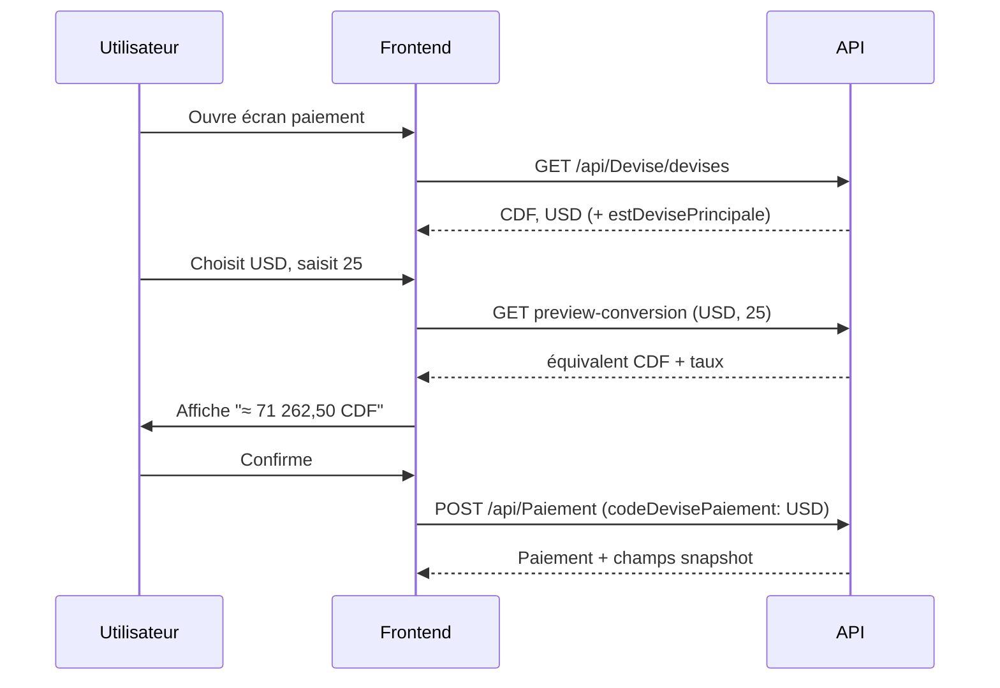

# Guide complet — Intégration multi-devise (CongoTravelAPI)

> **Note** : le contenu canonique pour porter **paiement électronique + multi-devise** est intégré dans [§10 de `Integration-FlexPay-From-CongoTravelAPI.md`](Integration-FlexPay-From-CongoTravelAPI.md).  
> **Ce fichier** reste une référence détaillée optionnelle (reporting, remboursements, séquence frontend étendue).

Documentation portable pour répliquer le module multi-devise dans **un autre projet** (.NET, mobile, web).

**Dernière mise à jour** : mai 2026  
**Référence code** : `Controllers/DeviseController.cs`, `Controllers/PaiementController.cs`, `Services/VoyageService.cs`, `Services/FlexPayReservationService.cs`  
**Scripts SQL** : `deploy_multidevise_phase1.sql`, `deploy_multidevise_phase23.sql`, `deploy_multidevise_full.sql`  
**Doc complémentaire (API front)** : `Documentation/Themes/06_facturation_paiement/DOCUMENTATION_MODULE_MULTIDEVISE.md`

---

## Résumé exécutif

| Élément | Valeur |
|---------|--------|
| Modèle | **Devise principale par société** + taux manuels par paire |
| Devises autorisées | Référentiel `DevisesMonetaires` par `IdSociete` |
| Taux | Table `TauxChanges` avec `DateEffet` (historique) |
| Montants métier | Toujours stockés en **double** : devise d’origine + snapshot en devise principale |
| Conversion | `montantCible = Round(montantSource × taux, 2)` (CDF FlexPay : entier) |
| Preview | `GET /api/Devise/preview-conversion` |
| Phases livrées | Phase 1 (paiement), Phase 2 (voyage + remboursement), Phase 3 (reporting) |

**Principe fondamental** : ne jamais recalculer rétroactivement les montants passés — **figer le taux** (`TauxVersDevisePrincipale`) et les montants convertis au moment de l’écriture (paiement, voyage, remboursement).

---

## Table des matières

1. [Concepts métier](#1-concepts-métier)
2. [Architecture](#2-architecture)
3. [Modèle de données](#3-modèle-de-données)
4. [Algorithme de conversion](#4-algorithme-de-conversion)
5. [Scripts SQL (nouveau projet)](#5-scripts-sql-nouveau-projet)
6. [API — module Devise](#6-api--module-devise)
7. [Intégration par domaine](#7-intégration-par-domaine)
8. [FlexPay et choix de devise de paiement](#8-flexpay-et-choix-de-devise-de-paiement)
9. [Reporting et dashboards](#9-reporting-et-dashboards)
10. [Sécurité et permissions](#10-sécurité-et-permissions)
11. [Séquence frontend](#11-séquence-frontend)
12. [Porter vers un autre projet](#12-porter-vers-un-autre-projet)
13. [Fichiers source CongoTravel](#13-fichiers-source-congotravel)
14. [Checklist de validation](#14-checklist-de-validation)

---

## 1. Concepts métier

### 1.1 Devise principale (par société)

- Champ : `Societe.CodeDevisePrincipale` (ISO 4217, 3 lettres, ex. `CDF`, `USD`).
- **Une seule** devise principale active par société à un instant T.
- Sert de **devise de consolidation** : reporting, totaux dashboard, comparaisons.

### 1.2 Devise d’origine (saisie)

- Exemples :
  - Prix d’un voyage : `Voyage.CodeDevisePrix` + `Voyage.Prix`
  - Paiement guichet : `Paiement.CodeDevisePaiement` + `MontantAPaye`
  - FlexPay : le client choisit `CodeDevisePaiement` (`CDF` ou `USD`) indépendamment de la devise du voyage.

### 1.3 Snapshot (figé à l’écriture)

Chaque entité financière conserve :

| Champ type | Rôle |
|------------|------|
| `CodeDevise*` (origine) | Devise saisie / affichée |
| `CodeDevisePrincipale` | Devise société au moment de l’opération |
| `TauxVersDevisePrincipale` | Taux appliqué (ex. 2850,50 pour 1 USD → CDF) |
| `*DevisePrincipale` | Montants convertis pour agrégats |

Si le taux change le lendemain, **les anciennes lignes ne bougent pas**.

### 1.4 Taux de change

- Saisie manuelle par admin / gérant (pas d’API Banque centrale automatique).
- Paire orientée : `CodeDeviseSource` → `CodeDeviseCible`.
- Plusieurs lignes par paire possibles ; la **plus récente** avec `DateEffet <= dateRéférence` gagne.
- Pour USD↔CDF, prévoir **les deux sens** ou implémenter le **taux inverse** (voir §4.3).

---

## 2. Architecture

```
┌─────────────────┐     ┌──────────────────┐     ┌─────────────────┐
│  Frontend       │────▶│  DeviseController │────▶│ DevisesMonetaires│
│  (sélecteur     │     │  preview-conversion│     │ TauxChanges      │
│   devise)       │     └──────────────────┘     └────────┬────────┘
└────────┬────────┘                                        │
         │                                                  │
         ▼                                                  ▼
┌─────────────────┐                              ┌─────────────────┐
│ Paiement /      │  ResolveConversion (taux)    │ Societe.        │
│ Voyage /        │─────────────────────────────▶│ CodeDevise      │
│ Remboursement   │  snapshot en BDD             │ Principale      │
└─────────────────┘                              └─────────────────┘
```

**Couches à reproduire dans un autre projet**

1. **Référentiel** — CRUD devises + taux (`DeviseController`).
2. **Service de résolution** — une méthode unique `ResolveConversionAsync(idSociete, codeSource, dateRef)`.
3. **Snapshot** — appliqué dans chaque use case métier (paiement, voyage, etc.).
4. **Preview** — endpoint lecture seule pour l’UI avant validation.

---

## 3. Modèle de données

### 3.1 Tables principales

#### `Societes` (extension)

| Colonne | Type | Description |
|---------|------|-------------|
| `CodeDevisePrincipale` | `varchar(3)` | Devise de consolidation, défaut `CDF` |

#### `DevisesMonetaires`

| Colonne | Type | Description |
|---------|------|-------------|
| `IdDeviseMonetaire` | PK int | |
| `IdSociete` | int FK | Scope tenant |
| `CodeDevise` | `varchar(3)` | `CDF`, `USD`, … |
| `Libelle` | `varchar(120)` | |
| `Symbole` | `varchar(10)` nullable | `FC`, `$`, … |
| `Statut` | bool | Active / inactive |

**Contrainte** : `UNIQUE (IdSociete, CodeDevise)`.

#### `TauxChanges`

| Colonne | Type | Description |
|---------|------|-------------|
| `IdTauxChange` | PK int | |
| `IdSociete` | int FK | |
| `CodeDeviseSource` | `varchar(3)` | |
| `CodeDeviseCible` | `varchar(3)` | |
| `Taux` | `decimal(18,8)` | Multiplicateur source → cible |
| `DateEffet` | `datetime` | Début de validité |
| `Statut` | bool | |

**Index recommandé** : `(IdSociete, CodeDeviseSource, CodeDeviseCible, DateEffet)`.

### 3.2 Extensions `Paiements` (phase 1)

| Colonne | Type | Description |
|---------|------|-------------|
| `CodeDevisePaiement` | `varchar(3)` | Devise saisie |
| `CodeDevisePrincipale` | `varchar(3)` | Snapshot |
| `TauxVersDevisePrincipale` | `decimal(18,8)` | Snapshot |
| `MontantAPayeDevisePrincipale` | `decimal(18,2)` | |
| `MontantPayeDevisePrincipale` | `decimal(18,2)` nullable | |
| `ResteAPayeDevisePrincipale` | `decimal(18,2)` nullable | |
| `DatePaiement` | `datetime` | Date métier pour choix du taux |

Les champs historiques `MontantAPaye`, `MontantPaye`, `ResteAPaye` restent dans la **devise de paiement**.

### 3.3 Extensions `Voyages` (phase 2)

| Colonne | Type | Description |
|---------|------|-------------|
| `CodeDevisePrix` | `varchar(3)` | Devise du tarif affiché |
| `CodeDevisePrincipale` | `varchar(3)` | Snapshot |
| `TauxVersDevisePrincipale` | `decimal(18,8)` | Snapshot |
| `PrixDevisePrincipale` | `decimal(18,2)` | `Prix × taux` |

`Prix` (int ou decimal) = montant dans `CodeDevisePrix`.

### 3.4 Table `Remboursements` (phase 2)

| Colonne | Type |
|---------|------|
| `CodeDeviseRemboursement` | `varchar(3)` |
| `CodeDevisePrincipale` | `varchar(3)` |
| `MontantRembourse` | `decimal(18,2)` |
| `TauxVersDevisePrincipale` | `decimal(18,8)` |
| `MontantRembourseDevisePrincipale` | `decimal(18,2)` |
| `DateRemboursement` | `datetime` |

### 3.5 Commande FlexPay (phase FlexPay + multi-devise)

`CommandeReservationEnAttente` stocke en plus :

- `MontantVoyage` / `CodeDeviseVoyage`
- `MontantFlexPay` / `CodeDevisePaiement`
- `TauxVersDevisePaiement` (voyage → devise de paiement choisie)

---

## 4. Algorithme de conversion

### 4.1 Résolution standard (vers devise principale)

Utilisé par : **Paiement**, **Voyage** (prix → principale), **preview-conversion**.

```
ENTRÉE : idSociete, codeDeviseSource, dateReference

1. codePrincipale ← Societe.CodeDevisePrincipale (défaut "CDF")
2. Vérifier que codeDeviseSource existe dans DevisesMonetaires (Statut = true)
3. Si codeDeviseSource == codePrincipale → retourner taux = 1
4. Sinon :
   taux ← dernier TauxChanges WHERE
          IdSociete = idSociete
          AND Source = codeDeviseSource
          AND Cible = codePrincipale
          AND Statut = true
          AND DateEffet <= dateReference
        ORDER BY DateEffet DESC, DateCreation DESC
        LIMIT 1
5. Si taux absent → ERREUR métier
6. montantConverti = Round(montantSource * taux, 2)
7. Retourner (codePrincipale, taux, montantConverti)
```

**Référence C#** : `PaiementController.ResolveConversionAsync` (lignes ~325–371).

### 4.2 Date de référence par use case

| Use case | Date utilisée pour le taux |
|----------|---------------------------|
| Paiement guichet | `DatePaiement` (ou `UtcNow` si absent) |
| Création voyage | `DateDepart` du voyage |
| Remboursement | `DateRemboursement` |
| Preview UI | Query `datePaiement` ou `UtcNow` |

### 4.3 Conversion entre deux devises arbitraires (FlexPay)

Cas : voyage en **USD**, paiement Mobile Money en **CDF**.

```
1. Tenter taux direct : Source=voyage, Cible=paiement
2. Sinon taux inverse : Source=paiement, Cible=voyage → utiliser 1/taux
3. Sinon ERREUR
```

**Référence C#** : `FlexPayReservationService.ConvertMontantAsync`.

**Arrondi CDF** (FlexPay / opérateurs MM) :

```csharp
if (codeDevisePaiement == "CDF")
    montantFlexPay = Math.Round(montantFlexPay, 0, MidpointRounding.AwayFromZero);
```

### 4.4 Pseudo-code service réutilisable

```csharp
public interface ICurrencyConversionService
{
    Task<ConversionResult> ConvertToPrincipalAsync(
        int idSociete, string codeDeviseSource, decimal montant, DateTime dateRef, CancellationToken ct = default);

    Task<ConversionResult> ConvertAsync(
        int idSociete, string codeSource, string codeCible, decimal montant, DateTime dateRef, CancellationToken ct = default);
}

public record ConversionResult(
    bool Success,
    string? ErrorMessage,
    string CodeDeviseSource,
    string CodeDeviseCible,
    decimal Taux,
    decimal MontantSource,
    decimal MontantCible);
```

Centraliser évite la duplication entre `PaiementController`, `VoyageService`, `FlexPayReservationService`, `RemboursementController`.

---

## 5. Scripts SQL (nouveau projet)

### Ordre d’exécution recommandé

1. `deploy_multidevise_phase1.sql` — Societe, Paiements, DevisesMonetaires, TauxChanges, seed CDF/USD
2. `deploy_multidevise_phase23.sql` — Voyages, Remboursements, index reporting
3. (Optionnel) `deploy_devise_unique_societe_code.sql` — contrainte unique `(IdSociete, CodeDevise)`

**Migrations EF CongoTravel** (si vous partez du même repo) :

- `20260508135505_MultiDevisePhase1`
- `20260508141208_VoyageDeviseAndReportingPhase23`
- `20260508151940_AddIdSocieteToDevisesMonetaires`
- `20260508152532_AddUniqueDeviseBySociete`

### Données initiales minimales

```sql
UPDATE Societes SET CodeDevisePrincipale = 'CDF' WHERE CodeDevisePrincipale IS NULL OR CodeDevisePrincipale = '';

INSERT INTO DevisesMonetaires (IdSociete, CodeDevise, Libelle, Symbole, Statut, DateCreation)
VALUES
  (1, 'CDF', 'Franc congolais', 'FC', 1, UTC_TIMESTAMP()),
  (1, 'USD', 'Dollar américain', '$', 1, UTC_TIMESTAMP());

INSERT INTO TauxChanges (IdSociete, CodeDeviseSource, CodeDeviseCible, Taux, DateEffet, Statut, DateCreation)
VALUES
  (1, 'USD', 'CDF', 2850.50, UTC_TIMESTAMP(), 1, UTC_TIMESTAMP()),
  (1, 'CDF', 'USD', 0.00035088, UTC_TIMESTAMP(), 1, UTC_TIMESTAMP());
```

---

## 6. API — module Devise

**Route de base** : `/api/Devise`  
**Auth** : JWT — rôles `Admin`, `Super-Admin`, `Gérant` (scope société sauf Super-Admin).

| Méthode | Route | Description |
|---------|-------|-------------|
| GET | `/devises` | Devises actives (scope utilisateur) |
| GET | `/devises/societe/{idSociete}?includeInactive=` | Liste par société |
| POST | `/devises` | Créer devise |
| GET | `/devises/{id}` | Détail |
| PUT | `/devises/{id}` | Modifier (libellé, statut, principale) |
| PUT | `/societe/{idSociete}/devise-principale/{codeDevise}` | Basculer devise principale |
| POST | `/taux-change` | Créer taux |
| GET | `/taux-change?idSociete=&source=&cible=` | Dernier taux de la paire |
| GET | `/preview-conversion?idSociete=&codeDeviseSource=&montant=&datePaiement=` | Simulation |

### Exemple preview-conversion

**Requête**

```http
GET /api/Devise/preview-conversion?idSociete=1&codeDeviseSource=USD&montant=25&datePaiement=2026-05-08T10:30:00Z
Authorization: Bearer {token}
```

**Réponse 200**

```json
{
  "idSociete": 1,
  "codeDeviseSource": "USD",
  "codeDevisePrincipale": "CDF",
  "datePaiement": "2026-05-08T10:30:00Z",
  "taux": 2850.50,
  "montantSource": 25,
  "montantConverti": 71262.50
}
```

---

## 7. Intégration par domaine

### 7.1 Paiement (`POST /api/Paiement`)

**Request (champs multi-devise)**

```json
{
  "montantAPaye": 50,
  "montantPaye": 50,
  "codeDevisePaiement": "USD",
  "datePaiement": "2026-05-08T12:00:00Z",
  "idSociete": 1,
  "methodePaiement": "CASH"
}
```

**Traitement backend**

1. Normaliser `codeDevisePaiement` (uppercase, 3 car.).
2. `ResolveConversionAsync(idSociete, codeDevisePaiement, datePaiement)`.
3. Remplir snapshot + `MettreAJourResteAPaye()` sur entité `Paiement`.

**Règle reporting** : agrégats financiers sur `Montant*DevisePrincipale` ou filtre `Statut == true` pour paiements validés.

### 7.2 Voyage (`POST /api/Voyage`)

**Request**

```json
{
  "prix": 25,
  "codeDevisePrix": "USD",
  "dateDepart": "2026-06-01",
  "idSociete": 1
}
```

**Traitement**

- `ResolveVoyagePrixConversionAsync(idSociete, codeDevisePrix, dateDepart)`
- `PrixDevisePrincipale = Round(Prix × taux, 2)`

Les **tarifs par catégorie de siège** restent exprimés dans la même logique que le prix voyage (même devise prix).

### 7.3 Remboursement (`POST /api/Remboursement`)

Même pattern que paiement : devise remboursement + snapshot principale + `DateRemboursement` pour le taux.

### 7.4 Réservation + paiement CASH

`ReservationWithPaiementService` : le montant attendu est calculé en **devise du voyage** ; le paiement CASH doit être cohérent avec les tarifs sièges (validation tolérance 0,05).

---

## 8. FlexPay et choix de devise de paiement

**Précision métier #1 (CongoTravel)**

Le client peut payer en **CDF** ou **USD** même si le voyage est tarifé dans l’autre devise.

**Flux**

1. Calcul total voyage en `CodeDeviseVoyage` (tarifs sièges).
2. Utilisateur choisit `Paiement.CodeDevisePaiement`.
3. Conversion voyage → paiement via `TauxChanges` (direct ou inverse).
4. Initiation FlexPay avec `MontantFlexPay` dans `CodeDevisePaiement`.
5. Snapshot stocké sur `CommandeReservationEnAttente` + `Paiement` en attente.
6. Au callback succès : validation montant callback vs `MontantFlexPay` (tolérance 0,05).

**Champs API initiation**

```json
{
  "reservation": { "idVoyage": 10, "passagers": [...] },
  "paiement": {
    "montantAPaye": 71250,
    "codeDevisePaiement": "CDF",
    "methodePaiement": "MOBILE_MONEY",
    "phone": "243900000000",
    "idSociete": 1,
    "idSite": 2
  }
}
```

`montantAPaye` = montant **dans la devise de paiement** après conversion (à recalculer côté serveur et comparer).

---

## 9. Reporting et dashboards

### Principes

- **Consolidation** : toujours en `CodeDevisePrincipale` via champs `*DevisePrincipale`.
- **Détail par devise** : grouper par `CodeDevisePaiement` / `CodeDevisePrix` pour tableaux de bord multi-devises.
- Ne pas reconvertir à la volée les lignes historiques : utiliser les snapshots.

### Exemple requête reporting (concept)

```sql
SELECT
  CodeDevisePaiement,
  SUM(MontantPayeDevisePrincipale) AS totalConsolide,
  CodeDevisePrincipale
FROM Paiements
WHERE IdSociete = @idSociete
  AND Statut = 1
  AND DatePaiement BETWEEN @debut AND @fin
GROUP BY CodeDevisePaiement, CodeDevisePrincipale;
```

**Endpoint** : `GET /api/FinanceReporting/paiements/summary` (filtre paiements validés).

---

## 10. Sécurité et permissions

Permissions RBAC (extrait `PermissionSeeder`) :

| Permission | Action |
|------------|--------|
| `TauxChange.Create` | Créer un taux |
| `TauxChange.Read` / `ReadAll` | Consulter |

Règles :

- Super-Admin : toutes sociétés.
- Admin / Gérant : uniquement `IdSociete` du JWT.
- Impossible de désactiver la devise principale courante sans en désigner une autre.
- `codeDevise` non modifiable après création (évite casse des historiques).

---

## 11. Séquence frontend



---

## 12. Porter vers un autre projet

### Checklist technique

- [ ] Ajouter `CodeDevisePrincipale` sur l’entité **tenant** (Societe / Organization).
- [ ] Créer tables `DevisesMonetaires`, `TauxChanges`.
- [ ] Étendre tables financières avec colonnes snapshot (§3).
- [ ] Implémenter `ICurrencyConversionService` (§4.4).
- [ ] Exposer `DeviseController` (CRUD + preview).
- [ ] Brancher conversion dans **chaque** écriture financière.
- [ ] UI : sélecteur devise + appel preview avant submit.
- [ ] Seed devises + taux pour chaque société de test.
- [ ] Tests : même devise (taux=1), conversion USD→CDF, taux manquant (400), date effet passée.
- [ ] Documenter pour l’équipe mobile les champs request/response.

### Ce qu’il ne faut pas faire

- Recalculer les montants historiques quand le taux change.
- Stocker uniquement la devise principale (perte d’audit).
- Oublier l’arrondi CDF pour FlexPay / Mobile Money.
- Supposer un taux bidirectionnel sans ligne inverse ou sans logique `1/taux`.

### Adaptations possibles

| Besoin autre projet | Adaptation |
|---------------------|------------|
| Devise globale (pas par tenant) | `IdSociete` nullable sur devises ; taux sans société |
| API taux automatique (BC) | Remplacer saisie manuelle par job + cache ; garder snapshot |
| Crypto | Étendre `CodeDevise` à 4–5 car. ou table séparée |
| Plus de 2 devises UI | Lister `GET /devises` dynamiquement |

---

## 13. Fichiers source CongoTravel

| Fichier | Rôle |
|---------|------|
| `Models/DeviseMonetaire.cs` | Entité devise |
| `Models/TauxChange.cs` | Entité taux |
| `Models/Paiement.cs` | Champs snapshot paiement |
| `Models/Voyage.cs` | Champs snapshot voyage |
| `Models/Remboursement.cs` | Snapshot remboursement |
| `Controllers/DeviseController.cs` | API référentiel + preview |
| `Controllers/PaiementController.cs` | `ResolveConversionAsync` |
| `Services/VoyageService.cs` | `ResolveVoyagePrixConversionAsync` |
| `Services/FlexPayReservationService.cs` | Conversion paire arbitraire |
| `deploy_multidevise_phase1.sql` | DDL phase 1 |
| `deploy_multidevise_phase23.sql` | DDL phase 2–3 |
| `TESTS_MULTIDEVISE_PHASES_1_2_3.http` | Tests manuels HTTP |
| `Documentation/Themes/06_facturation_paiement/DOCUMENTATION_MODULE_MULTIDEVISE.md` | Doc endpoints front |

---

## 14. Checklist de validation

- [ ] Créer devise non principale (ex. EUR) sur une société test
- [ ] Définir USD comme principale via PUT devise-principale
- [ ] Créer taux USD→CDF et CDF→USD avec `DateEffet` aujourd’hui
- [ ] `preview-conversion` : 25 USD → montant CDF cohérent
- [ ] Créer paiement en USD : vérifier champs `*DevisePrincipale` en base
- [ ] Créer voyage en USD : `PrixDevisePrincipale` cohérent
- [ ] Tenter paiement sans taux : erreur 400 explicite
- [ ] Reporting : total consolidé = somme des `MontantPayeDevisePrincipale`
- [ ] (Si FlexPay) initiation CDF pour voyage USD : conversion + callback montant

---

## Glossaire

| Terme | Définition |
|-------|------------|
| Devise principale | Devise de consolidation société |
| Devise d’origine | Devise saisie sur l’écran ou le contrat métier |
| Snapshot | Copie figée du taux et des montants convertis à l’écriture |
| DateEffet | Date à partir de laquelle un taux est utilisable |
| Taux direct | Multiplicateur Source → Cible tel que défini en base |

---

*Document généré pour faciliter la réutilisation du module multi-devise CongoTravelAPI dans d’autres applications.*
